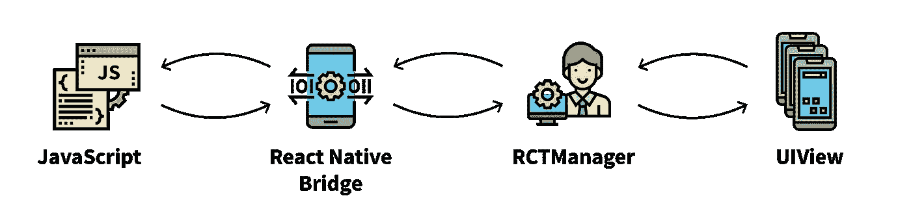
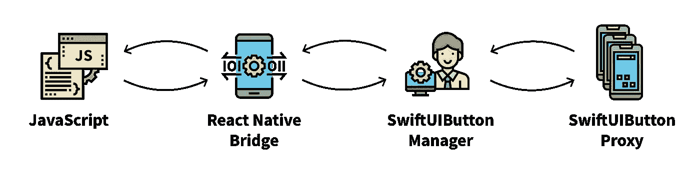
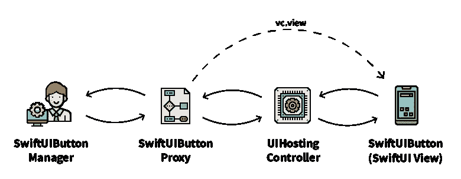
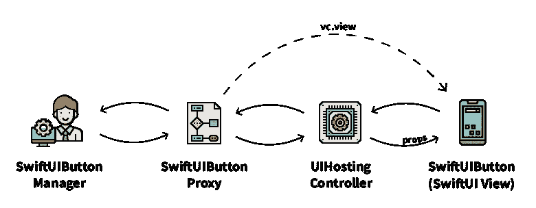

# React Native 遇上 SwiftUI

> 原文：<https://betterprogramming.pub/react-native-meets-swiftui-d1606a8e1681>


## 编写一个代理，允许您在 React 本机应用程序中使用 SwiftUI

2015 年， [React Native](https://facebook.github.io/react-native/) 为跨平台移动世界带来了声明式组件方法。没过多久，这种面向组件的哲学就扩展到了类似的库中。现在，随着 [SwiftUI](https://developer.apple.com/tutorials/swiftui) 和 [Jetpack Compose](https://developer.android.com/jetpack/compose) ，这终于到达了本地平台。

SwiftUI 是一个 UI 框架，它将声明性组件方法引入苹果平台家族，包括 iOS、macOS 和 watchOS。

它可以与它的前身 UIKit 互换工作，这意味着开发者可以将新框架无缝集成到他们现有的应用程序中。然而，混合搭配的 UIKit 和 SwiftUI 需要中间件来连接它们。

今天，我们将编写一个代理，允许开发人员在其 React 本机应用程序中使用 SwiftUI。

请记住，SwiftUI *仅在 iOS 13.0 及以上版本*上运行(在撰写本文时，iOS 13.0 的平台覆盖率为[94%](https://david-smith.org/iosversionstats/))。如果你的应用必须支持以前的 iOS 版本，你就不能使用 SwiftUI。

# 1.初始设置

让我们从创建一个带有本地 UI 组件的 React 本地应用程序开始(现在，一个简单的`UIView`就可以了)。



如果您不熟悉桥接本机组件以进行本机反应，我强烈建议您在继续之前阅读文档中的相应文章。GitHub 上也有初始设置的代码[。](https://github.com/Kureev/ReactNativeWithSwiftUITutorial/releases/tag/initial-setup)

# 2.勾搭斯威夫特

当我们有一个完成初始设置的应用程序时，我们可以创建一个 Swift 类(`SwiftUIButtonProxy`)，作为 SwiftUI 视图和`RCTViewManager`之间的代理。

在 Objective-C 项目中创建第一个 Swift 类后，Xcode 会询问您是否希望它创建[一个桥接头](https://developer.apple.com/documentation/swift/imported_c_and_objective-c_apis/importing_objective-c_into_swift)。需要向 Swift 公开一个任意的 Objective-C 代码，我们以后会用到，所以一定要说:“是”。

新视图应该类似于以下内容:

```
// SwiftUIButtonProxy.swift**@objc class** SwiftUIButtonProxy : **UIView** {}
```

现在，让我们修改我们的`RCTViewManager`来渲染它:

```
// SwiftUIButtonManager.m-(**UIView ***)view {
  **return** [[SwiftUIButtonProxy **alloc**] **init**];
}
```



在这一步，你可能会注意到 Xcode 开始抱怨`SwiftUIButtonProxy`的用法。

发生这种情况是因为 Objective-C 不知道任何 Swift 类别，除非您导入一个收集所有可访问 Swift 结构信息的动态项目标题:

```
**#import** "<ProjectName>-Swift.h"
```

注意`<ProjectName>`只是项目名称的占位符。例如，如果您的项目名为“FooBar ”,您的导入应该如下所示:

```
**#import** "FooBar-Swift.h"
```

不要被这种进口所迷惑。你的`*.xcworkspace`或者`*.xcodeproj`里没有对应的文件，但是它是存在的。Xcode 将在构建步骤中根据 Swift 代码库的可见性区域构建它。

导入完成后，错误应该会消失，应用程序应该会正常构建。如果你在这一步有任何问题，你可以在我的[教程库](https://github.com/Kureev/ReactNativeWithSwiftUITutorial)中查看[“代理类”标签](https://github.com/Kureev/ReactNativeWithSwiftUITutorial/releases/tag/proxy-class)。

# 3.渲染 SwiftUI

尽管渲染 Swift 的视图应该非常简单，但是挂接 SwiftUI 却不简单。由于设计限制，从 UIKit 运行 SwiftUI 的唯一方法是使用`UIHostingController`。

直到这一点，我都没有在 app 中提到使用`UIViewController`或者其他任何控制器的话题。事实上，这通常会让学习 React Native 的人感到困惑。

你看，在本地开发中，`ViewControllers`在管理应用程序的视图和数据中扮演着重要的角色。在 React Native 中，原生组件的 JavaScript 部分应该接管。

然而，如果我们构建一个复杂的本地组件，或者说，桥接一个 SwiftUI 视图，学习如何使用它们可能会很方便。

正如我之前提到的，SwiftUI 视图层次结构可以通过使用`UIHostingController`集成到您现有的应用程序中。它充当 UIKit 和 SwiftUI 框架之间的中介，因此您可以将 SwiftUI 视图作为 UIKit 视图层次结构的一部分。

让我们创建一个新的 SwiftUI 视图，并将其命名为`SwiftUIButton`。

然后，我们调整`SwiftUIButtonProxy`类来创建一个具有新视图的`UIHostingController`。因为我们要创建一个视图控制器并公开它的视图，所以不需要从`UIView`继承代理类。

但是，因为我们不能将没有继承`NSObject`的类暴露给 Objective-C，所以我们将用`NSObject`替换`UIView`以保持其可访问性。

相应的管理器类也应该反映这些变化:

如您所见，我们没有返回`SwiftUIButtonProxy`本身，而是用通过`UIHostingController`代理的 SwiftUI 视图替换了它。



恭喜你！您刚刚桥接了您的第一个 SwiftUI 视图。

# 4.道具呢？

大多数本机组件实现配置属性和回调。在教程的这一部分，我们将桥接两个简单的属性:`count: Int`和`onCountChange: RCTBubblingEventBlock`。

这可能是本教程中最复杂的部分。数据转发绝非易事。

首先，我们不能使用标准的`RCT_EXPORT_VIEW_PROPERTY`宏，因为它会生成试图访问视图实例的 setters。不幸的是，SwiftUI 视图不能直接暴露给 Objective-C，因为 Swift 的`struct`没有相应的类型。

这就把我们带到了这样一个点，传递数据的唯一方式是通过可以访问两个运行时的自定义 Swift 代理:Objective-C 从 JavaScript 接收视图属性，Swift 将这些属性设置为相应的 SwiftUI 视图。

听起来很复杂，但是不要让它吓到你！它是这样工作的:



本地组件的管理器通过特殊的设置器接收新的属性，这些属性是在预编译例程期间由类似`RCT_EXPORT_VIEW_PROPERTY`的宏生成的。

每次使用如上所述的宏时，您都会为您包装的属性生成一个自定义 setter(参见 [#define macro](https://gcc.gnu.org/onlinedocs/cpp/Object-like-Macros.html#Object-like-Macros) 如何工作)，因此当您从 JavaScript 发送一组新的属性时，React Native 会检查新属性的相应 setter 是否存在于管理器中。

TL；DR: `RCT_EXPORT_VIEW_PROPERTY` -like 宏生成属性设置器，当用户向本地组件的 JavaScript 表示分配新属性时，会调用这些属性设置器。

既然我们不能使用`RCT_EXPORT_VIEW_PROPERTY`，我建议我们创建自己的宏。按照`RCT_EXPORT_VIEW_PROPERTY`的命名惯例，我称它为`[RCT_EXPORT_SWIFTUI_PROPERTY](https://gist.github.com/Kureev/2151c335cf9c7a1fa45460627424bbdf)`和`[RCT_EXPORT_SWIFTUI_CALLBACK](https://gist.github.com/Kureev/2151c335cf9c7a1fa45460627424bbdf)`。

这些宏中的每一个都利用了`RCT_CUSTOM_VIEW_PROPERTY`的功能，它允许开发者创建一个定制的 setter。

如果您决定使用它们，请记住它们仅在以下条件下有效:

*   您有一个代理类，它公开了一个名为`storage`的静态`NSMutableDictionary`。
*   `RCT_EXPORT_SWIFTUI_PROPERTY`只支持`int`、`string`、`bool`等基本属性。复杂类型需要正确的转换，这超出了本文的范围


正如我前面提到的，每个自定义宏都依赖于 React Native 的`RCT_CUSTOM_VIEW_PROPERTY`宏，该宏允许开发人员为道具创建自定义设置器。这个宏需要一个定义 setter 的块。

在块的范围内，除了类属性之外，React Native 还公开了三个参数:

*   `UIView *view` —道具接受者。
*   `UIView *defaultView` —默认视图。
*   `id json` —指向接收数据的指针。

我们最感兴趣的是`json`和`view`。人们可能会注意到`view`的类型不同。我们得到的不是 SwiftUI 视图，而是一个常规的 UI 视图，它由`UIHostingController`公开用于桥接。不幸的是，这还不够。

为了设置新的道具，我们需要获得对真实 SwiftUI 视图的引用。此时唯一的方法是通过`UIHostingController`，但是控制器本身也是不可及的…

为了解决这个问题，我创建了一个`key:value`存储(`NSMutableDicrionary`，并将其作为静态属性分配给`SwiftUIButtonProxy`。

现在，如果我在创建视图时存储了一个`view:proxy`对，我就可以在 setter 中访问所需的`proxy`。因为我们的代理是`UIHostingController`的容器，所以不需要努力就可以得到 SwiftUI 视图的正确引用。

然而，别忘了我们是从 Objective-C 操作的，这使得直接操作 SwiftUI 视图道具变得不可能。

如果我们在`SwiftUIButtonProxy`类中定义自定义的`count`和`onCountChange`属性，我们可以解决这个约束，这样它们就可以使用控制器的`rootView`属性来传播新值:

为每个属性手动编写 getters 和 setters 有点乏味(特别是当您有几个属性时)，但这是我发现的最直接的方法。

另外，请注意这里的`props`:swift ui 允许组件拥有一个本地状态`@State`，公开状态`@ObservedObject` (props)，以及一个共享的公开状态`@EnvironmentObject`(上下文)。

在这个例子中，我使用`@ObservedObject`，因为我们需要从外部设置值。在 SwiftUI 视图中，它看起来像这样:

```
// SwiftUIButton.swift**@ObservedObject var** props = ButtonProps()
```

现在，让我们向视图添加一个按钮。每当用户点击那个按钮时，我们希望用新增加的计数器值调用`props.onCountChange`。经过一些风格上的改变，`SwiftUIButton`代码看起来可能类似于这样:

现在，为了完善这个例子，我们只需要覆盖两个缺失的部分:`ButtonProps`和 JavaScript 部分:

```
**class** ButtonProps : **ObservableObject** {
  [@Published](http://twitter.com/Published) **var** count: Int = 0
  [@Published](http://twitter.com/Published) **var** onCountChange: RCTDirectEventBlock = { _ in }
}
```

`ButtonProps`是一个`ObservableObject`，它保存我们从 JavaScript 传递给它的值。如果你对`@Published`感到不解，没关系。该指令创建一个绑定，告知 SwiftUI 在其中一个已发布的属性发生更改时重新呈现。

JavaScript 部分没有:

就是这样！这是一条漫长而崎岖的道路，但你已经熬过来了。

通过一些小的调整，比如在 SwiftUI 视图中添加一个按钮，并通过回调连接相应的数据，您应该有一个从 0 计数到+无穷大的应用程序。

结果代码(带有一些原生 UI 调整)可以在[教程库](https://github.com/Kureev/ReactNativeWithSwiftUITutorial)中找到，在[工作示例](https://github.com/Kureev/ReactNativeWithSwiftUITutorial/releases/tag/working-example)标签下。

# 5.后手稿

我们刚刚将 SwiftUI 组件桥接到 React 本机应用程序中——虽然这开启了巨大的可能性，但我意识到这个主题具有挑战性。

如果你需要时间考虑，那也没关系。我花了几个不眠之夜才想出一个可持续的方法，坦率地说，我不确定这是不是最好的方法。

该解决方案的整体复杂性让我希望在未来发布新的 React 原生架构时，这些事情会变得更容易。