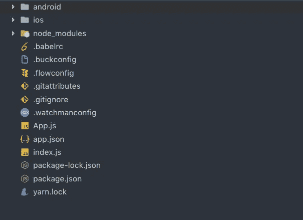
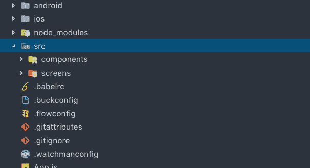
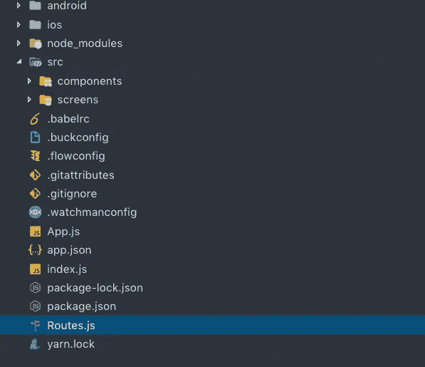
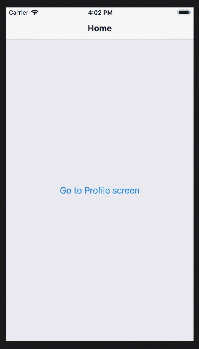
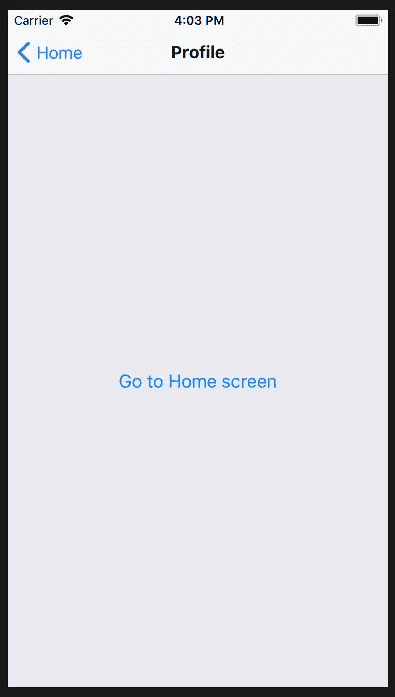

# 反应导航初学者(高级版-3)

> 原文：<https://betterprogramming.pub/react-native-navigating-between-the-screens-and-code-structure-for-beginners-6b815ee8f79>

## 看看基本代码和导航


由[拍摄的科尔顿鲟鱼](https://unsplash.com/@coltonsturgeon?utm_source=unsplash&utm_medium=referral&utm_content=creditCopyText)在 [Unsplash](https://unsplash.com/search/photos/compass-keyboard?utm_source=unsplash&utm_medium=referral&utm_content=creditCopyText)

几个月前，我开始与 React Native 合作，我必须说这是一次令人惊叹的旅程。我从一名全职的前端开发人员，以 HTML 和 CSS 作为我的知识库来创建网站，到 React Native，它是基于成熟的 JavaScript 构建的。

在这篇文章中，我将告诉你基本的代码结构和导航。对于任何初学者来说，轻松创建一个 React 本机应用程序并在屏幕之间导航都很有帮助。

# 项目设置

您可以访问 React Native 站点，了解关于该框架的更多信息。当您访问该网站时，您有两种选择—一种是帮助您入门，另一种是帮助您学习基础知识。因为我们将在这篇文章中探索代码结构，所以我将在这里更详细地讨论它。如果您想学习基础知识来增强您的概念，请随意浏览 React Native [站点](https://facebook.github.io/react-native/docs/getting-started)。

## 开始之前，请确保您的系统中安装了以下软件:

1.  XCode 应用程序(适用于 Mac 系统)。可以从 app store 安装。
2.  Android Studio(可选)
3.  [节点](https://nodejs.org/en/download/)最新版本
4.  带终端的代码编辑器(Visual studio 代码)。

假设您安装了 Node，请在终端中输入以下命令:

```
npm install -g react-native-cli
```

这将在你的系统中安装`react-native-cli`。现在是时候创建应用程序了。在终端中输入以下命令:

```
react-native init MyProjectName
```

我们必须等待几分钟，直到项目安装完毕。完成后，您可以通过输入以下命令来访问刚刚创建的应用程序的文件夹:

```
cd MyProjectName
```

可以看到用`react-native-cli`提供的默认文件和文件夹安装的 app 的完整代码结构。



React Native 提供的默认代码结构

# 创建我们自己的屏幕和组件

由于我们已经完成了项目环境的设置，是时候给它一个个人风格了。现在，我将创建我将在应用程序中使用的屏幕和组件。

## 创建 src 文件夹

就在`node modules`文件夹下面，添加一个文件夹，命名为`src`。

实际上，你可以随意命名这个文件夹。我将它命名为`src` ,因为它通常被推荐用来帮助其他开发者理解应用程序的源代码在哪里。

一旦你创建了`src`文件夹，你必须在`src` 文件夹中再创建两个文件夹。一个用于将要创建的屏幕，一个用于组件。完成添加后，您的代码结构将如下所示:



带有屏幕和组件的 src 文件夹

在继续创建屏幕之前，让我们学习如何将 React 原生应用导航到您的代码。为此，我们将在现有文件中进行以下更改。我将使用 React 导航在屏幕之间导航。您可以在项目的终端中使用以下代码安装它:

```
npm install react-navigation
```

安装 React Navigation 后，转到文件夹结构并创建一个名为`Route.js`的文件。这将包含在应用程序内的屏幕之间导航的代码。应该是加在`src` 文件夹外，像这样:



路线文件

现在，在`Routes` 文件中，添加以下代码:

您可以在上面的代码中看到，我在代码中导入了两个文件——`Home` 和`Profile`——并在导航组件中使用了它们。这两个文件基本上是包含我的应用程序代码的屏幕。稍后我会详细介绍它们。现在，不要担心他们。

转到项目文件夹中的`App.js`文件，删除所有现有代码。然后，添加以下代码行:

```
import React, {Component} from "react";
import Routes from "./Routes";
const App = () => <Routes/>export default App;
```

一旦完成了对`App.js`文件的修改，就该对`index.js` 文件进行修改以完成导航过程了。

```
import { AppRegistry } from 'react-native';
import App from './App';
console.ignoredYellowBox = ['Warning: Each', 'Warning: Failed'];
AppRegistry.registerComponent('AwesomeProject', () => App);
```

现在导航设置已经完成，我们可以开始为我们的应用程序创建自己的屏幕和组件了。

# 屏幕创建和导航

转到您创建的`src`文件夹中的屏幕文件夹，添加两个文件— `Home.js`和`Profile.js`。是的，你猜对了。我们正在创建我上面提到的屏幕。

创建完这些文件后，让我们添加代码并链接它们，以便在两个屏幕之间导航。

## Home.js

## 简介. js

你一定注意到了这两个文件的代码几乎是一样的。这是因为我现在专注于导航，而不是内容创作。我可能会在我的下一篇文章中写下它们，让你对内容有一个更好的了解。

不过，让我解释一下上面屏幕代码的基础:

1.  在第一行，我们导入了 React 库。
2.  在下一行中，我们从 React Native 导入所有的[组件，这是我们创建屏幕所需要的。](https://facebook.github.io/react-native/docs/components-and-apis)
3.  然后，我创建了与文件同名的类。没必要，但建议避免混淆。
4.  静态导航选项基本上是针对标题的。您可以通过使用静态导航选项来[改变和操作](https://reactnavigation.org/docs/en/getting-started.html)这一点。
5.  然后我设计了组件视图的样式，类似于 HTML 代码中的 div 元素。您也可以在代码的末尾设计组件的样式，但是这还是取决于您。
6.  接下来，我有一个按钮将我链接到另一个屏幕，这类似于 HTML 中的`<a>`标签。还记得我们上面安装 [React 导航](https://reactnavigation.org/docs/en/getting-started.html)库的时候吗？这是它帮助开发人员或用户在屏幕之间导航的地方。
7.  最后，我已经导出了整个类，这样我们就可以在应用程序中的其他地方导入它。这也可以在课程开始时完成，如下所示:

```
export default class Home extends React.Component {.....Code here.....}
```

所以现在你差不多完成了。转到终端，输入以下命令。

```
react-native run-ios
```

构建开发过程完成后，您会看到类似这样的内容:

## 主屏幕:



## 个人资料屏幕:



请随意在我的 [github 库](https://github.com/sudhirkumarojhaa)中寻找这个项目。

谢了。保持学习和分享:-)