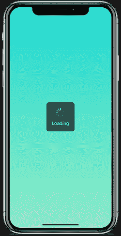
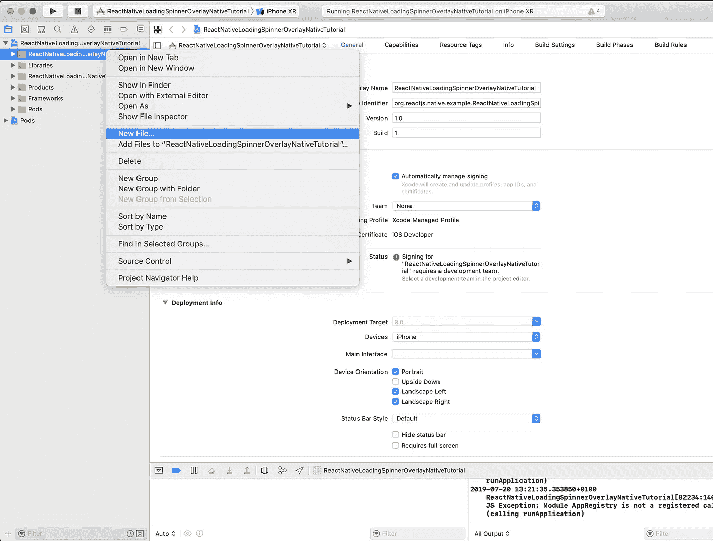
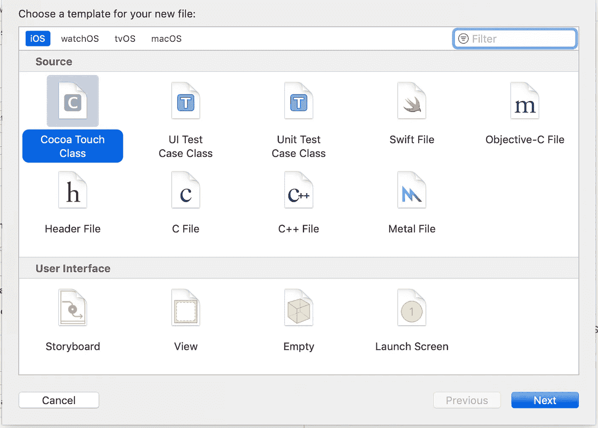
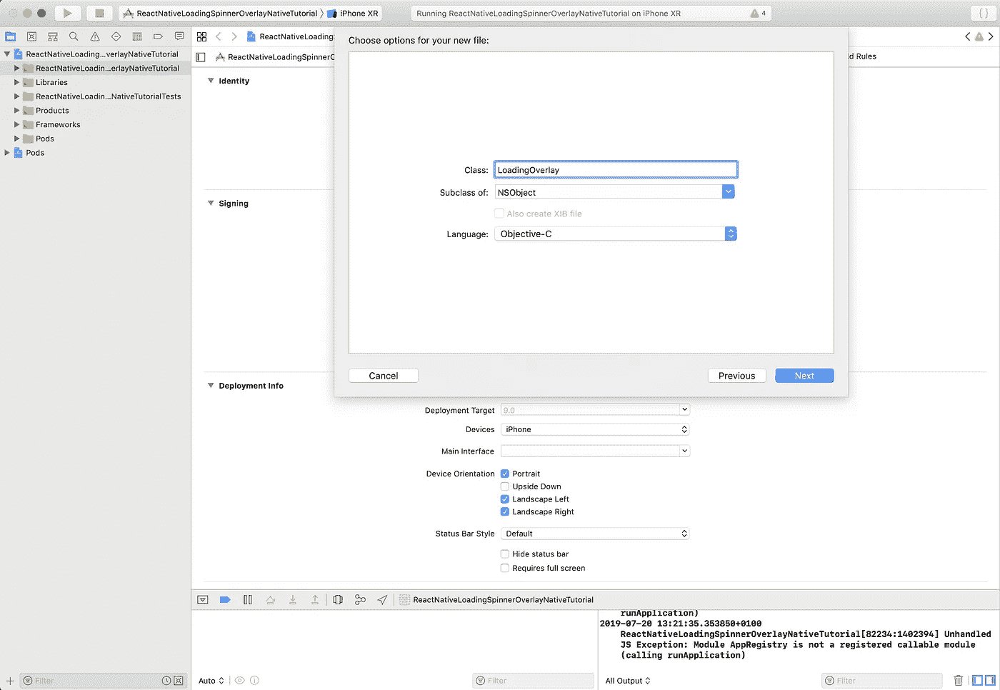
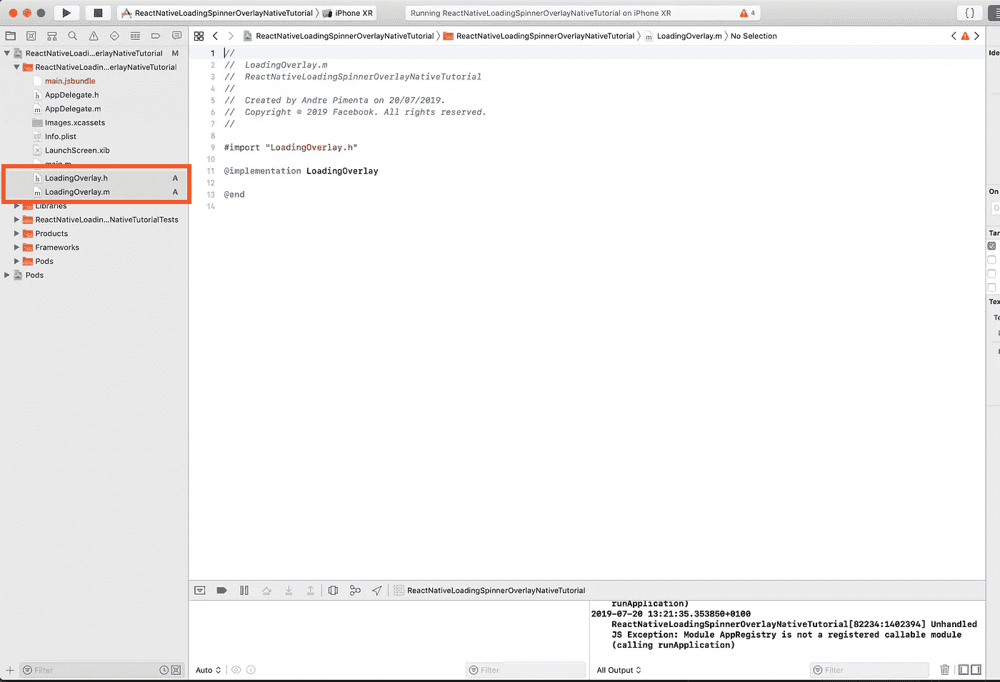
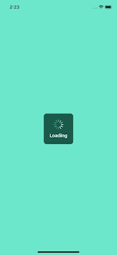
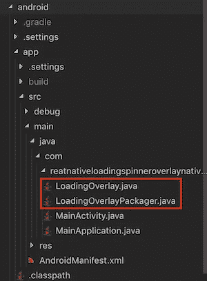
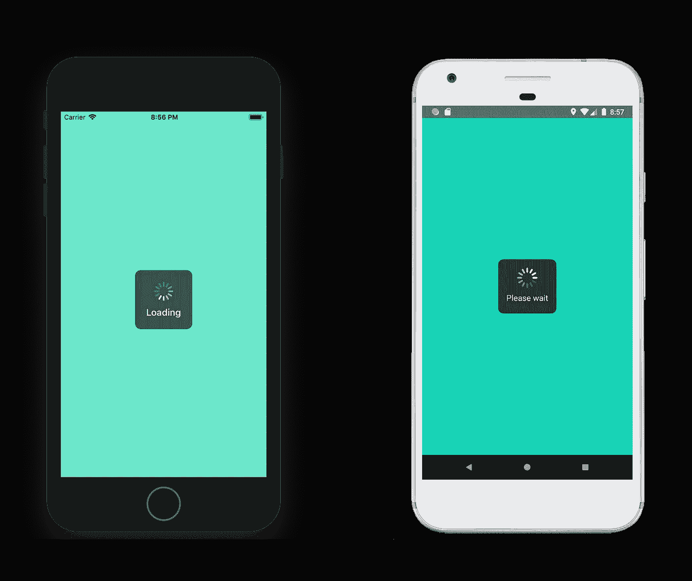

# React Native:使用任何原生 iOS 或 Android 库的最快方式

> 原文：<https://betterprogramming.pub/react-native-the-quickest-way-to-use-any-native-ios-or-android-library-321a484f8d6e>

## 通过创建 React 本机桥了解如何使用任何本机库


如何在 React Native 中使用任何 iOS 和 Android 库？图片来源: [MindInventory](https://www.mindinventory.com)

*   目标:通过创建一个 [React Native](https://facebook.github.io/react-native/) 桥来学习如何使用任何本地库。
*   TL；DR:检查整个代码，并遵循 [GitHub](https://github.com/andrepimenta/react-native-loading-spinner-overlay-native-tutorial) 上的提交。
*   高级功能:建议您熟悉 React Native，并有一些 Android/iOS 开发经验。

有时候，你需要使用一个还不支持 React Native 的原生 Android 或 iOS 库。

在我的例子中，我想使用 [Helpshift](https://helpshift.com/) ，这是一个客户支持平台。如果你研究他们的开发者指南，你会发现他们支持除 React Native 之外的所有平台，所以我别无选择，只能自己构建。

我的时间表也很紧，我必须尽可能以最快的方式完成它，这在创业世界中很正常，所以如果你发现自己处于类似的情况，请继续阅读。

# 介绍

在本教程中，我将构建一个本地加载屏幕覆盖图，可以从 React Native 的任何地方调用它。

我会在 iOS 上使用 [JGProgressHUD](https://github.com/JonasGessner/JGProgressHUD) ，在 Android 上使用 [KProgressHUD](https://github.com/Kaopiz/KProgressHUD) 。我选择这两个库是因为它们看起来非常相似，并且具有相似的 API。

我以一个现有的项目命名了这个项目`ReactNativeLoadingSpinnerOverlayNativeTutorial`，但是它使用了原生的 iOS 和 Android 库，而不是 React 原生组件。它看起来会像这样:



# ios

## 1.安装 iOS 库

将这一行添加到 pod 文件中:

```
pod ‘JGProgressHUD’
```

要安装 pod，请运行:

```
cd ios && pod install
```

## 2.创建 iOS 桥

通过在 Xcode 上打开您的工作空间文件，选择您的项目，然后右键单击以添加新文件，从而为您的模块创建本地文件:



选择*可可触摸等级*并点击*下一步*:



为你的模块命名，点击*下一步*:



然后，只需点击*创建*:


现在您应该有两个文件，在本例中是`LoadingOverlay.h`和`LoadingOverlay.m`:



通过将其复制到您的`LoadingOverlay.h`文件中来创建桥:

并将其写入您的`LoadingOverlay.m`文件:

这创建了一个可以从 React Native 调用的桥。

可以看到，这个函数叫做`toggle` ，其中接收一个叫做`show`的布尔值。在这个函数中，您可以使用本机代码。

## 3.实现 iOS 本地库

让我们来看一个来自 JGProgressHUD 的例子:

```
JGProgressHUD *HUD = [JGProgressHUD progressHUDWithStyle:JGProgressHUDStyleDark];
HUD.textLabel.text = @"Loading";
[HUD showInView:self.view];
[HUD dismissAfterDelay:3.0];
```

他们用一些选项实例化 HUD，然后在一个`self.view`中显示 HUD，然后告诉它在 3 秒钟内关闭。好，让我们在`LoadingOverlay.m`文件中实现它。

我们希望在`show`为真时显示它，在显示为`false` *:* 时隐藏它

```
HUD = [JGProgressHUD progressHUDWithStyle:JGProgressHUDStyleDark];if(show){ UIWindow *window = [[UIApplication sharedApplication] keyWindow];
 UIView *topView = window.rootViewController.view;
 HUD.textLabel.text = @"Loading";
 [HUD showInView:topView];}else{
 [HUD dismiss];
}
```

整个文件现在看起来像这样:

注意，我在文件的开头实例化了`JGProgressHUD *HUD`。我们然后像一个普通的 iOS 库一样使用它，有可能从 React Native 调用它。

还要注意我是如何得到显示 HUD 的主窗口的，这在制作这些桥梁时很常见，你经常需要得到主应用程序窗口。

本土这边就这样了。我们现在可以在 React 本机端的任何地方调用它:

```
import { NativeModules } from 'react-native';var LoadingOverlay = NativeModules.LoadingOverlay;//Let's show it
LoadingOverlay.toggle(true).then(result => {
  console.log('show', result)
})// And let's hide it after 3 seconds
setTimeout(()=>{
  LoadingOverlay.toggle(false).then(result=>{
      console.log("hide", result)
  })
}, 3000)
```



# 机器人

## 1.安装 Android 库

在 android/app 文件夹中的`build.gradle`中包含此内容。

```
dependencies {
    // Other dependencies
    implementation 'com.kaopiz:kprogresshud:1.2.0'
}
```

## 2.创建 Android 桥

在项目中的`MainActivity.java`旁边添加两个文件，分别叫做`LoadingOverlay.java`和`LoadingOverlayPackager.java`:



通过将其复制到您的`LoadingOverlayPackager.java`文件中来创建桥接:

**重要的**:不要忘记在代码中更改包名。

将此添加到您的`LoadingOverlay.java`文件中:

**重要事项**:不要忘记更改代码上的包装名称

这创建了一个可以从 React Native 调用的桥。正如你所看到的，这个函数叫做`toggle` ，其中接收一个叫做`show`的布尔值。在这个函数中，您可以使用本机代码。

为了让 Android 知道你的模块存在，把它添加到你的`MainApplication.java`文件的包列表中:

```
new LoadingOverlayPackager()
```

## 3.实现 Android 原生库

让我们来看一个来自 [KProgressHUD](https://github.com/Kaopiz/KProgressHUD) 的例子:

```
KProgressHUD.create(MainActivity.this)
	.setStyle(KProgressHUD.Style.SPIN_INDETERMINATE)
	.setLabel("Please wait")
	.setDetailsLabel("Downloading data")
	.setCancellable(true)
	.setAnimationSpeed(2)
	.setDimAmount(0.5f)
	.show();
```

他们用一些选项实例化 HUD，然后在活动中显示 HUD。好，让我们在`LoadingOverlay.java`文件中实现它。

如果`show`是`true`，我们想要显示它；如果显示是`false` *:* ，我们想要隐藏它

```
KProgressHUD hud = KProgressHUD.create(activity);if(show){
 hud.setStyle(KProgressHUD.Style.SPIN_INDETERMINATE)
 .setLabel("Please wait")
 .setAnimationSpeed(2)
 .setDimAmount(0.1f)
 .show();
}else{
 hud.dismiss();
}
```

整个文件现在看起来像这样:

注意，我在文件的开头实例化了`KProgressHUD hud`。然后，我们可以像使用普通的 Android 库一样使用它，并有可能从 React Native 调用它。

还要注意我是如何获得显示 HUD 的主活动的，就像之前对 iOS 说的那样，这在制作这些桥梁时很常见，你经常需要获得主应用程序的活动。

仅此而已。React 原生端，iOS 和 Android 原生模块都可以调用。这是一个调用本机模块的 React 本机组件的完整示例:

这就是编码，现在是最后的结果。

# 结果



*   代码:检查 [GitHub](https://github.com/andrepimenta/react-native-loading-spinner-overlay-native-tutorial) 上的全部代码。

希望这篇教程对你有帮助！

如果您对这篇文章的后续部分感兴趣，请在评论中告诉我，在这篇文章中，我将实现的示例转换成一个合适的 [npm](https://www.npmjs.com/) 包。或者，我可以展示如何构建一个更复杂的桥示例。