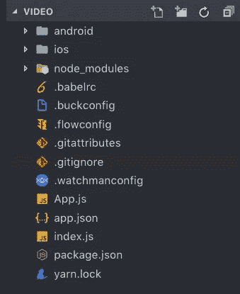
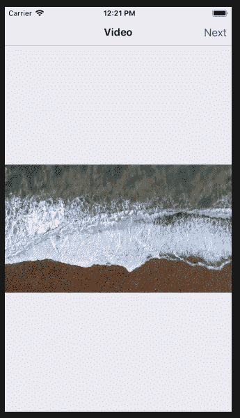
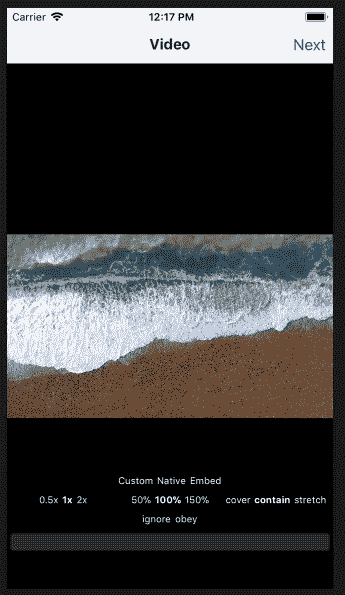

# react-本地视频组件

> 原文：<https://betterprogramming.pub/react-native-video-component-68262bcbc21f>

## React Native 中一个有用的视频库


[乔·塞拉斯](https://unsplash.com/@joaosilas?utm_source=unsplash&utm_medium=referral&utm_content=creditCopyText)在 [Unsplash](https://unsplash.com/search/photos/video?utm_source=unsplash&utm_medium=referral&utm_content=creditCopyText) 上拍照

我在 React Native 中寻找一个原生视频组件，但没有找到，所以我决定起草这篇关于 react-native-community 找到的名为 react-native-video 的库的文章。下面是如何使用 react-native 中的定制组件和代码来实现这个库。

# 第一步

使用创建一个名为 video 的新项目

```
react-native init video
```

一旦安装完成，您将拥有一个默认的 React Native 代码库，如下所示。



默认代码结构

现在我们需要添加一些内部文件夹和文件，这样我们就可以开始创建我们的视频组件。

# 第二步

创建一个名为 src 的文件夹，并在其中创建另一个名为 screens 的文件夹。现在，在这个文件夹中，创建一个名为`Video.js`的文件。

在此之前，我们需要设置导航来将 React 本地引擎导航到我们的文件。

```
npm install react-navigation
```

[](https://medium.com/@sudhirKr/react-native-navigating-between-the-screens-and-code-structure-for-beginners-6b815ee8f79) [## 反应导航初学者(高级版-3)

### 几个月前我开始和 react native 一起工作，我必须说这是一个从全职…

medium.com](https://medium.com/@sudhirKr/react-native-navigating-between-the-screens-and-code-structure-for-beginners-6b815ee8f79) 

在 src 文件夹外创建一个名为`Routes.js`的文件。

在`App.js`文件中进行修改。

```
import React, {Component} from "react";
import Routes from "./Routes";
const App = () => <Routes />export default App;
```

现在我们开始创建我们的视频组件。

# 第三步

安装以下命令:

```
npm install react-native-video
```

(GitHub 上有一个由 [react-native-community](https://github.com/react-native-community/react-native-video) 开发的很棒的资源库。查看更多详细信息。)

安装完成后，在终端中运行以下命令:

```
react-native link react-native-video
```

此命令会将库链接到您的项目。

现在转到`Video.js`文件，输入以下代码:

现在运行以下命令:

```
react-native run-ios
```

下面是它的展示方式:



无控制的视频

这是简单视频组件代码的基本结构。对于控件，您可以将以下代码添加到`Video.js`文件中，并获得带有控件和功能的视频组件。



具有完整控制和功能的视频

请和我一起欣赏 react-native-community 为 react-native-video 库所做的工作，并查看该库以了解更多细节。