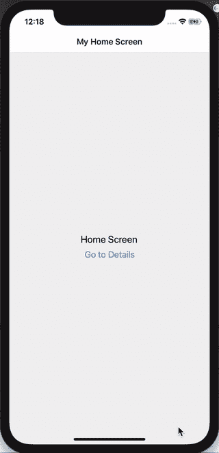

# React 导航 5:堆栈、标签和抽屉合二为一

> 原文：<https://betterprogramming.pub/react-navigation-5-stack-tab-drawer-all-in-one-ead723188056>

## 设置 React 本机应用程序的导航，实现无缝屏幕转换


安娜斯塔西娅·彼得罗娃在 [Unsplash](https://unsplash.com/?utm_source=unsplash&utm_medium=referral&utm_content=creditCopyText) 上的照片

React 导航为您的 React 原生应用程序在 iOS 和 Android 上提供无缝路由和导航。最近参加了 React Native 的课程，我了解到有很多有用的功能可以通过导航添加到你的应用程序中，其中大部分我将在这里解释。

## 我们将会做什么

*   分别浏览堆栈、标签和抽屉导航器
*   将它们结合起来，在 React 原生应用的屏幕上进行转换

**注意:**对于本文，我将使用 React Navigation 的最新稳定版本，即 v5。

# 什么是 React 导航？

以同样的方式在网络浏览器中处理往返——在那里推送和弹出路线——React Navigation 推送和弹出你的应用程序的路线。它的特别之处在于，它包括了我们今天在手机上看到和喜爱的屏幕切换时的流畅动画。

# 安装

如果您还没有这样做，让我们安装`[react-navigation](https://reactnavigation.org/docs/getting-started)`包。如果您使用 Expo，还需要运行`expo install`命令来安装它的依赖项！

```
npm install @react-navigation/nativeexpo install react-native-gesture-handler react-native-reanimated react-native-screens react-native-safe-area-context @react-native-community/masked-view**OR if you using yarn:**yarn add @react-navigation/native
```

# 设置

首先，我们将使用一个[堆栈导航器](https://reactnavigation.org/docs/stack-navigator/)。我之前提到过 React 导航推送和弹出路线，它这样做是从堆栈*中的*到*和*。**

堆栈导航器是一个包含应用程序路线的堆栈，默认情况下，您的第一个屏幕是您的根屏幕。当您切换应用程序的屏幕时，新的屏幕会放在堆栈的顶部。

要开始使用 React 导航，我们需要单独安装`react-navigation-stack`包:

```
npm install --save react-navigation-stack
```

我们现在准备修改我们的`App.js/App.tsx`文件来使用堆栈。

## App.js/tsx

上面有几点说明:

*   首先，我们导入所有的屏幕，就像您通常在任何 React/React 本机应用程序中所做的那样
*   然后，我们使用`createStackNavigator`初始化我们的堆栈，并使用它们的组件为我们应用程序的每个屏幕创建一个堆栈屏幕
*   最后，我们用`NavigationContainer`包装我们的堆栈屏幕，它负责管理我们应用程序的状态

# 使用

## HomeScreen.tsx

*   堆栈中的每个屏幕都将导航作为道具，因此每个屏幕都可以访问导航的`navigate()`功能
*   `navigate()`功能的第一个参数是指屏幕的名称(在`App.tsx`中设置)。第二个参数是可选的，保存我们需要在屏幕之间传递的任何细节。在本例中，我们传递一个用户 ID 和名称。

## DetailsScreen.tsx

*   在`DetailsScreen`中，我们正在访问从`HomeScreen.tsx`传入的相同路线参数。

## ContactScreen.tsx

# 工作演示

我们现在应该有一个带有基本导航的 React 本机应用程序，如下所示:



# 临时演员

到目前为止，我们已经通过按钮点击为 React 本地应用提供了一些基本的导航功能。但是，我们还可以添加一些其他内容，因此下一节将重点介绍:

*   页眉样式
*   在选项卡中导航
*   浏览侧边抽屉

我们开始吧！

## 页眉样式

为了给我们的应用程序标题添加一些样式，我们有两个选项:

*   给`Stack.Navigator`添加一些默认样式。此处添加的任何样式将应用于堆栈的所有屏幕。
*   给每个屏幕添加一些样式——如果你不想让所有的屏幕看起来都一样，这很有用。

在上面的代码中，我们选择了两个选项。在`HomeScreen`中指定的样式将覆盖在`Stack.Navigator`中指定的样式。所以你最终应该为`HomeScreen`选择一种背景色，为所有其他屏幕选择另一种背景色。

## 标签导航

标签可以在今天的大多数应用程序中找到，所以我们的应用程序也应该有一些！与堆栈一样，我们需要单独安装这个包:

```
npm install @react-navigation/bottom-tabsORyarn add @react-navigation/bottom-tabs
```

然后我们需要修改我们的`App.tsx`，如下所示:

*   `Tab.Navigator`的`screenOptions`道具允许多种配置，其中之一就是`tabBarIcon`。在上面的例子中，我们根据激活的路线分配图标。

## 抽屉导航

```
npm install @react-navigation/drawerORyarn add @react-navigation/drawer
```

*   drawer 的实现非常简单，和选项卡一样，您只需用`Drawer.Navigator`替换`NavigationContainer`的内容。

如果您现在点击并从左侧滑动，将会出现一个带有项目`Home`、`Details`和`Contact`的抽屉导航。

# 把所有的放在一起

如果你能走到这一步，太棒了！到目前为止，我们已经了解了如何通过 React Navigation 提供的三个主要导航器来实现导航——堆栈、选项卡和抽屉。但是现在大多数应用程序同时使用了*和*所有这些功能，那么我们该怎么做呢？

如果您尝试向`NavigatorContainer`添加多个导航器，它会产生一个错误，说已经有一个导航器了。


塞巴斯蒂安·赫尔曼在 [Unsplash](https://unsplash.com/s/photos/frustration?utm_source=unsplash&utm_medium=referral&utm_content=creditCopyText) 上拍摄的照片

我们的第一个想法可能是将选项卡导航器移动到`HomeScreen`中。然而，这意味着几件事:

*   我们的`HomeScreen`内容将会丢失，因为它将被选项卡导航功能所取代
*   我们可能会有一个无限循环，因为`HomeScreen`会自己导航
*   我们必须在所有屏幕上添加标签导航器，以确保在通过标签导航时不会丢失它们

一个更好的选择是创建一个单独的`MainScreen`组件来保存我们的`Home`、`Details`和`Contact`的选项卡导航器代码。

让我们现在就做吧！

## MainScreen.tsx

*   我们还对`App.tsx`做了一点小小的改动，以确保抽屉导航中的`Home`标签指向`MainScreen`，它现在处理我们的标签。

## App.tsx

由于我们的`initialRouteName`被设置为`Home`，我们的`MainScreen`将默认拾取并渲染`Home`。

## 栈呢？

最后，为了将我们的`Stack.Navigator`添加到我们的应用程序中，我创建了两个子 contact 组件，并将一个`Stack.Navigator`添加到我们的父组件`ContactScreen`:

对用户来说，这将简单地导航到`ContactA`或`ContactB`。唯一的区别是在幕后，它将属于在`ContactScreen`中创建的堆栈——这也是一个如何嵌套导航器的好例子。

# 最终产品

我们现在有了一个 React 本地应用程序，它通过 React 导航包使用堆栈、选项卡和抽屉导航器。


# 摘要

React 导航提供了一种简单的方法来处理整个 React 本机应用程序的导航。借助堆栈、标签和抽屉，在屏幕间切换轻而易举。

## 有用的链接

*   [GitHub 回购](https://github.com/nats12/react-native-navigation-demo)
*   [React 导航回购包括一个演示](https://github.com/react-navigation/react-navigation/tree/main/example)
*   [游乐场 app](https://wix.github.io/react-native-navigation/docs/playground-app/)