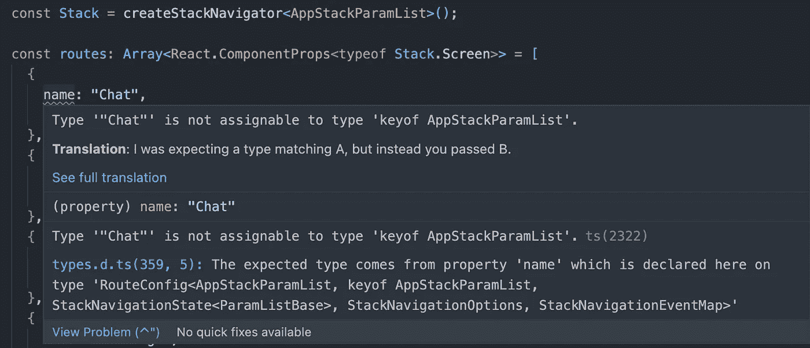
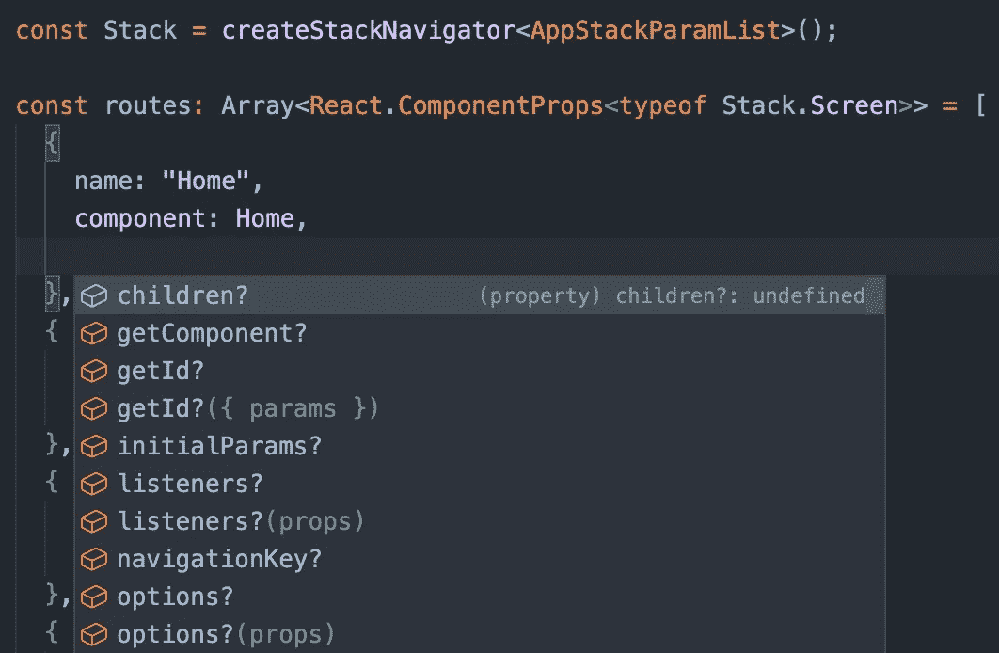

# 如何在 React Native With Typescript 中构造导航

> 原文：<https://betterprogramming.pub/react-navigation-with-typescript-fa7805f52ab0>

## 利用打字—反应导航

亨德里克·莫克尔在 [Unsplash](https://unsplash.com?utm_source=medium&utm_medium=referral) 上的照片

如今，构建导航已经成为任何移动应用的基本特征。说到 React Native world，我们口袋里有 [React 导航](https://reactnavigation.org/)。

本文将介绍如何使用 TypeScript 实现典型的 React 导航，同时比较使用 TypeScript 的不同策略。

更重要的是，它还将涵盖我们如何最大限度地利用 TypeScript 功能，以便能够在导航上构建一个更具可伸缩性的架构。

*注意:本文中的例子是使用@react-navigation@6.x 版本导出的。*

*警告:本文将涉及的方法/策略并不是你必须严格遵循的必不可少的方法/策略，但它们只是我的偏好，我发现与本文的读者分享它们很有用。* [*React Navigation 已经有了一个惊人的关于类型脚本用法的有据可查的部分。*](https://reactnavigation.org/docs/typescript) *也就是说，你已经可以按照这个文档***构建一个很棒的 react-navigation 类型脚本结构了。**

## *创建堆栈导航器*

*让我们来看看如何使用 [React 导航](https://reactnavigation.org/)包创建一个[堆栈导航](https://reactnavigation.org/docs/stack-navigator/)。*

*参见下面取自[反应导航](https://reactnavigation.org/docs/stack-navigator/#api-definition)的例子；*

*可以看出，这里没有任何关于 TypeScript 的具体内容，让我们在这段代码中添加一点 TypeScript。*

*在上面，我们为`createStackNavigator`添加了`ParamList`类型。但是，我们怎么知道`createStackNavigator`采用了泛型类型呢？有几种方法可以解决这个问题。首先查看[文档](https://reactnavigation.org/docs/typescript/#type-checking-the-navigator)一直是个好习惯。在这个给定的例子中，您会注意到在文档中已经有一个关于它的部分。*

*另一方面，假设网站上没有记录`createStackNavigator`的这种特定类型，那么确定该函数是否具有该类型的一种可能的方法就是跳转到该函数的类型定义。一开始可能会令人生畏，因为会有很多类型、接口、泛型飞来飞去，但是你越习惯于跳到类型定义，它就越不会让人不知所措。*

## ***更新！***

*如果你想用 typescript 处理额外的复杂性，并且还想忽略 React 团队(`React.ComponentProps)`)的优秀 TS 工具，你可以继续阅读到本文末尾。*

*但我恐怕，这一段可能就要结束了！*

*我们将能够使用`React.ComponentProps<typeof YourStack.Screen>`检索每个堆栈屏幕的类型和它们的配置，结果将非常惊人。*

*完整示例见下文:*

*是的，它仍然有智能感知，如果你把一个不相关的*(或者:一个不在你的堆栈类型声明中的屏幕)*屏幕放到你的堆栈中，它仍然会警告你，这样:*

**

*无效屏幕*

*智能感知也将在那里:*

**

*它也更加简洁、可配置和动态:*

*总之，这种方法允许我们轻松地管理复杂的导航结构*(至少当我们将这种特定的方法与本文中的其他方法进行比较时)*。这是因为在你拥有更干净的 JSX 的同时，你也能够以一种更动态、更模块化的方式来配置你的`routes`。*

## *领先一步使用 TypeScript*

*它确实不局限于只声明`createStackNavigator`的泛型类型。`Stack.Navigator`会有的`children`元素类型怎么样？虽然他的概念在官方文档中已经有了很好的定义，但是让我们看看下面我们可以如何使用它来创建一个更松散的结构。*

*哎呀，这里发生了这么多…让我们把每个代码块分成单独的部分。*

*在代码片段的顶部，我们正在导入必要的模块。这些导入包括类型、函数和其他必要的东西。它们不是有趣的，而是必要的:)*

*上面，我们从 react-native 导入了`[View](https://reactnative.dev/docs/view)`组件，这样这个例子可以用一种更简单的方式来演示。*

*现在，有趣的部分来了。从`@react-navigation/core`进口的`RouteConfig`正好取五种类型作为[通用类型](https://www.typescriptlang.org/docs/handbook/2/generics.html)。这个特殊的类型定义在官方的 react-navigation 网站上没有记录，尽管如此，你已经可以通过使用我们上面提到的跳转到类型定义的方法来理解这个类型定义。*

*尽管在典型的 react-native typescript 项目中使用它可能显得多余/没有必要，但它有几个好处，将在下一节中介绍。*

## *[智能感知](https://code.visualstudio.com/docs/editor/intellisense)*

*因为我们有一个严格类型化的堆栈路由(又名 app routes)数组，所以数组的每个元素现在都必须坚持数组的类型定义。这意味着在向数组中添加新元素时，IntelliSense 将开箱即用。*

*此外，应用这种类型会迫使我们在有新元素添加到应用程序 routes 时更新`AppStackRoutesType` 。否则，我们将无法添加一个在`AppStackRoutesType(AppStackParamList)`T13 中不存在的新元素。*

## *绘制路线*

*接下来是最后一部分，我们使用`createStackNavigator`创建堆栈导航器。那么简单地说，这只是映射我们上面创建的数组和它的严格类型的问题。*

*我们最终可以信任数组中的每个元素，它将拥有正确类型的元素，因此使用 [spread 语法](https://developer.mozilla.org/en-US/docs/Web/JavaScript/Reference/Operators/Spread_syntax)是安全的。*

## *这真的是最后一部分吗？*

*嗯……不！*

*我们仍然可以在我们已经讨论过的例子上改进我们的打字。*

*你可能已经注意到的不同之处是我们有了`StackRoutesType`,它采用了一个泛型类型，等于我们之前已经见过的类型。但是你可能会问这有什么好处。最好用形象化的方式来回答这个问题。*

*如果我们不选择使用通用的`StackRoutesType` *，*，我们将不得不为应用程序中的每个堆栈重复打字。*

*因此，随着应用程序越来越大，这将是一个噩梦。*(这里的概念是，应用程序中堆栈的数量与应用程序的复杂性成正比，事实上，这并不总是 100%有效的假设，但它适用于这个特定的示例)**

*另一方面，看上面当使用泛型类型时，它是如何变得更简单和干净的。*

# *最新图片*

*让我们比较一下典型的`Stack`函数在两种不同场景下的表现:*

**图一:在 JSX 逐个渲染整个堆栈屏幕。**

**图 2:使用严格类型化的 typescript 创建的堆栈路由数组呈现屏幕。🎉**

## *还有一件事…导航器道具呢*

*我们可能还有一件事要考虑，那就是堆栈导航器的道具。查看下面的`StackNavigator` *，*存在单个导航器的一大块配置。为什么不让这些配置与 JSX 脱钩？*

*从第 13 行开始，我们应该已经熟悉了为什么使用泛型。与这里的栈路由类型的唯一区别可能是`DefaultNavigatorOptions`类型，它是从`@react-navigation/core`引入的。类型本身的名称甚至是不言自明的，它是导航器的`options`。*

*类似于`*RouteConfig*` 类型我们上面提到过的*，*也需要多个泛型类型。除此之外，请记住，我们是显式地 o**子键，因为我们已经渲染了对应于`Stack.Screen` *的`Stack.Navigator` 子键。****

*在第 22 行，我们正在创建一个全新的对象(或者它可以是一个函数，只要它返回一个满足导航选项类型的对象)，它将代表我们的导航器的`options`。*

*因此，在第 50 行，只要满足给定的类型，这个对象就可以安全地与 spread 语法一起使用。*

*更干净的 JSX…我认为…*

## *最新图片-航海家道具*

*让我们再次比较典型的`Stack`函数在两种不同场景下的表现:*

**图 1:在 JSX 拥有 stack navigator 配置。**

**图 2:将堆栈导航器配置从 JSX 解耦。**

*在本文中，我们已经介绍了如何真正利用 TypeScript 并实现一种更简洁的方式来构造我们的反应式本机导航器。*

*祝大家有一个无虫的一天。*