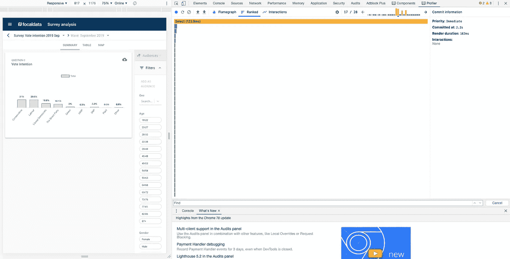
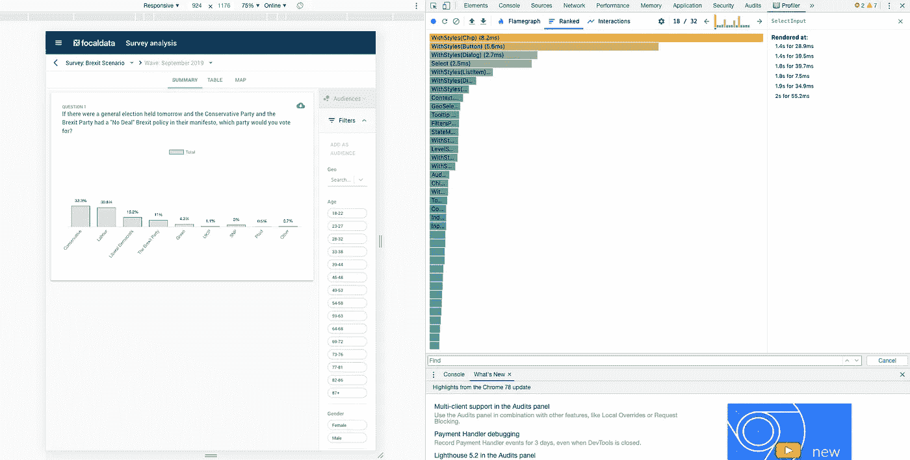

# 对性能优化做出反应

> 原文：<https://betterprogramming.pub/react-performance-optimisations-15b244cf3abb>

## 用真实世界的例子


布拉登·科拉姆在 Unsplash[拍摄的照片](https://unsplash.com/s/photos/athlete?utm_source=unsplash&utm_medium=referral&utm_content=creditCopyText)

在本文中，我们将使用来自我们的 web 应用程序 [focaldata](https://www.focaldata.com/) 的示例来浏览 React 中的一些性能优化。

然而，在我们开始之前，重要的是要考虑什么时候是关注优化的合适时机。React 非常快，与其防止重新渲染，不如将时间花在构建产品上。性能改进也增加了应用程序的复杂性，这可能会减慢其他开发人员处理代码的速度。用肯特·多兹的话说:

> 大多数时候，你不应该费心去优化不必要的重新呈现器。反应非常快，我可以想到很多事情让你用你的时间去做，这比优化这些事情要好。事实上，用 useMemo 和 useCallback 等功能]来优化东西的需求是如此之少，以至于在我从事 PayPal 产品工作的 3 年时间里，甚至在我从事 React 工作的更长时间里，我都不需要这样做。

如果您的应用程序感觉很慢，您应该只考虑关注性能优化。

# 什么是重渲染？

当需要提高性能时，开发人员通常会致力于减少重新渲染。但这意味着什么呢？

更新 DOM 分三步完成:

*   渲染阶段是 React 创建元素的时候。`React.createElement`。
*   协调阶段是 React 比较以前的元素和新的元素的阶段。
*   DOM 更新的提交阶段(如果需要的话)。

呈现和协调阶段非常快，但是提交阶段通常是 DOM 更新中最慢的部分。

与其专注于防止闪电般的渲染(如果在协调阶段没有差异，甚至可能不会更新 DOM)，通常最好的方法是隔离缓慢的提交并解决它们。

如果我们正在进行性能优化，我们应该知道应用程序中目前慢的是什么。例如，这可能意味着点击一个按钮或输入一个输入。我们可以使用 React Profiler 工具调查哪些提交速度慢——只需下载 React dev 工具，检查页面并单击 Profiler。

这里有两个我们在 [focaldata](https://www.focaldata.com/) 发现的性能改进的例子。值得记住的是，React 在生产中更新 DOM 的速度要比在开发中快得多。以下示例正在开发中。

# 使用 React 探查器识别慢速提交

在我们的内部应用程序中，我们有一个调查列表。当用户点击调查时，加载下一页会有一点延迟。使用 React Profiler，我们可以单击 record，选择一个调查，停止记录，然后检查提交。



正如您在图中看到的，一个组件`Select`需要 123 ms 来提交，比所有其他组件都要长得多。我们可以在截图右上角的小图中看到，条形图中有四个高的黄色条。在其中的每一个中，`Select`是最昂贵的组件(即花费了最长的时间来加载),总共花费了超过 400 ms 来加载。

`WindowedSelect`是另一种昂贵的成分。在代码库中搜索后，我发现这是一个 0.0.3-alpha 版本的 npm 包，使用了`Select`。

让我们将软件包升级到版本 2.0.1，并再次运行 profiler。



`Select`组件现在只需要 2.5 毫秒加载。现在最昂贵的组件是`withStyles(Chip)`，它需要 8.2 毫秒——大大少于`Select`的 123 毫秒加载时间。这是一个显著的性能提升，而无需编写任何代码！

# 使用 useMemo 解决不必要的重新渲染

我们在应用程序的几个部分向用户显示一个可重用的表格组件。虽然渲染速度相对较快，但加载时会有一点延迟，尤其是在显示属于某个用户的所有文件的部分。

使用 React `Profiler`，我记录了登陆页面，点击上传文件按钮的过程。`Profiler`显示表组件花了 38 毫秒提交。

表格组件映射数据以创建表格行，然后映射每一行以创建单独的单元格。这意味着它的性能是`O(n^2)`。如果它在许多文件中循环，提交必然会很慢。

虽然该表需要遍历大量数据，但我们可以检查它是否被不必要地重新呈现。为了更好地理解渲染过程，我们可以使用`[WhyDidYouRender](https://www.npmjs.com/package/@welldone-software/why-did-you-render)` npm 包并用`useRef`跟踪渲染。在`Table`组件中，我们添加以下内容:

控制台日志显示表格组件呈现了四次——三次是不必要的。更新状态、父组件渲染或属性更改会触发重新渲染。`WhyDidYouRender`包声明`Table`正在被重新渲染，因为道具在变化——但是输入是一样的，那么为什么它要被重新渲染呢？

原因是，在 JavaScript 中，整数、字符串和布尔值具有引用相等性:

```
true === true // true
false === false // true
1 === 1 // true
'a' === 'a' // true
```

然而，对象、数组(JavaScript 中的对象)和函数指向内存中的一个空间，而*没有*的引用相等性:

```
{} === {} // false
[] === [] // false
() => {} === () => {} // false
```

`Table`组件正在重新呈现，因为我们将列和数据作为数组/对象的道具传入。这就是为什么即使列和数据的值保持不变，props 在技术上也会发生变化。

为了解决不必要的重新渲染，我们可以记忆表组件，即在缓存中存储数据。内存化用于解决引用相等的问题，并缓存计算量大的函数。

在 React 中，我们有几个可用的记忆选项。`useCallback`会缓存一个回调函数。当我们将函数作为没有引用相等性的道具传递时，这是很有帮助的。使用`useMemo`，我们可以记忆值，这样它们就不需要重新计算，或者我们可以将组件包装在`React.memo()`中，这类似于纯组件。

在这种情况下，我们想要记忆一个值:带有映射数据的`Table`组件:

通过将逻辑提取到一个单独的组件中并用`useMemo`调用它，表格组件仅在`data`更新时创建。

我们可以在`Files`组件中包含`CreateTableData`函数，但是该函数仍然会在每次渲染时创建。在 JavaScript 中创建函数是很昂贵的，所以最好把它提取出来，只在需要的时候创建。

我们已经节省了三次不必要的大约 38 毫秒的重新渲染，节省了超过 100 毫秒的加载速度。然而，`useMemo`确实增加了代码的复杂性。在实现性能改进之前，考虑速度与代码复杂性之间的权衡总是很重要的。

# 进一步阅读

*   [在修复重新渲染之前修复缓慢的渲染](https://kentcdodds.com/blog/fix-the-slow-render-before-you-fix-the-re-render)，肯特·C·多兹 https://kentcdodds . com/blog/Fix-the-Slow-Render-Before-You-Fix-the-Re-Render
*   [使用备忘录和使用回调](https://kentcdodds.com/blog/usememo-and-usecallback)，肯特·C·多兹
*   [优化性能](https://reactjs.org/docs/optimizing-performance.html)，reactjs.org
*   [错误的抽象](https://www.sandimetz.com/blog/2016/1/20/the-wrong-abstraction)，桑迪·梅斯
*   [React 钩子:UseEffect，UseCallback，UseMemo](https://dev.to/devcord/react-hooks-useeffect-usecallback-usememo-3o42) ，Devcord
*   [如何使用 React Profiler 发现并修复性能问题](https://www.youtube.com/watch?v=00RoZflFE34) (YouTube)，Ben Awad