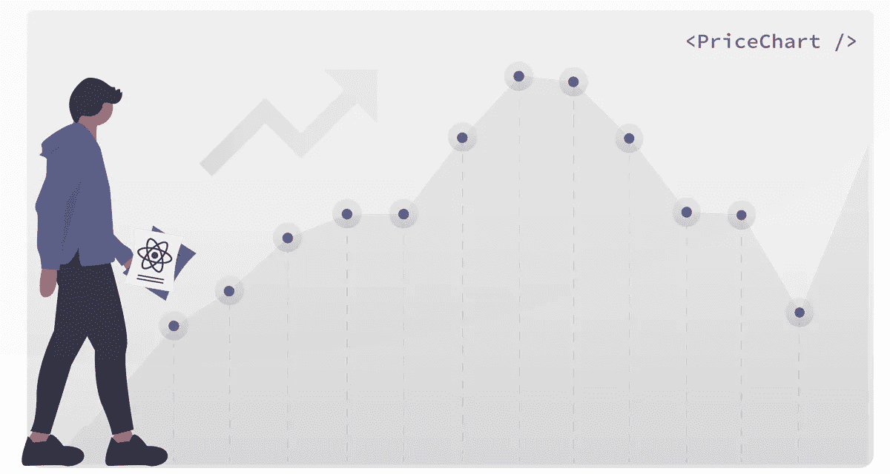
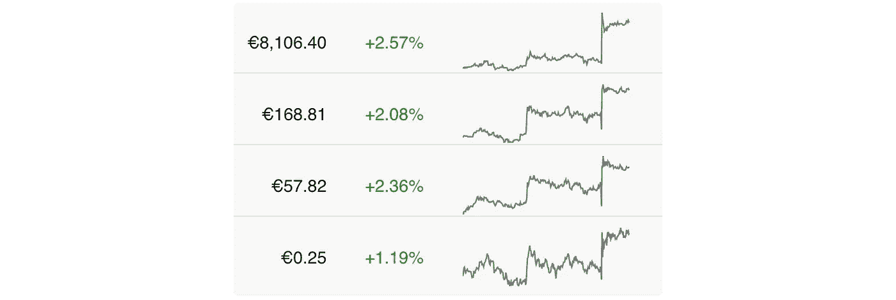
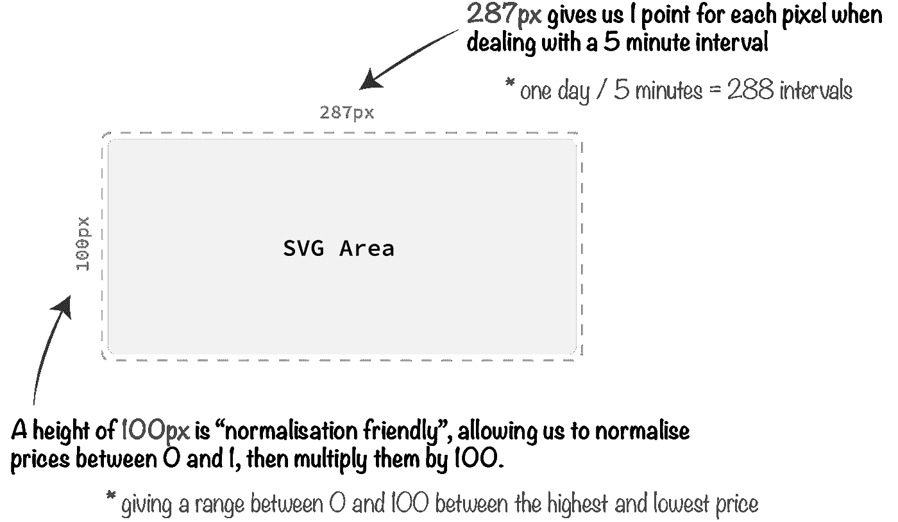
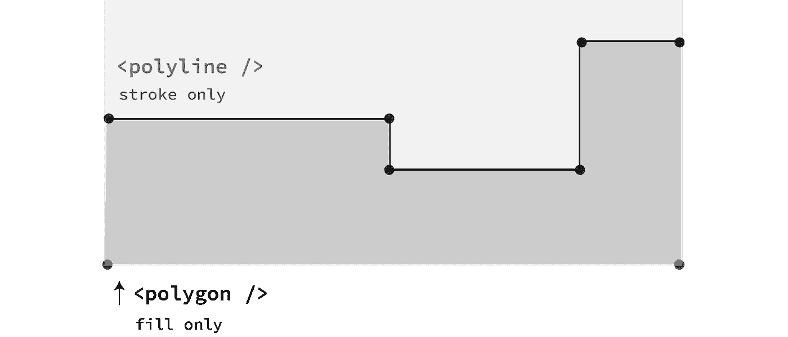
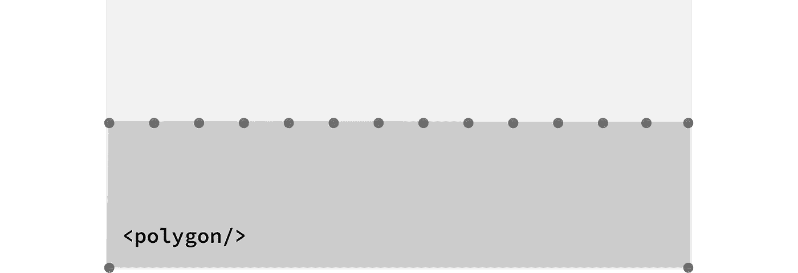

# React:实时价格图表 SVG 组件

> 原文：<https://betterprogramming.pub/react-real-time-price-chart-svg-components-3f93767fc350>

## 如何在 React 中实现实时 SVG 线图



# 价格图表是任何金融平台的重要组成部分

在财务应用程序的登录页面和仪表板上包括价格图表已经成为标准做法，无论是在应用程序中还是在 web 上。这些图表是作为 SVG 构建的，旨在显示一段时间(通常是 24 小时)内的趋势，通常每隔几秒到几分钟更新一次。



价格图表的典型示例，显示资产的 24 小时价格变动

描述价格变动的图表通常与其他资产数据(如价格和价格变化)一起显示在列表中，通常通过仅显示线条本身来保持简单的美感。

我们还将介绍如何用不同的颜色给线下的区域着色，这是这些图形的另一个共同特征。

由于这些图形的简单性，没有必要采用一个更强大的绘图解决方案，这会导致项目规模膨胀和增加不必要的复杂性。有了与 React 状态结合使用的 SVG 操作知识，以及规范化数据集以适合我们的 SVG 作为定位点的过程，我们可以自己创建一个优雅、快速、轻量级的解决方案。

本文详细介绍了这个过程，将这些图形创建为 React 组件，该组件通过内联 JSX 获取一系列点来构建 SVG。我们将涵盖:

*   如何使用一个 SVG 构建一个线图，用一个`[polyline](https://developer.mozilla.org/en-US/docs/Web/SVG/Element/polyline)`表示线本身，用一个`[polygon](https://developer.mozilla.org/en-US/docs/Web/SVG/Element/polygon)`表示线下可选的阴影区域——这对于增加图形的美感也非常有用
*   如何构建一个`<PriceChart />`组件，它接受一组坐标作为支撑，利用它们来构建线图的形状
*   如何获取一系列原始价格，并在 0 到 100 的范围内对其进行归一化，以绘制到 SVG 上

在将 SVG 包装在 React 组件中并为行坐标嵌入道具之前，让我们首先探索如何构造 SVG 本身。

# 构建价格图表 SVG

构建 SVG 图表组件有三个步骤:

1.  价格图表的形状和密度是要考虑的第一件事——与决定要使用的 SVG 维度的数据集相一致。
2.  一旦确定下来，我们就可以将 SVG 模板化为 React 组件，将其包装在一个样式化的组件中，以适应其大小和颜色。
3.  最后，价格坐标可以通过 props 嵌入到 SVG 中，并绘制成 SVG 元素中的点。

## 确定 SVG 大小

规划 SVG 的维度非常重要。大多数价格图表都绘制在一个矩形区域内，这不是巧合。这就是为什么:

*   **SVG 的宽度**通常与将要绘制的价格一致。例如，5 分钟间隔的每个像素 1 个点为我们提供了 24 小时内总共 288 个图。在这种情况下，SVG 的宽度将是 287px(因为第一个点将位于 x 位置 0)。
*   **SVG 的高度**需要*标准化友好。*换句话说，一旦我们将价格标准化为 0 到 1 之间的值，它们需要再次相乘以适应 SVG 的维度(SVG 不会只有 1px 高)。例如，我们可以添加另一种计算方法，将这些标准化值乘以 100，这样我们就可以得到 0 到 100 之间的范围。现在我们可以开始工作了。

一旦我们的 React 价格图表组件构建完成并准备好获取坐标，我们将在本文的后半部分更详细地讨论这个标准化过程。

考虑到上述情况，我们将在图表中显示过去 24 小时的价格变动。

对于这个时间框架，以五分钟为间隔绘制点是完全可以接受的，提供了足够的细节来显示价格的准确变动，总共有 288 个价格点可供使用:

```
**// price points with 5 minute intervals**86,400 (seconds in a day) / 300 (seconds in 5 minutes) = 288
```

我们最终得到的是一个合适的 SVG 区域`287px by 100px`。这个区域非常适合在列表或小部件中嵌入价格图表:



确定价格区间时需要考虑的一些事情:你计划的图表有多大？你能减少点数，从而降低应用带宽要求吗？您的数据源允许的最短间隔是多少？您可能需要围绕这个或其他约束来设计您的 UI。

我们的 SVG 大小现在可以根据您的 UI 目标作为进一步操作的基础。因此，如果您的价格图表需要横跨整个页面，您可以每四个像素而不是每个像素绘制一个点，对于相同的五分钟间隔，总宽度将为 1151 像素，或者任何符合您需要的形状。

现在 SVG `[viewBox](https://developer.mozilla.org/en-US/docs/Web/SVG/Attribute/viewBox)`的维度已经确定，我们可以安全地定义我们的`[svg](https://developer.mozilla.org/en-US/docs/Web/SVG/Element/svg)`元素(尽管里面还没有任何东西):

```
**// defining the price chart** [**viewBox**](https://developer.mozilla.org/en-US/docs/Web/SVG/Attribute/viewBox) **dimensions**<svg
   ae nf" href="http://www.w3.org/2000/svg" rel="noopener ugc nofollow" target="_blank">http://www.w3.org/2000/svg"
   **viewBox="0 0 287 100"** >
   ...
</svg>
```

现在，让我们继续定义构成线图本身的元素以及这条线下面的阴影区域。

## SVG 元素:折线和多边形

我们价格图表的线条是一个强制元素，通过`[polyline](https://developer.mozilla.org/en-US/docs/Web/SVG/Element/polyline)` SVG 元素实现。`polyline`是一个基本形状，它通过一个`points`属性连接几个坐标来创建直线:

```
**// polyline drawing a zig-zag line**<svg ...>
  <polyline **points**="0,0 25,50 50,0 75,50 100,0" />
</svg>
```

`polyline`下方的阴影区域是通过`[polygon](https://developer.mozilla.org/en-US/docs/Web/SVG/Element/polygon)`元素实现的。A `polygon`定义了由一组相连的直线段组成的闭合形状。像`polyline`一样，`polygon`也接受一系列定义形状的点:

```
**// polygon drawing a square**<svg ...>
  <polygon **points**="0,0 100,0 100,100 0,100" />
</svg>
```

将这些形状组合在一起就是一个美观的价格图表所需要的。考虑下面的插图，看看`polyline`和`polygon`如何共同赋予价格图表一些个性:



SVG 由两个元素组成:a <polyline>和</polyline>

我们只需要担心`polyline`的`stroke`颜色和`polygon`的`fill`颜色。这些都可以通过 CSS 来实现，这将在下面进一步讨论。

你可以把`polygon`想象成一个盒子，它上面有一大堆点，准备好与线条本身进行相同的运动:



只有我们<polygon>的顶行被操纵</polygon>

考虑到这一点，我们现在可以对上一节的`svg`进行一点更新，添加这两个元素:

```
<svg
   ae nf" href="http://www.w3.org/2000/svg" rel="noopener ugc nofollow" target="_blank">http://www.w3.org/2000/svg"
   viewBox="0 0 287 100">
  <polygon
    **points**={`${...} 287,100 0,100}
  />
  <polyline
    **points**={`${...}}
   />
</svg>
```

现在我们有所进展，但是现在需要提供`points`道具来定义形状。

现在，我已经添加了空字符串文字，并添加了`polygon`元素的底部点——记住，我们只需要定义该形状的顶部线条来匹配`polyline`移动。

## SVG 作为 React 组件

这个难题的最后一部分是实现一个 React 组件，它将接受一个`points`prop——一个坐标数组——并将它们作为点放在 SVG 元素中。

首先，让我们考虑如何格式化这些坐标。它们将是数组，每个点提供一个`x`和`y`值。这里我们不假设任何格式规则，比如在`polyline`和`polygon`元素中分隔每个点的 x 和 y 坐标的逗号——我们将在组件本身中处理格式。

现在让我们只导入带有虚拟数据的普通值。这可能是如何做到的:

```
import { PriceChart } from './PriceChart';const MyComponent = () => (
  **<PriceChart**
    **points**={[[0,50],[1,51],[2, 50.5],[3,56],[4,50] ... [287,78]]}
  **/>**
);
```

我们提供了一个数组的数组，每个数组都有一个`x`和`y`坐标。`x`值始于`0`——图表的左侧——并逐点通过。`y`值是我们在`0`和`100`之间的标准化价格，其范围我们之前已经确定。

在 API 级别，`x`坐标的计算非常简单。在返回完整的坐标序列之前，您可以循环遍历您的`y`坐标并增加一个初始化为 0 的计数器。另一个解决方案是简单地返回标准化价格，并增加前端的`x`坐标。

这就剩下我们的`<PriceChart />`组件来绘制这些点了。让我们把它们取出来，并以我们的 SVG 元素能够理解的方式进行格式化:

```
export const PriceChart = (props) => (
  <svg...>
    <polygon
      points={`${**props.points.map(p => 
                 ' ' + p[0] + ',' + p[1]
                )**} 287,100 0,100`
             }
    />
    <polyline
      points={`**${props.points.map(p => 
                 ' ' + p[0] + ',' + p[1]**
                **)**}`
             }
    />
  </svg>
);
```

我们的`<PriceChart />`功能组件现在返回完整的 SVG。它在 JSX 级别绘制出`points`道具，将每个点作为`p`并以`x,y`的格式返回一个格式化的坐标，同时还在每个点之间添加一个空格。每个`p`点的索引`0`是我们的`x`坐标，而索引`1`是我们的`y`坐标。

在通过样式化组件添加了一些 CSS 之后，我们完成的组件类似于下面的 Github 要点。下面是完整的实现:

就样式而言，我们将 SVG 本身包装在一个我们称之为`Wrapper`的样式`div`中。

我们已经确保包含的`svg`元素保持了`Wrapper`的全宽，并且还分别为`polyline`和`polygon`定义了`stroke`和`fill`属性。`Wrapper`自身坚持其包含元素的维度；很有可能我们将把`<PriceChart />`嵌入到另一个包含组件中，所以我们希望回到那些维度。

好了，现在我们的组件已经出来了，让我们最终探索 JavaScript 中的价格规范化过程。

# 使一组价格数据正常化

本节专门介绍如何将一系列价格，例如:

```
const prices = [
  961.7442,
  8963.1259,
  8961.5466,
  8959.3715,
  8954.2278,
  ...
];
```

…转换成符合我们的 SVG 的标准化值，SVG 的高度为`100px`:

```
const normalised_prices = [
  12.40342549423265,
  12.111408873991664,
  12.445187442672605,
  12.904885894352674,
  13.991985763740644,
  ...
}
```

我们在这里采用的标准化方法称为[特征缩放](https://en.wikipedia.org/wiki/Feature_scaling)。要素缩放取数据集中的最大值和最小值，并在值 0 和 1 之间重新缩放整个数据集。我们将很快用 JavaScript 编写这个等式，如下所示:


将数据集归一化到 0 和 1 之间的特征比例方程

为什么要这么做？因为数据，尤其是价格，变化很大。它们是如此的不可预测，以至于我们不可能预测 SVG 的维度。此外，我们的 SVG 设计用于处理各种不同价格范围的市场。

对一系列值进行标准化是解决这种不可预测性的一个很好的方法。我们已经获得了手头的最低和最高价格。如果您只是将价格放在一个数组中，您可以使用 JavaScript 的`[Math.min()](https://developer.mozilla.org/en-US/docs/Web/JavaScript/Reference/Global_Objects/Math/min)`和`[Math.max()](https://developer.mozilla.org/en-US/docs/Web/JavaScript/Reference/Global_Objects/Math/max)`函数来获取这些值:

```
**// getting min and max from an array**const min = Math.min(...prices);
const max = Math.max(...prices);
```

如果您正在处理复杂的 JSON 对象，一个更耗费资源(但语法最少)的解决方案是遍历对象，在计算最小值和最大值之前手动填充一个数组:

```
**// getting max and min from some JSON API result**let prices = [];for (let i = 0; i < json.length; i++) {
   prices.push(parseFloat(json[i].marketdata.ask_price));
}const min = Math.min(...prices);
const max = Math.max(...prices);
```

在上面的例子中，我们从`json[i].marketdata`的`ask_price`字段获取价格。

从这里开始，我们可以遍历每个价格，并应用归一化方程返回一个在`0`和`1`之间的值:

```
**// feature scaling equation in Javascript**let normalised_price = 
   (parseFloat(prices[i]) - min) / (min - max);if (isNaN(normalised_price)) {
  normalised_price = 0;
}
```

在 JavaScript 中，0 除以 0 会得到`NaN`，它不是一个浮点数。正因为如此，我已经添加了一个额外的检查与`[isNan()](https://developer.mozilla.org/en-US/docs/Web/JavaScript/Reference/Global_Objects/isNaN)`，以覆盖正常化的价格到`0`，如果我们有一个不活跃的市场的价格。

这已经足够好了——我们现在需要将这个范围从 0–1 增加到 0–100，以符合高度为 100 像素的 SVG。为此，我们可以将`normalised_price`乘以`100`:

```
normalised_price = Math.abs(normalised_price * 100);
```

我们在这里使用了`[Math.abs()](https://developer.mozilla.org/en-US/docs/Web/JavaScript/Reference/Global_Objects/Math/abs)`来确保我们处理的是无符号值。

现在肯定一切都很好；我们的值将毫无问题地嵌入到我们的 SVG 中。嗯——差不多。还有一个问题需要解决:SVG 的原点(0，0)在`viewBox`的左上角，而不是我们在标准数学中所期望的左下角。

正因为如此，我们的价值观目前是颠倒的。非常高的标准化价格 90 将出现在图表底部附近，而较低的价格 5 将出现在顶部 5 个像素处。我们需要添加另一个计算来反转我们的价格:

```
**// inverting our prices to make up for SVG coordinate system**normalised_price = Math.abs(normalised_price - 100);
```

我们只是从正常价格中扣除了 100，并删除了负号，确保结果值再次不带符号。有了这个地方，一个正常化的高价格 90 将转化为`10`，一个低价格 5 将转化为`95`——所有这些都与我们的 SVG `viewBox`设置一致。

总结整个标准化过程，以下是完整的解决方案:

# 摘要

本文探讨了如何利用 SVG 和 React 创建实时价格图表，其中的`polygon`和`polyline`点是通过一个组件 prop 提供的。

该属性传递原始坐标值，不采用 SVG 期望的任何格式规则。相反，格式化是在映射点数组时在 React 组件中完成的。

我们还参观了如何使用特性缩放来计算这些标准化值，理想情况下，这些值将在后端进行计算，并通过 API 或 Websocket 提供给 React 应用程序。

## 更多资源

阅读有关 Websockets 的更多信息，将您的 React 应用连接到实时数据:

[](https://medium.com/@rossbulat/react-managing-websockets-with-redux-and-context-61f9a06c125b) [## React:用 Redux 和上下文管理 Websockets

### 使用 React 上下文和 Redux 存储将组件连接到实时 Socket.io 事件

medium.com](https://medium.com/@rossbulat/react-managing-websockets-with-redux-and-context-61f9a06c125b) 

阅读有关如何在 React 中制作 SVG 动画的更多信息:

[](https://medium.com/@rossbulat/react-svg-stroke-animation-with-css-explained-c1e8e3d2e206) [## React:解释了 CSS 的 SVG 笔画动画

### 和创建带有样式化组件的 CSS 菜单切换过渡

medium.com](https://medium.com/@rossbulat/react-svg-stroke-animation-with-css-explained-c1e8e3d2e206)