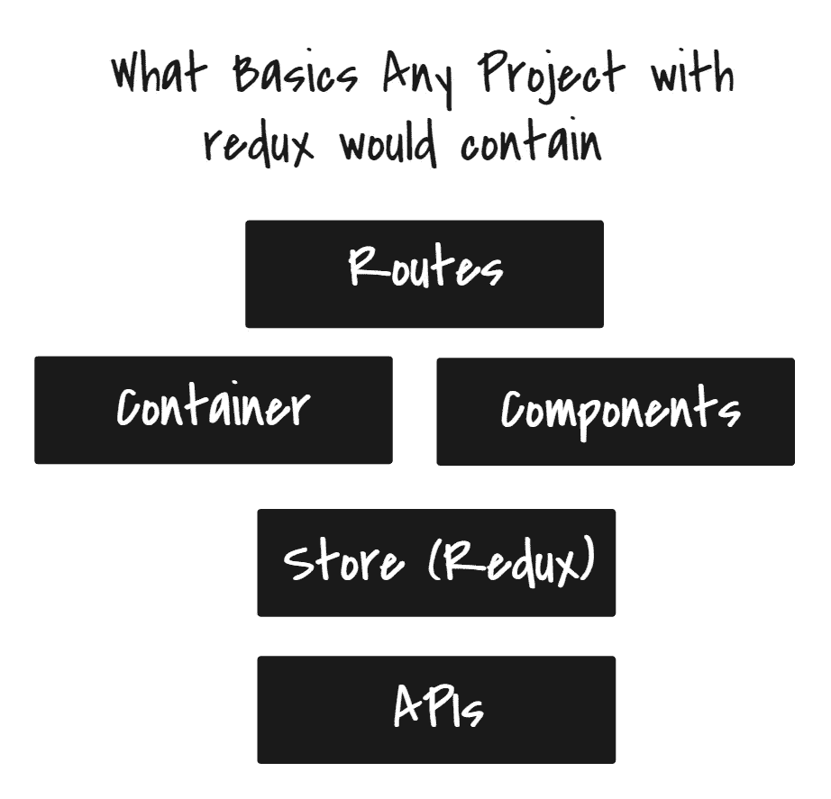
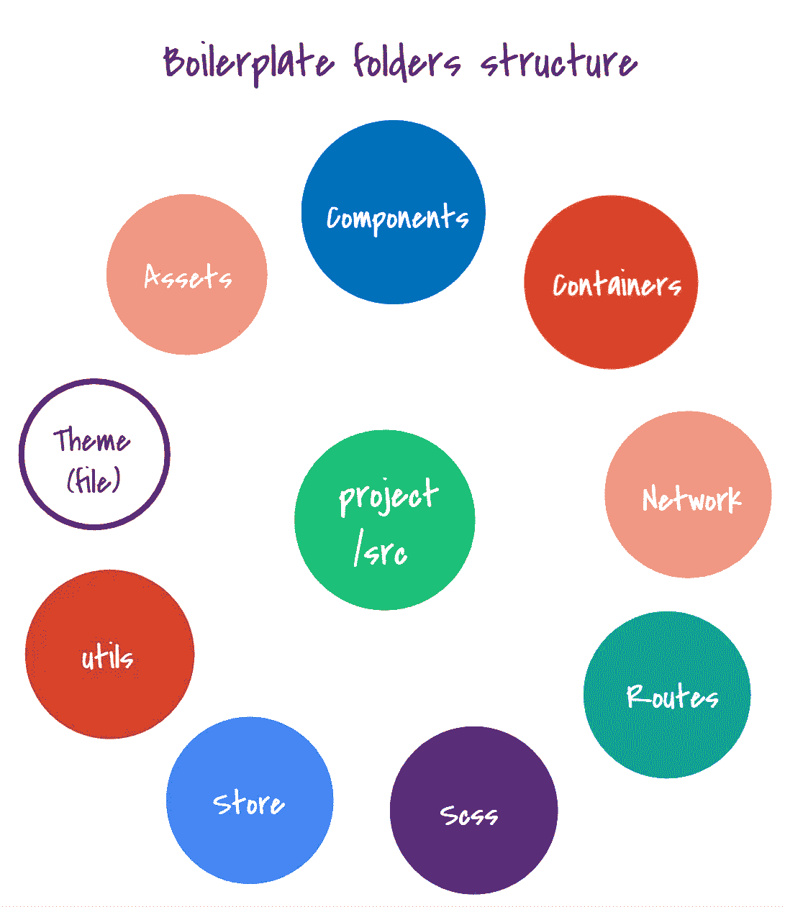

# React-Redux (Saga)样板文件

> 原文：<https://betterprogramming.pub/react-redux-saga-boilerplate-d2ca0c891ccd>

## 你需要尽可能快地开始你的项目，这是创建你自己的样板文件的良好起点


[图片来源](https://xpgraph.com/react-is-the-new-black)

在本文中，我们将发现一个使用 React、Redux-Saga 和本地化的 Material UI 的样板文件。

## **“样板”是什么意思？**

> 根据维基百科，“样板代码或只是样板代码是必须包含在许多地方的代码段，很少或没有改动”。因此，这意味着样板文件是一个特性甚至一个项目的快速开始，如果你启动它们的步骤是相同的话。为了节省时间，你可以开始用所谓的样板文件来写。

## **我什么时候需要样板文件？**

每当你觉得你重复了一堆代码，你知道你必须开始写你自己的样板文件来加速你的起点。

让我们开始探索今天由 React 创建的样板文件。你会检查它是否适合你的需要，或者不启动你的反应应用程序。为了能够使用这个样板文件，您需要了解 React 和 Redux saga。



## React-Redux 样板技术:

*   反应
*   Redux 传奇
*   反应路由器
*   路线守卫(私人路线)
*   引导程序
*   材料用户界面
*   反应-国际
*   Axios

# 主文件夹

React 样板文件由`/src`中的主文件夹组成，如下图所示:



## 📁资产:

包含字体、图像、区域设置文件夹(用于本地化)和任何共享媒体文件夹的文件夹。

## 📁组件:

组件文件夹将包含项目中的任何功能组件；您可以在这些组件中使用 React 挂钩来连接状态。

## 📁容器:

容器文件夹将包含项目中的任何类组件，您可以在其中使用 React 生命周期挂钩方法。

## 📁网络:

该文件夹包含两种类型的文件夹:

*   **API:**这包含一个用于启动 Axios 实例的文件和另一个用于调用端点的文件。

这里有一个关于 [Axios](https://alligator.io/react/axios-react/) 的有用链接:

[](https://alligator.io/react/axios-react/) [## 将 Axios 与 React 配合使用

### 几乎每个项目都需要在某个阶段与 REST API 接口。Axios 是一个轻量级 HTTP 客户端，基于…

鳄鱼. io](https://alligator.io/react/axios-react/) 

*   **拦截器:**要转换传出和传入的数据，可以使用拦截器。

这里有一个[拦截器](https://dev.to/teroauralinna/global-http-request-and-response-handling-with-the-axios-interceptor-30ae)的有用链接:

[](https://dev.to/teroauralinna/global-http-request-and-response-handling-with-the-axios-interceptor-30ae) [## 使用 Axios 拦截器处理全局 HTTP 请求和响应

### 这是一个如何捕捉所有 Axios HTTP 请求、响应和错误的简短示例。捕捉是通过…实现的

开发到](https://dev.to/teroauralinna/global-http-request-and-response-handling-with-the-axios-interceptor-30ae) 

## 📁路线:

此文件夹将包含两个文件，一个用于历史记录，另一个用于您的项目路线。

## 📁SCSS:

(注意:如果你使用的是 CSS，就不需要 SCSS 文件夹。)

您需要安装`*node-sass*` 以便能够在 React 项目中使用 SCSS。它将已经存在于样板文件中，并将包含不同情况的部分内容，如变量、一般样式等。

## 📁商店:

Redux Saga 在这个样板文件和**商店**文件夹中用作中间件——或者你也可以称它为 **redux** 文件夹——并且将包含使用 redux-saga 循环的主要文件夹:

*   行动
*   还原剂
*   萨迦
*   类型

这里有一篇对 [redux-saga](https://medium.com/@dina.elghndour/getting-started-with-redux-redux-saga-with-react-5c36e4ccee6f) 有用的文章:

[](https://medium.com/@dina.elghndour/getting-started-with-redux-redux-saga-with-react-5c36e4ccee6f) [## Redux 入门:Redux-saga with React

### 我们有一系列关于入门的文章，在最后还原链接。

medium.com](https://medium.com/@dina.elghndour/getting-started-with-redux-redux-saga-with-react-5c36e4ccee6f) 

## 📁实用工具:

您也可以将它命名为**服务**文件。它将包含任何共享或服务文件，如 Lazyloaded 组件、授权服务、常量等。

**PrivateRoute** 文件可以在 utils 中找到，也可以是 components 文件夹中的功能组件。

这里有一个[私人路线的有用链接](https://medium.com/@thanhbinh.tran93/private-route-public-route-and-restricted-route-with-react-router-d50b27c15f5e)。

## 📄**主题:**

该文件与材质 UI 主题相关，在这里您可以设置 RTL 的主要颜色、次要颜色和方向以及任何常规主题选项。
材料中主题和 RTL 的有用链接:

[](https://material-ui.com/customization/theming/) [## 主题-材质-用户界面

### 用你的主题自定义材质界面。你可以改变颜色，排版等等。主题指定了…

material-ui.com](https://material-ui.com/customization/theming/) [](https://material-ui.com/guides/right-to-left/) [## 从右到左材质-用户界面

### 支持从右向左的语言，如阿拉伯语、波斯语或希伯来语。要更改材质的方向，用户界面…

material-ui.com](https://material-ui.com/guides/right-to-left/) 

# 您需要什么来运行样板文件并从这一点继续？

使用以下命令从 GitHub 克隆 repo:

```
git clone [https://github.com/Marinashafiq/react-redux-boilerplate.git](https://github.com/Marinashafiq/react-redux-boilerplate.git)
```

*   npm 安装
*   npm 开始

这里是[样板库链接](https://github.com/Marinashafiq/react-redux-boilerplate)。

# 关于此样板文件的其他信息:

该样板文件包含您可能不需要的功能，例如:

*   **拉杆**组件及其动作和减速器。如果你的应用没有表格或者没有小吃店的需求，你可以删除它。
*   **带认证的应用程序专用路线**。
*   **RTL** 如果你的应用不支持的话`Theme.js`文件里就不需要了，所以你需要把 JSS 从主题文件里去掉。
*   **React intl** 也是为了本地化。如果你的应用只支持一种语言，就不需要了。

**注意:**之前版本的 react-intl 将需要在`index.js`中添加区域设置。如果您使用的是 4.4.0 之前的版本，请查看文档。

但是，您也可以使用其他示例文件夹，例如:

*   **Loader** 带有它的 reducer 和 action，它随着拦截器中的每个请求而触发。
*   样品`**sagas.js**` 文件和`**apis.js**` 添加您的端点。
*   示例**控制**组件文件夹，其中将包含可重用的表单组件，如按钮、输入等。
*   包含所有延迟加载组件的导出的 **Lazyloaded** 文件夹。

**注意:**登录组件包含将令牌添加到本地存储中，以便**仅模拟路由守卫，**您可以删除和添加您的逻辑。

[](https://codeburst.io/lazy-loading-react-components-77dcef99d850) [## 惰性加载反应组件

### 当你的应用程序中有很多组件时。最终 JavaScript 代码包会变大。这要花很多时间…

codeburst.io](https://codeburst.io/lazy-loading-react-components-77dcef99d850) 

在这个样板存储库中，您将找到另一个名为`structure_redux_2`的分支，它包含一个具有 redux 文件夹的另一种结构的样板，该结构根据每个(type — action — reducer — saga)的特性来分隔文件夹。

# 结论

样板文件只是你重复代码或项目结构的快速开始，目的是加速编码时间。

项目结构可以用许多不同的方式来完成；选择适合你和你的项目的方式。

通过做和实践，而不仅仅是阅读，来学习更多。快乐学习:)

特别感谢迪娜·埃尔格恩杜尔。你可以看看她的样板文件，这对我开始我的工作帮助很大。

谢谢你的时间。欢迎任何反馈和意见！