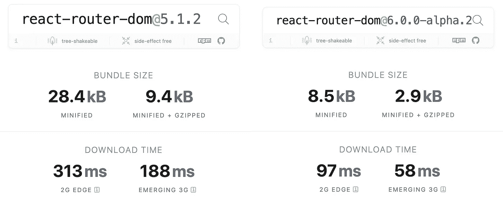

# 三分钟后反应路由器 v6

> 原文：<https://betterprogramming.pub/react-router-v6-in-two-minutes-a7a2963e2340>

## 了解最新版本中的新内容


[法托斯 Bytyqi](https://unsplash.com/@fatosi?utm_source=medium&utm_medium=referral) 在 [Unsplash](https://unsplash.com?utm_source=medium&utm_medium=referral) 上的照片。

在撰写本文时， [React 路由器](https://reacttraining.com/react-router/web/guides/quick-start) v6 作为 alpha 版本出现在地平线上。即使是早期的 alpha 版本，也有那么多好消息可讲。

您可能已经知道，React 还有另一个很棒的路由解决方案，叫做 [Reach Router](https://reach.tech/router) 。Reach Router 是轻量级的，更容易使用，并且注重可访问性。它由 React 路由器的核心贡献者之一 [Ryan Florence](https://medium.com/u/162352c45b6e?source=post_page-----a7a2963e2340--------------------------------) 构建。正如 Ryan 在他的[2019 年年中博客文章](https://reacttraining.com/blog/reach-react-router-future/)中提到的，React 路由器和 Reach 路由器将合并在一起，React 路由器将成为幸存的项目。

我们已经在 v5.1 中看到了 Hooks API 的最初成果，但是我们开始看到 v6 的实际结果:嵌套路由、相对链接、相对路由、自动路由排名等等。

注:React 路由器[v 6 . 0 . 0-α2](https://github.com/ReactTraining/react-router/releases/tag/v6.0.0-alpha.2)在编写时使用。

# 获取 React 路由器 v6

运行以下命令来获取 React 路由器 v6:

```
npm install react-router@next react-router-dom@next
```

# 捆绑大小

与以前版本相比，最大的改进之一是包的大小。比之前的版本减少了差不多 70%。



React 路由器 v6 的捆绑包大小减少了约 70%。

*   [React 路由器 v 5 . 1 . 2](https://bundlephobia.com/result?p=react-router-dom@5.1.2):9.4 kb minified+gzipped
*   [React 路由器 v 6 . 0 . 0-alpha 2](https://bundlephobia.com/result?p=react-router-dom@6.0.0-alpha.2):2.9 kb minified+gzipped

React 路由器的创造者迈克尔·杰克逊(Michael Jackson)解释了他们是如何实现这一结果的:

React 路由器 v6 的捆绑包大小减少了约 70%。

# 切换到路线

`<Switch>`替换为`<Routes>`。由于这个新的 API，我们可以在一个地方定义我们所有的路线，并自动进行路线排序以及相对路线和链接。

# 具有自动路线匹配的嵌套和相对路线

`<Route>`经历了一些变化，使我们的生活变得更容易。

*   `<Route component>`被`<Route element>`取代。
*   `<Route children>`已更改为接受子路线。
*   不再有`<Route exact>`和`<Route strict>`，因为路线是自动匹配的。
*   `<Route path>`相对于路线的层次结构。

# 相对链接

与`<Route path>`一样，`<Link to>`也是相对于路线的层次而言的。如果省略开头的`/`，它会变成相对于它所在的路径路径。

# 后代路线

您可以在一个应用中自由使用多个`<Routes>`。将小的应用程序组合在一起工作是很有用的。

# 用户路由

你还记得让你把路线定义为一个对象的`react-router-config`包吗？那个包裹已经成为历史了。现在我们用`useRoutes`钩子代替。

它类似于旧包，但有一些改进。您将路由定义为一个对象数组，将它传递给自定义钩子，然后得到一个可以呈现的 React 元素。就是这样。

下面是一个配置示例:

如果我说`<Routes>`只是`useRoutes`的一个包装组件，我希望你不会感到惊讶。

# 使用导航而不是使用历史

`useHistory`现已成为历史。它已经被 React 的悬念导航 API 所取代。从现在开始，你可以`useNavigate`四处导航。它有命令式和声明式选项。

# 结论

接下来的几天肯定会有越来越多的细节。不管怎样，我对我所看到的已经很满意了。

编码快乐！

# 推荐故事

[](https://medium.com/better-programming/the-best-way-to-manage-routes-in-a-react-project-with-typescript-c4e8d4422d64) [## 使用 TypeScript 管理 React 项目中的路线的最佳方式

### 获得类型的优势，像冠军一样管理您的路线

medium.com](https://medium.com/better-programming/the-best-way-to-manage-routes-in-a-react-project-with-typescript-c4e8d4422d64)