# React 路由器，解释

> 原文：<https://betterprogramming.pub/react-routers-explained-ff89153a6405>

## 如何构建动态的多页面 React 应用程序


斯文·皮伦在 [Unsplash](https://unsplash.com/) 上的照片。

传统上，React 一直用于构建单页面 web 应用程序。但是，如果您坚持构建一个具有多个页面或路径的 React 应用程序，则必须完成以下过程:

*   告诉 React 根据用户导航到的路线呈现页面。
*   为了实现这一点，React 必须从服务器获取页面。

用代码实现这些步骤曾经有点乏味。这就是[反应路由器](https://reactrouter.com/)开始发光的地方。

# React 路由器简介

## 什么是 React 路由器？

根据这篇[媒体文章](https://medium.com/@ridars01/react-router-tutorial-e6b1cc148925)，React 路由器库允许用户在他们的应用中实现动态路由。此外，它通过根据路线渲染 React 组件来利用基于组件的方法。换句话说，它告诉 React 在 URL 的特定路径上呈现特定的组件。例如，当用户位于`/about`目录时，呈现`About` React 组件。

## 何时使用 React 路由器

让我用一个例子来说明这一点。

让我们创建一个名为`Home.js`的组件。这将是当用户导航到根目录(`/`)时显示的组件。

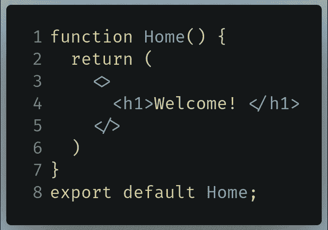

我们示例中的 Home 组件

接下来，让我们编写另一个名为`About.js`的组件。这将在用户转到 URL 的`/about`目录时呈现。

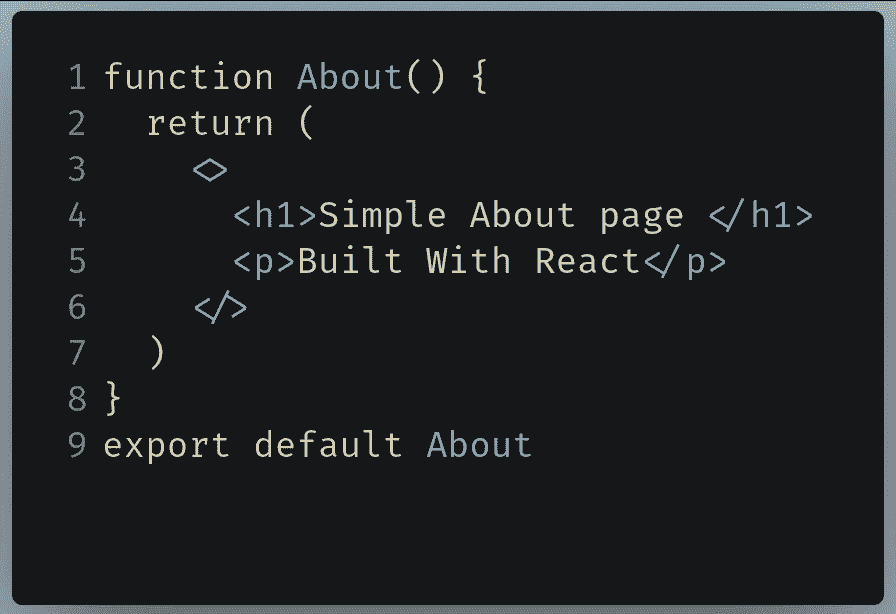

我们示例中的 About 组件

现在让我们将它显示给 DOM。为此，让我们转到`App.js`中的`return`模块:

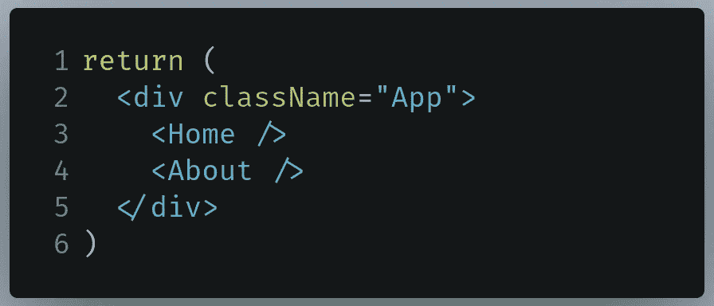

向 DOM 显示这些组件

这将产生以下输出:

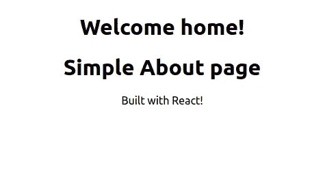

代码示例的输出

我们的代码有效。然而，问题是我们不想在同一个页面上同时呈现`About`和`Home`。我们希望`Home`呈现在`/`页面上，而`About`组件呈现在名为`/about`的独立路径上。

在这种情况下，我们将利用 React 路由器库的能力。

使用这个库还有一个额外的好处:因为您的 React 应用程序不必从服务器获取页面，只需加载特定的组件，所以您的 web 应用程序变得更快、更动态。因此，这让你的应用感觉像一个原生的桌面或移动应用。

我们写点代码吧！

# 入门指南

首先，使用以下终端命令初始化项目的存储库:

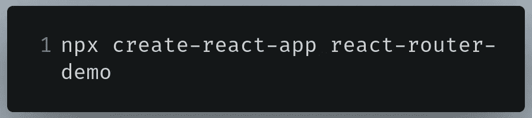

初始化项目的命令

完成后，现在让我们安装`react-router-dom`包。

## 安装所需的库

我们将只安装`react-router-dom`模块，因为 React 路由器库依赖于这个包来运行。

为此，运行以下终端命令:

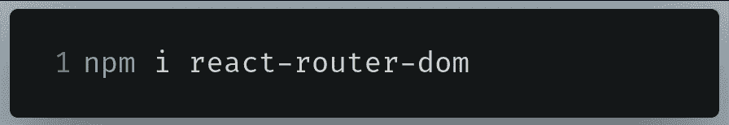

安装 react-router-dom 包的命令

在下一节中，我们将编写代码来为我们的项目设置一个 React 路由器。

# 反应路由器:基本路由

## 设置

开始之前，去`App.js`并从`react-router-dom`包中导入以下模块:

*   `Route`:这将允许我们告诉 React 根据路线渲染特定的组件。
*   这将为我们的项目增加路线设施。`BrowserRouter`标签之间的所有内容都能够执行路由。
*   `Switch`:这将呈现它遇到的第一个与路线匹配的`Route`。我们将在教程的后面更详细地介绍这一点。
*   `Redirect`:`Redirect`模块将允许我们根据用户导航到的目录将用户重定向到另一条路径。例如，如果用户导航到`/`目录，则将用户重定向到`/home`目录。

为此，转到`App.js`并编写以下代码:

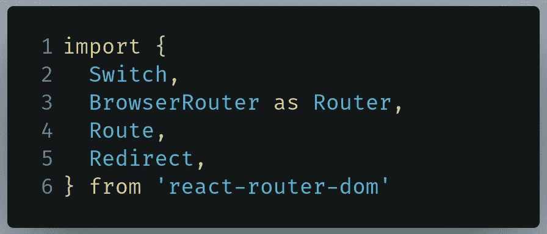

在 App.js 中导入库

我们只是使用对象析构赋值来从`react-router-dom`获取这些包。

*   第 3 行:在这里，我们只是将`BrowserRouter`重命名为`Router`。

现在让我们继续创建一些组件，这些组件将用于演示 React 中的路由。

在您的`src`文件夹中，创建一个名为`Home.js`的新文件，并编写以下代码:


Home.js 的代码

现在让我们创建另一个名为`About.js`的组件:


About.js 中的代码

完成后，让我们创建另一个名为`Nav.js`的组件。该组件将在每条路线上呈现:

这是一个基本组件，由一个`ul`元素和几个`li`子项组成。

完成后，让我们继续基本路由。

## 基本路由

在这一节中，我们将最终向我们的项目添加基本的路由设施。

让我们从把我们新制造的部件进口到`App.js`开始:

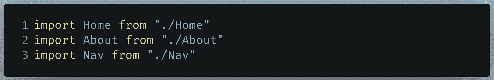

在 App.js 中导入

去`App.js`找到你的`return`区块:

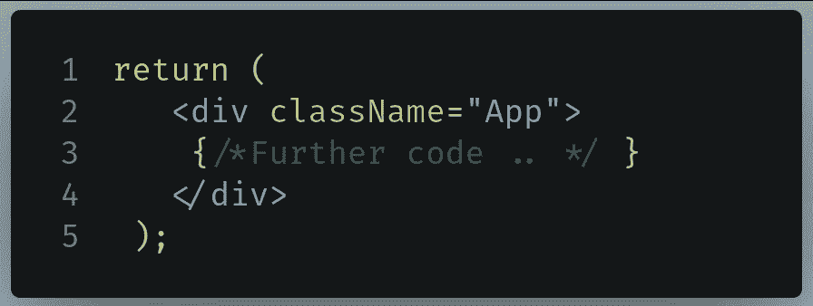

要在 App.js 中查找的代码

现在删除`div`标签之间的代码，并编写以下代码:

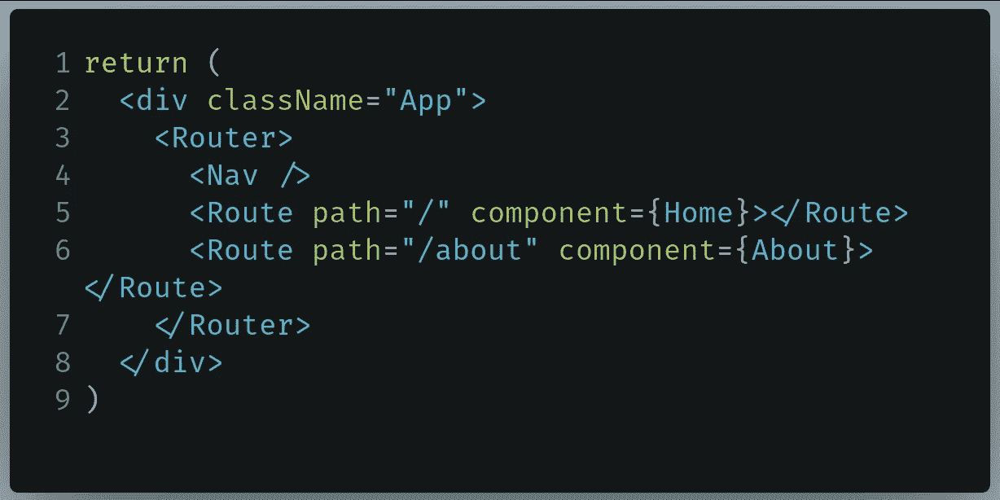

要在 App.js 中编写的代码

*   第 4 行:呈现`Nav`组件。
*   第 5 行:如果用户在`/`目录中，告诉 React 呈现`Home`组件。
*   第 6 行:假设用户在`/about`页面，告诉 React Router 呈现`About`组件。
*   第 3 行和第 7 行:`Router`标签之间的所有内容现在都能够执行基本的路由。

完成后，现在让我们运行代码。这将是输出:

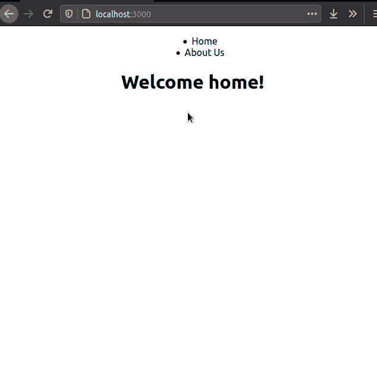

正如我们所看到的，当我们导航到`/about`页面时，呈现了`About.js`组件。然而，尽管我们的代码告诉 React 在`/`页面上呈现这个组件，但是`Home`组件仍然被显示。那么为什么会出现这个问题呢？

让我们回溯到刚刚编写的这段代码:


要在 App.js 中查找的代码

原因是`Router`只是检查路线路径而不是太具体。所以在这段代码中，它基本上遍历了所有这些`Route`组件。

*   根据第 5 行，我们告诉 React 如果在任何子`Route`组件的`path`道具中遇到斜杠(`/`)就渲染`Home`组件。
*   现在根据第 6 行，如果我们转到`/about`页面，React Router 首先检查路由是否包含一个`/`。由于该状态为`true`，再次显示`Home`。此外，由于路径包含了关键字`about`，那么`About`组件也会被呈现。

简而言之，默认情况下，React Router 将呈现所有作为彼此子路由的组件。为了纠正这个问题，我们需要使用`Switch`组件。

## 该开关组件

根据 [React Router 的文档](https://reactrouter.com/web/api/Switch),`Switch`组件本质上是在匹配 URL 时停止遍历所有路由路径的整个过程。它将只呈现匹配当前 URL 的第一个`Route`组件。

在`App.js`中，找到你的`return`区块:


要在 App.js 中查找的代码

用`Switch`标签包装所有的`Route`组件。最后，您的`return`块应该是这样的:

由于我们在`Switch`标签之间包装了`Route`标签，React Router 现在将查看这些`Routes`并呈现第一个符合其标准的`Route`组件。所以理论上，如果用户转到`/`路径，应该呈现`Home`，而当用户导航到`/about`目录时，应该只呈现`About`。

写完代码后，运行程序。这将是结果:

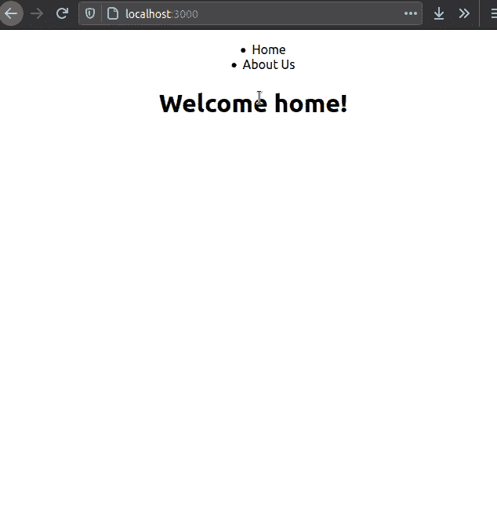

代码的输出

如您所见，`Switch`组件在我们的程序中引入了一个问题。即使我们转到`/about`页面，也只有`Home`被渲染。发生了什么事？

让我们回溯到刚刚编写的代码:

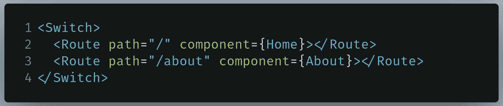

要参考的代码(App.js)

*   第 2 行:我们告诉 React Router 如果 URL 包含一个`/`就渲染`Home`。
*   第 3 行:我们告诉 React Router 如果 URL 包含一个`/about`就渲染`About`。
*   所以当我们导航到`/about`时，React Router 首先检查 URL 是否包含`/`。由于这个条件是`true`，所以渲染了`Home`。
*   这就是`Switch`接手的地方。回想一下，`Switch`只呈现匹配 URL 的第一个`Route`组件。所以在`/about`上，现在`Home`被渲染了(匹配 URL 的第一个`Route`组件)，`Switch`停止了 URL 匹配过程。因此，`About`没有被呈现到 DOM 中。

现在让我们来纠正这个问题。为此，我们需要在我们的`Route`组件中使用`exact` prop。

## 确切的道具

如果路径名与 URL *完全匹配*，那么`exact`属性实际上告诉 React Router 呈现`Route`的组件。所以在我们的应用程序中，我们可以预期当用户导航到`/`时`Home`应该只显示，如果用户转到`/about`目录，那么`About`应该只显示。

转到`App.js`中的`return`块，找到以下代码:


要在 App.js 中查找的代码

现在，就像这样将`exact`道具添加到`Route`组件中:

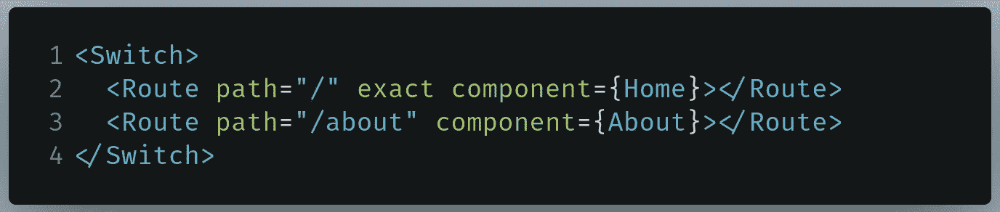

App.js 中要替换的代码

*   第 2 行:`exact` prop 现在告诉 React Router，如果用户导航到`/`目录，只显示`Home`组件。

写完代码后，运行程序。这将是结果:

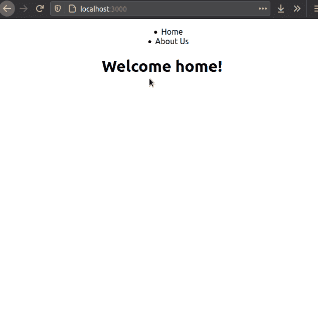

代码的输出

我们的代码有效！我们的产出是我们想要的。

接下来，我们将使用`Link`组件为我们的应用程序添加导航。

## 链接组件

在现实世界中，用户不希望通过在地址栏中手动输入路线来导航我们的网站。我们必须使用按钮或锚链接，用户将点击，以便他们可以通过网站。

这就是 React 路由器的`Link`组件的用武之地。您可以假设`Link`组件是一个`a`标签。

由于`Link`用于导航目的，我们将在`Nav.js`中使用它。

转到`Nav.js`，从`react-router-dom`包中导入`Link`开始，如下所示:

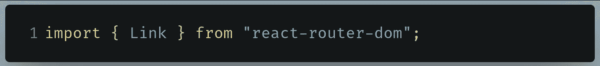

导入 Nav.js

在`Nav.js`中，找到你的`return`区块:

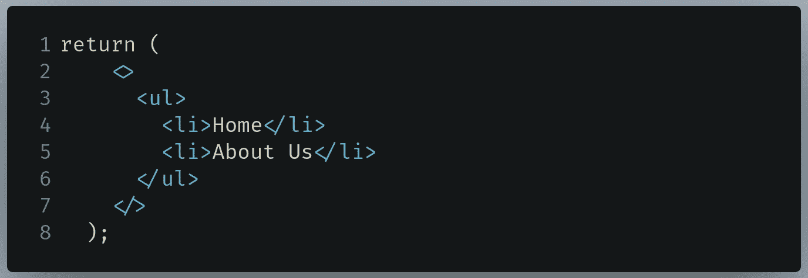

要在 Nav.js 中查找的代码

现在用下面这段代码替换它:

*   第 4-6 行:我们将`Link`组件包装在`li`标签之间，这样它们就可以呈现在列表元素中。这个`Link`通过将用户指引到`/`路线，将他们带到主页。
*   第 7-9 行:我们已经将`Link`组件包装在`li`标签之间，这样它们就可以呈现在我们的列表元素中。此`Link`通过将用户指引到`/about`路线，将用户带到“关于”页面。

现在运行代码。这将是结果:

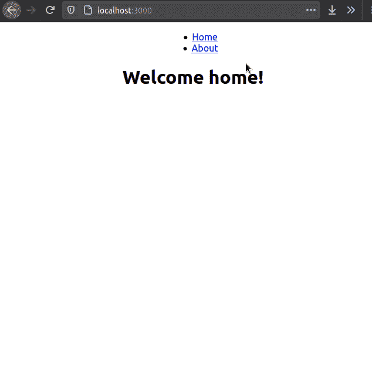

代码的输出

我们的代码有效。现在让我们继续处理重定向。

## 重定向组件

组件`Redirect`的用法相当简单。呈现时，它会将用户导航到一个新的位置。例如，在我们的程序中，如果用户在地址栏中键入`/home`路线，我们希望我们的应用程序将他们重定向到`/`页面。

转到`App.js`中的`return`块:

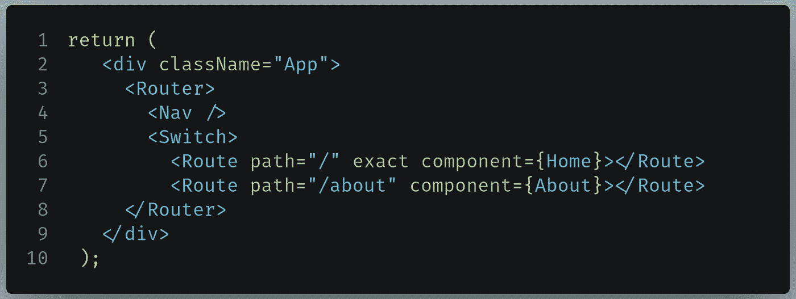

要在 App.js 中查找的代码

现在将它改为下面这段代码:

零钱在第 7 行。

*   第 7 行:这里，我们告诉 React Router 将用户从`/home`重定向到`/`目录。属性是重定向的路径名。此外，`to`道具是重定向到的位置。

就是这样！让我们运行代码。

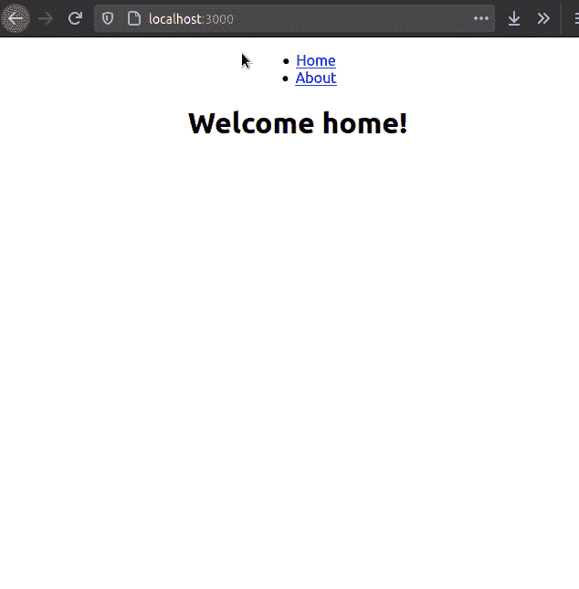

代码的输出

如你所见，当我们在地址栏中输入`/home`路线时，应用程序引导我们回到`/`目录。这意味着我们的代码有效！

我们现在完成了基本的路由。在下一节中，我们将创建动态和自定义路线。

最后，`App.js`应该是这样的:

而`Home.js`应该是这样的:

而且，`Nav.js`应该是这样的:

最后，`About.js`应该是这样的:

# React 路由器:动态和定制路由

在本文的这一部分，我们将从外部 API 获取数据。我们将特别使用这个[咖啡 API](https://sampleapis.com/api-list/coffee) 。这是我们要做的:

*   在主页上，我们将展示两个`Link`组件。
*   一个`Link`组件将引导用户到一个有热咖啡名称列表的页面，另一个将引导他们到一个有冰咖啡名称列表的页面。
*   当用户点击列表中的任何名字时，他们将被带到另一个页面，显示他们刚刚点击的咖啡的描述。

现在让我们用代码实现它。

我们的第一步是渲染`Home.js`中的两个`Links`。转到`Home.js`，从`react-router-dom`导入`Link`:

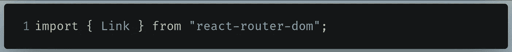

在 Home.js 中导入

现在转到`App.js`中的`return`块:

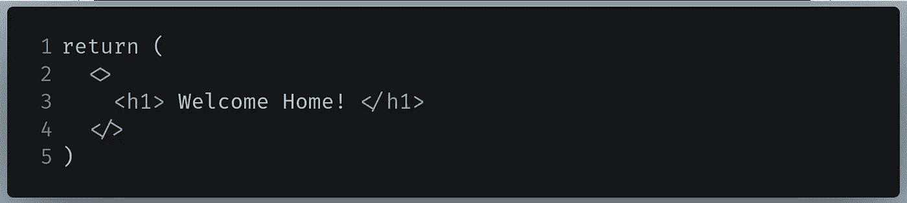

要在 Home.js 中查找的代码

让我们现在渲染它。用下面的代码块替换它:

在这里，我们简单地创建了两个将显示在列表中的`Link`组件。

*   第 6-8 行:这个`li`元素有一个`Link`组件，将用户重定向到`/coffee/hot`目录。
*   第 9-11 行:这个`li`元素有一个`Link`组件，将用户重定向到`/coffee/iced`目录。

这将是输出:

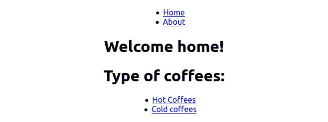

代码的输出

我们的代码有效。然而，我们还没有处理`/coffee/hot`和`/coffee/iced`路径，这就是为什么当它们被点击时，页面上不会呈现任何东西。

但有一个问题:我们如何处理这两条路线？我们先想想。

一个解决方案是这样的:

*   创建两个组件，分别处理`/coffee/hot`和`/coffee/iced`路线:

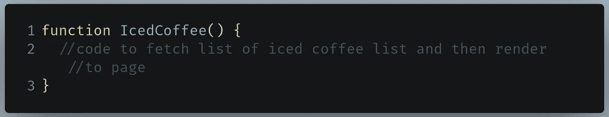

冰咖啡样品溶液


样品溶液热咖啡

*   然后，我们可以创建两个`Route`组件来在`App.js`中呈现它们:

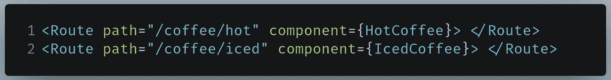

示例解决方案 App.js

虽然这是纠正我们问题的一种方法，但这并不理想。`HotCoffee`和`IcedCoffee`的代码都差不多，这就打破了编程的枯燥(不要重复自己)原则。

纠正这个问题的另一种方法是使用参数。这种方法更好，需要编写的代码更少。注意在`/coffee/hot`和`/coffee/iced`中，我们可以将`/hot`和`/iced`路线归类为参数。

## 使用 useParams 访问参数

如果您曾经使用过 Express.js，我们将使用如下参数:

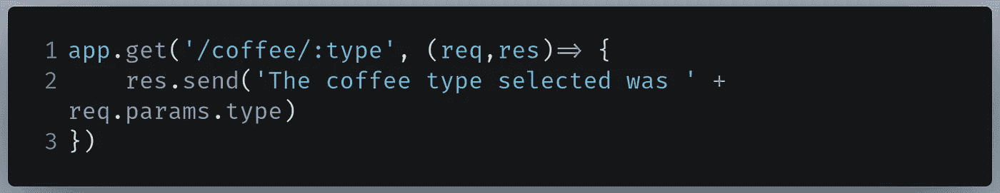

实施此流程 App.js

但是我们如何在 React 中访问这些参数呢？

好消息是 React Router 允许在我们的代码中访问参数。为了在 React 路由器中访问 URL 参数，我们使用了`useParams`钩子。

让我们首先创建一个`Route`来处理`/coffee/:type`路线。这里，`type`是我们想要访问的参数。

转到`App.js`并在`return`块中找到以下代码:

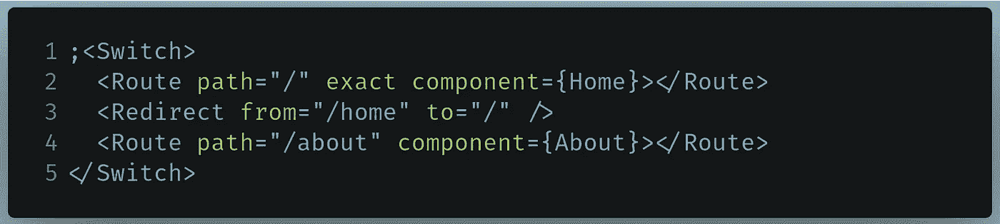

要在 App.js 中查找的代码

现在用下面的代码编辑它:

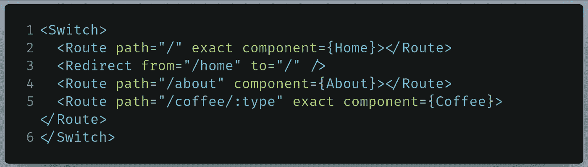

要在 App.js 中编写的代码

*   第 5 行:这里，我们告诉 React Router，如果用户在`/coffee/:type`目录中，就呈现`Coffee`组件。

现在让我们使用`useParams`吊钩。下一步，我们将创建一个组件来呈现咖啡列表。创建一个名为`Coffee.js`的新文件，并编写以下代码:

*   第 1 行和第 2 行:分别从`react-router-dom`和`react`模块导入`useParams`和`useEffect`挂钩。
*   第 4 行:这个`params`变量将为我们提供关于 URL 中参数的数据。它被赋予了包含 URL 中参数值的`useParams`钩子。
*   第 6-8 行:这里，当`Coffee`组件被安装到 DOM 时，我们记录下`params`的值。

在运行程序之前，让我们在`App.js`中导入这个组件。转到`App.js`并像这样导入`Coffee`:

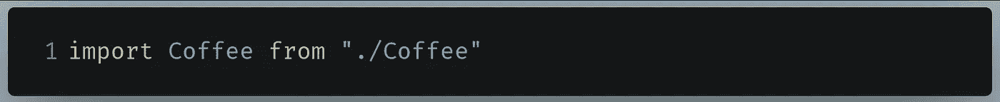

要在 App.js 中编写的代码

现在运行程序。让我们先来看看指向`/coffee/hot`的链接:

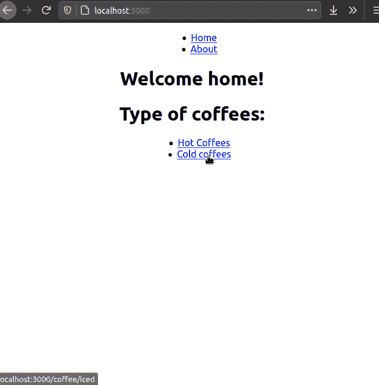

代码的输出

查看你的浏览器的开发者工具的控制台。在这里，我们可以看到`params`的价值:

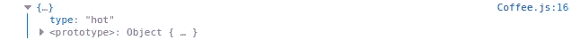

控制台中的输出

如你所见，我们得到了`type`参数的值！让我们使用它。

让我们点击将用户重定向到`/coffee/iced`的链接。控制台中的输出如下:

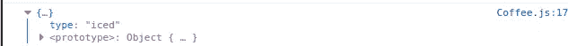

控制台中的输出

在这里，`type`参数现在是`iced`。我们的代码有效！

下一步，我们将从 [Coffee API](https://sampleapis.com/api-list/coffee) 中获取`fetch`数据，然后按类型呈现咖啡列表。

## 获取数据

在`Coffee.js`中，创建一个名为`fetchData`的函数。在那里，编写以下代码:

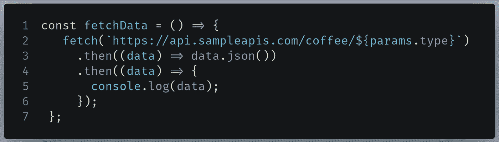

用 Coffee.js 编写的代码

*   第 2 行:这里，我们调用 Coffee API。最后，我们追加了从`params`对象获得的`type`参数值。因此，根据点击的链接，我们从`https://api.sampleapis.com/coffee/iced/`或`https://api.sampleapis.com/coffee/hot`获取数据。
*   第 3-4 行:将提取的原始数据转换成 JSON。
*   第 5 行:然后将 JSON 数据注销到控制台。

现在，停留在`Coffee.js`中，在`useEffect`钩子中找到代码:

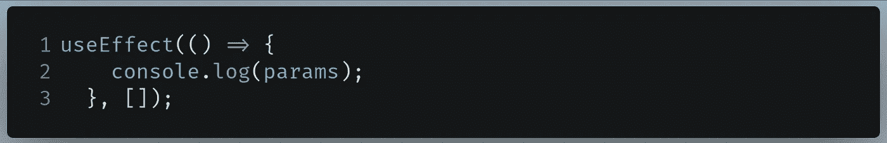

Coffee.js 中要查找的代码

并且像这样改变它:

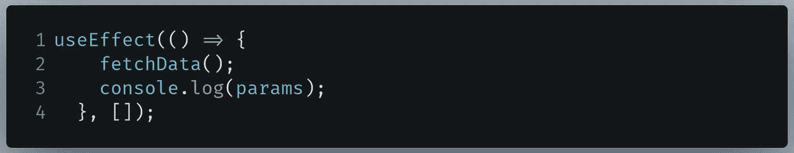

Coffee.js 中替换为的代码

*   第 2 行:在这里，组件一挂载，我们就调用`fetchData`函数。

运行代码。这将是输出:

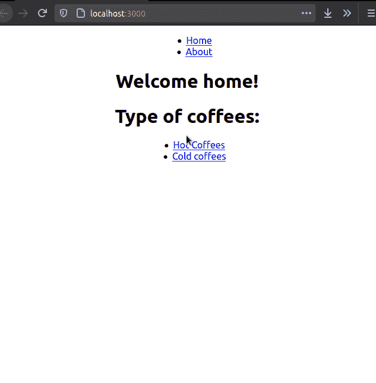

代码的输出

这里什么都没变。但是，打开控制台并查看输出。

这里是我们去`/coffee/hot`时的控制台输出。`type`参数为`hot`:

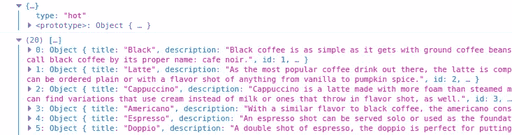

控制台中的输出

这是我们导航到`/coffee/iced`目录时的控制台输出。`type`参数为`iced`:

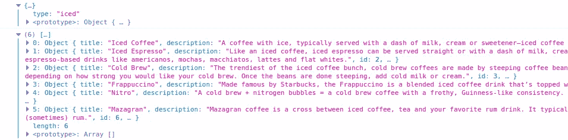

控制台中的输出

如您所见，我们从 API 获得了一组对象。现在，我们将只从这些对象中提取`title`字段。

在`Coffee.js`中，创建一个钩子，该钩子将被分配来自该 API 的数据:

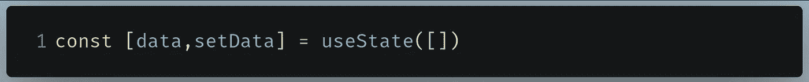

用 Coffee.js 编写的代码

现在在`Coffee.js`中找到你的`fetchData`功能:

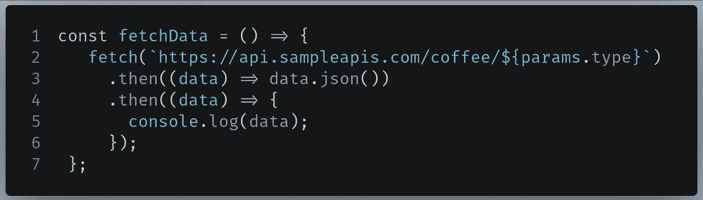

Coffee.js 中要查找的代码

并将其更改为下面这段代码:

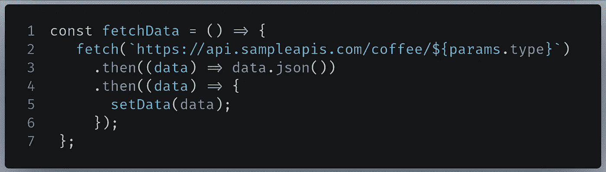

Coffee.js 中替换为的代码

*   第 5 行:这里，我们将`data`钩子的值设置为我们刚刚从 Coffee API 中获取的数据。

现在在`Coffee.js`中找到你的`return`块:

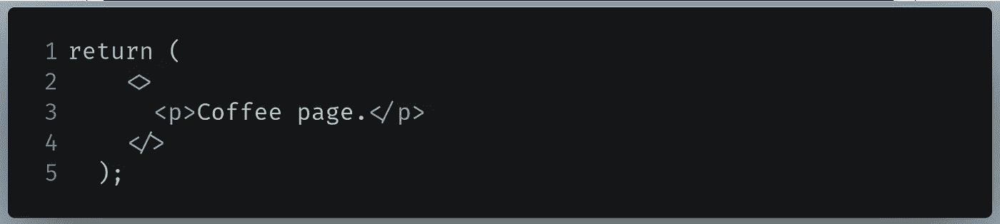

Coffee.js 中要查找的代码

然后将其更改为以下代码块:

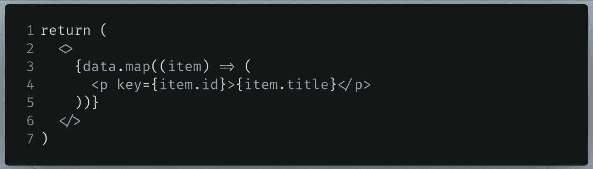

Coffee.js 中替换为的代码

*   `Line 3`:对`data`数组的内容使用`map`方法。这将遍历数组。
*   第 4 行:输出数组中每个对象的`title`字段。`title`字段包含咖啡的名称。

运行代码。这将是输出:

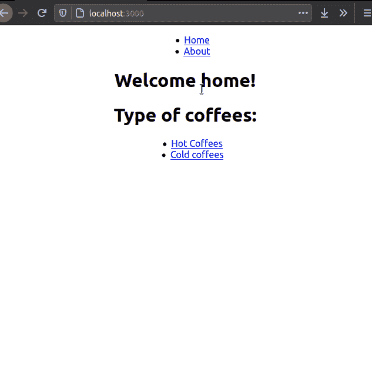

代码的输出

我们的代码有效。现在让我们将列表中的每一项都变成一个可点击的`Link`元素。

找到我们刚刚写的代码:


Coffee.js 中要查找的代码

像这样改变它:

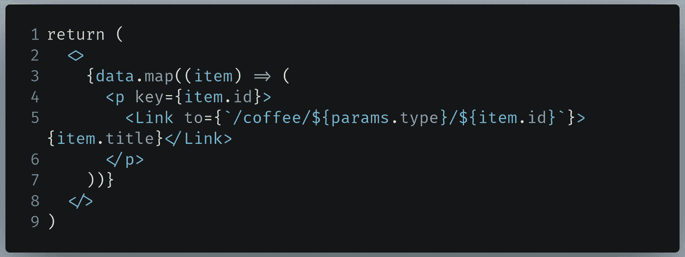

用 Coffee.js 编写的代码

变化在第 5 行。

*   `Line 5`:现在渲染列表中的每一项都会将用户导向`/coffee/:type/:id`。这里，`type`和`id`是参数。我们已经提取了数组中每个对象的`id`字段。

在下一节中，我们将呈现一个单独的页面来显示每种咖啡的描述。

最后，`Coffee.js`应该是这样的:

## 显示描述

让我们首先创建一个`Route`组件，它将在用户导航到`/coffee/:type/:id`目录时呈现一个组件。

转到`App.js`并找到您的`return`块:

现在把它改成这样:

*   第 10 行:在这里，我们告诉 React Router，如果用户前往`/coffee/:type/:id`路线，就呈现`CoffeeInfo`组件。在这一行上，`type`和`id`是参数。

现在让我们创建`CoffeeInfo`组件。创建一个名为`CoffeeInfo.js`的新文件，并编写以下代码:

这段代码与最初版本的`Coffee.js`非常相似:

*   第 4 行:我们只是用`useParams`钩子提取 URL 的参数，然后将它们存储在`params`变量中。
*   第 7 行:记录组件安装后`params`的结果。

最后，让我们在`App.js`中导入这个文件。转到`App.js`并导入`CoffeeInfo.js`文件:

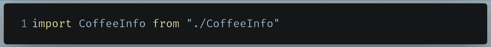

在 App.js 中导入

现在运行代码。这将是结果:


代码的输出

没有什么异常发生，但是我们在控制台的`CoffeeInfo`文件中记录了参数值。看看你的控制台。这将是输出:

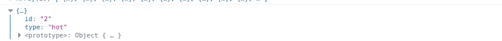

控制台中的输出

太好了！我们得到了参数的值。让我们现在使用它。

在`CoffeeInfo.js`中，创建一个名为`fetchData`的函数。在那里，编写以下代码:

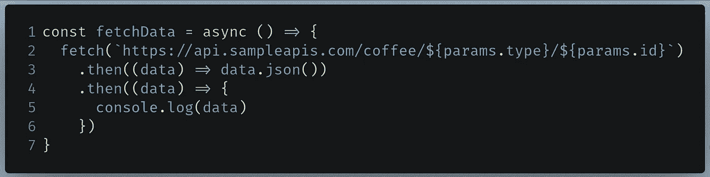

要写入 CoffeeInfo.js 的代码

*   第 2 行:这里，我们从 Coffee API 获取数据。但是这一次，我们附加了参数的`type`和`id`值来获得想要的咖啡描述和名称。
*   第 5 行:将获取的数据输出到控制台。

运行代码。这将是输出:

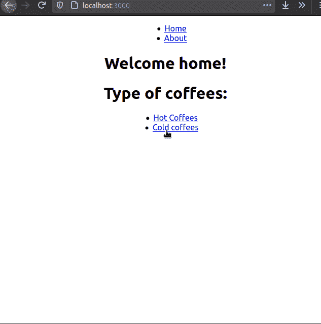

代码的输出

什么都没变。但是看看控制台:

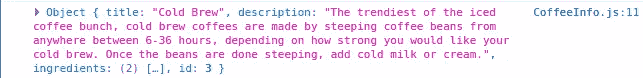

控制台中的输出

瞧啊。我们得到了想要的数据。

作为我们的最后一步，现在让我们向浏览器显示这些数据。

在`CoffeeInfo.js`中，声明两个钩子:

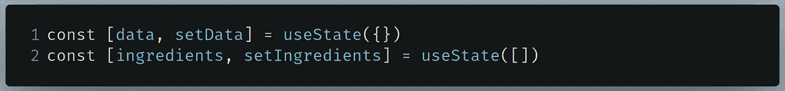

在 CoffeeInfo.js 中声明钩子

*   `data`钩子将存储提取的数据。
*   `ingredients`钩子将从获取的数据中存储`ingredients`数组的内容。

现在转到`CoffeeInfo`中的`fetchData`函数:


要在 CoffeeInfo 中查找的代码

像这样改变它:

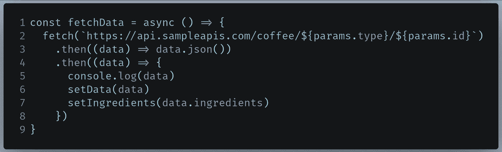

CoffeeInfo.js 中要替换的代码

第 6 行和第 7 行发生了变化:

*   第 6 行:将获取的数据存储在`data`钩子中。
*   第 7 行:将取出的数据中的`ingredients`数组存储到`ingredients`钩子中。

让我们现在展示它。

转到您在`CofeeInfo`中的`return`块:

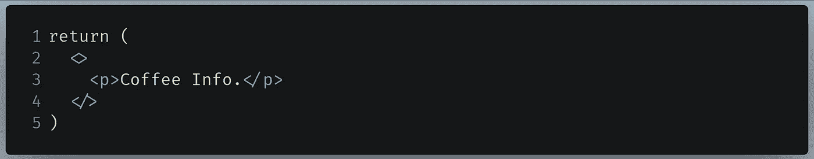

CoffeeInfo.js 中要查找的代码

像这样改变它:

*   第 3-4 行:显示提取数据的`title`和`description`值。
*   第 7 行:因为`ingredients`是一个数组，所以我们使用了`map`函数。
*   第 8 行:遍历`ingredients`数组并显示它们的值。

运行代码。这将是结果:

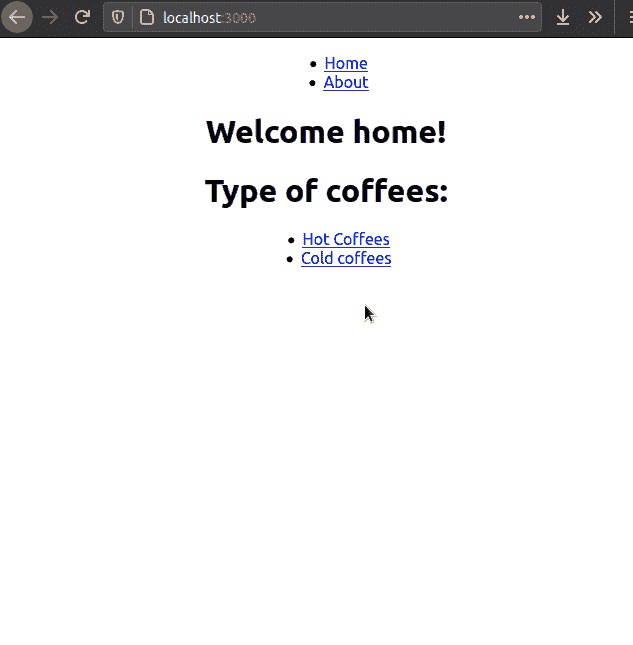

代码的输出

我们的代码有效。

最终，`CoffeeInfo.js`应该是这样的:

这就是`App.js`应该有的样子:

## 构建水平导航条

在本节中，我们现在将构建一个水平导航组件。这将有助于用户轻松浏览我们的网站。

为此，请转到`Nav.js`并为您的`ul`元素分配一个`className`属性。

```
//change in Nav.js
return (
  <>
    <ul className="nav"> </ul>
    {/* Further code..*/}
```

接下来，进入你的`App.css`文件。在这里，附加以下代码片段:

*   第 2 行:我们的`nav`组件应该有一个`inline`的`display`属性。这意味着 React 将在一行中呈现其子元素。
*   第 6–8 行:`float`属性表示 JavaScript 将显示所有相邻的元素。后来，我们添加了一些填充，这样所有的元素之间就会有一些空间。这使得链接更容易点击。

这将是结果:

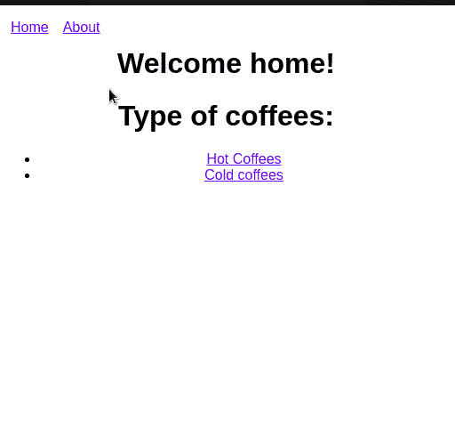

代码的输出

我们完事了。

# GitHub 链接和其他资源

## GitHub 链接

[本项目回购](https://github.com/HussainArif12/react-router-tutorial)

## 其他阅读资源

*   [React 路由器教程—开发版](https://www.youtube.com/watch?v=Law7wfdg_ls)
*   [5 分钟内反应路由器—詹姆斯·奎克](https://www.youtube.com/watch?v=yQf1KbGiwiI)
*   [反应路由器](https://reactrouter.com/web/api/Hooks/useparams)
*   [反应列表和键](https://reactjs.org/docs/lists-and-keys.html)(显示数组内容的指南)

# 结论

如果您在本教程中遇到了任何问题，那么请仔细研究代码，全面掌握 React 路由器的内部工作原理。不要放弃！

这篇教程绝不是一篇短文。恭喜你坚持到最后！我希望你学到了很多。感谢阅读！

下一篇:[在 Node.js 中使用 GraphQL 与 Apollo Server 的完整指南](https://medium.com/better-programming/the-complete-guide-to-using-graphql-in-node-js-with-apollo-server-aef347a7a0ee)
上一篇:[用 TailwindCSS 和 Material UI 构建一个 React Pomodoro 应用](https://medium.com/javascript-in-plain-english/build-a-react-pomodoro-app-with-material-ui-and-tailwindcss-e4bab98e30ae)