# React-Select 使创建可选菜单变得容易

> 原文：<https://betterprogramming.pub/react-select-makes-creating-selectable-menus-easy-5d9dffc7e0d9>

## react-select 简介，开箱即用，高度可定制


照片由[贾里德·阿兰戈](https://unsplash.com/@jaredrossarango?utm_source=unsplash&utm_medium=referral&utm_content=creditCopyText)在 [Unsplash](https://unsplash.com/s/photos/future?utm_source=unsplash&utm_medium=referral&utm_content=creditCopyText) 上拍摄

HTML 的`select`并不容易。需要两种类型的标签来定义:

```
<select>
  <option value="apple">Apple</option>
  <option value="banana">Banana</option>
  <option value="orange">Orange</option>
  <option value="berry">Berry</option>
</select>
```

React 的`select`与此类似，只是它使用了 JSX (JavaScript + XML)，这是 JavaScript 的一个扩展，直接在 JavaScript 内编写 HTML。在许多方面，JSX 类似于 HTML，但是它需要转换成标准的 ECMAScript，然后再转换成 HTML。

我会推荐使用 [React Select](https://github.com/JedWatson/react-select) ，这样选择就容易了。这个开源代码从 2014 年 8 月开始，现在已经有几百个贡献者，上万个明星。它提供了一个单独的组件`Select`，具有常用的选择功能、简单的样式、异步加载、动态创建的选项、固定选项和许多其他特性。

# 选择功能

一如既往，我们使用 [Create React App](https://medium.com/better-programming/10-fun-facts-about-create-react-app-eb7124aa3785) 作为起点。首先，用命令`npm i react-select`安装 React Select。然后这个包在`package.json`成为`[dependencies](https://medium.com/better-programming/package-jsons-dependencies-in-depth-a1f0637a3129)`的一部分。

```
"dependencies": {
  "react-select": "^3.1.0"
}
```

将`src/App.css`改为最小样式:

开箱即用，我们可以轻松地编写以下用户界面:

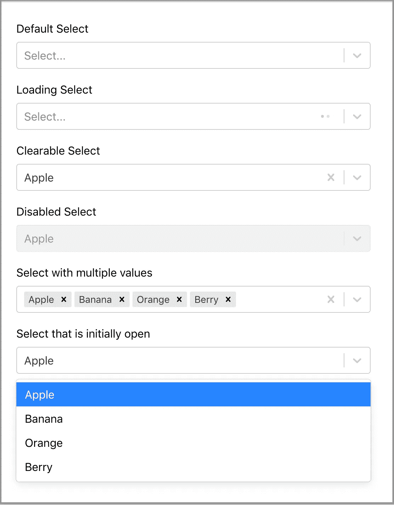

这是`src/App.js`的代码:

*   第 18 行:默认`Select`。
*   第 20 行:显示了设置了`isLoading`的加载动画。
*   第 22 行:显示预选值`“Apple”`。由于`isClearable`已设置，它允许我们使用退格键或字段右侧的“x”按钮清除所选值。
*   第 24 行:显示禁用的`Select`和设置的`isDisabled`。
*   第 26 行:显示设置了`isMulti`的多个值的`Select`。每个选定的值都可以单独删除，或者使用字段右侧的“x”按钮删除所有选定的值。
*   第 28 行:最初打开`Select`菜单。

# 样式选择组件

我们如何设计`Select`组件的样式？首先，我们需要知道`Select`组件是如何转换成 HTML 元素的。

这一行代码`<Select options={options} />`生成以下 HTML 元素:

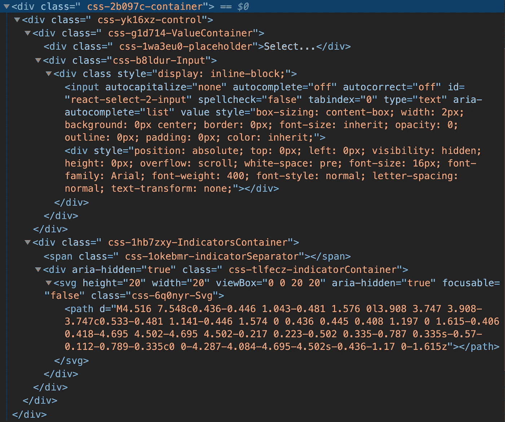

最顶层是一个`container`，里面包含一个`control`，由一个`valueContainer`和一个`indicatorsContainer`组成。

`valueContainer`有一个`placeholder`和一个`input`。

`indicatorsContainer`为右侧的下拉箭头等。

`Select`组件可以为`Select`元素取一个`className`，为带有给定前缀的内部元素取一个`classNamePrefix`。

我们将`className`设置为`“top”`，将`classNamePrefix`设置为`<Select options={options} className=”top” classNamePrefix=”inner” />`内的`“inner”`。这些是转换后的 HTML 元素:

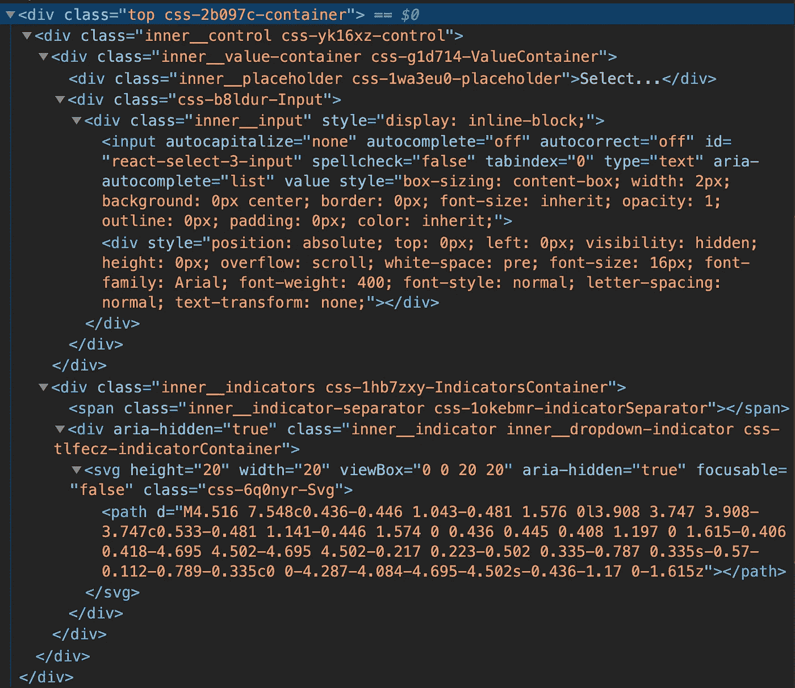

有了特定的类名，可以使用 CSS 规则来设计元素的样式。

然而，`Select`组件提供了一种更好的方式来覆盖每个部分的内置样式。它使用`styleFn`函数，该函数有两个参数:

*   `provided`:组件的默认内置样式。
*   `state`:组件的当前状态，可以用来生成新的样式。

下面的代码定制了一个`Select`组件:

记得传播原版`provided`风格。否则，你会对缺少的基本造型的外观和感觉感到惊讶。

这是`provided`物体:

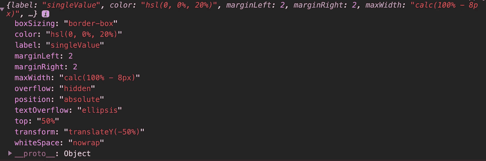

这是`state`物体:

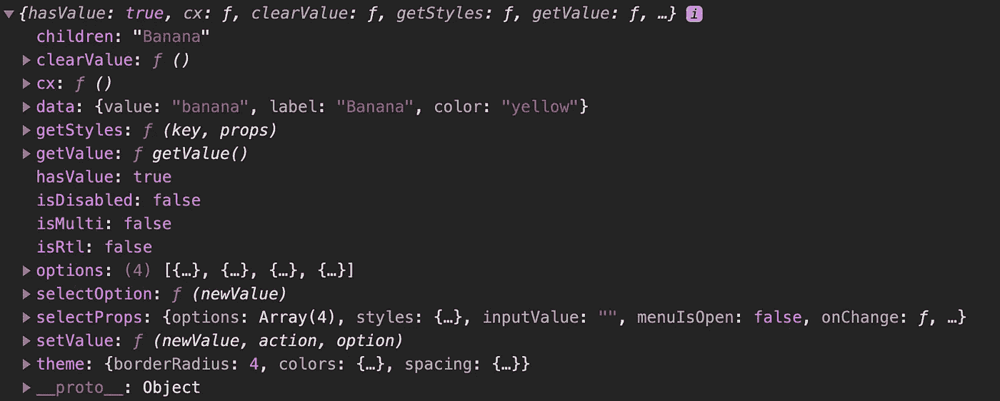

在上面的代码中:

*   第 17-23 行在打开的`menu`中样式化每个`option`的边框、颜色、不透明度和填充。
*   第 24 - 28 行显示了选择`control`框的样式。
*   第 29 - 32 行对选中的`singleValue`进行样式化。

下面是样式化的`Select`组件:

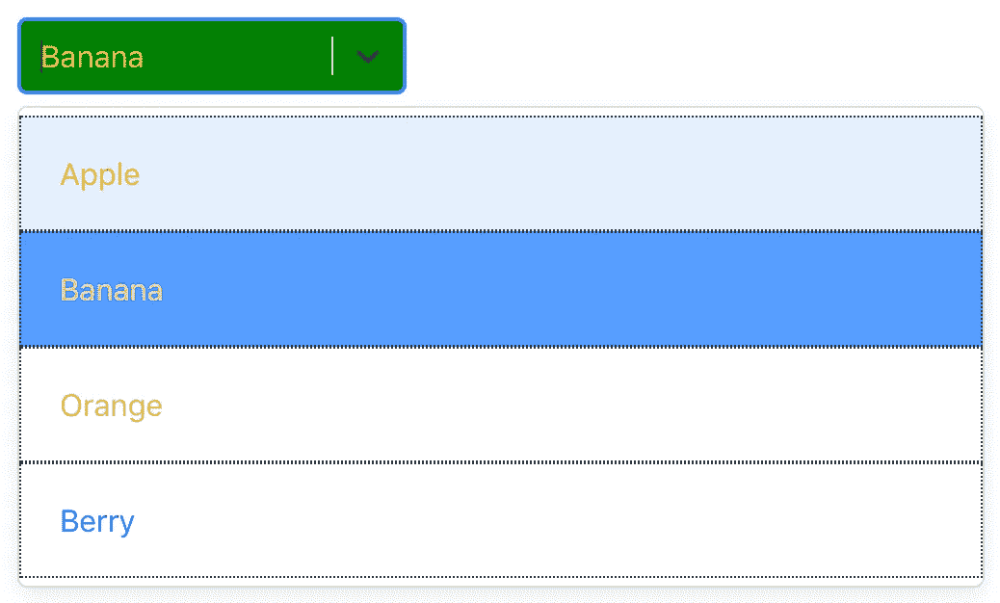

这些零件可以设计成:

*   `clearIndicator`
*   `container`
*   `control`
*   `dropdownIndicator`
*   `group`
*   `groupHeading`
*   `indicatorsContainer`
*   `indicatorSeparator`
*   `input`
*   `loadingIndicator`
*   `loadingMessage`
*   `menu`
*   `menuList`
*   `menuPortal`
*   `multiValue`
*   `multiValueLabel`
*   `multiValueRemove`
*   `noOptionsMessage`
*   `option`
*   `placeholder`
*   `singleValue`
*   `valueContainer`

# 异步选择

我们可以通过设置`isSearchable`使`Select`组件可搜索:

如果`options`列表是远程的怎么办？

React `Select`提供了一个组件`AsyncSelect`，根据用户输入动态加载选项:

第 26 行调用`loadOptions`，在第 12-21 行定义。该功能有两个参数，`inputValue`和`callback`。在上面的例子中，返回了一个承诺。或者，可以将检索到的选项传入`callback`。这里，三秒钟的延迟清楚地显示了加载过程:

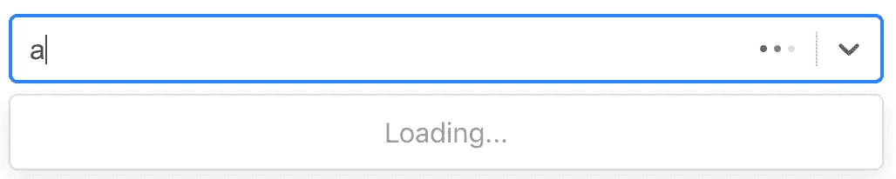

三秒钟后，带有字母`a`的选项显示在打开菜单中:

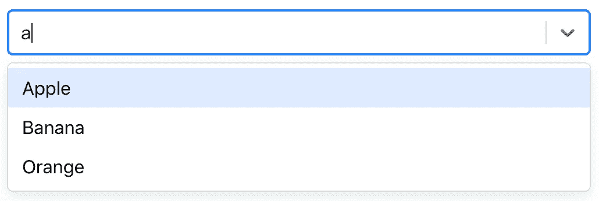

键入`aa`，没有选项:

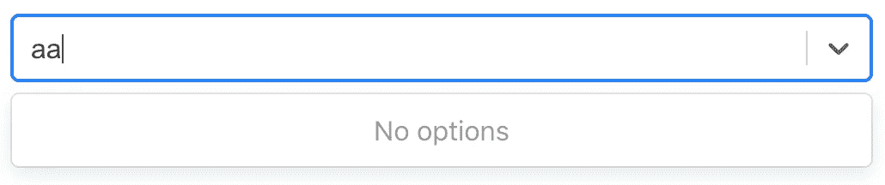

退格在`Select`组件中有一个`a`，我们可以在第 26 行看到`cacheOptions`的效果。

用`cacheOptions`，立即显示之前的选项。否则，又要花三秒钟来取回它们。

# 可创建选择

如果选择不在 Select 的选项里呢？

React Select 提供了一个组件`CreatableSelect`，用于根据用户输入动态创建一个选项:

第 27-33 行构建了`CreatableSelect`组件。当创建一个新项目时，它调用`handleCreate`，这在第 16-23 行中定义。该函数将新创建的值添加到选项列表中。

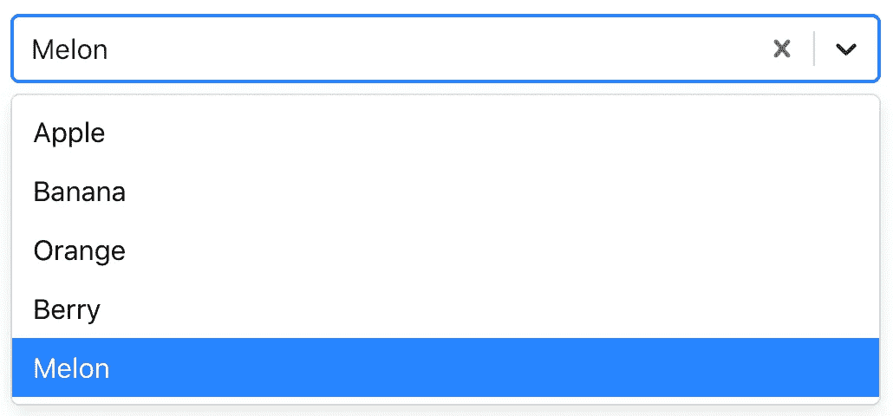

另外，`CreatableSelect`可以和 Async 配合使用。React Select 提供了一个组件`AsyncCreatableSelect`，用于动态加载选项并允许基于用户输入创建选项。

现在`AsyncCreatableSelect`组件过滤了现有的选项，并提供了一个创建选项。

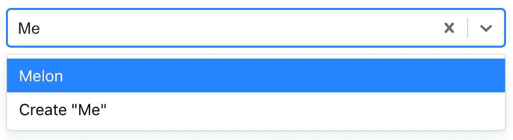

# 固定选项

具有多个值的反应选择可以有一些固定的值，即它们总是被选中。

该用户界面将`Banana`和`Oranges`显示为固定选项。`Apple`和`Berry`可以删除和添加。

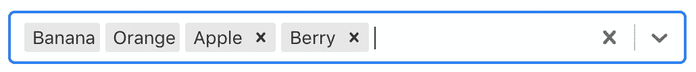

下面的代码展示了它是如何实现的:

第 74 - 82 行定义了带有固定选项的选择组件。

第 76 行使组件动画化。当删除一个值时，该项目在动画模式下消失。

第 77 行定义了 clear 按钮，该按钮仅在有一些可删除选项时显示。

第 78 行定义了区分固定选项和可删除选项的样式。

第 52 - 70 行显示了使固定选项不可删除的算法。`handleChange`通过两个参数传入:

*   `inputValue`:当前选项
*   被析构的`{ action, removedValue }`:允许我们根据`action`和`removedValue`修改选项。

以下是`action`的可用值:

*   `select-option`:从列表中选择一个选项。
*   `deselect-option`:(多个)从列表中取消选择一个选项。
*   `remove-value`:(多个)用移除按钮移除所选选项。
*   `pop-value`:使用退格键删除选项。
*   `set-value`:从没有`action`的组件调用`setValue`。
*   `clear`:使用清除按钮删除所有选择的选项。
*   `create-option`:(可创建)创建一个新选项。

# 结论

你感受到反应选择的力量了吗？用几行代码组成一个选择组件似乎很容易。是时候让你尝试一下了吗？

为了让事情变得更有趣，你还可以在 [Ant 设计系统](/understanding-the-ant-design-system-a-ui-design-for-enterprises-39afdb188b06)中查看 Select。

感谢阅读。我希望这有所帮助。你可以在这里看到我的其他媒体出版物。