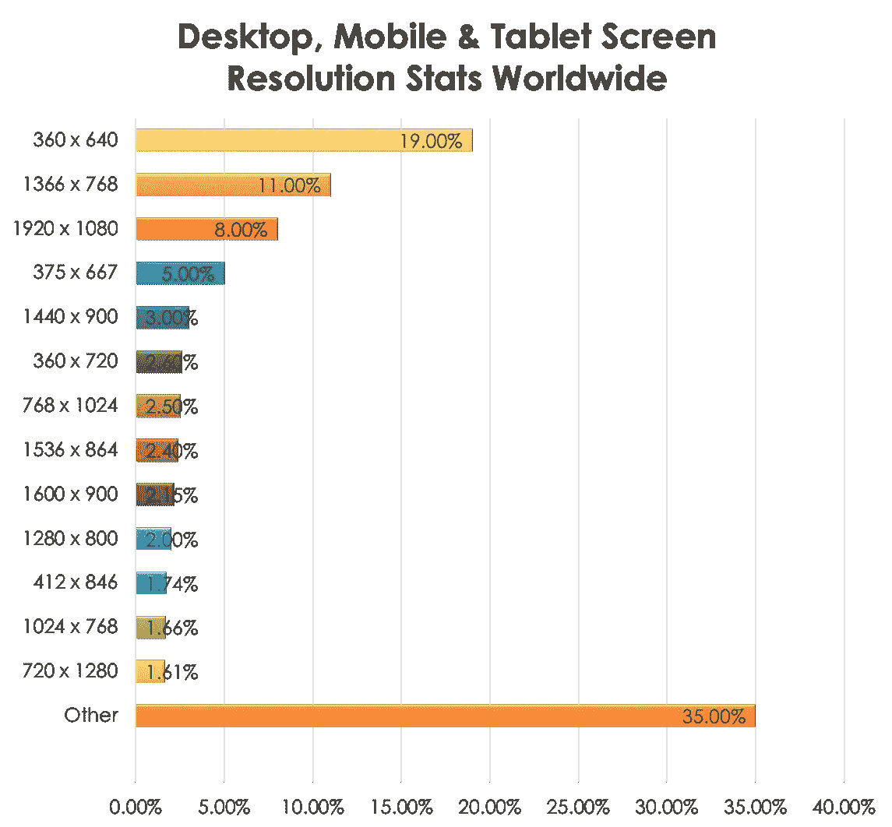
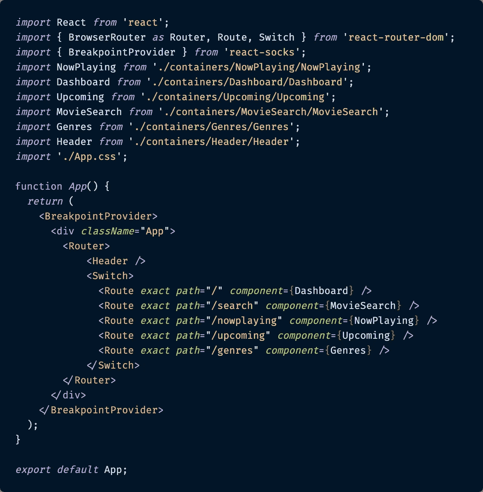
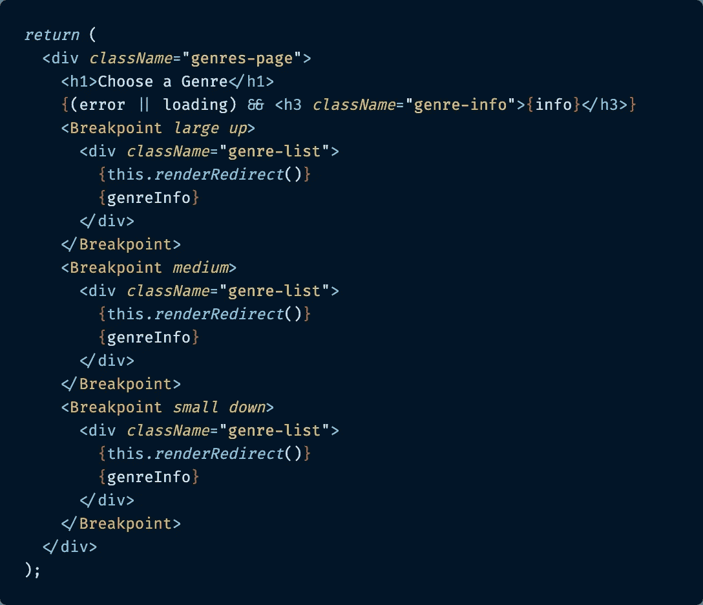
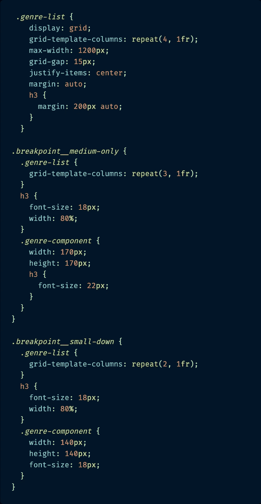
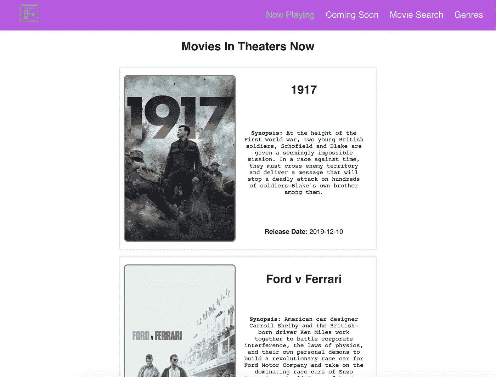
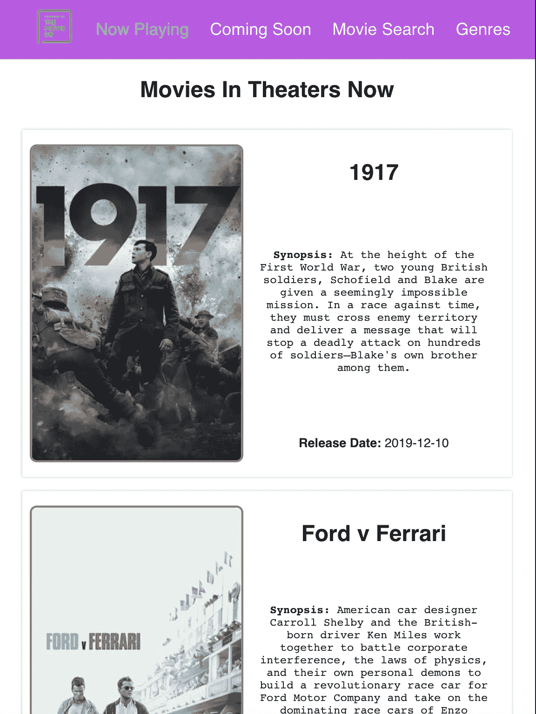
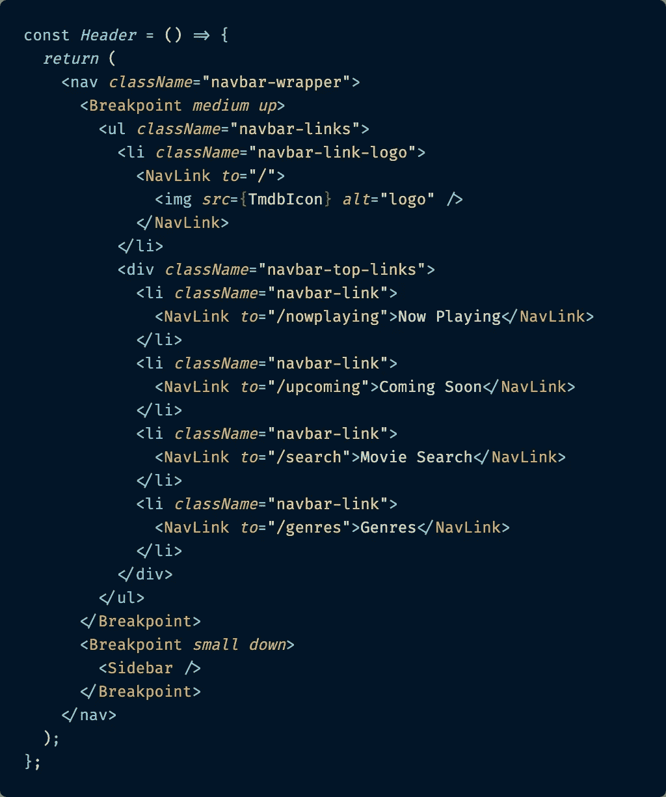
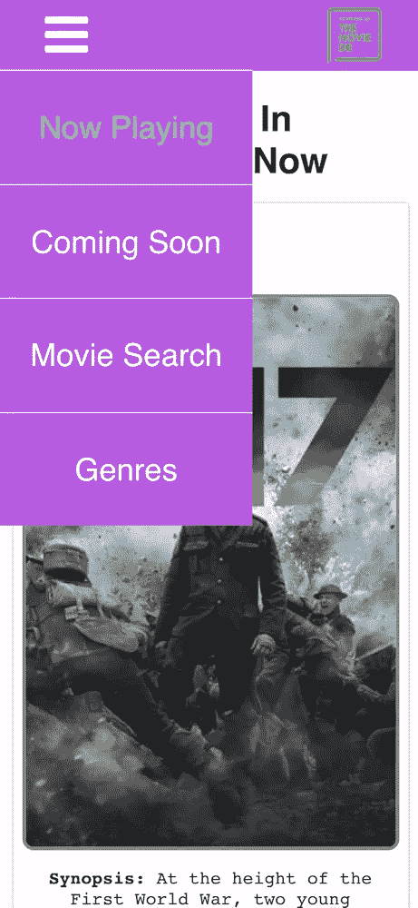
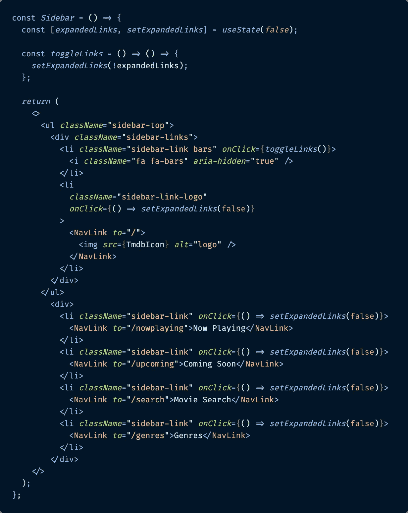

# React Socks 和响应式网页设计

> 原文：<https://betterprogramming.pub/react-socks-and-responsive-web-design-with-react-63b766d000bd>

## 一种 React 专用的方式来构建网页和应用程序，以适应用户的设备大小

在 [Unsplash](https://unsplash.com/s/photos/mobile-design?utm_source=unsplash&utm_medium=referral&utm_content=creditCopyText) 上由 [Balázs Kétyi](https://unsplash.com/@balazsketyi?utm_source=unsplash&utm_medium=referral&utm_content=creditCopyText) 拍摄的照片

# 介绍

几个月前，我和一位同事在科技大会 [Connect 上做了一次演讲。Tech](https://connect.tech/) 关于在构建网站和应用程序时对响应式网页设计日益增长的需求。我们讨论了几种不同的方法来实现它，特别是在 JavaScript 框架 [React](https://reactjs.org/) 中。

如果你对这个术语不熟悉，让我快速定义一下*响应式网页设计*，这样我们都从同一点开始。我发现的最好的定义直接来自于《粉碎》杂志，这是网站开发者和网站设计者的主要编辑意见。

> “响应式网页设计是一种方法，它建议设计和开发应该根据屏幕大小、平台和方向来响应用户的行为和环境。”— [粉碎弹匣](https://www.smashingmagazine.com/2011/01/guidelines-for-responsive-web-design/)

在当今世界，当你构建应用程序时，从多种浏览器/设备尺寸的响应式设计开始应该已经很有意义了，但是如果你想要一些统计数据，这里有一些应该有助于说服你。

> " 57%的用户表示，他们不会推荐一家手机网站设计糟糕的企业."——[足球俱乐部](https://www.socpub.com/articles/the-5-mobile-marketing-mistakes-infographic-14849)

换句话说，糟糕的移动存在(或者更糟，根本没有移动存在)会让你的组织看起来不专业，与现代消费者脱节。这里还有一个:

> “83%的用户表示跨所有设备的无缝体验非常重要。”— [沃尔夫冈·耶格尔](https://visual.ly/community/infographic/technology/mobile-web-usage-2015-and-onwards)

今天的消费者期望无缝体验和品牌一致性，无论他们使用什么设备与你的品牌互动。请看这张从 2018 年 8 月到 2019 年 8 月的图表，它显示了全球用户的平均屏幕尺寸。

数据来源: [GlobalStats](https://gs.statcounter.com/screen-resolution-stats/desktop-mobile-tablet/worldwide/#monthly-201808-201908-bar) ，显示 2018 年 8 月-2019 年 8 月

在 2020 年及以后，所有迹象都表明，无论用户身在何处，都需要响应式设计来满足他们。

虽然我不会深入讨论我们在如何实现响应式设计的演讲中所涉及的所有细节(如果你愿意，你可以看到演讲的完整[幻灯片)，但我想分享两种实现响应式设计的可能方法，供其他希望开始使用它的人参考。](https://t.co/WFHmJsDZ4d?amp=1)

这篇文章将介绍响应式 web 设计的第二个解决方案，它特定于 JavaScript 框架 React:使用 React Socks 根据视口大小有条件地呈现元素。

如果你想看我谈到的第一个解决方案(CSS 媒体查询)，你可以在这里看到我的文章。

# 什么是反应袜？

[React Socks](https://www.npmjs.com/package/react-socks) 是一个 ReactJS 库，设计用于基于特定视口渲染组件。

虽然 CSS 媒体查询用于显示和隐藏元素*总是*出现在 DOM 中，但 React Socks 更进一步，帮助*根据视口大小有条件地*呈现元素。这意味着除非组件大小适合当前视口，否则 React Socks 根本不会渲染组件(或其附带的 CSS)。

归结起来就是:

*   轻松渲染特定于视口的组件
*   能够在需要的地方命名和定义自己的断点(如果您不想自定义，React Socks 也有预定义的断点)
*   如果延迟加载特定于视口的组件，可能会提高应用程序的性能
*   更简单、更甜蜜的语法，易于使用

## 使用反应袜

实现 React Socks 实际上也非常简单。首先，用一个`<BreakpointProvider>`标签包装你的顶层组件(可能是`App`),然后你可以在应用程序的其余部分中任何你需要的地方使用`<Breakpoint>`标签。

**断点提供者实现**

下面是我如何用`<BreakpointProvider>`在顶层包装我的应用程序。

`App.js`:

开始使用 React Socks 就像用 <breakpointprovider>HTML 标签包装你的 App.js 文件一样简单</breakpointprovider>

从文件顶部的 React Socks 导入，包装整个 app。搞定了。一旦解决了这个问题，你就可以在你的应用中任何需要响应的地方开始使用`<Breakpoint>`标签了。

**断点实现**

这是一个使用`<Breakpoint>`标签在组件内部设置断点的例子。

除了实际的`Breakpoint`标签包装器之外，您还需要包括一个 size【React Socks】默认为`xsmall` (0px)、`small` (576px)、`medium` (768px)、`large` (992px)和`xlarge` (1200px)以及一个修饰符`down`、`up`或`only`。

`Down`表示从*到*该特定断点及其以下的任何内容，`up`表示从*到*该特定断点及其以上的任何内容，`only`(或无修饰符)表示仅在该特定断点的像素范围内。如果你看看下面的例子，可能会更有意义。

第一段是 JSX 代码，第二段是不同断点的 CSS 代码。

`Genres.js`:

一个用<breakpoint>包装不同 DOM 组件的例子，这些组件需要以不同的视口尺寸呈现</breakpoint>

`Genres.scss`:

这是根据视口大小设置的断点，有条件地与流派组件一起呈现的 CSS

在上面的例子中，第一个`Breakpoint`包装器规定每当一个视口是`large up`(即 992px 或更高)，第一个列出的 CSS 将被渲染(带有`grid-template-columns: repeat(4, 1fr);`的那个)。

第二个`Breakpoint`包装器将在 991px 和 577px 的视口大小之间仅呈现*，因为其断点大小被设置为`medium`。并且附带的 CSS 通过包装在`.breakpoint__medium-only`的类中有条件地呈现。这个 CSS 类是通过添加 React Socks `Breakpoint`包添加的——不需要您做任何修改。*

第三个将在视口为 576px 或更小时渲染，因为它在`Breakpoint`组件中被设置为`small down`。同样，包含`grid-template-columns: repeat(2, 1fr);`的 CSS 也只能以该视口大小进行渲染。

这种组件的有条件呈现可以缩小 CSS 包的大小，并通过只加载视图需要的内容而不加载其他内容来显著清理加载到浏览器中的 CSS。

# 我如何在我的 React 应用程序中使用 React Socks

除了我们在会议上的发言，我还建立了三个 React 电影演示站点来说明我的观点，使用[电影数据库 API](https://developers.themoviedb.org/3/getting-started/introduction) 作为数据源。

第一个站点完全没有响应，显示了跨多个设备的糟糕用户体验。

第二个网站是用 CSS 媒体查询构建的，使其能够响应平板电脑和移动设备。第三个站点是使用 React 特定的响应库 React Socks 构建的，以使其具有响应性。

这第三个演示就是我在这篇文章中展示的代码片段。如果你想看完整的代码库，可以在 GitHub 上找到[，如果你想看现场版，可以在这个网站](https://github.com/paigen11/movie-demo-3)上找到[。](https://movie-demo-3.paigen11.now.sh)

以上是如何使用 React Socks 的一个例子，但让我给你看另一个它真正闪耀的例子。当您拥有完全不同的布局或组件时，您需要基于视口大小进行渲染。这是 React Socks 擅长的地方。

## 基本组件示例

**桌面和平板电脑视图**

这是我的电影应用程序在桌面和平板电脑上的两个截图，显示了整个应用程序中基于标题的导航栏。

对于这两种较大的尺寸，指向不同页面的链接总是可见的(`Now Playing`、`Coming Soon`、`Movie Search`和`Genres` ——加上一个返回最右侧`Dashboard`登录页面的链接)。

**桌面视图**

我的应用程序中使用桌面标题组件作为导航栏的页面

这是平板电脑的视图。同样，顶部有足够的空间来放置所有的链接。

**平板电脑视图**

tablet 视图中的同一个页面，仍然为导航栏使用 Header.js 组件

现在，这里有一个反应 JSX 的镜头，随着这些观点。

如你所见，`Breakpoint`包装器使用`medium up`来显示标题，而视窗是 577px 及以上。当视口小于该值时，React Socks 可以渲染一个名为`<Sidebar>`的完全不同的组件。

`Header.js`:

这是最初的 Header.js 组件，它将为桌面或平板电脑呈现顶部导航链接，或者为移动视图呈现不同的侧栏组件

## 用 React Socks 切换的侧边栏组件

**移动尺寸**

但这里有一个相同标题在移动视图中的截图:它变成了一个侧边栏，当用户点击右上角的汉堡栏时，它会从左侧滑入相同的链接。

再一次，回到主页的链接(T4 页面)现在在右上角。

使用 Sidebar.js 组件的应用程序中的移动视图页面。

这个视图实际上是由`Header`组件的子组件`Sidebar`呈现的，因为`Sidebar`被包装在`small down`的 React Socks 断点内。只要视口大小低于 576px，就会呈现`Sidebar`组件而不是`Header` ——其链接横跨顶部。

这是`Sidebar`组件的 JSX。

`Sidebar.js`

Sidebar.js 组件的 JSX，仅由移动大小的父 Header.js 组件呈现

现在，想象一下，试图将这两个截然不同的组件整合成一个既适用于台式机又适用于移动设备的组件。这也许是可能的，但是 JSX 会很乱，CSS 会更乱。

React Socks 使得简单地切换出完整的组件变得更加容易，使得代码更加简洁，开发更加容易。

# React 袜子的利与弊

我已经介绍了几个不同的示例，说明如何使用 React Socks 根据视口大小来切换 React 组件，但是我觉得有必要谈谈它们带来的一些好处和缺点。

正如我上面提到的，在某些情况下，它们可能是一个很好的解决方案，但是对于解决每一个响应式设计需求来说，它们可能并不完美。

先说亮点。

## 利益

*   当您有非常不同的组件或布局要根据视口大小进行渲染时非常理想——正如您在上面的 header/sidebar 示例中看到的，桌面和移动视图和功能非常不同。试图将这些硬塞进一个组件，并使用纯粹的 CSS 媒体查询来显示和隐藏不同屏幕大小的组件的不同部分，将会变得混乱和更加复杂。
*   可以命名和设置自定义断点——如果您需要比 React Socks 设置的默认断点更多的特定断点，这很容易。如果你想要一个额外的、超大的监视器的断点，你可以简单的命名它为`giantMonitor`，并用它设置一个视窗大小。同样，如果你想要一个叫做`pizza`或`bicycle`的，你也可以这么做。这完全取决于你和你的需求。
*   与媒体查询相比，每个视图呈现的 CSS 更少——正如我之前提到的，React Socks *仅*呈现包装在其`Breakpoint`标签内的组件(以及随之而来的 CSS)。较小的 CSS 包大小意味着更快的页面加载时间，特别是对于移动用户，从而带来更好的用户体验。

React Socks 只有一个我在试用时发现的主要缺点。

## 缺点

*   React Socks 最大的缺点是:对于保持相同结构，只需要调整高度、宽度、边距、填充等的代码来说，这可能是多余的。对于保持相同布局和 DOM 元素的最小更改，只需添加一些包装在媒体查询中的 CSS，而不是多次定义包装在`Breakpoint`标签中的相同组件和 CSS，这样可能会更快。

当你考虑是否要穿反应袜时，这是我唯一能指出的。

# 结论

在当今多设备的世界里，响应式网页设计对每个设计师和开发者来说都是至关重要的。我们甚至无法想象应用程序可能被使用的一些场景，我们也不能给用户带来糟糕的体验——因为我们的竞争对手不会。

有很多解决方案，但是我选择研究的方法之一是使用 React 专用库 React Socks 来使站点具有响应性。它是专门为使用 React 框架而定制的，非常容易上手。

React Socks 只渲染视口所需的组件和 CSS，不渲染任何其他内容，如果需要，可以很容易地创建自定义断点，并且它提供了一个更干净、更易读的代码和更好的应用程序性能的选项。对于您的响应需求来说，这是一个非常好的选择。

过几周再来看看——我会写更多关于 JavaScript、React、ES6 或其他与 web 开发相关的东西。

感谢阅读。我希望您在设计和构建自己的基于 React 的响应式 web 应用程序时会考虑 React Socks。这是一个强大、通用的解决方案。

## **如果你喜欢读这篇文章，你可能也会喜欢我在《更好的编程》中的其他文章:**

*   [“纯 CSS 媒体查询和使用 React 的响应式网页设计](https://medium.com/better-programming/pure-css-media-queries-and-responsive-web-design-with-react-bac7a31e84b4)”
*   [“如何在 React URL 路径中传递多个路由参数](https://medium.com/better-programming/how-to-pass-multiple-route-parameters-in-a-react-url-path-4b919de0abbe)”
*   [“GitHub 模板:在开发团队中形式化拉取请求的更聪明的方法](https://medium.com/better-programming/github-templates-the-smarter-way-to-formalize-pull-requests-among-development-teams-89f8d6a204f)”

# 参考资料和更多资源

*   [GitHub repo](https://github.com/paigen11/movie-demo-3) ，React app 搭配 React Socks 实现响应式设计
*   r [响应 app](https://movie-demo-3.paigen11.now.sh) 现场演示现场
*   通过[粉碎杂志](https://www.smashingmagazine.com/2011/01/guidelines-for-responsive-web-design/)进行响应式网页设计
*   以 React.js [演示文稿为特色的响应式设计](https://drive.google.com/drive/folders/1oRtHrgzpPorn9ogGpAxA5lPrH3ycCYK9)
*   反应袜子， [NPM 文档](https://www.npmjs.com/package/react-socks)