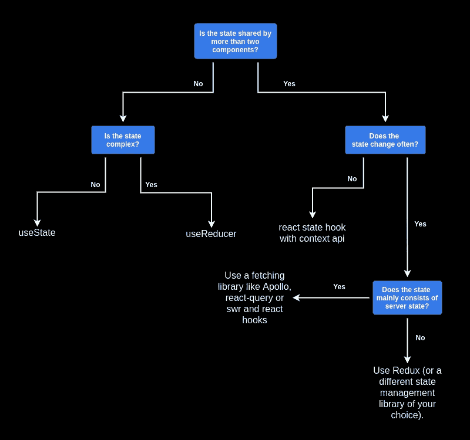

# 反应状态管理

> 原文：<https://betterprogramming.pub/react-state-management-7e7f3a2018e4>

## 了解如何为您的项目选择正确的状态管理解决方案，并知道何时使用 Redux

由[玛利亚·坎图](https://unsplash.com/@mariacantu?utm_source=medium&utm_medium=referral)在 [Unsplash](https://unsplash.com?utm_source=medium&utm_medium=referral) 上拍摄的照片。

如果你在社区中四处看看，你总是会遇到下面这个问题:我如何在 React 中管理我的状态？

以前使用过其他框架如 [Angular](https://angular.io/) 或 [Vue.js](https://vuejs.org/) 的开发人员会问自己如何在 React 中管理他们的状态。通常，这个问题涉及国家管理的官方解决方案。

[自从 React 16.8 中引入上下文 API 和钩子 API 以来，开发人员面临的另一个问题是如何在 Redux 和带有`useState` / `useReducer`的上下文 API 之间做出决定，以管理其全局状态。](https://www.reddit.com/r/reactjs/comments/epxavs/is_redux_really_a_good_idea/)

我想在下面的文章中回答这两个问题。为了这个目的，我在社区里做了一些研究，得到了很多有经验的 React 开发者的意见。

# 什么是国家管理？

然而，在我们开始之前，我想澄清几个基本点。在我们能够解决正确的状态管理问题之前，我认为我们需要一个状态管理确切含义的定义。

状态描述了应用程序在给定时间点的状况。

状态的子类型有:

*   服务器状态
*   导航状态
*   本地用户界面状态
*   全局用户界面状态

状态管理描述了根据所有输入维护应用[的状态/知识。](https://hackernoon.com/how-to-simplify-your-application-state-management-as6n3wz8)

输入通常发生在服务器(API)或客户端(用户)。

因此，[状态管理的困难](https://hackernoon.com/how-to-simplify-your-application-state-management-as6n3wz8)来自于应用程序中所有状态子类型的协调。

# React 中的 State 是什么意思？

UI 是应用程序状态的可视化表示。如上所述，state 代表[应用程序在给定时间点的状态](https://www.robinwieruch.de/react-state#react-state-graphql%23what-is-state-in-react)。

在 React 中，状态是反映 UI 当前状态的数据结构。

状态可以由不同种类的数据组成:

1.  决定侧边栏是否打开的布尔值。
2.  表单的文本内容。
3.  通过 API 提取的服务器数据。

在 JavaScript 中，我们可以这样表示:

所有这些数据既可以本地管理(即在一个组件中使用 React Hooks 或`setState`)也可以全局管理。

在这种情况下，管理意味着保存和更改状态，以及通过 UI 显示状态。

# 有官方/推荐的状态管理解决方案吗？

有了`setState`方法和`useState` / `useReducer`钩子，组件内部的本地状态管理有了一个特定于 React 的解决方案。有了这个，[你已经可以创建](https://reactjs.org/docs/faq-state.html#should-i-use-a-state-management-library-like-redux-or-mobx)相当复杂的应用程序了。

像 Angular 的 [NgRx](https://ngrx.io/) 或者 Vue 的 [Vuex](https://vuex.vuejs.org/) 这样的全局状态管理没有半官方的解决方案。在这里，你被 React 宠坏了。一些解决方案专门针对应用程序状态的某些部分(例如 [react-query](https://react-query.tanstack.com/) )，而[一些是通用解决方案](https://changelog.com/posts/when-and-when-not-to-reach-for-redux)(例如 Redux)。

# 那么，如何选择合适的状态管理解决方案呢？

我有意不考虑导航状态。任何拥有两个以上视图的 React 应用程序都应该依赖于像 [react-router](https://reactrouter.com/) 这样的路由库。从我的角度来看，处理浏览器 API 太复杂了，你自己无法管理。

如果我们假设主要的困难是协调子类型，那么我们首先应该问自己，我们需要在(React)应用程序中管理什么类型的状态。我们的状态有多复杂？多久换一次？然后我们决定哪种解决方案最适合我们。

下面，你可以看到我决策过程的示意图:

选择正确的状态管理解决方案的决策过程。

# 使用状态

首先，我们的状态是由两个以上的组件共享的吗？如果不是，那么下一个问题就是我们的状态是否有复杂的更新逻辑。换句话说，新状态依赖于旧状态还是多个子值被改变？如果这些问题的答案是否定的，我们就用带`useState`的局部状态。

例如，如果我们有一个只有一个组件的简单计数器，使用带有`useState`的本地状态就足够了。

第一次渲染`Counter`组件时，`useState`钩子用`intialCount`初始化。作为返回值，我们得到状态变量`count`和更新函数`setCount`。

要改变计数，我们需要用一个新值调用`setCount`。每当我们调用`setCount`时，计数器组件被重新呈现。

如果我们想在旧值的基础上设置`count`的新值，我们应该传递给`setCount`一个简单的更新函数，该函数传递 count 的新值作为它的返回值。

## 任务

*   阅读 React 文档中的`[useState](https://reactjs.org/docs/hooks-reference.html#usestate)` [。](https://reactjs.org/docs/hooks-reference.html#usestate)
*   通过`[useState](https://dmitripavlutin.com/react-usestate-hook-guide/)` [导轨](https://dmitripavlutin.com/react-usestate-hook-guide/)进行工作。

# 用户教育

现在，如果我们的状态确实有复杂的更新逻辑，那么对`useReducer`就有意义了。

如上所述，上下文中的“复杂”意味着状态的改变必须改变状态的许多值，或者状态依赖于先前的状态。

首先，我们定义一个初始状态和一个纯约化函数。这消耗了一个状态和一个动作，并返回一个新的状态。

为了在我们的计数器组件中使用`useReducer`，我们进行类似于`useState`的操作:我们用`initialState`和`reducer`初始化`useReducer`。初始化之后，我们得到状态和一个调度函数。调度功能用于向减速器请求状态改变。为此，我们用适当的动作调用`dispatch`。

相应地，按钮的`onClick`处理程序不再包含它们自己的逻辑，而是仅通过`dispatch`请求状态改变。

## 任务

*   阅读 React 文档中关于`[useReducer](https://reactjs.org/docs/hooks-reference.html#usereducer)`的内容。
*   [了解](https://css-tricks.com/getting-to-know-the-usereducer-react-hook/) `[useReducer](https://css-tricks.com/getting-to-know-the-usereducer-react-hook/)`。
*   [学习什么时候到](https://www.robinwieruch.de/react-usereducer-vs-usestate) `[useState](https://www.robinwieruch.de/react-usereducer-vs-usestate)` [和什么时候到](https://www.robinwieruch.de/react-usereducer-vs-usestate) `[useReducer](https://www.robinwieruch.de/react-usereducer-vs-usestate)`。

# 上下文 API +状态挂钩

如果我们看决策图的右边部分——也就是说，如果我们对“状态是由两个以上的组件共享的吗？”—我们面临的问题是，我们的全球状态是否经常变化。如果我们可以回答不，那么上下文 API 可以让我们的生活更轻松。

一个典型的例子是许多不同组件都需要的用户登录状态。

在我们的代码示例中，我们用`createContext`初始化上下文，它对`AuthProvider`组件的所有子组件都可用。

使用自定义钩子`useAuth`，子组件可以访问状态。这样可以让我们省去不必要的支柱钻孔。

## 任务

*   在 React 文档中阅读更多关于 React 的 `[useContext](https://reactjs.org/docs/hooks-reference.html#usecontext)` [钩子的信息。](https://reactjs.org/docs/hooks-reference.html#usecontext)
*   阅读更多关于`[useContext](https://www.robinwieruch.de/react-state-usereducer-usestate-usecontext)` [结合](https://www.robinwieruch.de/react-state-usereducer-usestate-usecontext) `[useState](https://www.robinwieruch.de/react-state-usereducer-usestate-usecontext)` [和](https://www.robinwieruch.de/react-state-usereducer-usestate-usecontext) `[useReducer](https://www.robinwieruch.de/react-state-usereducer-usestate-usecontext)`。

# 服务器状态(react-query、Apollo、swr)

再次查看我们的决策图，我们看到我们已经用完了 React 的板资源。我们现在进入了一个值得使用外部状态管理解决方案的领域。

如果应用程序主要使用全局状态来检索、缓存和更新驻留在服务器上的数据，[建议](https://kentcdodds.com/blog/application-state-management-with-react#server-cache-vs-ui-state)使用专门的数据管理解决方案。

在管理界面中，我们经常需要在不同的视图中显示许多不同的数据。有效地管理这些数据绝非易事。

下面，我将展示一个使用 react-query 的简单示例:

类似于我们的上下文 API 示例， [react-query](https://react-query.tanstack.com/) 为我们提供了一个上下文提供者和一个定制钩子。

使用`useQuery`定制钩子，我们现在可以获取我们需要的数据。为此，我们给`useQuery`传递一个惟一的名称和实际的获取函数。我们取回需要显示的数据(`status`、`error`、`content`)。

真正的亮点是`react-query`替我们接手管理。它确保数据被自动缓存和更新。如果我们在第二个组件中使用相同的查询问题，`react-query`将不会多次执行查询，但是[将依靠缓存的数据](https://react-query.tanstack.com/guides/important-defaults)。

此外，所提供的上下文提供程序被优化，以防止组件不必要的重新呈现。自己实现这个功能并不简单。

## 任务

*   了解更多关于 react-query 背后的[动机。](https://react-query.tanstack.com/overview)
*   了解备选方案，阿波罗[和 SWR](https://www.apollographql.com/) 。

# Redux 等人。

但是，如果状态由多个组件共享，频繁更改，并且主要不是服务器状态，该怎么办呢？

让我们以在有许多按钮的文本编辑器中管理状态为例。这就是 Redux 的用武之地。Redux 非常高效，拥有一个包含许多插件(所谓的中间件)的大型生态系统，并且非常有据可查。

我们在这里再次使用 Redux 和 Redux 工具包重新实现了我们的`Counter`示例。它与`useReducer`变体非常相似。

首先，我们初始化我们的状态和我们的规约。在我们的`Counter`组件中，我们初始化了一个所谓的选择器——一个选择状态子集的函数。此外，我们使用 Redux 的`useDispatch`钩子来命令状态改变。

与我们的`useReducer`变体不同，我们不需要用字符串来命名一个动作。动作名称由`createSlice`自动生成。

正如我们简单的`Counter`示例所示，设置 Redux 确实需要更多的努力。自从 React 16.3 正式引入了 Context API 之后，对于小型应用来说，大部分都是不值得花力气的。

[Redux](https://blog.isquaredsoftware.com/2018/03/redux-not-dead-yet/)相对于上下文 API 和 React 挂钩的组合的优势在于:

*   可以促进团队合作的一致的和定义的架构模式。
*   通过出色的浏览器扩展轻松调试。
*   不同中间件的使用。
*   插件多，扩展性好。
*   跨平台和跨框架使用。
*   根据应用程序状态，性能优于上下文 API。

虽然 Redux 是 React 最著名和最受欢迎的状态管理解决方案，但它绝不是唯一的。备选方案有 [MobX](https://mobx.js.org/README.html) 、[反冲](https://recoiljs.org/)、 [RxJS](https://rxjs-dev.firebaseapp.com/) 。

## 任务

*   了解更多关于使用 von Redux und Redux-Toolkit 的信息。
*   研究 Redux 替代品。

# 结论

很多 React 应用没有 Redux 也能过得去。在许多情况下，使用它会增加不必要的复杂性。

React 钩子和上下文 API 可以覆盖许多以前用 Redux 解决的用例。

对于服务器状态缓存，建议使用专门的库。

决策图可以帮助开发人员为他们的应用程序找到正确的状态管理形式。

最后，所示的解决方案并不相互排斥。在应用程序中使用局部和全局状态没有任何问题。

# **参考文献**

1.  [n00b 问:你为什么会使用 React w/o 钩子？](https://www.reddit.com/r/reactjs/comments/jb638g/n00b_q_why_would_you_ever_use_react_wo_hooks/)
2.  [状态管理在 React？](https://www.reddit.com/r/reactjs/comments/khki5p/state_management_in_react/)
3.  [redux 真的是个好主意吗？](https://www.reddit.com/r/reactjs/comments/epxavs/is_redux_really_a_good_idea/)
4.  [Virdol，Marin —如何简化您的应用统计管理](https://hackernoon.com/how-to-simplify-your-application-state-management-as6n3wz8)
5.  [Virdol，Marin —如何简化您的应用状态管理](https://hackernoon.com/how-to-simplify-your-application-state-management-as6n3wz8)
6.  [威鲁奇，罗宾-React 状态管理](https://www.robinwieruch.de/react-state#react-state-graphql#what-is-state-in-react)
7.  [应该用 Redux 或者 MobX 这样的状态管理库吗？](https://reactjs.org/docs/faq-state.html#should-i-use-a-state-management-library-like-redux-or-mobx)
8.  [Erikon，Mark——何时(以及何时不)达到 Redux](https://changelog.com/posts/when-and-when-not-to-reach-for-redux)
9.  [肯特郡多兹——使用 React 进行应用状态管理](https://kentcdodds.com/blog/application-state-management-with-react#server-cache-vs-ui-state)
10.  [概述反应-查询](https://react-query.tanstack.com/overview#motivation)
11.  [重要默认值—反应-查询](https://react-query.tanstack.com/guides/important-defaults)
12.  [关于缓存失效——为什么很难？](https://yihui.org/en/2018/06/cache-invalidation/)
13.  埃里克森·马克——博客回答:Redux——还没死！