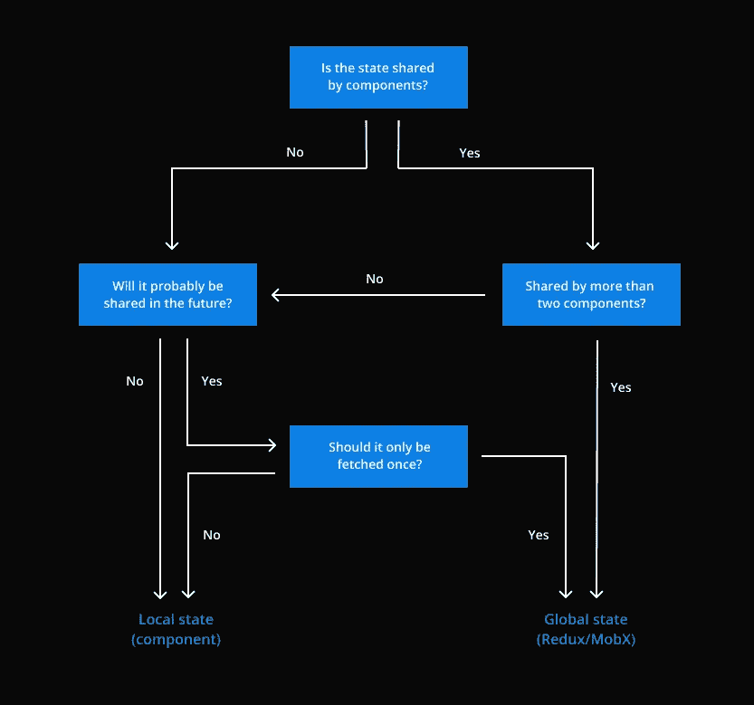

# 2020 年反应状态管理

> 原文：<https://betterprogramming.pub/react-state-management-in-2020-719d10c816bf>

## 我们还需要像 Redux 和 MobX 这样的状态管理框架吗？

# 介绍

React 钩子的引入无疑改变了对状态管理的看法。

在我们拥有这个特性之前，很难在组件之间共享状态逻辑。现在就像给它做一个抽象的钩子一样简单(例:`useUserLogin`)。

这就提出了一个问题，为什么我们仍然需要状态管理框架？在这篇文章中，我将描述我在哪里保留`state`的决策过程。我还将分享我对 2020 年我们是否还需要国家管理框架的看法。

# 什么变了？

那么在钩子出现之前，我们是如何定义状态的呢？基本上，有两种选择:在组件中定义一个本地状态，或者使用状态管理框架将其设置为全局状态(例如 MobX / Redux)。

## **本地状态(挂钩前)**

只有这两个选项的问题在下面的场景中得到最好的描述。假设我们的状态不一定是全局的，但是我们可能希望在多个组件中重用我们定义本地状态的方式。

在上面的例子中，我们可能想要重用设置加载和错误状态——在钩子之前这是不可能的。我们唯一的选择是用 Redux 使它可重用。在 Redux 中，每个想要搜索用户的组件可以简单地分派一个动作(`searchUsers()`)并监听全局状态的变化。

然而，使用这种全局状态(Redux/MobX)会导致一些问题:

*   更多样板代码
*   复杂流动
*   多个组件正在操纵全局状态，这可能会导致不必要的副作用

## **解决方案:React Hooks！**

谢天谢地，React 在 React 16.8 中引入了 hook。从那天起，在多个组件之间共享状态逻辑成为可能。

在下面的示例中，我们现在能够共享加载和错误行为:

**好处**:如果多个组件想要提供搜索用户列表的功能，我们也可以制作一个`useUserSearch`。

然而，钩子并不是银弹。将状态保存在钩子中并不意味着它成为一个单体，状态只绑定到一个组件。在某些情况下，我们可能只想保存一个状态实例(例如，只获取一次用户信息)。这就是状态管理框架证明其价值的地方。

# 如何决定在哪里保存状态

既然可以跨组件共享状态逻辑，我们如何决定是将状态保存在组件中(本地)还是保存在状态管理框架中(全局)？

下面是我决策过程的一个图像。

在哪里保存状态的决策过程

# 状态管理框架有什么好处？

现在我们知道何时在全局状态和本地状态之间做出决定。但是为什么我们在 2020 年仍然使用国家管理框架呢？上面使用 React 钩子有什么好处？

以下是一些好处:

*   全局定义，这意味着只有一个数据实例
*   仅提取远程数据一次
*   丰富的开发工具
*   为软件工程师提供标准化的工作方式

# 结论

我们已经看到 React Hooks 已经动摇了整个国家管理格局。自从它们的引入，在组件之间共享状态逻辑变得更加容易了。

然而，钩子不是银弹，我们可能仍然需要状态管理框架。这并不意味着我们需要在全局范围内保持每个状态——大多数情况下最好保持在组件级别。只有在绝对必要的时候，才应该将状态转移到状态管理框架中。