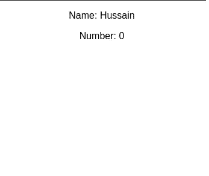
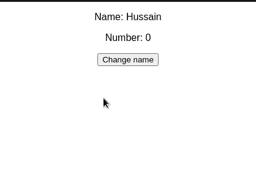
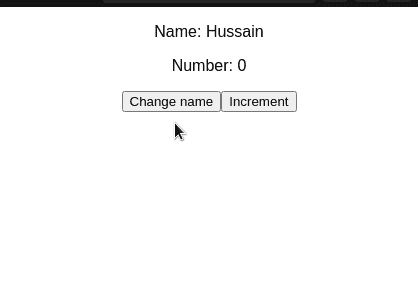
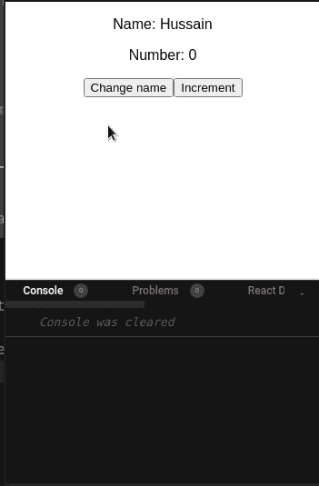
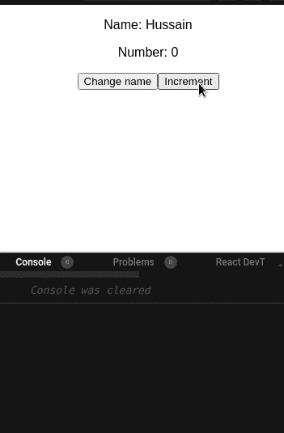
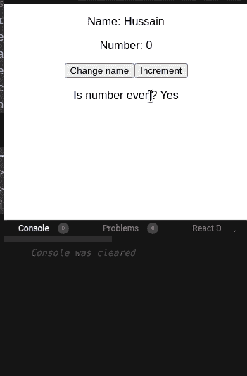

# 轻松应对状态管理

> 原文：<https://betterprogramming.pub/react-state-management-with-easy-peasy-f716dccfa980>

## 简易豌豆初学者指南


来源:[布莱恩·威廉姆斯](https://unsplash.com/@brywyll)在 [Unsplash](http://unsplash.com)

在写一些代码之前，让我们先讨论一下为什么使用状态管理是必要的。

# 状态管理的重要性

简单来说，开发者需要使用一个状态管理系统来解决 React 的道具钻取问题。让我通过一个代码示例向您解释一下。

看看下面的片段:

在这段代码中，我们基于`mode`属性的值呈现一个 React 组件。让我们试着用这段代码把事情弄复杂一点:

这里，我们还呈现了一个`ThemeMessage`组件。该组件显示`mode`道具的当前值。

虽然代码可以工作，但是有一个小缺陷。注意，我们必须键入两次`light`值。结果，这打破了编程的枯燥规则。让我们试着解决这个问题:

虽然我们的代码是有效的，现在很容易遵循，但有一个主要问题。要获得`mode`道具并将其发送给相关组件，您必须将其传递给`FullPage`组件。即使`FullPage`不需要`mode`道具来运行，我们仍然必须传递它，因为它的子组件需要它。

因为我们的代码很简单，所以没有问题。但是，如果您的项目规模扩大，从而变得更加复杂，该怎么办呢？你将不得不通过许多层和组件“钻”下你的道具。

为了减轻这样的问题，开发者为他们的应用程序使用状态管理库。一个这样的例子很简单。

# 什么是 Easy Peasy，为什么要使用它？

Redux 是国家管理图书馆的一个家喻户晓的名字。但是让我们解决房间里的大象:它需要太多的样板文件来开始。必须有一个不需要大量代码就能工作的替代库。

进入 [Easy Peasy](https://easy-peasy.dev/) :这个库不仅不需要太多的样板文件，还带来了许多优势，包括:

*   简单易懂的代码。
*   使用钩子。由于钩子在 React 中风靡一时，这是一个巨大的优势。
*   支持派生数据。我们将在本文后面了解派生数据。
*   不需要在上下文提供者中包装您的状态。这解决了 [React 的上下文 API](/reacts-context-api-explained-baebcee39d2f) 中的一个小缺陷，你需要将你的状态包装在`Context.Provider`标签中。因此，这会降低代码的可读性。

既然已经谈了它的成果，那就开始吧！

# 简单:基本用法

## 装置

要在 React 应用程序中安装 Easy Peasy，请运行以下终端命令:

```
npm install easy-peasy
```

## 创建我们的商店

要开始，我们首先需要建立一个*商店*。这是你放置所有状态变量和它们各自动作的地方。

在您的项目目录中，创建一个名为`store.js`的文件。这里，从编写以下代码开始:

*   第 4 行:创建一个`number`州。它的起始值将是`0`。
*   第 7 行:创建一个`name`变量。它的初始值将是`Hussain`。
*   第 14 行:调用`createStore`方法。这将允许我们将我们声明的状态与我们的项目联系起来。

## 消费国

在这一部分，我们将在用户界面上显示我们的商店。

为此，创建一个名为`StoreConsumer.js`的文件。在这里，继续编写这段代码:

*   第 3 行和第 4 行:`useStoreState`方法允许我们访问商店的状态。这里，我们提取了`name`和`number`变量。
*   第 7 行:向 DOM 显示它们的值。

作为最后一步，我们现在需要将我们的商店连接到项目。为此，转到`App.js`并用以下代码替换所有代码:

*   第 8 行:用`StoreProvider`标签包装我们的`StoreConsumer`组件。`store`道具指向我们想要使用的商店。
    我们现在已经将我们的商店与这个应用程序连接起来。

这将是输出:



代码的输出

就是这样！请注意，我们不需要编写过多的样板代码来启动和运行。

在本文的下一部分，我们将深入研究 Easy Peasy 库。

# 简单:高级用法

## 行动

操作是允许您对所需状态执行更新的功能。你可以把它们想象成一个`useState`钩子中的`setValue`函数。

在您的`store.js`文件中，找到`nameModel`对象并添加一个`setName`属性:

*   第 5 行:定义我们的`setName`方法。
*   第 6 行:将`name`状态的值改为有效载荷。

让我们使用这个函数。为此，在`StoreConsumer.js`模块中添加以下代码:

*   第 7 行:点击时，将`name`的值改为`Medium`。

这将是输出:



代码的输出

下面的代码片段增加了我们的`number`州的值:

要使用这个函数，在`StoreConsumer.js`中添加这段代码:

*   第 6 行:点击后，运行`addNumber`函数。这将增加`number`的值。

这将是代码的结果:



代码的输出

## 听众

侦听器是允许我们扫描所需存储中的变化的代码片段。

要开始使用监听器，在您的`store.js`文件中，编辑`nameModel`对象，如下所示:

*   第 4 行:告诉 Easy Peasy 在`setName`方法运行时运行这段代码。
*   第 6 行:每次`name`变量改变时，在控制台中记录它的值。

运行这段代码。这将是结果:



注意，在输出中，React 记录了我们的`name`状态的值。这意味着我们的代码是成功的！

## 使用监听器作为中间件

我们的侦听器甚至可以作为中间件方法工作。这方面的一些使用案例包括:

*   验证:如果新的状态值不符合特定的格式，则抛出一个错误。
*   边界值:不要让我们的状态变量超过某个值。比如我们的`number`变量不应该超过`10`。

为此，转到`store.js`并找到`numberModel`对象:

*   第 4 行:`addNumber`动作应该是这个监听器的目标解析器函数。
*   第 7 行:检查`number`状态是否大于`10`。如果是，将`number`设置为`10`并退出该功能。

这将是结果:



代码的输出

太神奇了。我们的代码像预期的那样工作！

## 计算属性

简而言之，计算属性是从另一个状态派生的状态变量。

要使用计算变量，请在您的`numberModel`对象中添加以下代码片段:

*   第 6 行:我们的`isEven`状态将从`number`状态派生而来。如果`number`变量是偶数，则返回`true`。否则，返回`false`。

我们剩下要做的就是显示变量`isEven`。为此，转到`StoreConsumer.js`并添加以下代码:

*   第 1 行:从存储中获取`isEven`变量。
*   第 6 行:显示`isEven`的值。

这将是代码的结果:



代码的输出

我们完事了。

# 进一步阅读

[程序的源代码](https://codesandbox.io/s/easy-peasy-tutorial-niuc2)

*   [易反应状态管理库— Flavio Copes](https://flaviocopes.com/react-easy-peasy/)
*   [使用 React-Open Replay 博客进行简单的状态管理](https://blog.openreplay.com/easy-peasy-state-management-using-react-easy-peasy)
*   [易皮斯全球状态反应 w/ Hooks](https://medium.com/@ctrlplusb/easy-peasy-global-state-in-react-w-hooks-421f5bf827cf) — [肖恩·马西森](https://medium.com/u/8407d5f9b4f3?source=post_page-----f716dccfa980--------------------------------)

# 结论

Easy Peasy 是一个易于使用的库，启动和运行时需要的样板文件较少。API 是干净的，这意味着您的全局状态更容易维护。

非常感谢您的阅读！编码快乐！