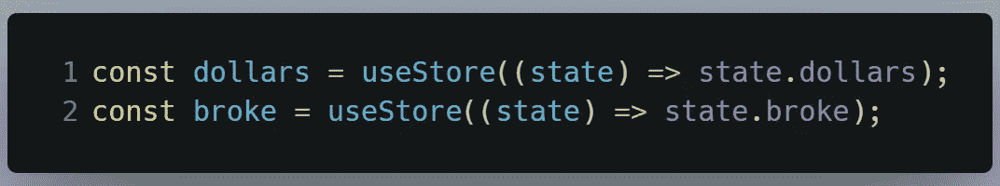
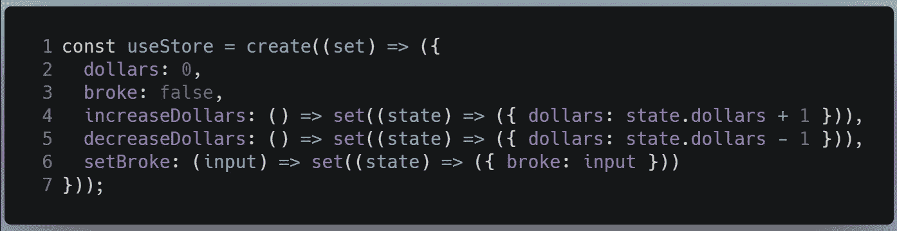
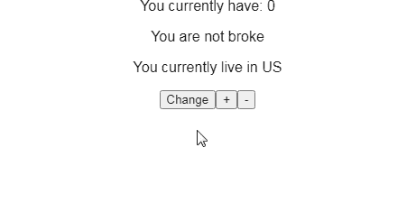
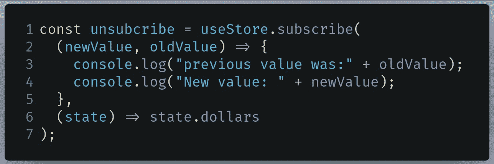
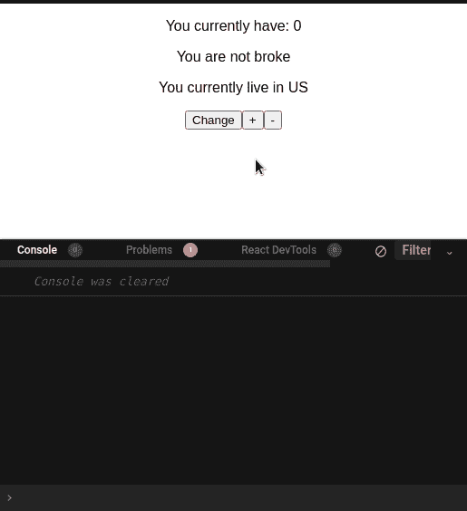
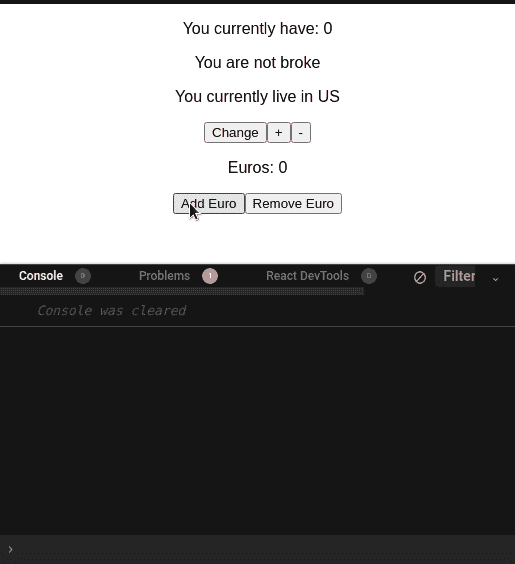

# 用 Zustand 反应状态管理

> 原文：<https://betterprogramming.pub/react-state-management-with-zustand-b816472b4be7>

## 关于 Zustand API，您需要知道的是


来源:[塞巴斯蒂安·诺尔](https://unsplash.com/@skenb)在 [Unsplash](http://unsplash.com) 上

# 介绍

让我们首先讨论一下为什么首先应该使用状态管理库。

## 状态管理的重要性

简单来说，由于 React 臭名昭著的道具钻取问题，开发者需要一个状态管理系统。让我通过一个代码示例向您解释一下。

看看下面的片段:

我们在这里所做的是基于`company`道具渲染一个图标。相当简单。让我们试着把事情复杂化一点。

在上面这段代码中，我们还呈现了一个`Message`组件，它显示了`firm`道具的当前值。

然而，有一个问题。注意，我们必须输入两次`apple`属性值。这打破了编程的枯燥规则。结果，这在代码审查期间留下了不好的印象。让我们试着解决这个问题:

虽然我们的代码是完全有效的，现在很容易遵循，但有一个主要问题。要获得`company`道具并将其发送给相关组件，您必须将其传递给`FullPage`组件。即使`FullPage`不需要`company`道具来运行，我们仍然必须传递它，因为它的子组件需要它。

因为我们的代码很简单，所以没有问题。然而，如果您的项目规模扩大，从而变得更加复杂，该怎么办呢？你将不得不通过多个层和组件“钻”下你的道具。

为了减轻这样的问题，开发者为他们的应用程序使用状态管理库。Zustand 就是这样一个例子。

## Zustand 是什么，为什么要用？

Redux 是国家管理图书馆的一个家喻户晓的名字。但是让我们解决房间里的大象:它需要太多的样板文件来开始。必须有一个不需要大量代码就能工作的替代库。

进入 Zustand，这是一个不仅不需要太多样板文件而且还有其他优点的库。其中包括:

*   简单易懂的代码
*   使用钩子。由于钩子在 React 中风靡一时，这是一个巨大的优势。
*   不需要在上下文提供者中包装您的状态。这解决了 [React 的上下文 API](/reacts-context-api-explained-baebcee39d2f) 中的一个小缺陷，你需要将你的状态包装在`Context.Provider`标签中。因此，这会降低代码的可读性。

既然已经谈了它的成果，那就开始吧！

# Zustand:简单用法

## 装置

要在 React 项目中安装 Zustand，请运行以下终端命令:

```
npm install zustand
```

## 创建商店

要入门，Zustand 首先需要一个*店*。这是您放置所有状态及其功能的地方。现在，我们将只存储状态变量。

创建一个名为`states.js`的单独文件，并编写以下代码:


要在 state.js 中编写的代码

*   第 3 行:创建一个名为`useStore`的定制钩子。`create`函数告诉 Zustand 为我们创建一个商店。`create`接受一个回调函数作为它的第一个参数，它接受一个用于操作状态的`set`函数。
*   第 4 行:我们的`useStore`变量只有一个状态，叫做`dollars`。它的初始值将是`0`。
*   第 5 行:声明另一个名为`broke`的状态。它的初始值将是`false`。

太好了，你终于创建了一个简单的商店！是时候渲染了。

## 显示状态

现在让我们显示状态变量的值。在`App.js`中，首先像这样引入你的`useStore`变量:

```
import useStore from "./state"
```

然后像这样获得你的`dollars`和`broke`状态变量:



要在 App.js 中编写的代码

*   第 1 行:从`useStore`钩子获取`dollars`状态。
*   第 2 行:获取`broke`布尔值的值。

我们快完成了！您可以像这样显示它们:

```
return (
  <div className="App">
    <p> You currently have: {dollars} </p>
    <p> {broke? "You are broke" : "You are not broke" } </p>
  </div>
);
```

在这段代码中，我们显示了`dollar`和`broke`状态的值。

这将是结果:


代码的输出

就是这样！没有过多的样板代码。没有争论，没有大惊小怪。只有几行代码完成了这项工作。

您甚至可以声明多个商店。我们将在下一节讨论这个问题。

## 多家商店

Zustand 具有灵活性，允许您创建多个商店。这有助于组织状态变量。

在`state.js`中，编写以下代码:

*   第 3–6 行:这是我们之前定义的`useStore`钩子。
*   第 8 行:创建一个`useCountry`钩子，它有一个叫做`country`的状态变量。它的初始值将是`US`。
*   第 12 行:出口`useStore`和`useCountryStore`挂钩。

您现在已经创建了两家商店。让我们使用它们。

在`App.js`中，首先找到以下代码行:

```
import useStore from "./state"
```

像这样改变它:

```
import { useStore, useCountryStore } from "./state"
```

您现在需要进入`country`状态。为此，在`App.js`中编写以下代码行:

```
const country = useCountryStore((state) => state.country);
```

最后，您必须呈现它的值:

```
<p> You currently live in {country} </p>
```

运行代码。这将是输出:


代码的输出

太好了！我们的代码有效。如您所见，Zustand 库很容易使用。

在本文的下一部分，您将了解 Zustand 的更高级的概念。

最后，`App.js`应该是这样的:

# Zustand:高级用法

## 行动

简而言之，动作是改变状态值的函数。你可以把它们想象成`useState`钩子中的`setValue`函数。在这一节中，我们将为我们的状态编写动作。

在`state.js`中，找到下面这段代码:

```
const useStore = create((set) => ({
  dollars: 0,
  broke: false
}));
```

像这样改变它:



要在 state.js 中编写的代码

*   第 4–5 行:创建一个增加和减少`dollars`变量的`increaseDollars`和`decreaseDollars`动作。
*   第 6 行:创建一个接受`input`参数的`setBroke`函数。这将把`broke`状态的值更改为该参数。

完成后，转到`App.js`并编写以下代码:

```
const setBroke = useStore((state) => state.setBroke);
const increaseDollars = useStore((state) => state.increaseDollars);
const decreaseDollars = useStore((state) => state.decreaseDollars);
```

在上面这段代码中，我们已经将`setBroke`、`increaseDollars`和`decreaseDollars`动作导入到项目中。您现在可以使用它们了。

最后，转到`App.js`中的`return`块，添加以下代码行:

*   第 1–8 行:创建一个`button`元素，单击它将调用`setBroke`函数。这将翻转`broke`变量的值。
*   第 9–15 行:单击时，运行`increaseDollars`动作。
*   第 16–23 行:呈现一个运行`decreaseDollars`函数的`button`组件。

运行代码。这将是结果:



代码的输出

如您所见，我们的按钮运行良好，代码输出也符合预期！在下一节中，您将了解到一个叫做*的概念。*

最后，`App.js`应该是这样的:

## 国家订户

有时候你可能需要在不改变状态变量的情况下获取它们的值。为此，您需要使用订户。它们是使用`subscribe`方法完成的。

在`state.js`中，添加以下代码块:



要在 state.js 中编写的代码

*   第 1 行:使用`subscribe`方法告诉 Zustand 为我们的`useStore`钩子设置一个订阅者。
*   第 2 行:`subscribe`函数将给我们两个参数，它们返回我们指定的状态变量的旧值和新值。
*   第 6 行:告诉 Zustand 只在检测到`dollars`状态发生变化时运行代码。

运行代码。这将是结果:



代码的输出

注意，在输出中，Zustand 记录了我们的`dollar`状态的旧值和新值。这意味着我们的代码是成功的！

在本文的下一部分，您将了解 Zustand 的中间件功能。

最后，`state.js`应该是这样的:

## 中间件

与 Express 类似，Zustand 的中间件是一段代码，在每次状态改变之前运行。一些使用案例包括:

*   验证:如果新的状态值不符合特定的格式，则抛出一个错误。
*   边界值:不要让我们的状态变量超过某个值。比如我们的`dollar`变量不应该大于`10`或者小于`0`。

对于中间件，Zustand 开发者推荐使用`immer`模块来设置状态值。这将考虑到代码的整洁。为此，运行以下终端命令:

```
npm install immer
```

现在让我们为我们的中间件函数写一些代码。在`state.js`中，首先从`immer`导入`produce`函数，如下所示:

```
import produce from "immer";
```

接下来，添加以下代码:

*   第 1 行:创建`limit`函数。`set`参数是一个改变状态值的函数，而`get`函数检索我们商店的状态和它们的值。
*   第 5–7 行:如果`euros`状态的当前值大于`10`，则将`euros`变量设置为`10`，然后退出该功能。
*   第 8-10 行:如果`euros`的当前值小于`0`(负值)，则将其设置回`0`。
*   第 17 行:`immer`函数将改变我们的状态变量的值。

我们将使用一个单独的商店来演示中间件功能。在`state.js`中，编写以下代码:

*   第 1 行:声明我们的`useEuroStore` React 钩子。
*   第 2 行和第 3 行:告诉 Zustand 在这个商店上应用我们的中间件功能。
*   第 4–6 行:创建我们的`euros`状态及其相关动作。

我们现在需要将`useEuroStore`添加到我们的出口中。在`state.js`中找到以下行:

```
export { useStore, useCountryStore};
```

像这样改变它:

```
export { useStore, useCountryStore, useEuroStore};
```

我们现在已经完成了`state.js`文件。

回到`App.js`并获取您的`euros`状态及其功能，如下所示:

```
//all states
const euros = useEutoStore((state) => state.euros);*//all actions* const increaseEuros = useEutoStore((state) => state.increaseEuros);
const decreaseEuros = useEutoStore((state) => state.decreaseEuros);
```

最后，在`App.js`文件的`return`块中添加以下代码:

我们的代码终于完成了！运行它以查看它的运行情况:



代码的输出

太神奇了。我们的代码像预期的那样工作！

最后，`state.js`应该是这样的:

而`App.js`应该是这样的:

# 额外资源

*   利用 Zustand 简化国家管理 — LogRocket 博客
*   [Zustand 教程](https://www.youtube.com/watch?v=Ggb2nPEXahs)—YouTube 上的 Redhwan
*   Zustand:一个简单、快速的带挂钩的状态管理解决方案

# 结论

Zustand 是一个易于使用的库，几乎没有任何样板文件。其微小的尺寸和较少的膨胀导致更快的应用程序。API 非常干净，这意味着您的项目更容易维护。在我即将到来的项目中，我将使用 Zustand 进行全局状态管理，而不是 Context 或 Redux。

非常感谢你坚持到最后！