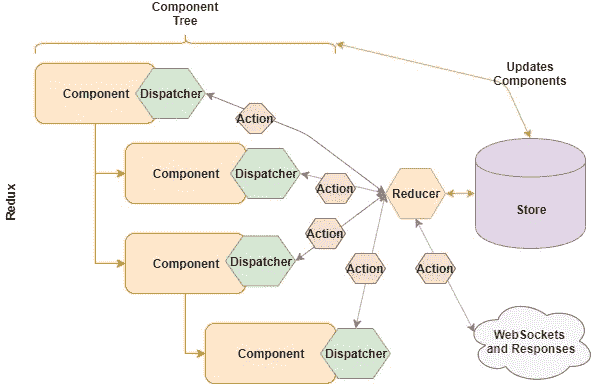
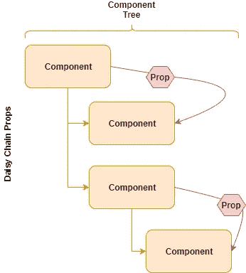
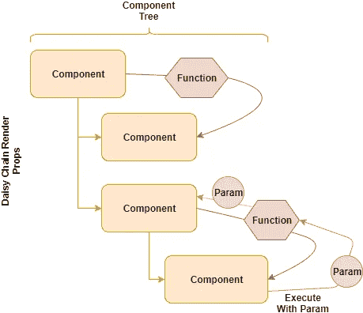
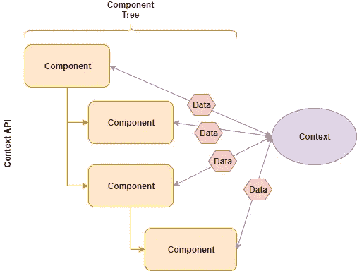
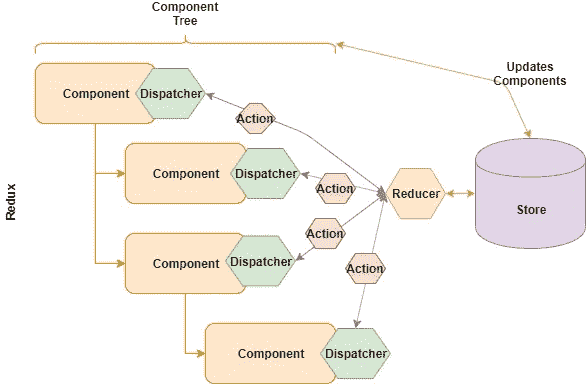

# React:状态管理的选项

> 原文：<https://betterprogramming.pub/react-state-of-the-state-e30e98abdb01>

## Flux，Redux，共享状态，集中存储



外观复杂的图表:)

[React](https://reactjs.org/) 是一个基于组件的前端库，基础很容易掌握。复杂的关键领域之一是状态管理。

状态表示程序中数据的处理方式。在 UI 中，这意味着业务数据和界面元素的条件。在 React 中，状态主要存在于两个地方:组件中或中央存储中。

有多种处理状态的技术，包括渲染道具、[上下文 API](https://reactjs.org/docs/context.html) 和 [Redux](https://redux.js.org/) 。大多数应用程序会混合使用多种选项。

# 纯组件和状态

可以在 React 中构建无状态的功能性组件:所谓的*纯*组件。在这种情况下，我们可以将组件视为中央集权国家的表现形式。

这个状态仍然存在于*的某个地方*。如果不在组件中，则在集中状态对象中，其信息反映在组件中。

# 组件状态

传统上，每个组件都可以有自己的状态，也就是说，变量代表它们保存的内容。在 OOP 中，这不仅仅是类比，而是完全等同于对象中的状态。

组件状态工作得很好，因为它封装了组件中的数据，所以在推理组件行为时，您可以主要考虑组件本身，而不需要参考外部参与者。

这是一个易于理解的状态流模型。

组件状态工作得很好，直到应用程序的 UI 变得足够复杂，组件必须交互和*共享数据。*

## 状态和道具

将数据从父组件传递到子组件有一个清晰的机制:您可以使用 *props。*道具是 React 的基本特征，很好地服务于目的。

将道具从父级菊花链到子级的想法类似于图 1。



图 1:菊花链道具

## “全局”根组件

在这个模型中，不同的视图(因为大型应用程序会将它们的视图分解成不同的根组件)是根组件，最终充当一个集中的状态存储。

然后，根父节点的状态将状态分发给子节点，这与我们稍后将看到的集中式状态选项类似。这就是从父母到孩子的沟通状态。

# 子到父

当你需要从孩子到父母的沟通时，第一个难题就出现了。

## 渲染道具

官方 [React 文档](https://reactjs.org/docs/render-props.html)已有*渲染道具*存在:

> “…将一个组件封装的状态或行为共享给需要相同状态的其他组件。”

渲染道具使用函数而不是具体的变量道具。(如果你对这个概念熟悉的话，它有点像 mixin。)

render prop 的本质是将一个函数传递给接收组件(即子组件)，然后在组件内部调用该函数。

这里的关键技巧是:您将一个函数从父节点传递给子节点，子节点调用它，从而使子节点能够通过满足该函数调用的任何参数将数据传递回父节点。

函数式编程的经典例子。

这里有一个 JS 摆弄的简单例子，这个例子来源于[非感官介绍 React](https://medium.com/@matthewcarltyson/react-in-7-minutes-a4fe81eb13ef) 中的例子——如果你已经知道 React 的基础知识，你就会明白，如果没有，花七分钟来达到速度。

所以，最重要的是:

```
{this.props.renderProp(‘Hello’)}
```

在调用函数的子组件中。请注意，我们将一个参数`hello`传回给了函数。是的，孩子和父母之间有交流的能力。

当然，在真实的应用程序中，您可以使用任何您想要的真实数据，包括子组件状态，作为传递回父组件的参数。

所以——我们有一个在渲染属性模式中将状态从子节点传递到父节点的解决方案。

## 想象一下

我们可以将渲染道具的概念形象化，如图 2 所示。



图 2:菊花链渲染道具

## 渲染道具的真实反映

这不仅为子-父通信提供了一个干净的机制，还支持创建可重用的组件(以及[更高阶的组件](https://reactjs.org/docs/higher-order-components.html)，或者返回组件的组件)。

但是在组件间通信方面，这是相当有限的。如果状态需要在多个或远处的组件之间共享，这就变得难以维持。

我们不想做的一件事是开始跨遥远的组件菊花链一堆渲染道具来实现状态共享。这是脆弱的，只是简单的丑陋。

# 上下文 API

处理共享状态的另一个候选是[上下文 API](https://reactjs.org/docs/context.html) 。

上下文 API 被明确设计为处理大量组件需要某种状态的情况。

在这种情况下，每个组件都可以访问上下文，而不是像 props 那样将组件关联在一起以共享状态。

这个概念如图 3 所示。



图 3:上下文 API

所以，这看起来更像是我们想要的处理复杂组件树的共享状态。

上下文 API 非常简单。要创建默认上下文:

```
const LanguageContext = React.createContext(‘english’);
```

然后，您可以修改根或低级组件中的值，如下所示:

```
class Parent extends React.Component {
  render() {
    return (
      <LanguageContext.Provider value="tibetan">
        <Child />
      </LanguageContext.Provider>
    );
  }
}
```

一旦低级组件将上下文引入树中，任何子组件都可以访问它，不管它们的嵌套有多深。

您可以像这样访问该值:

```
static lang = LanguageContext;
  render() {
    return <Button language={this.lang} />;
  }
```

(注意:这是较新的上下文 API)。

## 不废话

所以，这是一个非常干净和简单的方式来传递简单的数据。然而，它不能很好地扩展，也不能很好地处理动态数据。它更适合静态的简单数据类型。

您不希望试图管理复杂的数据结构，这些数据结构被 API 调用和上下文中的用户交互所修改。

要了解更多选项，让我们来看看备受关注的…

# Redux

Redux 从[通量](https://facebook.github.io/flux/)下降。通量是一个*想法*。

这个想法是，您创建一个集中的存储，然后以特定的方式控制对它的访问。在高层次上，这看起来类似于上下文 API 的工作方式。

改变 Redux 状态的核心限制是状态只能通过向商店提交一个*动作*来修改。(这类似于组件状态只能通过`setState()`修改的要求)。

动作定义了将要发生在状态上的一种离散的修改。一个*调度器*负责将动作发送到商店，在那里它被一个*缩减器*捕获，后者负责将动作应用到状态。

这本质上是一个基于事件的架构，类似于[命令](https://en.wikipedia.org/wiki/Command_pattern)设计模式(其中动作扮演命令的角色)。

我们可以看看图 4。



图 4: Redux

但是……为什么呢？

它做的一件事是克服了上下文 API 的限制。该存储能够处理复杂的数据结构，并将它们与复杂的视图相关联。它还可以通过 Redux 中间件与后端 API 进行交互。

但是我们再次问:“为什么它是这样构成的？”

首先，我想真正锤这个家，Redux 的发展有一个关键原因；它解决了一个*特定的*问题。

*Redux 解决了一个特定的问题:多参与者状态改变竞争条件*

它解决的问题是状态中的竞争条件被多个参与者修改。

通过强制向商店提交动作，您可以避免以下([经典、规范编码](https://en.wikipedia.org/wiki/Race_condition))问题:

*   组件 A 查看状态，得到一个值，比如:100。
*   组件 B 也看，也得到 100。
*   组件 A 通过增加 1 来修改该值，使其成为 101。
*   组件 B 现在通过增加 1 来修改*的*值，使其再次为 101。

其中该值应该以 102 结束。

现在，您可以看到，当多个组件竞争状态修改时，可能会出现这种竞争情况，但这实际上不太可能。更成问题的是到达 UI 的用户交互和 API 响应的交错。

然而，让我们再次强调这一点，当 WebSocket(或其他服务器推送)与用户动作直接竞争相同的状态时，真正的可重复问题出现了。

对于脸书来说，如果传说可信的话，这就是未读信息计数器。

无论如何，让我们为这个做一个数字，因为它确实是中心。图 5。


图 5:使用 WebSockets 的 Redux

这就是使用 Redux 的铁一般的理由:您正在处理竞争条件。

但是让我们先回顾一下。我们想避免一些严重的错误想法。

首先，除非万不得已，不要使用中央全局状态。如果满足您的需求，您希望封装您的组件状态并保持不变。

这一思路的第二点是:除非有充分的理由，否则不要使用复杂的中央存储来管理状态。

> "**最简单的解决方案**几乎总是最好的."—奥卡姆剃刀

然而，Redux 提供的一些好处可能会激励你。

## 容易推理

除了竞态条件之外，最引人注目的(IMHO)是您正在创建一个更容易理解和推理的应用程序状态的想法。

简而言之:所有的状态都集中在一个地方，所有可能的状态变化都在动作中明确列出，并在调度程序中说明。

这是一个有趣的想法。

我并不完全相信它，但是我认为它对于大规模应用是有意义的，只是有一些警告。

首先，你给管理状态的方式增加了复杂性，所以我们必须通过增加可理解性来克服这个问题。

另一方面，应用程序状态的复杂性(也可能是开发应用程序的团队的复杂性)应该值得采用。

我要赶紧补充一点，我认为大多数应用程序，*尤其是*敏捷、快速发展的新兴应用程序，应该避免(阅读:完全避免)处理 Redux 来管理状态的额外开销。

如果您正在使用它，请填写下面的空白:“我们正在使用 Redux 到 _ _ _ _ _ _ _ _ _ _ _ _ _ _ _ _ _ _ _ _”

现在，让我们看看 Redux 提供的其他一些好处:

*   可播放状态。
*   撤消历史记录。

可回放状态意味着您能够发送完整的应用程序状态用于调试目的，本质上是重新创建错误发生时的状态。

我的感觉是，作为一个想法，这可能听起来更好，而且比它在实践中的表现更好(当然，除非你有一大群开发人员来对付它)。

撤销历史依赖于这样一个事实，即您可以维护历史并恢复操作(就像我们前面提到的经典命令模式一样)。

最后，在面对集中式状态时，使用 Redux 还有一个更有说服力的理由:它很好理解，也很受欢迎。

等等，等等——我并不是说你应该用它，因为它很流行。我的意思是，它比许多人知道和理解它更受欢迎。

因此，您可以在对其有利的方面与增加的复杂性之间进行平衡，并奇怪地意识到实际上可能没有更简单、更干净的中央状态存储解决方案可以扔给 React。

# 钩住

现在，让我们考虑一个替代方案，使用本文中描述的*钩子*:使用 React 钩子 的 [*状态管理。*](https://medium.com/javascript-in-plain-english/state-management-with-react-hooks-no-redux-or-context-api-8b3035ceecf8)

这似乎是一个有趣的想法，然而，总的来说，我们又一次增加了复杂性，而不是减少它。

我认为这是作者进行的一个有价值的实验。也许他正在开发的 npm 包将会为我提供我正在寻找的东西，那就是…

# 金发姑娘

我仍然在 React 中寻找我的状态管理“恰到好处”的解决方案。

感觉应该有一个简单的机制存在于上下文 API 和 Redux 之间。它允许一个集中的状态，可以处理复杂的结构，并以最小的复杂度服务 API 交互。

## 哪里是国家最好的地方？

我想知道，在最后的分析中，是否有一个干净的集中状态或面向组件的状态，或者一个混合状态更好，更有意义，更容易理解和管理？

像软件中的大多数事情一样，这可能会成为一个问题，即具体的需求是什么。你在构建什么，有多复杂，团队有多大，有多少 API 交互，等等。