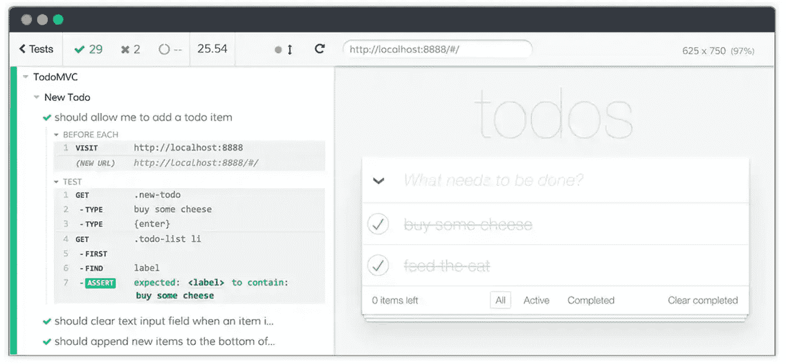
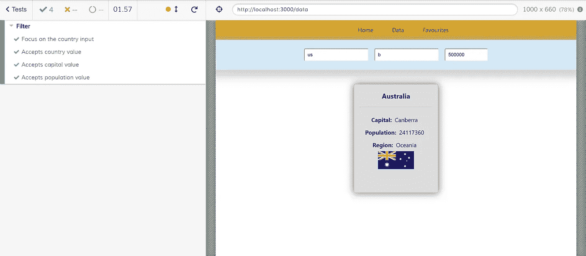

# React 测试:Cypress.io 入门

> 原文：<https://betterprogramming.pub/react-testing-get-started-with-cypress-io-a19b6eb6332a>

## 用最少的努力编写有意义的端到端测试


[毗湿奴·R·奈尔](https://unsplash.com/@vishnurnair?utm_source=medium&utm_medium=referral)在 [Unsplash](https://unsplash.com?utm_source=medium&utm_medium=referral) 上的照片。

开发人员讨厌编写测试。这需要时间，并且最终不会为客户提供额外的价值。此外，它往往是无聊的。

有了 Cypress，我发现了一个全新的测试视角。它更容易理解，更有效，也更有趣。

我将向您展示 Cypress 在 React 应用程序中的实现，您可以从[这个 Github repo](https://github.com/Dromediansk/countries-app-blog/tree/react-router-implementation) 中克隆它。我们的目标是测试应用程序的主要功能——这意味着编写导航链接、API 请求和过滤器功能的测试。

注意:如果你有兴趣从头开始构建整个应用程序，你可以从故事[开始用钩子构建 React 应用程序的一些最佳实践](https://medium.com/better-programming/some-best-practices-for-building-a-react-app-with-hooks-d6157494f5c1)。

# 关于赛普拉斯你应该知道什么

这是一个 E2E 测试工具，它简化了编写测试的过程。这些测试的目的是演练一个完整的类似生产的场景。这意味着我们能够模拟用户行为并涵盖所有需要的功能。

Cypress 有一个很好的 GUI，你可以看到单独的测试，以及它在你的应用程序中的样子。



Cypress 测试跑步者示例

以下是使用 Cypress 时的亮点:

*   测试易于阅读和编写(类似于简单英语)。
*   测试运行程序使用 web 浏览器，因此您可以实时看到测试了什么功能。
*   您可以在测试运行的同时开发您的应用程序。
*   可读的错误信息有助于快速调试。
*   [精心编制的文件](https://www.cypress.io/)。

# 安装 Cypress

现在，让我们把重点放在实际的部分。您可以使用以下命令克隆 Github repo[并安装 Cypress:](https://github.com/Dromediansk/countries-app-blog/tree/react-router-implementation)

```
npm install cypress --save-dev
```

过一会儿，它会在根目录下添加一个新的`cypress.json`文件和`cypress`文件夹。我们将在`cypress/integration/examples`存储我们所有的测试。

你可以用这个打开柏树:

```
./node_modules/.bin/cypress open
```

我知道，这是一个可怕的方式每次推出赛普拉斯。我会立刻忘记这个命令。幸运的是，您可以通过在`package.json`中添加以下 npm 脚本来简化它:

```
"scripts": {     
    "cypress": "cypress open"   
}
```

然后只需要`npm run cypress`就可以开柏树了。

# 告诉赛普拉斯访问网站

在我们编写测试之前，我们需要命令 Cypress 访问我们的网站。首先，让我们定义一下`cypress.json`中的`baseUrl`:

```
{
    "baseUrl": "http://localhost:3000"
}
```

`baseUrl`是用作`[cy.visit()](https://docs.cypress.io/api/commands/visit.html)`或`[cy.request()](https://docs.cypress.io/api/commands/request.html)`命令 URL 前缀的 URL。存储我们的基本 URL 是一个很好的实践，这样它在我们所有的测试中都是可访问的。

现在，我们可以告诉赛普拉斯访问网站。在`/cypress/integration/examples`中，我们可以创建一个新的规范文件，将其命名为`routeNavigation.spec.js`，并编写以下命令:

```
cy.visit("/");
```

Cypress 的所有功能都在全局`cy`对象下可用。试着运行这个测试看看结果。

# 测试导航链接

如果用户想使用我们的应用程序，导航链接是必须工作的核心功能之一。开始时编写简单的测试并了解语法也是合适的。

所以让我们在`routeNavigation.spec.js`中编写测试:

*   在第 2 行的`before()`中，我们可以实现在任何测试运行之前执行的代码——在我们的例子中是访问网站的默认路径。
*   `[cy.get()](https://docs.cypress.io/api/commands/get.html#Syntax)`用于选择合适的元素。我们正在搜索`a`元素，它是类`nav-list-item`的子类。
*   `eq(1)`代表选择第二个元素。计数从零开始。
*   我们正在模拟所选元素上的点击事件。
*   最后，使用`[cy.location](https://docs.cypress.io/api/commands/location.html#Syntax)`，我们检查`pathname`是否在地址栏中包含`/data`。
*   `timeout`是一个可选设置，您可以通过它来确定等待解决的时间。我很确定 99%的用户会在等待一分钟后离开网站。

以类似的方式，您可以为每一条其他的路线编写测试。你可以自己尝试，到处玩。

# 对 API 的测试请求

我们的目标是检查我们是否得到状态为 200 的响应，以及是否收到带有国家数据的响应。

一般来说，测试请求可以用`[cy.request()](https://docs.cypress.io/api/commands/request.html#Syntax)`方法来执行。

# 测试输入的焦点

该测试的目标是检查当用户访问页面时，按国家搜索的输入是否被聚焦。

首先，确认带有占位符`country`的输入已经在`AdvancedFilter.js`中设置了道具`autofocus`:

现在我们可以编写一个测试来检查它是否工作。因为我们正在测试另一个功能，所以让我们为此创建一个新文件，并将其命名为`filtering.spec.js`。

*   与前面的测试文件类似，我们首先告诉 Cypress 访问所需的路线。
*   在测试中，我们通过`name` prop 选择输入，并检查它是否在焦点上。

# 测试过滤器功能

我会考虑过滤我们应用程序的一个重要部分。如果它没有功能，应用程序的目的就失去了。因此，我们应该首先测试按国家搜索是否有效。

按国家测试搜索

该测试的目标是检查当用户输入一些文本(例如“us”)时，值是否会改变。在此之后，我们还期望过滤后的国家与值(8)相匹配。

当然，关于如何增强这个测试，有许多选项，所以可以随意尝试。此外，您可以自己为其他输入编写测试。

这是 GitHub repo 的最终版本。



最终版

# 最后的话

我希望你至少和我一样对柏树感到惊讶。这是一个非常棒的 E2E 测试工具，适用于各种技术——不仅仅是 React。它很快，测试很容易阅读，并且有很棒的文档。

然而，一个好的开发者应该学会*如何*和*在应用中测试什么*。如果你写的测试增加了代码覆盖率，但没有测试真正的功能，这只是浪费时间。

此外，如果你想做适当的测试，你必须学习相应的语法，匹配器等。，这当然需要更多的时间。因此，在开始花时间编写测试之前，明智的做法是考虑测试的整体范围。

感谢阅读！