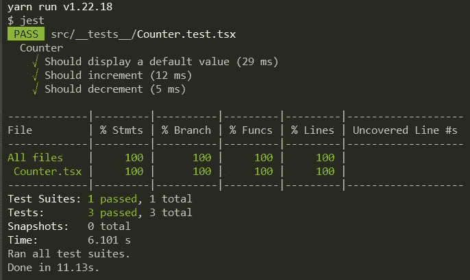

# 生产单元测试的反应测试库配置

> 原文：<https://betterprogramming.pub/react-testing-library-configuration-for-productive-unit-testing-5d0c446f3b3d>

## Redux 和 GraphQL 的一个例子

[Unsplash](https://unsplash.com/s/photos/disorder) 上 [sharonmccutcheon](https://unsplash.com/@sharonmccutcheon) 的照片

我经常加入一个新的 React 项目，那里缺少单元测试，无论是数量还是质量。有几个原因，但我今天想讨论的是糟糕的测试环境。

的确，测试需要技巧、彻底性，并且绝对是耗时的(即使那是值得的！).如果测试比必要的更痛苦，它就变成了避免编写测试的信号。

# 环境

对于 React，我推荐的工具是 Jest 和 React 测试库。这里没有什么花哨的；他们是社区中事实上的标准。

 [## React 测试:理解并选择正确的工具

### 通过选择适当的测试工具，使用 React 和 React Native 节省时间和精力。

morintd.medium.com](https://morintd.medium.com/react-testing-understand-and-chose-the-right-tools-858236d3c4e1) 

# 例子

为了演示如何在一个好的环境中编写好的测试，我们需要一个组件来测试，对吗？让我们使用一个常见的功能:计数器。

我将从下面的组件开始，在它自己的`Counter.tsx`文件中。

我想指定我的应用程序入口点仍然是 *App.tsx.* 它将在本文后面被修改以演示我们的配置*！*

# 试验

完整的资源库可以在 [GitHub](https://github.com/morintd/rtl-composable-providers) 上找到。

## 反应测试库

在遵循[介绍](https://testing-library.com/docs/react-testing-library/intro)并添加 [jest-dom](https://testing-library.com/docs/ecosystem-jest-dom/) 之后，我设置了我的测试的第一个版本，如下所示:

我们可以找到三个基本的测试。它们帮助我们验证我们已经显示了一个默认值，当相应的按钮被点击时，该值增加或减少。

使用当前的配置，我能够成功运行我的测试:

但是当处理更大的代码库、更多的功能和依赖性时，问题就出现了。在本文中，我将演示我们如何处理相当常见的 Redux 和 GraphQL。

## 添加 Redux

我在关注 [RTK 快速入门](https://redux-toolkit.js.org/tutorials/quick-start)，它方便地展示了一个带有计数器 app 的例子。我以下面的片段结束:

以下商店:

以及更新的`Counter.tsx`组件:

我的计数器的行为没有改变，但是测试失败，并显示以下错误消息:

> 找不到 react-redux 上下文值；请确保组件包装在<provider>中。</provider>

这很简单。我们试图隔离测试一个组件，但是它需要一个 react-redux 提供者来工作。我将它添加到我的`App.tsx`中，但是从我的测试角度来看，它无处可寻。

现在，对于每个测试，我们需要声明一个新的存储，并使用来自 react-redux 的提供者呈现我们的组件。从技术上讲，它可以与以下代码一起工作:

但是，这是正确的解决方案吗？那是许多不需要的样板代码。如果您有更多的依赖项，您的测试将呈指数增长。这使得它们很难编写和维护。

相反，React 测试库解释了如何设置一个[自定义渲染](https://testing-library.com/docs/react-testing-library/setup)。

 [## 设置|测试库

### React 测试库不需要使用任何配置。然而，有些事情你可以做，当…

testing-library.com](https://testing-library.com/docs/react-testing-library/setup#custom-render) 

## 设置改进

在完成定制渲染部分之后，我创建了一个包含`testing.tsx`文件的测试/目录:

我添加了一个`index.ts`文件，从我的测试/目录中重新导出所有东西，然后，我从这个目录中导入实用程序，而不是从`@testing-library/react`中导入我的 Redux 样板代码和实用程序:

那就好多了！但是，如果我们需要在测试期间触发对 Redux 存储的一些更改呢？此外，当我们的应用程序增长时，在我们的`testing.tsx`中增加几十个提供者会使它更难阅读和维护。

首先，我想让我的渲染更加可定制。如果你看一下`customRender` 方法，你可以看到它需要一些与 React 测试库相关的选项。

我们可以使用这些选项来定制我们的提供商。我将允许一个新的属性 providers，它是一个包含与我们的提供者相关的数据的对象。目前，需要采取以下措施:

实现如下所示:

看起来不错，我甚至会加入一个 helpers 函数来构建一个商店:

这样，我能够编写一个更高级的测试:

那看起来相当不错！但是我们仍然有一个问题:`testing.tsx`文件将会变得不可维护。

相反，我想将提供者的声明移动到不同的文件中，并动态构建函数`allTheProviders`。还有，构建它有一个很棒的模式:函数组合！

 [## 举例说明 JavaScript 中的函数组合

### 函数式编程:函数组合是在执行长代码时保持代码整洁、可读的一种极好的方式。

javascript.plainenglish.io](https://javascript.plainenglish.io/a-working-example-of-function-composition-in-javascript-5e8c704a13ca) 

让我解释一下。我没有创建一个庞大的函数，而是为我想添加的每个提供者创建一个。这些新函数接受选项、一个 React 节点，并返回一个 React 节点(可能有一个新的提供者)。

对于 Redux，这个函数看起来像这样:

如果它们具有这种结构，我可以将它们链接起来，或者换句话说，将它们组合起来，以构建一个具有多个提供者的组件。如果我将我的提供者列表、致力于组合它们的函数以及函数`AllTheProviders`分开，看起来如下:

就是这样！这样，我们可以在不同的文件中声明新的(可组合的)提供者函数，并将它们添加到我们的列表中。

## 添加 GraphQL

让我们通过添加 GraphQL 来改进我们的演示。我们将添加加载和保存当前计数器的功能。

我的模式和解析器如下所示:

在[服务器](https://www.apollographql.com/docs/apollo-server/getting-started)和[前端](https://www.apollographql.com/docs/react/get-started)上设置了 Apollo 之后，我向我的计数器添加了两个查询:

然后，我更新了我的 Redux 片，并添加了两个按钮来保存和加载当前计数器:

但是现在，就像 Redux 一样，我们的测试抛出了一个错误:

> 固定冲突:在上下文中找不到“客户端”或作为选项传入。将根组件包装在<apolloprovider>中，或者通过选项传递一个 ApolloClient 实例。</apolloprovider>

让我们遵循阿波罗的[测试部分](https://www.apollographql.com/docs/react/development-testing/testing/)，并将其集成到我们的自定义渲染中。我们可以从为 GraphQL 模拟添加一个选项开始，并为 apollo 创建一个可组合的测试提供程序:

然后，我们可以将这个可组合的提供者添加到我们的`providers`中。请记住，`providers`的顺序会影响我们如何添加提供商。

这与函数合成的工作原理有关。列表中最左边的是内层的`providers`，而最右边的是外层的`providers`。

然后，我能够编写下面的测试:

就是这样！您现在能够在健康的环境中编写适当的测试了。此外，当您的应用程序变大时，您不会有任何问题，只要您继续创建可组合的测试提供者。

不要忘了在 [GitHub](https://github.com/morintd/rtl-composable-providers) 上有一个完整的资源库。

感谢阅读。