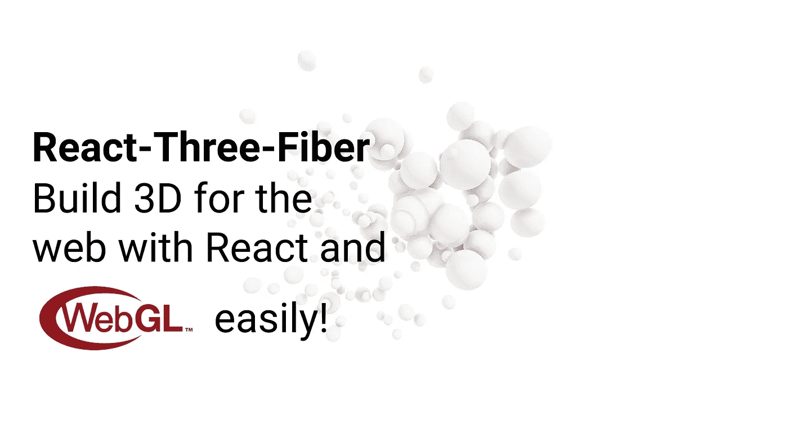

# React-Three-Fiber:使用 React 和 WebGL 轻松构建 3D 网络

> 原文：<https://betterprogramming.pub/react-three-fiber-build-3d-for-the-web-with-react-and-webgl-easily-c0df8801292>

## 直接编写 three.js 交互来与组件进行反应，并清除范围和道具



# 什么是反应三纤维？

React-Three-Fiber 或 R3F 是一个强大的 React 渲染器，用于 web 和 React Native 场景。

## 我为什么要用它？

帮助您提高场景的创建速度。有了 R3F，您将花更少的时间做无聊的事情，花更多的时间定义定制组件，R3F 将为您做所有这些:

*   创建画布
*   绑定事件
*   创建`Three.js`对象
*   开始渲染循环

# 我为什么要用它？

## **基于组件的场景**

3JS 允许我们以一种`declarative`的方式编写`three.js`对象。这意味着我们可以利用`props`、`states`和`hooks`构建场景，创建可重用的 React 组件。

## **内置助手**

它带有一些有用的功能，如`raycaster`，在每个`mesh`上，它可以让你访问所有有用的指针事件，如`onClick`、`onPointerOver`、`onPointerOut`等。

## **挂钩**

它有很多钩子，比如`useFrame`或`useThree`，从中我们可以得到`renderer`、`scene`、`camera`等有用的对象。

## **无依赖性**

因为它“只是”一个渲染器，它不依赖于`three.js`版本，所以你可以自由选择你的[首选版本](https://github.com/mrdoob/three.js/releases)。

## **仅在需要时重新渲染**

它像任何 React 组件一样工作，根据依赖关系的变化(状态、存储等)更新自身。

# 装置

用 [npm](https://www.npmjs.com/) 安装:

`npm install three react-three-fiber`

用[纱线](https://yarnpkg.com/)安装:

`yarn add three react-three-fiber`

你只需要添加三个(三个-js)和这个伟大的模块，没有其他依赖，它只有 [33kB](https://bundlephobia.com/result?p=react-three-fiber@4.0.14) ！

# 我如何使用它？

只需使用`Canvas`组件创建一个`three-js`画布——这将占用其容器的整个高度和宽度。

然后，在`Canvas`节点中，您将能够添加所有的动态组件——比如 react 组件的嵌套层次结构以及自定义组件。在本例中，我们创建了一个带有一些定制行为的`Box`组件。

我们使用`useRef`来访问`cube`的网格。在它被`three-js`初始化后，在内部，`canvas`能够保持与它的连接，当鼠标或触摸悬停在它上面时，改变它的比例或方向。

如果你向下滚动查看`Canvas`，你会看到`three-js`的其他官方组件，如`[ambientLight](https://threejs.org/docs/#api/en/lights/AmbientLight)`和`[pointLight](https://threejs.org/docs/#api/en/lights/PointLight)`。

```
<Canvas><ambientLight /><pointLight position={[10, 10, 10]} /><Box position={[-1.2, 0, 0]} /><Box position={[1.2, 0, 0]} /></Canvas>
```

总而言之，如果你想开始使用这个伟大的库来添加更多的 3D，你只需要使用 Fiber 中的这些函数/钩子:

```
import { Canvas, useFrame } from 'react-three-fiber'
```

如果你喜欢这个库，我建议你在这里开始寻找一个更基础的关于三 js 和 WebGL 世界的介绍:[https://threejsfundamentals.org/](https://threejsfundamentals.org/)。

如果你想了解更多光纤的功能，你可以阅读更多官方文档。

# 你对这个图书馆有什么看法？

还有其他的高级库，比如 A-FRAME，它们在网络上用 3D 元素构建类似的体验和页面。

但是 R3F 的*真正的* 威力是能够访问`three-js`的底层 API，帮助你更加熟悉这个不可思议的 WebGL 库。它还帮助您保持组件的清晰定义的层次结构，以便全面重用。

# code sandbox React-三纤维游乐场

# 如果你想了解更多关于钩子的知识

当我开始使用钩子时，我亲自阅读了《学习反应钩子》**,它帮助我理解了它们如何使用工具，如 **useFrame 或画布钩子**:[https://amzn.to/2Y8hoX9](https://amzn.to/2Y8hoX9)**

# **参考资料和资源**

*   **[GitHub](https://github.com/react-spring/react-three-fiber)**
*   **[捆绑恐惧症](https://bundlephobia.com/result?p=react-three-fiber@4.0.14)**
*   **[CodeSandbox](https://codesandbox.io/s/react-three-fiber-medium-86hx3)**