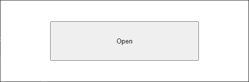
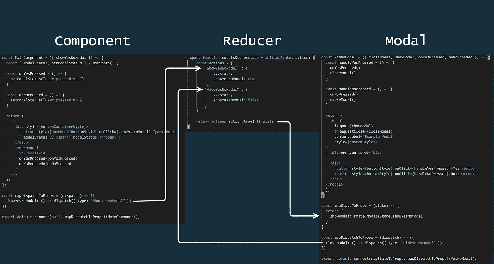

# React:使用 Redux 控制模态可见性状态

> 原文：<https://betterprogramming.pub/react-use-redux-to-control-modal-visibility-states-8953e44b71fd>

## 轻松管理对话框的打开和关闭状态


由 [Ferenc Almasi](https://unsplash.com/@flowforfrank?utm_source=medium&utm_medium=referral) 在 [Unsplash](https://unsplash.com?utm_source=medium&utm_medium=referral) 上拍摄的照片。

模态是位于应用程序主窗口之上的 UI 元素，帮助用户在不中断当前交互流的情况下做出决策。它们还可以为用户触发的操作提供反馈，并在不改变应用程序当前路径/页面的情况下呈现一些内容。

在本文中，我将介绍如何在 React 中使用 [Redux](https://redux.js.org/) 来控制模态是否可见。首先，让我们浏览一下应用程序示例，然后转到使用 Redux 的方法，以便节省我们大量的时间，并减少我们组件中大量的代码。

# 应用程序

我们将使用的应用程序是一个简单的按钮，它打开一个要求用户按“是”或“否”的模式:



应用示例

在这种方法中，我们使用直接在`MainComponent`中定义的`isOpen`属性来控制模态可见性。如果`IsOpen`道具是`true`，会显示模态。否则，它将被隐藏。

如果我们只在一个组件中使用这个模型，这种方法完全没有问题。如果我们试图在其他组件中使用这种模态，这就是`YesNoModal`的情况，这种方法会导致大量的代码重复。

每次我们使用这个模态，我们将不得不复制所有控制模态打开状态的代码。使用该模态的每个组件都必须通过定义`IsOpen`属性来控制状态。

如果我们可以调用一些动作来显示/隐藏这个模态并集中它的状态控制会怎么样？让我们使用 Redux。

# Redux 如何工作

全局管理状态可能非常复杂。Redux 帮助我们更好地处理状态管理。简而言之，Redux 是一个允许我们集中 React 应用程序的状态/逻辑的工具。这是个好消息，因为我们不想将模态状态控制委托给每个需要它的组件。

在我们深入使用 Redux 的例子之前，我想简单解释一下我认为 Redux 的三个主要支柱:动作、reducers 和存储。

动作是我们的组件将调用的事件，以让应用程序的其余部分知道我们想要更新一些状态。在我们的例子中，将调用一些动作，告诉我们的状态我们需要显示/隐藏`YesNoModal`。

Reducers 是纯函数，它将接收一个初始状态和一个动作，基于这个动作执行一个逻辑，并返回一个新状态。

最后但同样重要的是，存储是存储应用程序整体全局状态的机制。我们通过调用我们的动作来更新这个状态，并在 reducers 中处理它们。

很难用几行文字解释 Redux 是如何工作的，但我向你保证，当我们看到一些代码时，它会变得清晰很多。

# **安装 Redux**

让我们从安装 Redux 开始:

```
npm install redux -s
```

除了 Redux 本身，让我们也安装 react-redux，react 的一个官方绑定，它帮助我们的组件知道全局状态何时改变，并根据这种改变重新呈现它:

```
npm install redux-react -s
```

# 模态减速器

`modalsReducer`是我们根据组件触发的动作执行一些逻辑的地方。在这个例子中，我们只有一个模态，但是我们可以使用这个缩减器来管理任意多的模态。

缩减器由一个初始状态对象和一个函数组成，当我们需要对状态进行一些更新时，这个函数将被调用。`modalsStore`函数接收状态和动作作为参数。这个动作告诉我们应该在我们的状态中做什么改变。

如果动作的类型是`ShowYesNoModal`，我们返回一个新的状态，将`showYesNoModal`的值设置为`true`，表明我们想要显示模态。一旦模态打开，我们可以通过调度类型为`HideYesNoModal`的动作来关闭它，用属性`showYesNoModal = false`返回一个新的状态。

为了将这个减速器连接到我们的组件，我们需要对`index.js`文件进行一些更改:

基本上，我们通过用`Provider`组件包装我们的应用程序来创建商店并将其连接到我们的组件。我们的组件现在可以分派动作和订阅状态变化。注意，我们可以组合几个减速器。在这个例子中，我们只有`modalReducer`，但是我们可以有`notificationReducer`、`alertReducer`等等。

现在我们可以连接我们的`MainComponent` 并开始分派动作以显示`YesNoModal`:

现在我们在`MainComponent`中不再有模态打开状态。我们已经成功地移除了`MainComponent`管理模态状态的职责。相反，我们通过 props 接收函数`showYesNoModal`，当模态应该打开时，它将被调用。

但是这个`showYesNoModal`函数从何而来？当我们在第 36 行将`mapDispatchtoProps`连接到我们的组件时，这个函数被传递给 props。基本上，我们正在调度一个类型为`ShowYesNoModal`的动作，它将被我们的 reducer 捕获并触发一个状态变化。

现在我们只需要订阅`YesNoModal`本身的状态变化，以显示模态:

当我们将状态映射到 props(第 33 行)时，我们基本上只是订阅全局存储中的任何状态变化。`mapStateToProps` 函数接收全局状态对象，并将其映射到另一个包含管理模态可见性的属性的对象。

除了`showModal`属性，组件还接收了一个名为`closeModal`的函数。一旦被调用，它将分派一个类型为`HideYesNoModal`的动作，该动作将被我们的 reducer 捕获并更新状态，将控制模态可见性的属性设置为`false`。



调度/状态更新流程

就是这样:我们现在通过使用 Redux 管理的全局状态来控制我们的模态。此时，您可能会问自己，“如果我最终编写了更多代码来实现基本相同的结果，我为什么要使用 Redux？”

在上面的例子中，我们只有一个模态。如果我们有几个其他的模态呢？每当我们在组件中直接需要模态状态时，我们会想要管理它吗？大概不会。

一旦我们编写了第一个 reducer 并将其连接到应用程序的其余部分，实现新的 reducer 将非常简单。我们只需要将它们导入到我们的`index.js`文件中，并在创建商店时组合它们。

最后，我想分享一个真实世界的减速器，这是我很久以前在我的一个项目中实现的。这正是我们在本文中讨论的内容:

这个示例的重点是处理模态，但是我们可以将这种方法扩展到许多需要在整个应用程序中共享这种状态控制的挑战，比如警报、通知、身份验证等。

各位，今天就到这里。希望这篇文章对你有所帮助。

保重，编码愉快！

GitHub 上的[提供了源代码。](https://github.com/brunneus/react-redux-modal)