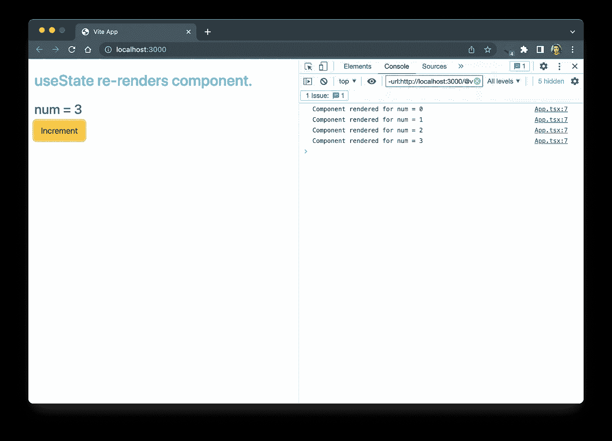
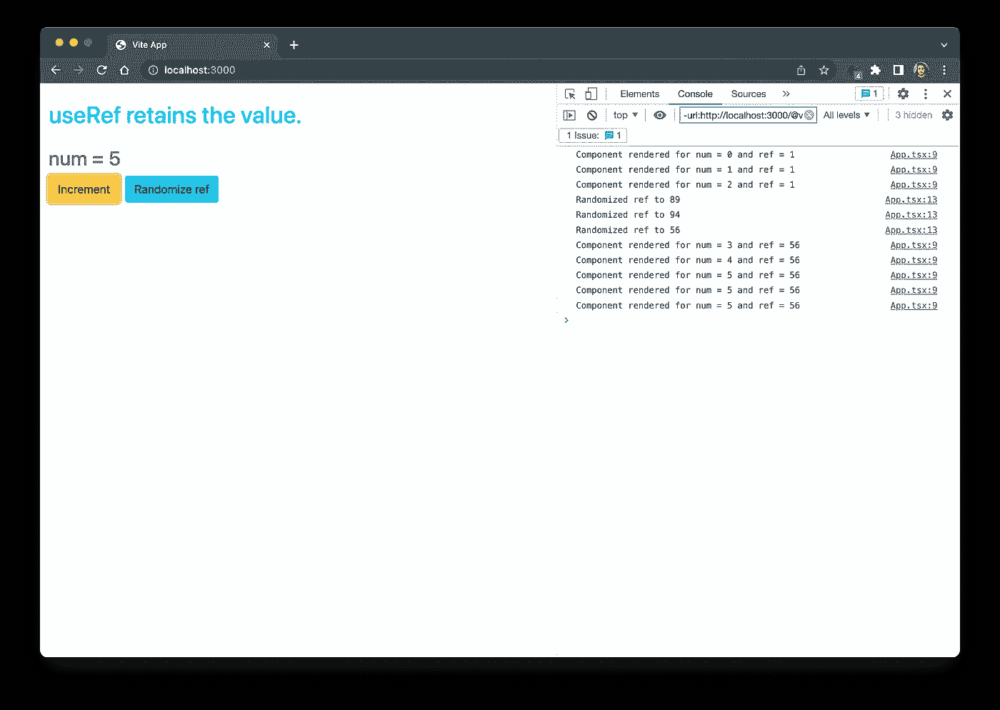
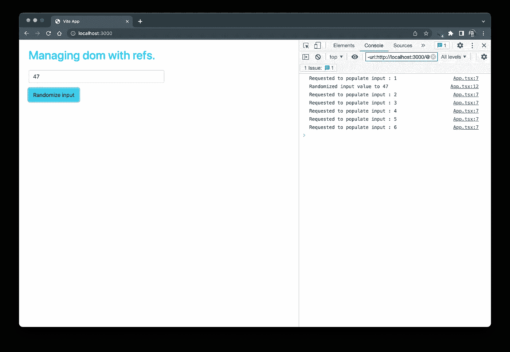
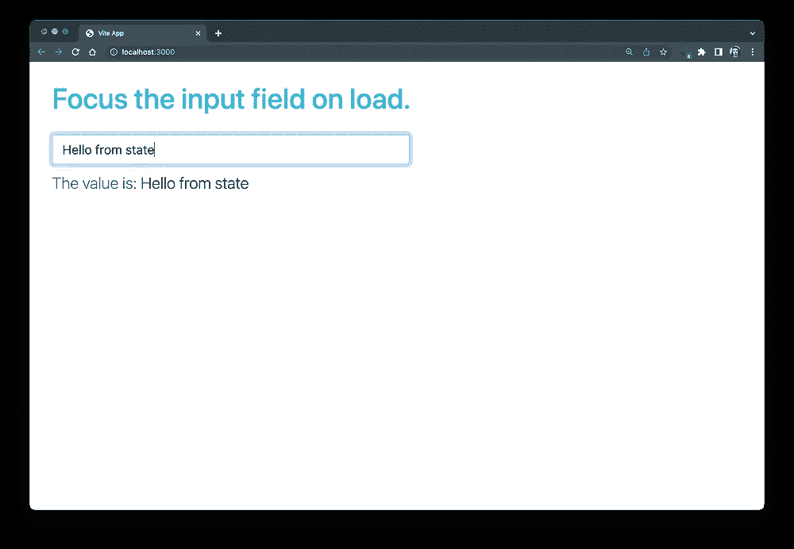
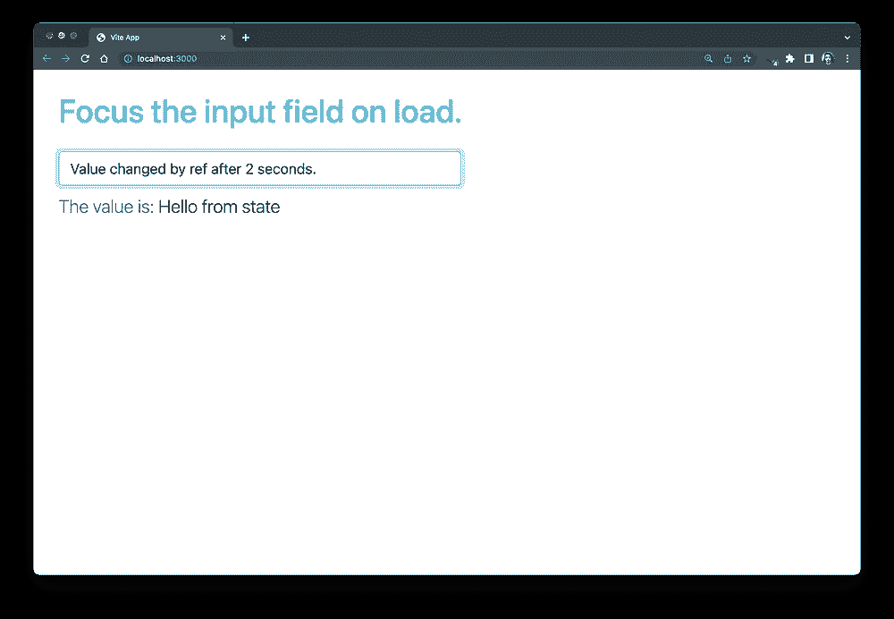

# React v18: useRef —什么，什么时候，为什么？

> 原文：<https://betterprogramming.pub/react-v18-demystifying-useref-forwardref-and-useimperativehandle-feec2fc5b2f6>

## 第 1 部分:驯服 React 的必要之恶— **useRef**


React useRef、forwardRef 和 useImperativeHandle

值和引用的概念对任何程序员来说都不陌生。顾名思义，值是数据在某个时间点的简单快照。为了唤起你对后者的记忆，引用是指向一些数据的指针，这些数据可能会随着时间的推移而改变，但引用本身保持不变。把它想象成一个房子的地址；地址总是保持不变，尽管房子可能会随着时间的推移翻新成一个新的。

React 高度推荐从 UI = function(state)的角度来思考。这种简化可能可以处理 99%我们习惯于用传统的基于 DOM 的范例做的事情，但是最后的 1%需要一些管道。

React 团队以引用的形式为这种情况留下了一个出口。依我看，refs 是一个必要的恶魔，它帮助我们解决 React 本身由于其数据驱动的设计理念而无法提供解决方案的问题。

因为 refs 很难理解。我们将分别讨论标题中提到的三个方面。对于第 1 部分，我们将了解什么是 React 引用，以及如何使用最基本的 useRef 钩子。在接下来的部分，我们将讨论更复杂的例子和用例。

# **useRef**

从使用 React 提供的`useRef`钩子的最基本实现开始。让我们考虑这样一种情况，它不需要花哨的 DOM 闩锁，只需要一个简单的数字来引用 React 的状态系统之外的内容。我们的应用程序将是一个超级简单的计数器应用程序。

组件在更新包含在 React 状态中的数据时重新呈现。



组件在更新包含在 React 状态中的数据时重新呈现。

从控制台日志中推断出我们的组件对 num 值的每一次更改都要重新呈现，这并不是什么复杂的科学，在复杂的生产应用程序中，这可能是一场噩梦。

让我们尝试将 ref 引入图片，看看它的表现如何。我们将在这里引入一个数字，它不应该在重新渲染之间改变，而且，如果它的值改变，也不应该导致重新渲染。

React refs 跨组件重新呈现器保存数据，并且在更新时不会导致重新呈现。



React refs 跨组件重新渲染保存数据，并且在更新时不会导致重新渲染。

正如我们从这个例子中看到的，我们的应用程序可以保留存储在 ref 变量中的随机值，即使组件由于单击 increment 按钮而重新呈现。从这个实验中得到的关键是，引用的值在这里是独立于组件生命周期的。

让我们来看一个更实际的例子，在这个例子中，我们将看到实际应用中使用的基准电压源。在本例中，我们有一个 HTML 输入元素，我们想看看它是否为空。如果是，那么我们在那里放一些随机值。

React 相信单向受控组件策略，即输入应该与某个状态相关联，并且我们在输入中看到的内容应该仅通过链接状态的变化来生成。在我们的案例中，没有任何州与此相关联。我们也不想像过去的学校方式一样，用`id`和`document.getElementById`开始，从而大发雷霆。

我们可以做的是使用一个引用作为指向这个 DOM 元素的指针，并在 reactor 中控制它的值。让我们看看下面的代码:

Refs 帮助我们连接到页面上的任何 DOM 元素，并以官方方式与它们交互。



Refs 帮助我们控制页面上的任何 DOM 元素，并在反应方式之外与它交互。

从上面的演示中，我们可以看到输入是第一次自己填充的，而且也没有直接访问真正的 DOM API。我们的`inputRef`充当了一个指向输入 DOM 元素的指针，使用它我们可以直接管理它的属性，绕过反应的状态系统。

通常不鼓励使用 refs 管理表单，因为它会扼杀使用像 reactor 这样的状态驱动库的全部理由。

让我们看看更适合使用反应参考文献的东西。想象一下，我们加载了一个表单，我们希望自动将焦点转移到一个输入字段，以获得 UX 核仁巧克力饼分数。我们可以以上述应用程序为例，使用 refs 将输入字段集中在 load 上。这是一个很受欢迎的功能，可以形成负载，你知道从哪里开始。在黄金时代，这也可以打开你的移动键盘，但现在因为安全和用户偏好而被屏蔽了。

使用反应参考聚焦输入字段。


使用反应参考聚焦输入字段。

# 黑暗面

如果这样强大的东西呈现给程序员，他们怎么能不滥用它呢？但是，仅仅因为我们有大量的降落伞，并不意味着每天都是跳伞日。ref 用于需要直接 dom 的情况，如上面的示例。第一个反例也可以通过使用`useMemo`钩子缓存来处理。

React 警告我们不要在虚拟 DOM 系统中直接访问 DOM。最大的问题是可预测性。如果某个东西没有正确通知 reactor 就直接更改了 DOM 元素，那么 reactor 中的单向数据模型将不会响应。

在我们的例子中，如果我们做一个小的超时触发，将直接改变数据，我们将失去对我们为受控改变定义的其他组件的通知。我们可以看到，在 ref 更改值后，下部段落标记中的消息没有更新。



通过使用 ref 在 2 秒的超时时间内直接更新的值破坏了我们的应用程序。

# 结论

我们已经看了足够多的例子来理解裁判如何帮助我们，以及我们应该注意什么。在下一部分中，我们将研究一些更复杂的用例，对于需要跨组件通信并将引用传递给其他组件的大型应用程序来说，这些用例可能会很方便。

> 第二部分在这里:[https://medium.com/p/89cce42b3309](https://medium.com/p/89cce42b3309)

```
**Want To Connect?**LinkedIn: [https://www.linkedin.com/in/sameerkumar1612](https://www.linkedin.com/in/sameerkumar1612/)
```