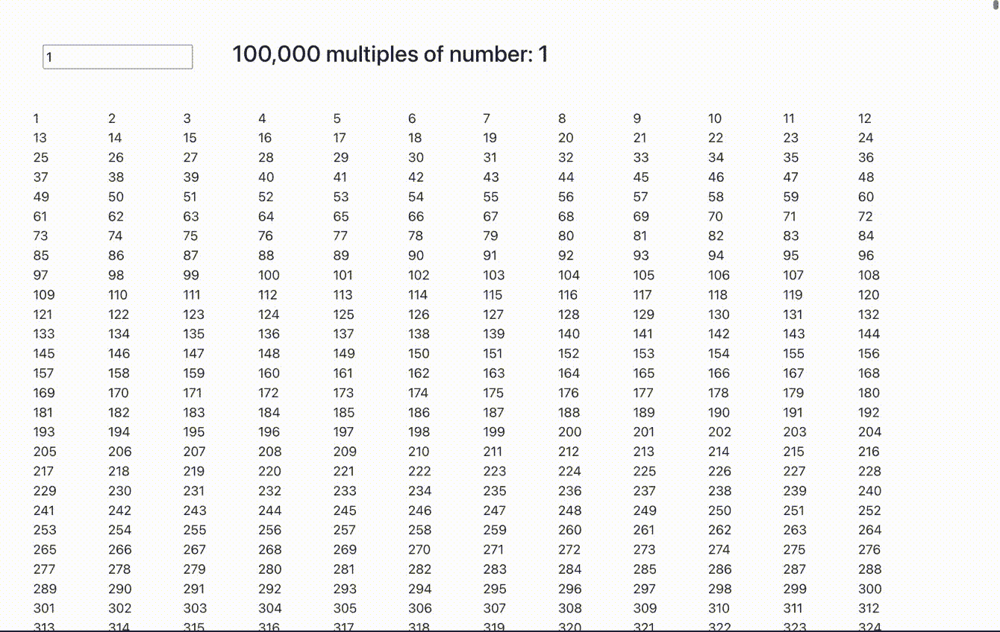

# React v18:先看一下 use transition hook——等等，但是为什么？

> 原文：<https://betterprogramming.pub/react-v18-usetransition-hook-why-f5d8880dc64d>

## 这个挂钩不是我们在日常工作中需要用到的东西，但对于用户端性能调优来说，它是一种受欢迎的方法。


在 react 中使用转换挂钩

React v18 引入了`useTransition`钩子，它看起来就像是另一个钩子，但是让我们看看它的用途以及它为未来打下的基础。

很久以前，React 暗示了并发模式的概念，其实现本身就是一个谜。然而，我们的目标是在复杂应用程序中缓慢的密集型操作和急需的更快的 UI 交互之间划一条线。

作为一名新生，我遇到的一个实际问题是在构建一个搜索组件时，该组件用于在每次按键时从后端获取推荐。我用去抖机制重构了它，以避免过多地触及后端。

简而言之，去抖意味着，你只在固定的时间间隔内执行某个动作。在我的例子中，按键 2 秒钟后点击 API，如果当时注册了另一个按键，则取消正在进行的 API 调用。

如果我们反思，那么我们可以理解，解决方案是将繁重的 API 操作从搜索框的主要输入流程中移出。如果它是连续的，在输入框中输入会感觉很慢。

从概念上讲，react 用这个钩子做了同样的事情。它允许您将繁重的逻辑从主流程转移到独立于输入流程的`startTransition`方法中。这导致将工作分成高优先级和低优先级队列。

这是一种“明显”的性能提升，不应该与 react 端的应用程序自动优化相混淆。加速是为了终端用户的体验，而反应完成的工作量是一样的。

请注意，它没有跳过中间的任何操作，也就是说，在渲染时根据输入的状态计算 UI，它只是改变了渲染倍数表和输入过程的优先级。

现在让我们来看看它的运行情况。在我们的演示应用程序中，我们将打印输入数字的 100，000 倍。这个计算是一个相当繁重的操作，会降低我们的应用程序的速度。



输入体验滞后。

将`useTransition`挂钩用于生成倍数。

它提供了一个布尔标志来知道流程是否完成，并提供了一个`startTranistion`函数来包装密集的流程。


setTransition 挂钩版本

要注意的关键点是输入和倍数表之间呈现的分离。

# 结论

我举的这个例子可能对演示这个钩子的用法有点夸张，但是请分享一下你觉得哪个地方更合适。这个挂钩不是我们在日常工作中需要用到的东西，但对于用户端性能调优来说，它是一种受欢迎的方法。

完全有可能在不使用这个钩子的情况下复制这种行为，但是在 React 中看到任务优先级表明并发性的良好进展，并且可以帮助开发人员构建更精细的 UX。

```
**Want to Connect?**🏭 LinkedIn: [https://www.linkedin.com/in/sameerkumar1612](https://www.linkedin.com/in/sameerkumar1612/)
```