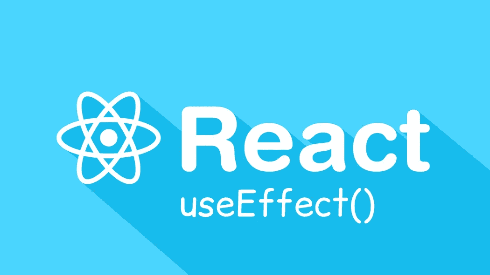
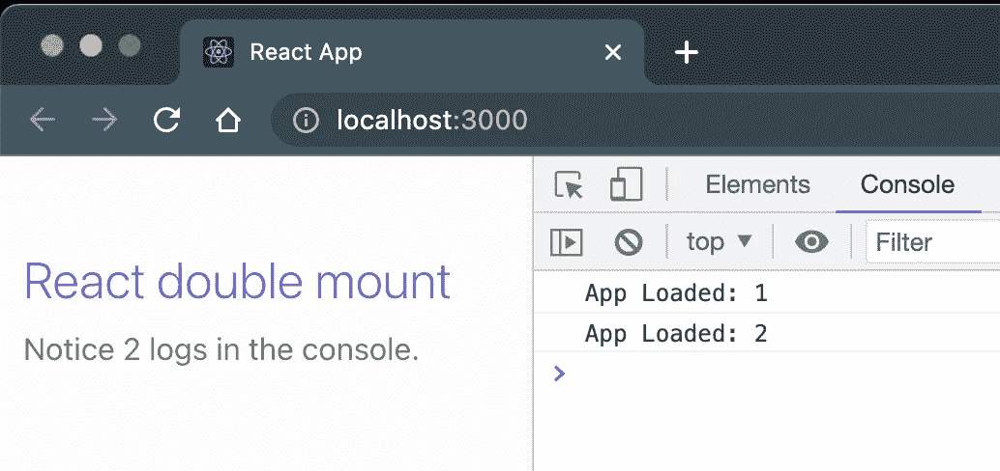
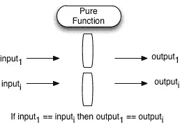
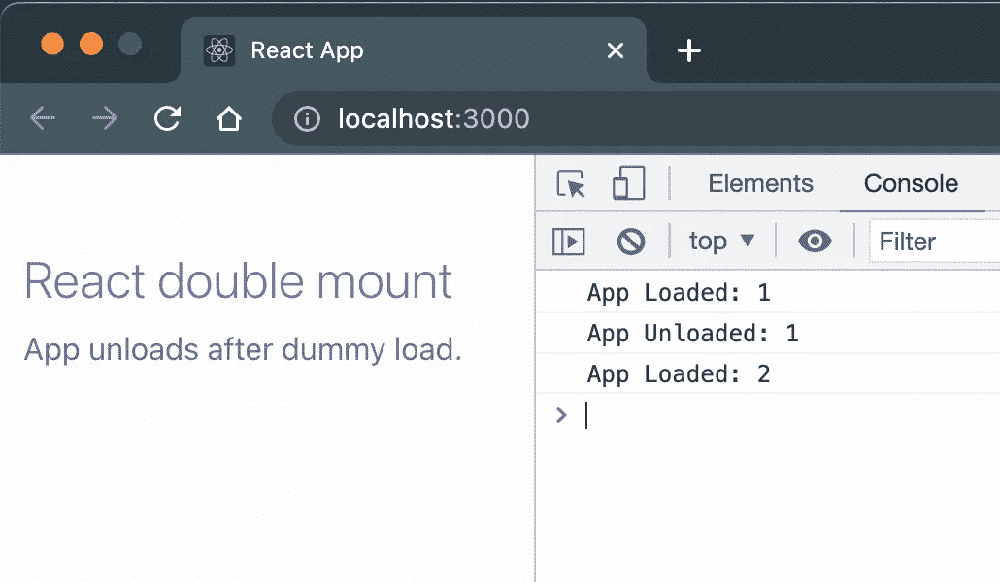

# React v18:为什么 useEffect 突然疯了？

> 原文：<https://betterprogramming.pub/react-v18-why-useeffect-suddenly-go-crazy-db1b42eb2730>

## **双挂载在 react useEffect()钩子上**



**双挂载在 react useEffect()钩子上**

React 版本 18 为核心带来了一些非常明显的变化。其中一个苦乐参半的变化是以严格模式加载组件的**挂载- >卸载- >重新挂载**模式。如果您还没有亲身体验过，请做好准备，因为乍一看，这似乎是您快乐工作的应用程序中的某种黑魔法。我们潜水吧。

# 问题

让我们以这个相当简单的代码为例。从`useEffect`中的空依赖数组来判断，我们可以期望“应用程序加载”在我们的控制台中打印一次，然后就完成了。

如果你对这个`[**console.count**](https://sameer-kumar-1612.medium.com/console-log-and-his-ninja-pals-4fc0863ad5f4)`方法的用法感到困惑，请阅读这里:[牛逼的控制台方法](https://sameer-kumar-1612.medium.com/console-log-and-his-ninja-pals-4fc0863ad5f4)。

在不带清理功能的 react 中使用 Effect 挂钩。

令人惊讶的是，我们看到这条消息被打印了两次。这就提出了一个问题，是我们做错了什么，还是 React 今天喝醉了？



**双控制台登录 react useEffect。**

# 背景

为了理解这一切，让我们首先讨论纯函数和幂等性的概念。下图不言自明，我们可以看到，在相同的条件下，一个函数应该产生相同的输出。然而，幂等性意味着即使一个函数运行多次，结果应该是相同的。



**纯函数**

你一定想知道这和我们手头的 react 问题有什么关系。举一个实际的例子，我们打算订阅来自某个服务器的通知流，我们保持它的使用效果，希望它在用户打开我们的网站时订阅，为此使用空的依赖数组。但是，正如在我们的小演示中所确定的，在 useEffect 中编写的代码运行了两次，因此我们的订阅也运行了两次。可能的结果有:

*   根据组件呈现的次数，我们会显示两个或更多的通知。*【应用级纯行为不再出现，有时显示 1 个通知，有时显示 83 个。】*
*   我们的订阅服务器可能会抛出一个错误:“您已经订阅了”。*【等幂在角落里哭。】*

# 解决办法

今天的数学已经讲得够多了，让我们来看看解决办法。“修复”本质上是坚持最佳实践。我找了很多网上资源，建议用自定义钩子代替`useEffect`用 ref 什么的黑掉。

框架往往通过抽象决策让我们的生活变得更容易，我们发起了全面的战斗来寻找溜出去的方法。Effect 总是提供一个清理功能，该功能应该用于清理在效果运行期间所做的工作。

在我们假设的例子中，它可以用于取消订阅。看我们之前的例子，应该是这样的:

在与清理函数反应中使用有效挂钩，



**挂载—卸载—挂载**

# 结论

react 团队决定将严格模式引入这些挂钩，以便在开发阶段建立最佳编程实践。就像我们的`useEffect`的情况一样，这种双重安装使我们避免了许多看不见的问题，这些问题可能会在以后的生产中出现，就像我们在订阅示例中看到的那样。

另外，请注意，React 在实际的生产构建中不执行这种挂载—卸载—挂载循环，它是一种开发模式特性，通过使用`index.tsx`中的`[StrictMode](https://reactjs.org/docs/strict-mode.html)`标记来提供，唯一目的是实施最佳实践。

react 中的 StrictMode。

```
**Want To Connect?**🏭 LinkedIn: [https://www.linkedin.com/in/sameerkumar1612](https://www.linkedin.com/in/sameerkumar1612/)
```