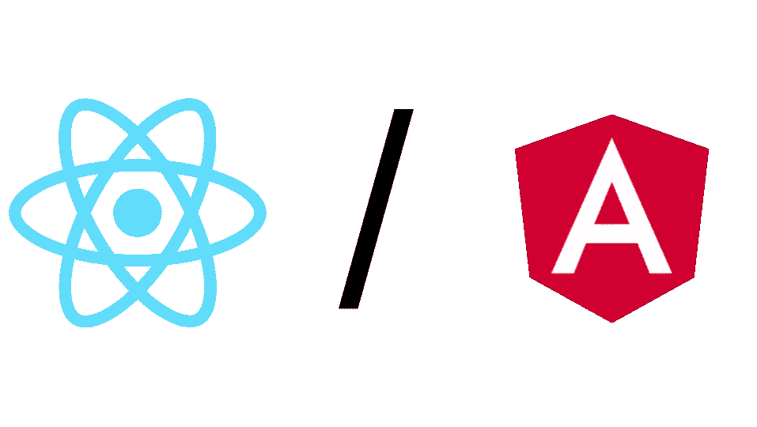

# 反应与角度:2020 年版

> 原文：<https://betterprogramming.pub/react-vs-angular-the-2020-edition-1e558f280cb8>

## 有些东西变了，有些东西进化了。有什么最新消息吗？

作者照片。

前端框架的数量之多会让你大吃一惊。有各种各样的框架:反应式、声明式、函数式、MVC、MVVM、OOP 等等。但最受欢迎的还是[反应型](https://reactjs.org/)和[棱角型](https://angular.io/)。截至 2020 年，他们有哪些不同？

# 什么是反应？

React 是一个由脸书开发并开源的 UI 库。我在强调这里是图书馆的事实。稍后我会解释为什么这很重要。

React 是目前最流行的 UI 库，它为数千个网站提供支持。React 使用 JavaScript 作为主要语言，可以在许多平台上运行，包括 web、Android、iOS，甚至 VR。

# 什么是有角？

Angular 是 Google 开发并开源的前端框架。马上，你可以注意到这些是根本不同的:React 是一个库，而 Angular 是一个框架。我将在最后一节解释这两个术语的区别。

Angular 使用 TypeScript 作为它的主要语言，并且能够在各种平台上运行。Angular 的架构采用了 [MVC](https://en.wikipedia.org/wiki/Model%E2%80%93view%E2%80%93controller) (模型-视图-控制器)模式，这是公认的行业标准之一。那么，React 和 Angular 有什么相似之处呢？

# 它们有什么相似之处？

首先也是最重要的，React 和 Angular 都产生了相同的可交付成果:一个前端应用程序，无论是网站，应用程序，还是介于两者之间的东西。这两者都在幕后使用 JavaScript 并充分利用 [NPM](https://www.npmjs.com/) (节点包管理器)，这使得共享重复代码变得异常容易。

## **社区**

这两个产品背后都有一个庞大的社区。由于 React 和 Angular 是开源的，许多公司依赖于它们，并试图保持它们的运行和更新，所以你在使用它们时可以感到相对安全。由于文档不完整、缺少关于堆栈溢出的帮助或第三方库的可用性，您不太可能遇到很多问题。

## 体系结构

这两种解决方案都提供了类似于 MVC 的架构，尽管有一些误解(我将在最后一节谈到)。此外，Angular 和 React 都允许使用 TypeScript 进行开发，但只有 React 支持纯 JavaScript。最后，这两者都是基于组件的，这与其他 UI 框架非常一致( [Vue](https://vuejs.org/) 、 [Flutter](https://medium.com/@mihalkrasnov/react-native-vs-flutter-which-one-should-you-use-4755ab429448) 等)。).

# 它们有什么不同？

哦天啊。在这里，我们将会有更多的观点——我想这就是你阅读这篇文章的原因。那么，我们开始吧。

## **库 vs 框架**

正如我之前所说，React 是一个库，Angular 是一个框架。简单来说，库解决一个问题，而框架解决一个领域的问题。大多数情况下，框架由库组成。这在实践中意味着什么:React 非常轻量级、快速且易于学习，但它本身不做任何事情(除了绘制一些按钮)。您将需要一个第三方库用于路由、API 连接、状态管理等。另一方面，Angular 有这个和更多的内置功能。Angular 虽然比较难学，但是它提供了一些不错的特性，比如路由、表单生成、依赖注入等等。React 只占 MVC 中的 M，但是 Angular 才是全部。

## **普通 DOM 与虚拟 DOM**

Angular 和 React 在屏幕上渲染东西时使用的方法略有不同。Angular 的行为就像你期望的那样:在每次重新渲染时，它从头开始构建一个新的 DOM，并在浏览器中替换它。另一方面，React 试图尽可能多地重用。它计算将浏览器的 DOM 带到 React 的内部虚拟 DOM 所需的最小操作集，然后执行它们。这将带来巨大的性能提升，一旦[并发模式](https://medium.com/javascript-in-plain-english/everything-you-need-to-know-about-react-concurrent-mode-in-2020-826af48c1f37)推出，这种提升将更加明显。

## **可扩展性**

这是 Angular 的强项之一。因为 Angular 实施了更复杂的架构，所以更容易扩展。在 React 中，太多的东西被放在开发人员的肩上，更容易搞砸。然而，在代码库变得足够大之前，您不会注意到它。当然，这可以通过应用干净架构原则来减轻，但是您需要意识到这一点。

## **移动开发**

React 曾经是这个部门的明显赢家，但现在已经不那么明显了。 [React Native](https://reactnative.dev/) 让你用 React 编写原生应用， [NativeScript](https://nativescript.org/) 让你用 Angular 和 Vue 编写原生应用。两者都提供了相当的性能和功能集。区别在于平台访问。如果你想在 React Native 中访问一些原生 API 方法，你就必须用 Kotlin 或者 Swift 写一个桥。在原生脚本中，可以直接从 JS 代码中访问原生方法。另一方面，React Native 有一个更大的社区，这是一笔宝贵的资产。然而，如果性能是优先考虑的，你应该看看[颤振](https://medium.com/@mihalkrasnov/react-native-vs-flutter-which-one-should-you-use-4755ab429448)。

# 结束语

感谢您的阅读。我希望你现在对 React 和 Angular 之间的区别有所了解。如果你有任何问题，请务必让我知道。

# 资源

*   [反应自然与颤动](https://medium.com/@mihalkrasnov/react-native-vs-flutter-which-one-should-you-use-4755ab429448)
*   [棱角分明的建筑概述](https://angular.io/guide/architecture)
*   [React 对账算法](https://medium.com/better-programming/how-the-react-reconciliation-algorithm-works-e29bf77a4d78)