# React、Vue 和 Svelte 模板并排

> 原文：<https://betterprogramming.pub/react-vue-and-svelte-templates-side-by-side-4aa52cf3cf2>

## 与 Python/Django 相比

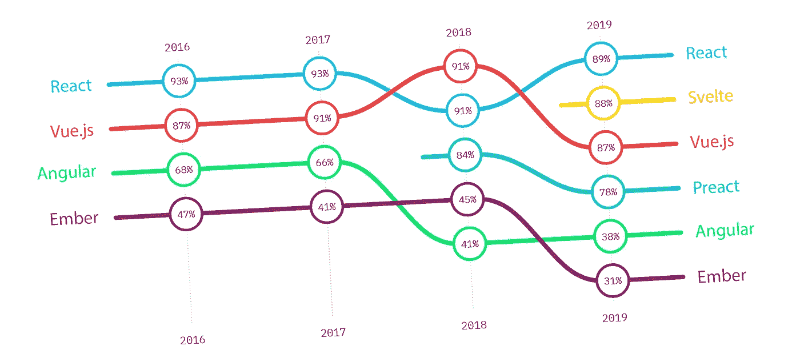

[司法状况](https://2019.stateofjs.com/front-end-frameworks/)满意度排名

至于 React 和 Vue.js，网上已经说得够多了。Svelte 是一个相对年轻的框架，所以我们将只添加一些关于它的词语。与其他产品最显著的区别在于，它在拥有其大部分优势的同时，还具有:

*   没有虚拟 DOM
*   没有运行时间
*   独特的“反应性”

没有需要导入的`svelte.js`——而是将用户代码编译成普通的 JavaScript。它使 svelet[比其他两个更快](https://github.com/krausest/js-framework-benchmark)，并且更容易集成到现有项目中，因为它基本上没有开销(根据 2020 年 RealWorld 框架比较，[最小的包大小](https://medium.com/dailyjs/a-realworld-comparison-of-front-end-frameworks-2020-4e50655fe4c1))。

另一件让 Svelte 如此快速的事情是，它跟踪变量的相互依赖性，这有助于最小化 DOM 更新的数量。

上个月，Svelte 收到了期待已久的打字稿支持。

至于基础设施，它仍然落后 React 和 Vue 一步(例如主要库/编辑器中的语法高亮、调试工具、第三方库的数量等)。

在本文中，我将描述基本功能，并提供一个用所有三种框架编写的简单链接选择应用程序作为示例。

# 1.变量

模板系统最常用的特性——变量替换——在所有三个框架中都非常相似:

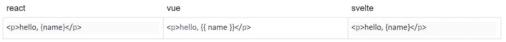

*Python* : f'hello，{name}'
Django: 'hello，{{ name }} '

# 2.条件式

下面是一个简单条件的样子:

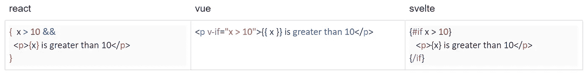

django:{ % if x > 10% }……{ % endif % }

[React](https://reactjs.org/docs/conditional-rendering.html) 在设计上没有模板语言。它依赖于本地 JavaScript 表达式(在这个特殊的例子中是逻辑 AND)来构建 HTML。这种便利来自于 JSX 的使用，它是 JavaScript 的一个扩展，允许我们将 HTML 标签视为一等公民。

[Vue.js](https://vuejs.org/v2/guide/conditional.html) ⁴有一个模板系统，它存在于标签属性中(例如`v-if`)，继承自 Angular。

Svelte 的模板语言可读性更好，并且让人想起了 django⁵⁶.拥有两种不同的大括号类型——开始`{# }`和结束`{/ }`——看起来比 Django 中的一种大括号类型``更神秘，但是需要更少的击键，同时保持高水平的可读性。

下一个是`if-else`语句:

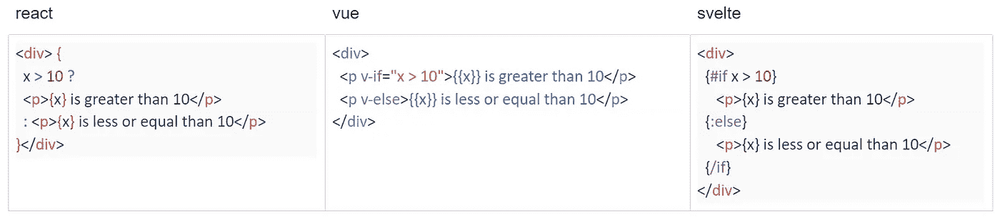

django:{ % if x > 10% }……{ % else % }……{ % endif % }

在 React 中，最自然的表达方式是使用三元运算符。在 Vue 中，逻辑再次出现在属性中，在这一点上，哪个`v-if`应该与哪个`v-else`匹配已经变得不那么明显了。Svelte 引入了第三种花括号——带冒号的“中间”花括号。

接下来的语句是`if-elif-else`。在 React 中使用嵌套的三元运算符通常被认为是不好的做法，所以这里有一个立即调用的函数表达式(IIFE)的例子。在 Vue 和 Svelte 中，语法与`if`和`if-else`语句一致:

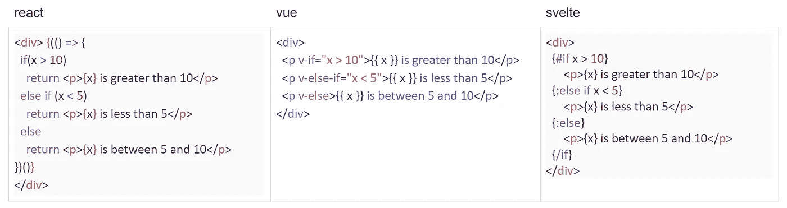

django:{ % if x > 10% }……{ % elif x< 5 %}……

Yet this React code is too difficult to digest and is only given here for completeness. As suggested by [u/sephg](https://www.reddit.com/user/sephg/)在注释中，尽管 trenary 运算符通常不被人接受，但如果使用适当的格式，它可以生成比 IIFE 更可读的代码:

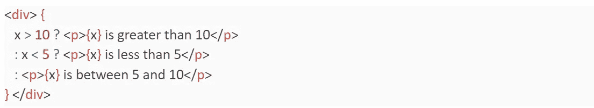

React 中令人惊讶的可读性嵌套趋势

当条件或子句变长时，嵌套的趋势运算符和子句都会变得过于混乱。直接的选择——将模板中的条件转移到专用变量、命名函数或独立组件——是 Django 模板系统热衷的代码和模板分离的反例(这也是导致 [jinja2](https://jinja.palletsprojects.com/en/2.11.x/) templates⁷存在的争论焦点)。

React 的第三方组件提供了“If/Else”标签、“Choose/When”标签等。(例如 [jsx-control-statements](https://github.com/AlexGilleran/jsx-control-statements) )，但是它们有相当强的局限性:不能短路(无论如何都要计算所有分支)，语法高亮效果差，等等。

如果这四种写反应条件句的方式还不够，2018 年⁸的[博客文章](https://blog.logrocket.com/conditional-rendering-in-react-c6b0e5af381e/)中有八种，或者 2020 年⁹的[博客文章](https://www.robinwieruch.de/conditional-rendering-react#if-else-components-in-react)中有九种。其中最值得注意的是高阶组件( [docs](https://ru.reactjs.org/docs/higher-order-components.html) )，Python decorators 的 React 名称。

同样值得注意的是，React 和 Vue.js 模板旨在打破 HTML 中“自然”的地方，如标签。如果你把干燥原则应用到上面的例子中，事情会很快变糟:

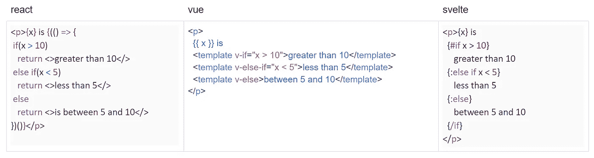

if-elif-else 语句不在标记边界

…虽然 Svelte 并不关心边界，*除了*它不允许在标签内使用条件语句(Django 对此非常满意)，例如

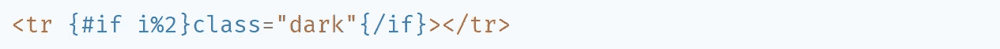

这不管用

[建议的解决方法](https://github.com/sveltejs/svelte/issues/259)是在属性值中使用 js(React-style):

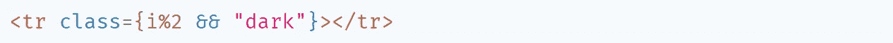

确实如此

如果表达式计算结果为`null`或`undefined`，则属性根本不会写入 HTML(使用`<input readonly={x && ‘readonly’}>`作为[布尔属性](https://html.spec.whatwg.org/multipage/common-microsyntaxes.html#boolean-attributes))。

# 3.环

除了 React 使用`map()`的情况，循环语法与条件一致:

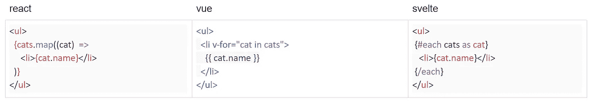

django:{ % for cat in cats % } { % end for % }

这三个框架都提供了自动迭代计数器:

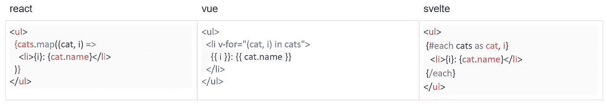

Python: "for i，cat in enumerate(cats)"
Django:{ % for cat in cats % } { { for loop . counter 0 } }:{ { cat . name } } { % end for % }

Vue 有一个特殊的对象循环语法:

蟒蛇:“`for i, (k, v) in enumerate(objects.items())"`

Svelte 有一个针对空序列的附加子句:

django:“{ % for cat in cats % }……{ % empty % }……{ % endif % }”

如果在一个循环中生成的条目序列预计会在以后被修改，那么所有被比较的框架都提供了一些方法(React warns，Vue [requires](https://github.com/vuejs/vetur/issues/858) ，Svelte 不介意)来对条目进行键控，以正确地跟踪它们的演化:

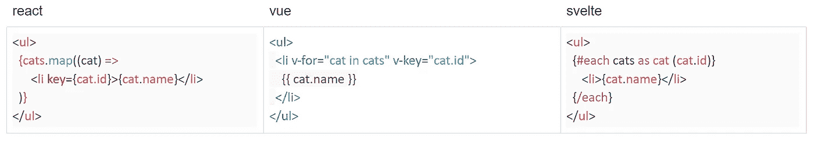

键控环路

简而言之，这两种修改都可以与[析构](https://developer.mozilla.org/en-US/docs/Web/JavaScript/Reference/Operators/Destructuring_assignment#Object_destructuring)相结合:

# 4.数据绑定

在所有三个框架中，标签属性都有很多神奇之处。我将只提到最不可或缺的部分:将 JavaScript 变量粘合到 DOM 小部件状态的部分。

将变量绑定到小部件有两种方式:单向绑定和双向绑定。

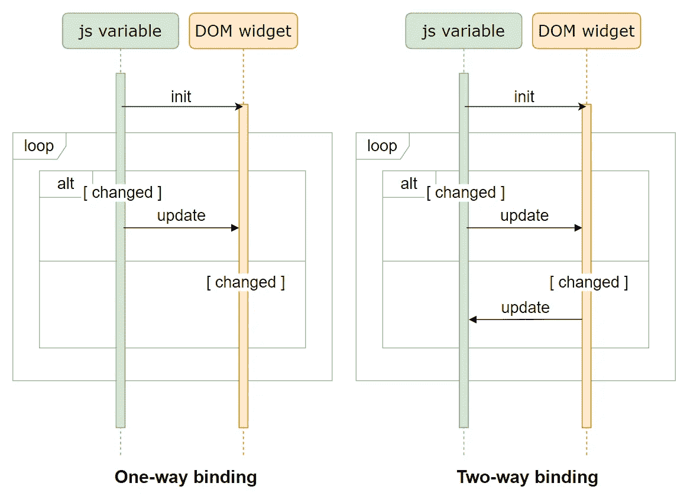

“循环”块是一种标准的方式[⁰，表示 UML 图的这一部分是重复的。“alt”块意味着只能发生其中一种选择](https://my.safaribooksonline.com/book/software-engineering-and-development/uml/0321193687/sequence-diagrams/ch04#X2ludGVybmFsX0h0bWxWaWV3P3htbGlkPTAtMzIxLTE5MzY4LTclMkZjaDA0bGV2MXNlYzImcXVlcnk9)

单向绑定指示框架在变量改变时更新 DOM，而不是相反:用户输入对绑定的变量没有影响。React 在这里比 Svelte 更具限制性:用户输入根本不起作用，除非您编写一个处理程序来实现双向绑定。

双向绑定更方便:variable 和 DOM 都“感觉”到对方的变化。例如，它允许我们锁定一对以不同方式显示相同值的控件，例如滑块和输入框。

下面是变量绑定语法的摘要:

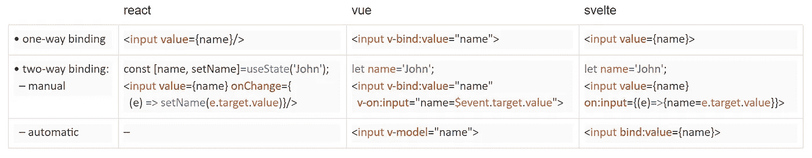

React 过去支持双向绑定，但是到今天为止，[推荐的](https://reactjs.org/docs/two-way-binding-helpers.html)方式是手动设置绑定，如上表所述。

# 5.组件文件结构

框架有不同的方式来组织组件文件中的代码。在 React 中，JavaScript 代码与 HTML 交织在一起，而 CSS 位于一个单独的文件中。在 Vue.js 中，所有三种类型的代码都组合在一个. vue [单文件组件](https://ru.vuejs.org/v2/guide/single-file-components.html)中。Svelte 有类似[的结构](https://svelte.dev/docs#Component_format)；只是块的顺序不同。

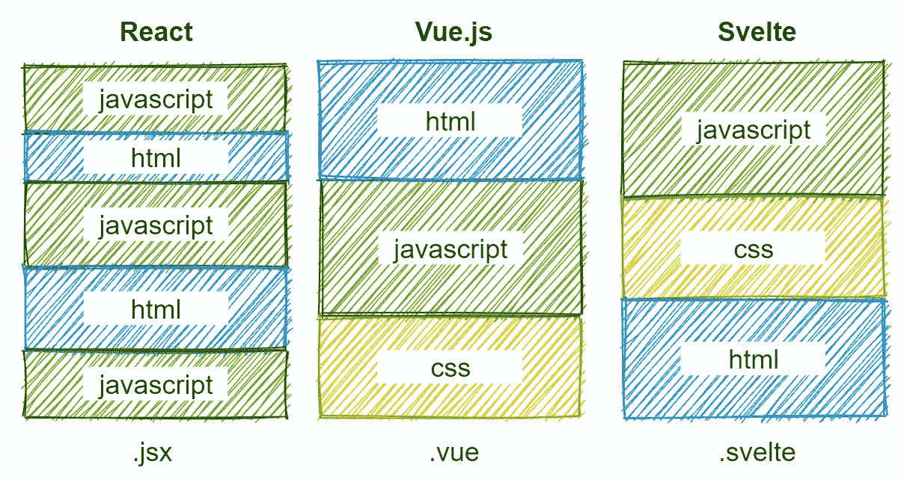

事实上，Vue 和 Svelte 中块的顺序是任意的。但是在团队中工作时，保持一致的顺序和合理的默认值是很方便的。该 Vue 块顺序由 [Vue 样式指南](https://vuejs.org/v2/style-guide/#Single-file-component-top-level-element-order-recommended)推荐。这个简单的顺序——由官方的简单[插件提供，但是另一种 javascript-html-css 顺序也被广泛使用。](https://github.com/sveltejs/prettier-plugin-svelte#options-cli)

将样式放在同一个文件中的好处是 CSS 被有机地封装起来，因此它只适用于当前组件( [vue](https://vue-loader-v14.vuejs.org/en/features/scoped-css.html) ， [svelte](https://svelte.dev/blog/the-zen-of-just-writing-css) )。在 React 中，这也是可能的——要么使用 [CSS 模块](https://create-react-app.dev/docs/adding-a-css-modules-stylesheet/)，要么使用任何 CSS-in-js 第三方库(这里是 GitHub 上 62 个包的[列表](https://github.com/MicheleBertoli/css-in-js))。

# 6.部分页面刷新

在 Django 中，模板呈现只发生一次:变量被替换，代码被发送到前端并被遗忘(尽管数据库查询和模板的一部分可以被缓存)。前端框架的主要目的是用更新的信息重新呈现页面(或者更好的是页面的一部分),只需最少或不需要与服务器交互。

在 React 和 Vue 中，为了实现部分页面刷新，您将模板分成组件，在它们之间分配变量(也称为组件状态)，然后，每当变量发生变化时，整个组件都会重新呈现。组件可以包含其他组件，并且有特定的规则来描述父组件或子组件应该发生什么来触发当前组件的重新呈现。

在 Svelte 中，组件也存在，但是它们服务于不同的目的(代码重用、数据流管理等)。).页面重新呈现的基本块是花括号中的表达式(变量、条件、循环等)。每当其中使用的变量改变时，该块被重新呈现，而页面的其余部分保持不变！([例](https://svelte.dev/repl/b45368f24ee5442f82fae7858c238a44?version=3.24.0))

# **7。示例应用程序:链接选择**

让我们看看上面给出的信息如何应用于实践。考虑两个选择框，第二个取决于第一个中选择的值:

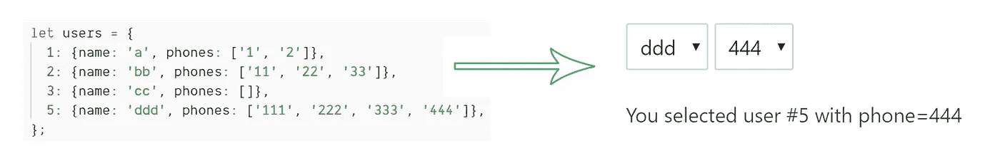

以下是如何在 React ( [尝试在线](https://codesandbox.io/s/shy-star-9ugy1?file=/src/App.js))、Vue ( [尝试](https://codesandbox.io/s/linked-selects-th5w3?file=/src/App.vue))和 Svelte 中实现这一点:

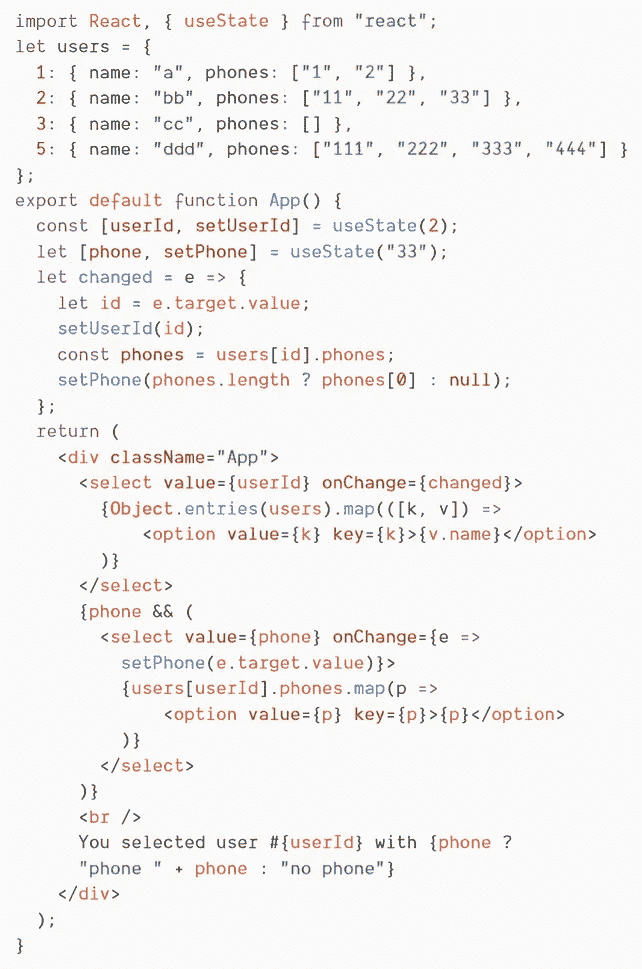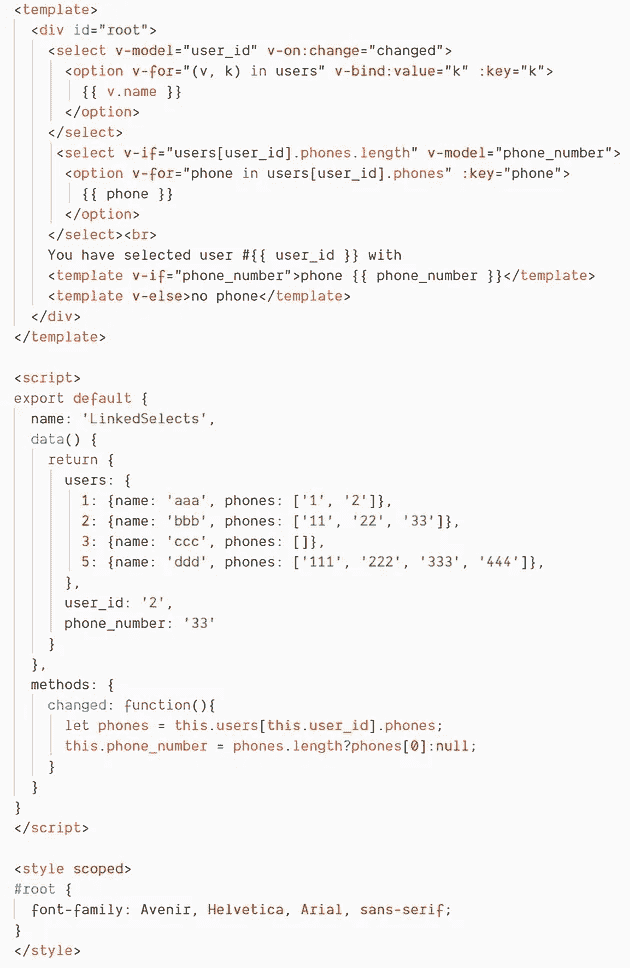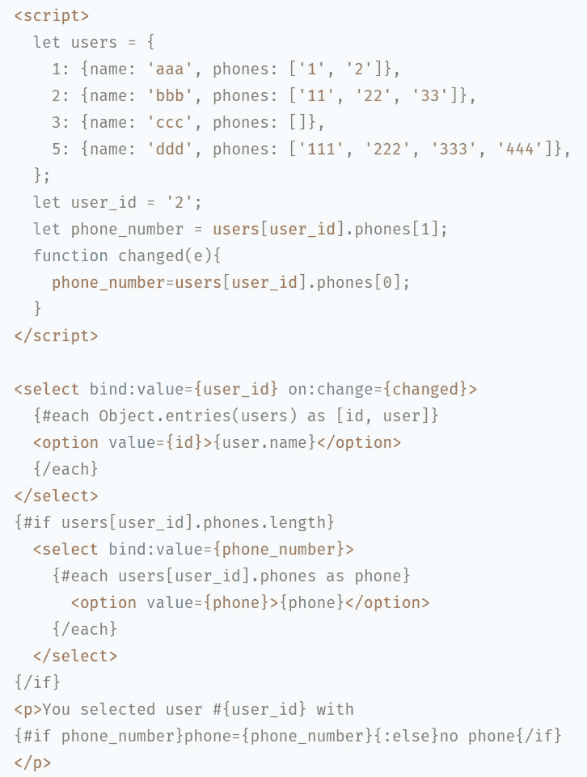

点击图片查看大图。

这些项目的完整源代码可以在 [GitHub](https://github.com/axil/linked-selects/) 上找到。

使用默认工具( [React](https://create-react-app.dev/docs/getting-started/) 、 [Vue/cli](https://cli.vuejs.org/guide/creating-a-project.html#vue-create) 、 [Svelte](https://svelte.dev/blog/the-easiest-way-to-get-started) ⁴)和默认设置构建项目会产生以下包大小:

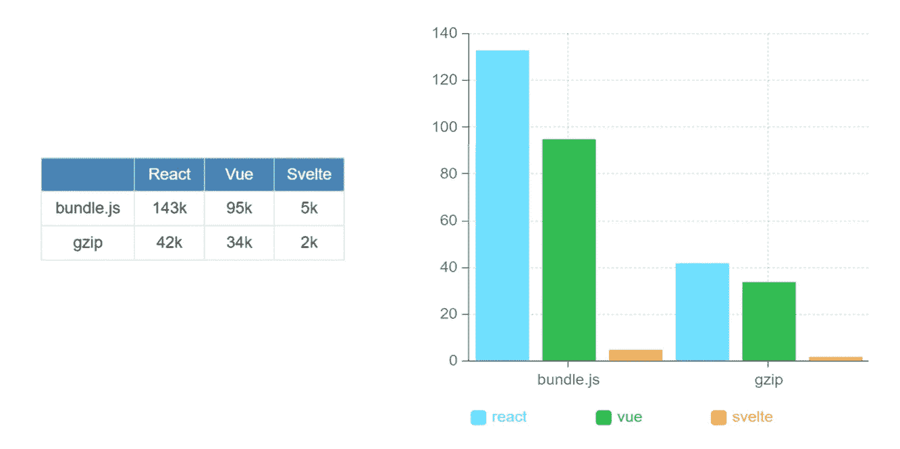

大小差异来自于 Svelte 没有运行时；它只编译和捆绑用户给它的代码。

一个 *hello world* 项目的规模(比如这个)可能并不能很好地估计一个真实世界的项目可以增长到多大。对 2019 年[和 2020 年](https://www.freecodecamp.org/news/a-realworld-comparison-of-front-end-frameworks-with-benchmarks-2019-update-4be0d3c78075/)的现实世界比较证实，对于更大的应用程序来说也是如此。

有一个关于纤细束尺寸的有趣讨论"[是的，但是它有尺度吗？](https://github.com/sveltejs/svelte/issues/2546)”。

# 8.结论

这三个框架都提供了一种方便的模板语言，但方式不同:React 语法是最灵活的，因为它允许您以任何可以想象的方式交错 JavaScript 和 HTML 纤细的语法可读性最强；Vue.js 是这两者之间的黄金比例。

尽管有明显的差异，但从概念上讲，框架的模板语法是非常相似的。主要区别在于反应性——它们如何对组件状态的变化做出反应。有一个很棒的视频叫做“[反思反应](https://www.youtube.com/watch?v=AdNJ3fydeao)”⁶，作者是《苗条身材》的创作者 Rich Harris。

Bugfix？改进的想法？编辑[谷歌文档](https://docs.google.com/document/d/1NFsLSY_6CHiTvPMH3nT38ADLHoAC4qaBSynmM757pW0/edit?usp=sharing)上的文章。

我要感谢[亚当·福尔](https://github.com/afaur)和[保罗·马利](https://medium.com/@paulmaly)让这篇文章变得更好。

# 参考

[1] js-framework-benchmark 项目*上*[*Github*](https://github.com/krausest/js-framework-benchmark)
【2】前端框架 2020 *上* [*中*](https://medium.com/dailyjs/a-realworld-comparison-of-front-end-frameworks-2020-4e50655fe4c1)【3】React 官方文档 [*条件渲染*](https://reactjs.org/docs/conditional-rendering.html)
【4】vue . js v2 指南 [*条件渲染*](https://vuejs.org/v2/guide/conditional.html) [*Django 模板语言*](https://docs.djangoproject.com/en/3.0/ref/templates/language/)【7】Jinja 文档 [*模板设计器文档*](https://jinja.palletsprojects.com/en/2.11.x/)【8】Esteban Herrera 博客(2018 年 2 月 28 日)[*React*](https://blog.logrocket.com/conditional-rendering-in-react-c6b0e5af381e/)【9】Robin Wieruch 博客(2020 年 1 月 16 日)
条件句之类的【11】我的 Github 账号、 [*链接-精选回购*](https://github.com/axil/linked-selects/)【12】创建 React App 站点由脸书 [*入门*](https://create-react-app.dev/docs/getting-started/)【13】Vue CLI Docs [# 2546](https://cli.vuejs.org/guide/creating-a-project.html#vue-create)【16】里奇·哈里斯*[*YouTube*](https://www.youtube.com/watch?v=AdNJ3fydeao)*