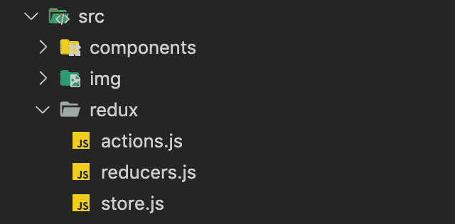
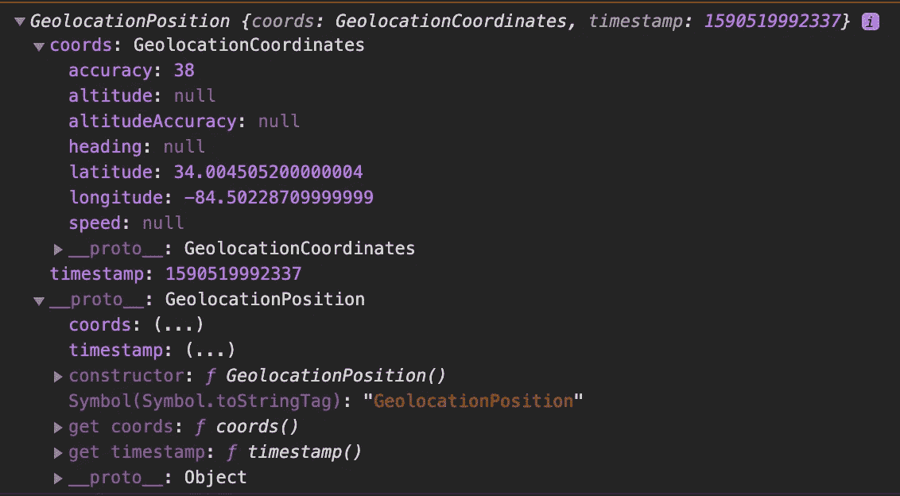

# 使用地理定位 API 和开放天气地图 API 构建 React 天气应用程序

> 原文：<https://betterprogramming.pub/react-weather-app-with-geolocation-api-and-open-weather-map-api-part-1-21d335d6aa34>

## 我如何解决这个带回家的面试问题


作者 GIF。

我最近申请了一家公司的工作，现在还在和他们面试。我参加了第一次面试，之后我收到了一个 GitHub 库的链接，上面有一个需要在周末完成的代码挑战。

# 项目

回购包含以下说明:

> “使用 [Create React App](https://github.com/facebook/create-react-app) 用 [Redux](https://redux.js.org/) 或 Context API 编写一个小的单页面 web 应用。我们知道这个应用程序中没有太多的状态，但是构建一个状态管理库可以让我们更好地理解您的风格。
> 
> 如果您不喜欢 React 和/或更喜欢另一种 web 框架。没问题！我们使用 React 并享受它，但你不必现在就这样。随意使用 Vue，Angular 等，甚至普通 JS，只要你完成下面的要求。但是，如果您使用 React，请使用 Create React App 和一些状态管理库。"

# 要求

> “-中间有一个名为“当前天气”的按钮
> 
> -点击后，它使用内置浏览器[地理定位 API](https://developer.mozilla.org/en-US/docs/Web/API/Geolocation_API) 获取用户的位置
> 
> -然后应用程序从 [OpenWeatherMap](https://openweathermap.org/current) 获取该位置的当前天气，并将其显示在页面上。
> 
> -在某个地方部署您的项目( [Surge.sh](https://surge.sh/) 是一个很好的简单解决方案)
> 
> 我们主要考察您编写整洁有序的代码、与外部 API 交互以及处理异步 JavaScript 的能力。因此，虽然这个项目并不大，但我们希望你给我们发送你认为是高质量的代码。您的提交历史应该清楚地显示您在应用程序中的进度。"

这是一次有趣的练习，也是一次很好的回顾。作为一个在过去一个月左右一直在练习棱角技巧的人，我不得不承认我有点生疏了。

我在这里告诉你我的过程以及分享代码。我今天发现工程团队已经看到了我的提交，并希望明天通过 Zoom 查看它。我非常期待！我写这篇文章是为了让我的神经平静下来。

如标题所示，这将是一篇由两部分组成的文章。这是可以期待的。

# **我们开始吧！**

我喜欢从待办事项列表开始。我是一个守旧派，喜欢把我的待办事项写在一张纸上，因为没有什么比划掉清单上的一项并得到多巴胺激增的奖励更令人满意的了。我最近还从我最喜欢的 YouTube 频道之一了解到，简单地制定一个如何以及何时完成一项任务的计划可以帮助消除伴随着未完成任务而来的焦虑。

然后我收拾好我所有的工具。我的意思是，我已经阅读了足够多的关于地理定位 API 以及如何使用它的入门知识。我知道我稍后才需要天气 API，但是我还是创建了一个帐户并请求了一个 API 密钥。激活它只需要几个小时，但其他 API 并不总是这样(有时可能需要几天)，我想确保它在我需要的时候准备好。我浏览了文档，并确信我已经拥有了启动这个应用程序所需的一切。

我创建了一个新目录，给我的应用取了一个吸引人的名字(为什么“Weatherly”还不是一个天气应用呢？)*，*在我的终端里键入 create-react-app，让它施展魔法。

我喜欢从小处着手，然后从那里开始建设。所以我做的第一件事是确保有一个按钮可以工作，并且我正确地使用了地理定位 API。

让我告诉你，这是我做过的最简单的事。他们的[文档](https://developer.mozilla.org/en-US/docs/Web/API/Geolocation_API)非常简单，你不需要在你的组件中安装、要求或导入任何额外的东西。我要特别注意的唯一一件事是确保所有的 API 调用都是针对 HTTPS 端点，而不是默认的 HTTP。我指的是所有的 API 调用。我必须确保我所有的 Open Weather Map API 调用都是在安全的环境下进行的，并且我部署的应用程序链接也是安全的。为了安全起见，确保你所有的链接都是 HTTPSs…否则(在第 2 部分会有更多)。

在我进一步讨论我的按钮组件之前，我想让您快速看一下我的文件设置。这是一个偏好，而不是一个要求，在这种规模的应用程序中当然没有必要，但是我喜欢坚持[关注点分离原则](https://www.oreilly.com/library/view/programming-javascript-applications/9781491950289/ch05.html)，把我的 Redux 组织到单独的文件夹中。如果你想要一个关于如何在你的应用中配置 Redux 商店的好指南，我强烈推荐官方 Redux 文档。但是，如何组织你的文件取决于你自己，下面是我选择的方法:



我喜欢将我的存储、动作和减少器分开，甚至可以在一个更大的项目中给动作和减少器分开的文件夹。

如果你想仔细看看我的文件，可以看看我的 [redux 文件夹](https://github.com/jwkuchta/lu-code-challenge-weather-app/tree/master/src/redux)。

然后，我为我的按钮创建了一个组件:

这里有几件事:

*   我喜欢我的组件是功能性的，因为这使它们更轻便，更容易调试，但是我通常从类组件开始，直到我确信一切正常后再进行重构。我专注于让事物工作，然后让它们对用户看起来更好，然后为了性能而重构。如果你认为有更好的方法，我欢迎你的想法。
*   如您所见，我正在从我的 redux 导入几个动作。正如我前面提到的，这种规模的应用程序通常不会保证使用 Redux，本地状态也很好(也可能将所有代码保存在一个组件中)，但为了练习和证明我了解 Redux，这就是我最后的结果。
*   我压缩了 Geolocation API Navigator 提供的方法，并将它们包装在我自己的函数中，在这个函数中，我访问位置数据并提取纬度和经度坐标(第 12-21 行)。
*   当然，在我让它看起来很漂亮之前，我首先测试了按钮，并查看了我的数据，通过将按钮直接连接到方法来了解我正在处理什么。它看起来有点像这样:

```
<button 
onClick={navigator.geolocation.getCurrentPosition(position =>       console.log(position))}>
Current Location
</button>
```

这是数据的样子:



这就是我知道如何访问纬度和经度数据的方法。

我是一切事物的忠实粉丝，在我继续前进之前熟悉这些数据。

这就是地理定位 API。真的就这么简单。第一次请求地理定位时，用户将被要求给予许可，但在以后的请求中不会被要求给予许可(除非您清空缓存)。此外，记得让你所有的链接与 HTTPS 安全。我遇到了几个问题，直到我发现通过 HTTP 获取的一个天气图标才是问题所在。永远从你的错误中学习。

至于我的组件，我喜欢把所有的东西都分开，尽管在这种规模的应用中完全没有必要。我也喜欢把大多数东西放在我的`App.js`之外，尽管我知道开发人员喜欢把它作为家庭组件——这也很好。

我的`App.js`就像他们得到的一样简单，并且包装了真正神奇发生的`HomePage`:

现在已经完成了，让我们深入到[开放天气地图 API](https://openweathermap.org/api) 以及我是如何压扁一些出现的 bug 的。

出于本练习的目的，我使用当前的地理坐标来获取天气数据，这些数据与我之前通过 ping Geolocation API 获得的坐标相同。

[这些](https://openweathermap.org/current)是 Open Weather Map API 提供给其用户的所有可用端点，下面是我使用的一个:

```
**api.openweathermap.org/data/2.5/weather?lat={lat}&lon={lon}&appid={apiKey}**
```

正如您所看到的，这些并不是您可以使用的所有参数，在我的例子中，我选择指定我希望温度信息提供给“英制”的单位(如第 2 行所示):

以下是我的`WeatherOutput`组件:

以下是根据摄氏/华氏选择的输出:

如您所见，我选择不再次获取数据(这次使用摄氏温度)，而是编写了一个简单的函数，将已经存储在 redux 存储中的数据转换为摄氏温度(默认情况下，它是以华氏温度获取的，您可以在前面看到)。

# **TL；博士**

这里是 [GitHub 回购](https://github.com/jwkuchta/lu-code-challenge-weather-app)。下面是部署在 [Surge](https://obsolete-winter.surge.sh/) 上的直播 app。

如果您有任何问题或意见，请随时联系我们。

我喜欢学习和帮助他人学习。