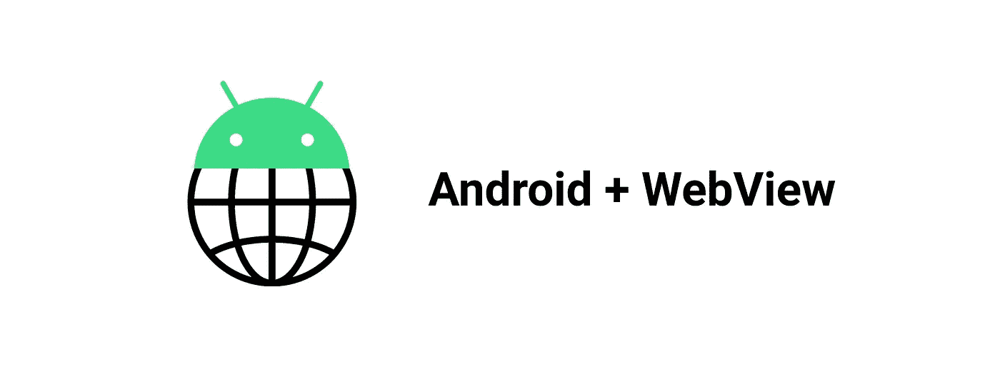
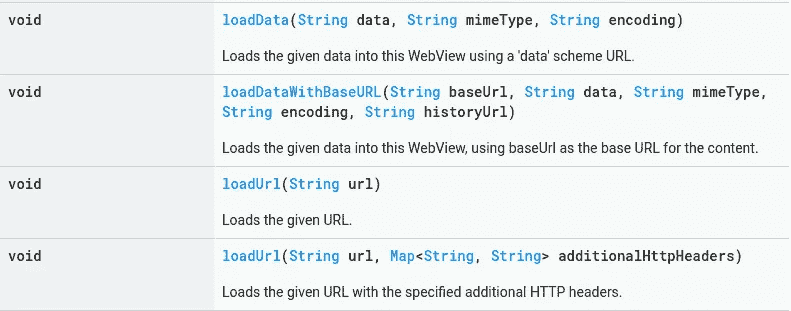

# React，WebViews，以及如何在 Android 上与 JavaScript 通信

> 原文：<https://betterprogramming.pub/react-webviews-and-how-to-communicate-with-javascript-on-android-70543c35d37d>

## 如何调用简化的 JavaScript 函数

# 介绍

WebView 是一个用于在 Android 应用程序中呈现网页的组件。如果你想显示一些内容(例如，你的站点)并且想让它看起来像是应用程序的一部分，这是非常有用的。

在某些情况下，开发人员只需要显示一些信息，而不需要与 Android 应用程序进行任何交互。

但有时这还不够，开发人员应该在 JavaScript 和 Kotlin 之间实现一座沟通的桥梁:例如，当用户点击应用程序中的某个按钮时，您可能希望调用一个 JavaScript 函数。

在我的例子中，我需要使用 WebView，因为有些 JavaScript 代码我不想在 Kotlin 上实现。

[信号源](https://developer.android.com/reference/android/webkit/WebView)

上面四样东西是用来通过 WebView 加载内容的。使用最广泛的当然是`loadUrl`，因为通常内容是在服务器的某个地方提供的。

# 互动的类型

实际上，JavaScript(通过 WebView)和 Android 应用程序之间有两种类型的交互:

*   从 JavaScript 调用 Kotlin 函数
*   从 Kotlin 调用 JavaScript 函数

# 用 JavaScript 调用 Kotlin 函数

用 JS 调用 Kotlin 函数需要做的事情有:

*   写一个特殊的接口
*   将其添加到 WebView
*   从 JS 调用一个接口函数

首先，我们创建一个特殊的接口。姑且称之为`AndroidJSInterface`。

如您所见，一个将从 JavaScript 调用的函数有一个特殊的注释`@JavascriptInterface`，它向 WebView 表明这个函数可以从 JS 调用。

接下来要做的是将这个界面添加到 WebView 中。这里我们将其命名为`Android`，不过你可以随意命名。

现在我们需要从 JS 代码中调用这个函数:

# 从 Kotlin 调用 JavaScript 函数

在大多数情况下，调用 JavaScript 也非常简单:

所以这里我们调用一个名为`callingFunction()`的函数。

## **但是如果 JavaScript 被缩小了呢？**

有各种各样的 JavaScript minifiers:例如，React 的生产版本使用 minified JS。

缩小后的 JS 是什么样子

问题是在缩小后，函数名被改变了，这就是为什么你不能直接调用它们。

我的第一个想法是以某种方式在 config 中注明跳过优化某些函数，以便保存它们的名称，但是没有办法做到这一点。

另一个想法是重新命名这个函数，以便保存它的名字，但是这太费时间了。

## **这里有一个解决方案**

1.  在 JavaScript 代码中添加一个特殊的事件监听器，并在调度事件时调用一个函数。
2.  从 Android 调度事件。

> “`**Event**`接口表示发生在 DOM 中的事件。
> 
> 事件可以由用户操作触发，例如单击鼠标按钮或敲击键盘，或者由 API 生成以表示异步任务的进度。它也可以通过编程来触发，比如调用元素的`[HTMLElement.click()](https://developer.mozilla.org/en-US/docs/Web/API/HTMLElement/click)`方法，或者定义事件，然后使用`[EventTarget.dispatchEvent()](https://developer.mozilla.org/en-US/docs/Web/API/EventTarget/dispatchEvent)`将其发送到指定的目标。"
> 
> — [MDN 网络文档](https://developer.mozilla.org/en-US/docs/Web/API/Event)

这里我们调度一个名为`event`的事件。

这里我们添加了一个监听器，并在`event`发生时做一些事情。

例如，我们可以调用我们想要调用的函数。

# 结论

使用`loadUrl`函数和作为参数传递的站点 URL 将站点加载到 WebView 中。

## **你可以从 Kotlin 调用一个 JavaScript 函数**

*   直接通过它的名字使用`javascript:functionName()`传递给`loadUrl`函数
*   使用事件:调用`evalutateJavascript`函数，将一个特殊的东西作为参数传递

## **你可以从 JavaScript 调用 Kotlin 函数**

*   写一个用`@JavascriptInterface`注释的特殊函数
*   调用`addJavascriptInterface`，传递一个内部有特殊函数的对象作为参数，并以某种方式命名(比如“Android”)
*   使用`window.Android.functionName();`从 JavaScript 调用函数

编码愉快，伙计们。感谢您阅读文章。