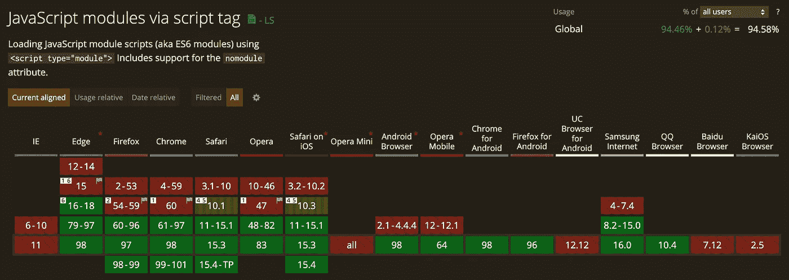

# 如何在 Ruby on Rails 应用中使用 React

> 原文：<https://betterprogramming.pub/react-with-rails-2022-bd28e1fcd355>

## 在铁轨上反应！


Nicolas Postiglioni 的照片:[https://www . pexels . com/photo/architectural-photography-of-building-421129/](https://www.pexels.com/photo/architectural-photography-of-building-421129/)

5 年前，我开始与 React 合作。由于团队中的 rails 经验，Rails 被设置为后端和前端。在对 Angular、React 和 Vue.js 进行了简短的评测后，React 在当时最让我们信服。

那时 Rails 中还没有官方的`webpack`集成，`webpacker`和其他开箱即用的可能性也不存在。最佳解决方案是来自 [Shakacode](https://github.com/shakacode/react_on_rails) 的 React on Rails。

在我看来，React on rails 仍然是将 React 和 rails 结合在一起的最重要的工具链，特别是因为据我所知，它仍然是与 Rails 相关的服务器端呈现的唯一方式。

在 Rails 7 发布前不久，发生了很多事情，webpacker 甚至退休了。创建新的 rails 应用程序时，rails 命令现在提供了以下选项:`importmap`(默认)、`webpack`、`esbuild`、`rollup`。

为了这个帖子，我看了一下`importmap`、`webpack`、`esbuild`，在 rails 上反应。

# 导入地图

> [*导入映射*](https://github.com/WICG/import-maps) *允许您使用映射到版本/摘要文件的逻辑名称导入 JavaScript 模块——直接从浏览器导入。所以你可以* [*使用为 es 模块(ESM)制作的 JavaScript 库构建现代的 JavaScript 应用程序，而不需要传输或捆绑*](https://world.hey.com/dhh/modern-web-apps-without-javascript-bundling-or-transpiling-a20f2755) *。*
> 
> 这让你不再需要 Webpack、Yarn、npm 或 JavaScript 工具链的任何其他部分。您所需要的只是 Rails *中已经包含的* [*资产管道。*](https://github.com/rails/importmap-rails)

没有编译、没有构建、没有复杂设置的 JavaScript，听起来像一个梦！在我看来，难怪 Rails 7 背后的团队决定支持`importmap`，并将其定义为 Rails 应用的标准。

## 装置

1.  使用`gem 'importmap-rails'`将`importmap-rails`添加到您的 gem 文件中
2.  跑`./bin/bundle install`
3.  运行`./bin/rails importmap:install`

要添加 javascript 库，只需运行以下命令:

```
./bin/importmap pin react@17.0.1
```

对我来说，下面的`config/importmap.rb`内容被证明是最适合使用 react 的，包括用于开发和生产环境的不同 React 库版本，以支持 React 的所有开发模式:

基本上，它工作得很好，你甚至不需要本地 node.js 安装！只要你不想使用像`eslint`这样的基于 Node.js 的开发工具来 lint 你的 JavaScript 文件，jest to test 等等。从我的角度来看，这在当今 React 应用程序的开发中实际上是必不可少的。

最大的问题是没有编译步骤，你不能使用 JSX，因为 JSX 需要被编译成 javascript。没有浏览器支持 JSX 开箱即用，可能永远也不会。

DHH [推荐](https://www.youtube.com/watch?v=k73LKxim6tw)图书馆`[htm](https://github.com/developit/htm)`，稍微改善了一下情况。

为了使问题和不同的可能性更容易理解，React 组件的一些例子一次有 JSX，没有 JSX，一次有`htm`:

使组分与 JSX 反应:

不含 JSX 的反应组分:

使用`htm`对组件做出反应:

[https://gist . github . com/uebe lack/ce 6a 0487 df 2278 ecdd 7 bcdeea 1449686](https://gist.github.com/uebelack/ce6a0487df2278ecdd7bcdeea1449686)

使用`importmap`的完整示例、一个使用`createElement`的示例和一个使用`htm`的示例如下:

[](https://github.com/uebelack/rails-todo-playground/tree/react-importmap) [## GitHub-uebe lack/rails-todo-playground at react-import map

### 我的小 rails playground rails-todo-playground 只是一个小游戏场，我用它来测试新的 rails 版本、功能…

github.com](https://github.com/uebelack/rails-todo-playground/tree/react-importmap) [](https://github.com/uebelack/rails-todo-playground/tree/react-importmap-htm) [## GitHub-uebe lack/rails-todo-playground at react-import map-htm

### 我的小 rails playground rails-todo-playground 只是一个小游戏场，我用它来测试新的 rails 版本、功能…

github.com](https://github.com/uebelack/rails-todo-playground/tree/react-importmap-htm) 

再给你一个提示，当然这一切都不适合 IE:



[https://caniuse.com/es6-module](https://caniuse.com/es6-module)

# 网络包

> webpack 的核心是现代 JavaScript 应用程序的静态模块捆绑器。当 webpack 处理您的应用程序时，它从一个或多个入口点内部构建一个 [*依赖图*](https://webpack.js.org/concepts/dependency-graph/) *，然后将您的项目需要的每个模块组合成一个或多个包，这些包是静态资产，为您的内容*[](https://webpack.js.org/)**提供服务。**

*Webpack 仍然是最广泛使用的捆绑 javascript 应用程序的工具。加载器和插件可以用来处理，传输，最小化等。各种资源。*

*可以通过`[jsbundling-rails](https://github.com/rails/jsbundling-rails)`集成到 Rails 应用程序的构建管道中。*

## *装置*

*如果您创建了一个新的 rails 应用程序，您可以使用以下命令创建该应用程序:*

```
*rails new -j webpack my_new_rails_app*
```

*要将其添加到现有的 rails 应用程序中:*

1.  *用`gem 'jsbundling-rails'`将`jsbundling-rails`添加到你的 gem 文件中*
2.  *运行`./bin/bundle install`*
3.  *跑`./bin/rails javascript:install:webpack`*
4.  *安装所需的节点依赖项*

```
*yarn add react react-dom
yarn add @babel/core @babel/preset-env @babel/preset-react babel-loader --dev*
```

*在项目的根文件夹中创建一个`babel.config.js` ，包含:*

*更新`webpack.config.js` 以包含`babel`加载器:*

*生成一个控制器和视图来服务您的新 react 应用程序:*

```
*rails g controller Root index*
```

*用以下内容覆盖`app/views/root/index.html.erb`的内容:*

```
*<div id="root">*
```

*将`config/routes.rb` 中的根更改为您的新视图:*

```
*Rails.application.routes.draw do
  root 'root#index'
end*
```

*将您的 React 应用程序添加到`app/javascript/application.js`:*

*最后，从以下内容开始您的应用程序:*

```
*./bin/dev*
```

*您可以在此找到使用`[webpack](https://github.com/hackercowboy/rails-todo-playground/tree/react-webpack)`的完整工作示例*

# *Esbuild*

> *我们当前的 web 构建工具比它们应该慢 10-100 倍。esbuild bundler 项目的主要目标是开创一个构建工具性能的新时代，并在此过程中创建一个易于使用的现代 bundler。
> [https://esbuild.github.io/](https://esbuild.github.io/)*

*JavaScript 世界中构建工具天空中的新星是`esbuild`，据说比其他任何东西都要快得多…我们会看到…*

*可以通过`jsbundling-rails`([https://github.com/rails/jsbundling-rails](https://github.com/rails/jsbundling-rails))集成到 Rails 应用程序的构建管道中。*

## *装置*

*如果您创建了一个新的 rails 应用程序，您可以使用以下命令创建该应用程序:*

```
*rails new -j esbuild my_new_rails_app*
```

*要将其添加到现有的 rails 应用程序中:*

1.  *用`gem 'jsbundling-rails'`将`jsbundling-rails`添加到你的 gem 文件中*
2.  *运行`./bin/bundle install`*
3.  *跑`./bin/rails javascript:install:esbuild`*
4.  *安装所需的节点依赖项*

```
*yarn add react react-dom
yarn add esbuild esbuild-loader --dev*
```

*生成一个控制器和视图来服务您的新 react 应用程序:*

```
*rails g controller Root index*
```

*用以下内容覆盖`app/views/root/index.html.erb`的内容:*

```
*<div id="root">*
```

*将`config/routes.rb` 中的根更改为您的新视图:*

```
*Rails.application.routes.draw do
  root 'root#index'
end*
```

*将您的 react 应用程序添加到`app/javascript/application.js`:*

*将`--loader:.js=jsx` 添加到您的`package.json`中的构建脚本:*

*最后，从以下内容开始您的应用程序:*

```
*./bin/dev*
```

*使用`esbuild`的完整工作示例您可以在这里找到。*

# *在轨道上反应*

*React on Rails 集成了 Rails 和脸书的 React 前端框架*

*反应在铁轨上的是[电流](https://www.shakacode.com/react-on-rails/docs/getting-started/)。*

*在我看来，React on rails 是 React 与 Ruby 和 rails 最全面的集成。相对于其他解决方案的主要优势:服务器端渲染和热代码替换。*

## *装置*

*参见[https://www . shaka code . com/react-on-rails/docs/getting-started/](https://www.shakacode.com/react-on-rails/docs/getting-started/)*

*简而言之:*

1.  *将`react_on_rails`、`shakapacker`和`foreman`添加到您的 gem 文件中，并运行`bundle install`*
2.  *运行`./bin/rails webpacker:install`*
3.  *运行`rails generate react_on_rails:install --ignore-warnings`*
4.  *使用`bundle exec foreman start -f Procfile.dev`启动您的应用程序*
5.  *在[打开浏览器 http://localhost:3000/hello _ world](http://localhost:3000/hello_world)*

*在 rails 上使用 react 的完整示例可以在这里找到。*

# *结论*

*如果你不是一个 JavaScript 爱好者，并且作为一个 rails 狂热者，不想在你的开发机器上安装 node，只想用 react 实现一个简单的小前端，而不需要测试或编码林挺——那么通过`importmaps`集成是正确的选择。*

*如果你想拥有最快的现代构建管道，并且没有任何特殊要求，你应该尝试`esbuild`。*

*如果你有可以用`webpack`插件实现的特殊需求，这在`esbuild`中还没有解决方案，如果你在开发过程中不需要服务器端渲染或热代码替换，那么保持简单，使用`webpack`的集成 rails 解决方案。*

*最后，如果您需要服务器端呈现，您别无选择，只能在 Rails 上使用 React。*