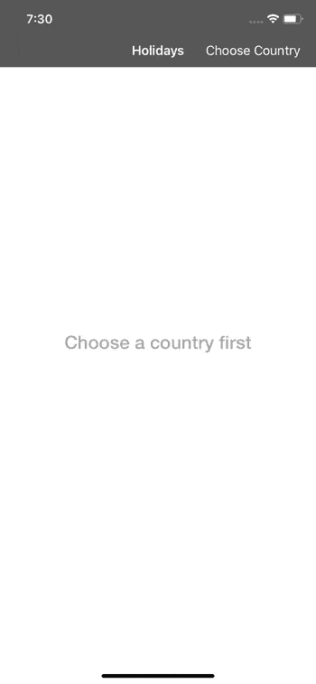
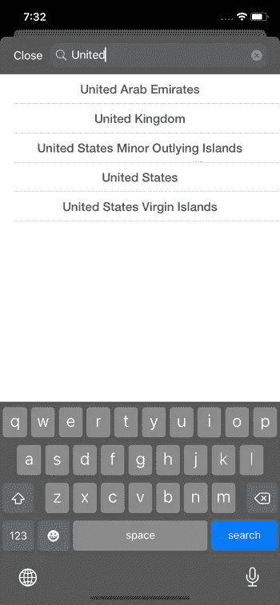
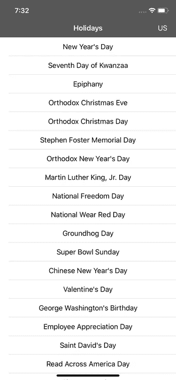
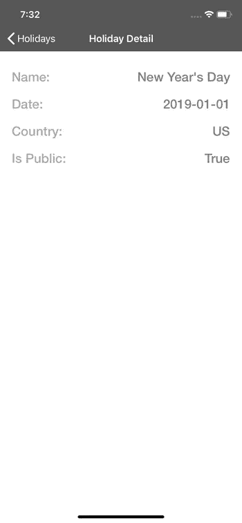
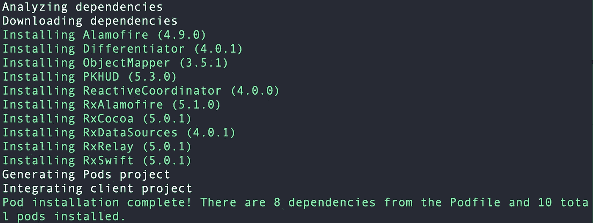

# 反应式 MVVM 和协调模式做对了

> 原文：<https://betterprogramming.pub/reactive-mvvm-and-the-coordinator-pattern-done-right-88248baf8ca5>

## 使用 Swift 5、RxSwift 和 RxDataSources

约翰·汤纳在 [Unsplash](https://unsplash.com?utm_source=medium&utm_medium=referral) 上的照片

# 介绍

所以，你已经在你的 iOS 应用中多次实现了 [MVC 架构](https://medium.com/better-programming/this-is-how-you-implement-mvc-architecture-in-2020-b39d65b4212f)，探索了 [MVP](https://medium.com/better-programming/implement-a-model-view-presenter-architecture-in-swift-5-dfa21bbb8e0b) 作为替代，听说了一些关于 [VIPER](https://medium.com/better-programming/how-to-implement-viper-architecture-in-your-ios-app-rest-api-and-kingfisher-f494a0891c43) 的事情，并且(可能)喜欢上了 MVVM。

现在怎么办？是时候将您的 MVVM 知识提升到一个全新的水平了——带协调员的反应式 MVVM！

在本文中，我将演示如何用 [RxSwift](https://github.com/ReactiveX/RxSwift) 、 [RxDataSources](https://github.com/RxSwiftCommunity/RxDataSources) 、 [RxAlamofire](https://github.com/RxSwiftCommunity/RxAlamofire) 实现 MVVM-协调器模式。

我们还将使用我自己的 CocoaPod，它提供了 ReactiveCoordinator 的基本实现，可以在我的 [GitHub repo](https://github.com/zafarivaev/ReactiveCoordinator) 中找到。

演示应用程序使用一个免费的[假日 API](https://holidayapi.com) 来获取国家列表，并获取所选国家去年的假日。

该项目的源代码可在 GitHub 上获得[。](https://github.com/zafarivaev/Reactive-MVVM-C-DemoApp)

# 演示应用程序

# 项目结构

# 快速设置

为了成功获取假日和国家，我们需要获得一个免费的[假日 API](https://holidayapi.com) 密钥:

1.  去 https://holidayapi.com。
2.  按*开始使用*并创建您的帐户。
3.  复制您的 API 密钥。

现在，只需将`APIManager.swift`中的“在此粘贴您的 API 密钥”替换为您从仪表板上复制的密钥:

要完成设置，导航到项目的目录并运行`pod install`来安装所有需要的依赖项:

# 我们开始吧

## **协调人**

首先，让我们看看 [ReactiveCoordinator](https://github.com/zafarivaev/ReactiveCoordinator) 框架中的协调器实现。

*   我们指定`CoordinationResult`来代替将来视图控制器之间的委托。
*   泛型`store<T>`方法用于将我们的协调器存储在`childCoordinators`字典中。
*   通用的`release<T>`方法负责释放未使用的坐标。
*   通用的`coordinate<T>`方法用于提供屏幕间的导航。
*   我们还有一个强制的`start()`方法，在这个方法中，我们将构建并连接视图控制器和它们的视图模型。

以下是我们如何在应用程序中使用 ReactiveCoordinator 的示例。假设我们有两个协调人:`AppCoordinator`和`HolidaysCoordinator`。两者都继承自 ReactiveCoordinator。工作流程:

1.  `AppCoordinator`触发它的`start()`方法。
2.  调用`coordinate(to: )`方法，该方法协调`HolidaysCoordinator`并触发自己的`start()`方法，该方法构造并连接`HolidaysViewController`及其`ViewModel`。
3.  因此，我们将`HolidaysViewController`呈现在屏幕上。

## **联网**

我们使用 RxAlamofire 创建一个基本的通用`get<T>`请求。

`APIClient.swift`

## 模型

`ObjectMapper`用于从我们从 Holiday API 接收的 JSON 中构造对象。

`Holidays.swift`

`Countries.swift`

有了这些，我们就可以开始培养我们的协调员了。

## **AppCoordinator.swift**

这个类负责为`window`设置`rootViewController`。

在其启动方法中，我们指定`window`的`rootViewController`为`HolidaysViewController`，嵌入在一个`UINavigationController`中。最后，我们协调到`HolidaysCoordinator`:

## `AppDelegate.swift`

在这里，我们创建并开始我们的`AppCoordinator`:

我们已经成功地设置了我们的应用程序的初始流程。

# 假日模块

如果选择了一个国家，此模块将显示假日列表。否则，它会显示一条占位符消息“首先选择您的国家”。

## **holidays coordinator . swift**

这里，类似于我们在`AppCoordinator`中所做的，我们设置了`HolidaysViewController`，并为它提供了一个`HolidaysViewModel`。

在`start()`方法中，我们订阅视图模型的`selectedHoliday`和`chooseCountry`属性。

当事件被发送到这些属性时，(即用户点击*选择国家*按钮或选择一个单元格)，协调器知道是时候导航了。

## **holidays view controller . swift**

它唯一的职责是布局视图，并将 UI 元素绑定到`HolidaysViewModel`。

仔细看看我们如何使用`UITableView`:

首先，我们使用 RxDataSources 将`viewModel`的`holidays`属性绑定到`tableView`。它超级短和简单，我们甚至不必使用这些冗长的`UITableViewDelegate`和`UITableViewDataSource`实现！

接下来，我们将特定`tableView`单元格的选择绑定到`viewModel`的`selectedHoliday`属性。这样，我们就避免了使用`didSelectRow(at: )` `UITableViewDelegate`方法。

这只用了三行代码就完成了——太棒了！

最后，我们订阅选择事件，通过接收选择的`indexPath`并调用`deselectRow(at: )`方法，将单元格的背景恢复到以前的状态。

## **holidays view model . swift**

在这里，所有的奇迹都会发生。这个视图模型负责接受来自视图的输入并获取假期。

## **holidaytableviewcell . swift**

单元格有自己的`HolidayViewModel`，在分配时我们调用`configure()`方法用模型更新单元格的 UI。

## **HolidayViewModel.swift**

用在`HolidayTableViewCell`中来表示它的属性。稍后我们将使用`Holiday Detail`模块中的`didClose`属性在`HolidayDetailViewController`弹出时发送一个信号:

# 选择国家模块

此模块显示国家列表。在选择特定国家时，`ChooseCountryViewController`被取消，将所选择的国家转发回`HolidaysViewModel`。

## choose country coordinator . swift

这里是我们将使用我们的`CoordinationResult`的地方。当我们点击*关闭*按钮时，`HolidaysCoordinator`接收`nil`。当一个单元格被选中时，它接收选中的`country`:

## **选择 countryviewcontroller . swift**

和以前一样，控制器只是显示 UI 并将动作事件发送到视图模型:

## **country table viewcell . swift**

具有与`HolidayTableViewCell`相同的功能:

## **选择 CountryViewModel.swift**

这里，我们执行两个重要的任务:获取国家和基于来自`searchBar`的文本进行过滤:

## **CountryViewModel.swift**

表示包含国家的`name`及其`code`的单元格:

# 假日详细信息模块

该模块显示特定假日的详细信息，显示其`title`、`date`、`country`和`isPublic`状态。

## **holidaydetailcoordinator . swift**

构建`HolidaysViewController`并为其提供一个`HolidayViewModel`:

## **holidaydetailviewcontroller . swift**

与其他视图控制器的工作完全相同:

# 包扎

现在，随着反应式 MVVM 协调器设计模式的成功实现，我们看到了以下好处:

1.  视图控制器只负责布局它们的视图，并向视图模型发送动作，使它们变得纤细简洁。即使您看到一个 300 行的视图控制器，您也知道它主要具有设置约束、执行布局和绑定到视图模型的方法。
2.  协调者监听由视图控制器发出的视图模型中的导航事件，从而清楚地划分他们之间的职责。
3.  视图模型处理应用程序的所有业务逻辑，并且独立于 UIKit，这使得为它们编写单元测试很容易。
4.  视图控制器相互不了解，所有的导航都在协调器内部处理。
5.  代码很简洁，因为我们使用了 RxDataSources，所以没有冗长的委托方法。
6.  如果我们发现出现了错误的屏幕，我们知道问题出在协调器内部。如果视图没有按照我们想要的方式显示，我们直接跳到视图控制器。如果一个 API 请求失败，或者，例如，过滤没有按预期工作，我们知道要在视图模型中寻找问题。

您可以通过以下链接了解其他人是如何实现反应式 MVVM 协调器模式的:

*   [协调人— RxSwift](https://academy.realm.io/posts/mobilization-lukasz-mroz-mvvm-coordinators-rxswift/) 。我发现这个演讲对了解 RxSwift、MVVM 和协调员模式非常有用。
*   [如何使用 MVVM 协调员](https://hackernoon.com/how-to-use-mvvm-coordinators-and-rxswift-7364370b7b95)。

如果你对不同的建筑模式感到好奇，请随意查看我的其他相关作品:

 [## 在 Swift 5 中实施模型-视图-演示者架构

### 使用领域数据库作为业务逻辑层

medium.com](https://medium.com/better-programming/implement-a-model-view-presenter-architecture-in-swift-5-dfa21bbb8e0b)  [## 新 MVC:单一责任原则和委托

### 苹果的模型视图控制器，终于做对了

medium.com](https://medium.com/better-programming/this-is-how-you-implement-mvc-architecture-in-2020-b39d65b4212f)  [## 在 Swift 5 中实施面向服务的架构

### 为什么只用 MVC/MVVM/蝰蛇还不够

medium.com](https://medium.com/better-programming/implement-a-service-oriented-architecture-in-swift-5-fc70b8117616)  [## 如何使用 Swift 5 在您的 iOS 应用中实现 VIPER 架构

### 使用方便的 Xcode 模板和参考报告

medium.com](https://medium.com/better-programming/how-to-implement-viper-architecture-in-your-ios-app-rest-api-and-kingfisher-f494a0891c43) 

非常感谢您的阅读！