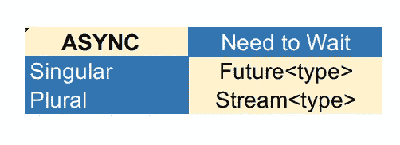

# 颤振中的反应规划

> 原文：<https://betterprogramming.pub/reactive-programming-in-flutter-9fd7b0a4835f>

## 发现颤动——第 15 周

## 流的简要介绍

克里斯汀娜·戈塔迪在 [Unsplash](https://unsplash.com/?utm_source=unsplash&utm_medium=referral&utm_content=creditCopyText) 上的照片。

反应式编程是用异步数据流编程。数据流是一个随时间发出多条数据的对象。在 Dart 中，这种数据被称为*流*。

流随时间发出数据。通过订阅流，我们可以听到所有发生的变化，只要我们订阅了它，我们就会在每次有新的数据添加到流中时收到通知。

# 两种等待方式——未来与流

*   随着时间的推移，未来只能提供一个`single`结果——或者是一个`error`或者是一个`data`,它是异步交付的。
*   另一方面，流可以随着时间的推移提供`zero`或`more`或`values`或`error`结果。他们可以在不同的时间段推送多条数据。

未来与潮流

# 简单看一下流

*   单一订阅——关于流的重要的一点是，它们在默认情况下是为单一订阅设置的。这意味着他们一生只允许一个听众。如果你试图监听一个流两次，你会得到一个异常。
*   广播流——如果需要多个侦听器，可以使用`asBroadcastStream`方法从单个订阅中生成一个广播流。
*   产生错误——如上所述，流会产生错误。使用`onError`方法并捕捉和处理其中的错误是一个好方法。如果您想在发生错误后继续订阅，您可以将属性`cancelOnError`设置为`false`。
*   `onDone`方法—使用此方法在流发送完数据后执行代码。
*   `subscription`对象——有三种方法:`pause()`、`resume()`和`cancel()`。使用这些方法来操作数据流。
*   数据操作简单——您可以使用各种方法以优雅的方式操作流中的数据，如`map()`、`where()`、`distinct()`等。
*   `Stream controller` —用于创建新流的控制器。
*   `Stream builder` —使用此构建器从流数据构建小部件。你需要提供一个`stream`和一个`builder`方法。每当流发出新值时，它将重新生成其子级。

# 结论

如果你是涵盖各种 Flutter 主题的简短有趣文章的粉丝，并且你想养成在接下来的 14 周内和我一起学习 Flutter 的习惯，你可以每周二阅读我的文章。

如果你对这篇文章有任何问题或评论，请在评论区告诉我。

对于那些想加入我们的颤振之旅的人，可以在下面找到前几周的链接:

*   [第 11 周](https://medium.com/better-programming/customize-default-splash-screen-in-flutter-4f0a3d872377)——“自定义 Flutter 中的默认启动画面”
*   [第 12 周](https://medium.com/better-programming/arrange-buttons-in-a-row-with-togglebuttons-flutter-widget-3e28b1ad51bb)——“用 ToggleButtons 小工具将按钮排成一行”
*   [第 13 周](https://medium.com/better-programming/stateful-widget-lifecycle-a01c44dc89b0)——“有状态小部件生命周期”
*   [第 14 周](https://medium.com/better-programming/my-december-recommendations-for-flutter-packages-d463cbb257cf)——“我 12 月份对颤振套件的建议”

下周见。不要打破记录！