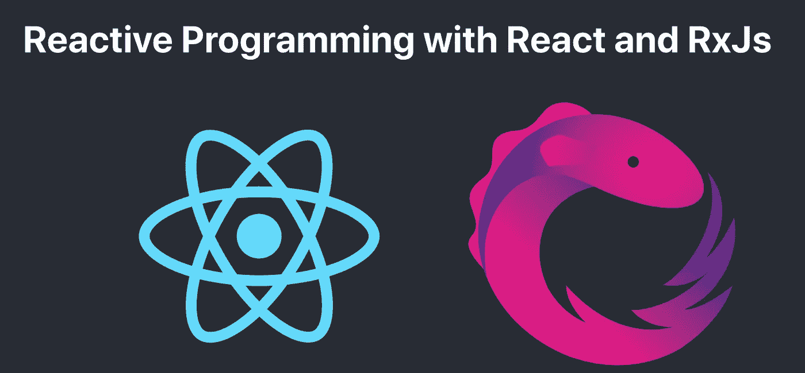
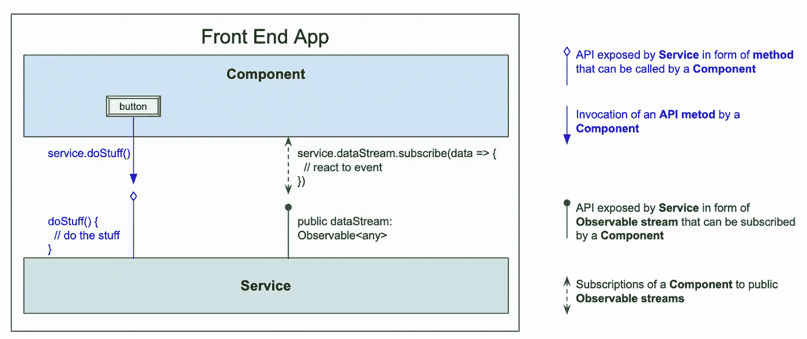
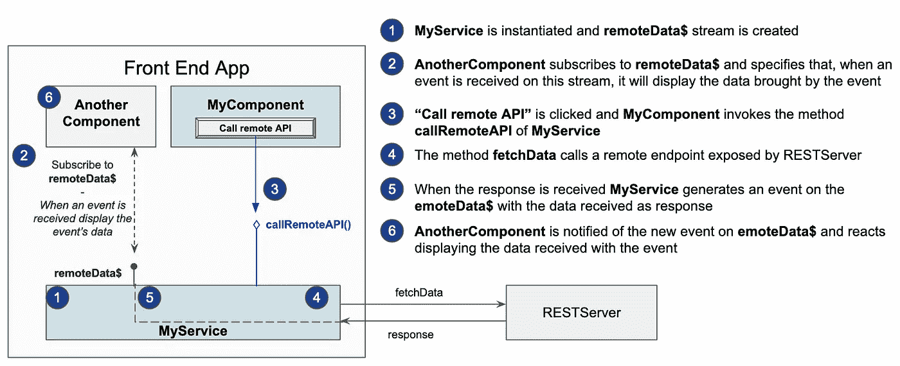
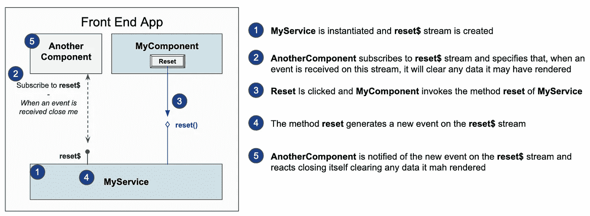

# 用 React 和 RxJs 进行反应式编程

> 原文：<https://betterprogramming.pub/reactive-programming-with-react-and-rxjs-88d2789e408a>

## 减少依赖性，增强模块化，鼓励共享公共逻辑，并提高可测试性

图片由作者提供。

反应式编程正在成为前端开发的流行范例。在本文中，我们旨在重温这一概念背后的关键思想，看看它可以应用于反应的方式，以及它可以带来哪些好处。

采用反应式编程和带有 React 的 [RxJs](https://rxjs.dev/) 可以帮助减少依赖性，增强模块化，鼓励应用程序之间共享公共逻辑，并提高可测试性。

和 React 一起，我们将只使用 RxJs，JavaScript/TypeScript 的反应式扩展。不需要其他外部依赖。

# 反应式编程:基本思想

> “反应式编程是一种与**数据流**和**变化传播相关的**声明式**编程范例。**——[维基百科](https://en.wikipedia.org/wiki/Reactive_programming)

这个定义背后的基本思想是，对于反应式编程，应用程序逻辑是基于数据流的，数据流是一段时间内的事件序列。每个事件都可以带来数据。

我们的程序预先声明它们对哪些流感兴趣，如何转换它们，以及当某些事件发生时如何反应和改变应用程序的状态。一旦这个意向声明完成，应用程序就可以实际启动了。应用程序中的所有内容都将来自我们声明中的事件流。我们可以说，应用程序只是随着时间的推移自动展开，将事件流转化为所需的行为。

在本文的其余部分，我们将看到一种在 React 应用程序中实现这些概念的方法，使用简单的示例来使这些概念具体化。

# React 应用分层:组件和服务

我们用 React 实现的反应式编程从两层组织应用开始:组件层和服务层。

## 组件层

根据这种设计，React 组件负责几个明确的任务:

*   UI 的呈现部分——这种呈现发生在应用程序开始时，或者作为对从外部世界接收的事件 *的*反应(例如，当由于调用外部 API 而接收到一些新数据时)。**
*   处理用户交互——拦截用户交互，并根据逻辑决定将哪个*命令*发送给外界。该组件不执行该命令。它只是发送它。

如果一个 React 组件——至少使用这种方法——只有*对事件*做出 *反应，并发送*命令*，那么我们需要*其他东西*来生成这样的事件并执行这样的命令。我们称之为服务。*

## 服务层

服务是一个类的实例，它代表组件或其他服务执行*命令*，并生成组件可以*对其做出*反应的*事件*。

为了履行这样的职责，服务为客户端公开 API，可以采取两种形式:

*   当客户端想要执行一个*命令*时可以调用的公共方法。
*   如果客户端希望*对* 事件做出反应，它可以订阅事件流。这样的流被实现为 RxJs `Observables`。

服务公开和客户端组件使用的 API

如果我们严格遵守这些职责，React 组件最终在逻辑上非常简单，而大部分工作由服务执行。稍后我们将对此进行详细阐述。

# 组件和服务交互

但是这个机制是如何更详细地工作的呢？让我们考虑一些典型的例子。

## 组件和远程服务之间的交互

让我们考虑一个仅由两个组件组成的简单应用程序:`MyComponent`和`AnotherComponent`。点击`MyComponent`的“调用远程 API”按钮，调用远程服务。这样调用返回的数据应该由`AnotherComponent`显示。

为了以一种被动的方式完成这一行为，我们可以创建一个服务(`MyService`)并组织应用程序各个部分的交互，如下所示:

远程端点调用的反应式实现

*   app 启动时，`MyService` 被实例化。因此，创建了`remoteData$` 流(一个`MyService`的实例变量)。
*   `AnotherComponent`订阅`remoteData$`并指定一旦接收到事件就在哪里显示数据。这是我们的应用程序的声明部分(即，我们告诉我们的程序我们对哪些事件流感兴趣，以及当这些事件流上发生事件时，应用程序必须如何做出反应)。应用程序的行为是这种声明的结果。
*   当点击“调用远程 API”时，通过调用`MyService` *的`callRemoteAPI`方法向`MyService`发送命令。*
*   `callRemoteAPI`方法执行命令调用远程端点。
*   一旦`MyService`收到响应，它就会在`remoteData$`流上生成一个新事件，并将收到的数据作为响应。
*   订阅了`remoteData$` 流的`AnotherComponent`被通知新事件，并通过在 UI 上呈现数据来对事件做出反应。

## 一个组件与另一个组件的交互

现在让我们考虑用户点击`MyComponent` *的“复位”按钮的情况。*在这种情况下，我们希望`AnotherComponent` 清除由于调用远程端点而显示的任何数据。

在这种情况下，交互描述如下:

两个组件之间交互的反应式实现

*   在应用程序开始时，会创建`MyService`和`reset$`流。
*   `AnotherComponent`订阅`reset$`流，并指定当它在该流上收到通知时，它将通过删除它可能已经呈现的任何数据来做出反应。
*   点击“复位”后，`MyComponent` 通过调用的`reset` API 方法*向`MyService` 发送命令。*
*   这种方法在`reset$` 流*上生成一个新事件。*
*   `AnotherComponent`通过清除它可能已经呈现的任何数据来对其做出反应。

# 如何编码

现在，这种反应式编程的方法已经通过它的基本原理进行了说明，我们可以更具体地看一下实现上面显示的两个基本交互的代码。

## *MyService*

首先要做的是编码`MyService`。正如我们已经看到的，`MyService`提供了作为 API 的:

*   两种方法:`callRemoteAPI`和`reset`
*   两个流:`remoteData$`和`reset$`

我们来推理一下`callRemoteAPI`。首先，它从调用`REST`端点返回的`Promise`中创建一个 RxJs `Observable`。然后，它使用`tap`操作符通过`next`方法通知`_remoteData$`主题上的新事件。`_remoteData$`是私人的。我们不想公开它，因为只有`MyService`可以在它上面生成事件。我们想要公开的是一个纯`Observable`流，这是通过使用`asObservable`方法从`_remoteData$`获得的`remoteData$`流来完成的。

我们刚刚描述的是在服务提供的 API 中经常遇到的一种模式:API 方法完成工作(在这种情况下，它是远程端点的调用，但也可以是其他任何东西),然后在作为`Observable` API 公开的主题上发出一个事件。客户端执行调用服务的 API 方法的命令，并通过订阅由服务公开为 API 的公共`Observable`来对事件做出反应。

## 提供服务的上下文挂钩

`MyService`是一个类，但是我们的组件需要的是这个类的一个共享实例，这样它们就可以共享相同的`Observable`流在它们之间进行通信。

React `context`钩子提供了一种简洁的方式。`context`钩子允许你定义一个默认值，这就是我们在这里利用的。

一旦我们以这种方式将`MyService`实例定义为`MyServiceContext`的默认值，任何需要访问服务实例的组件只需通过`useContext` API 获得`MyServiceContext`。

同时，React `context`的使用使得在需要时用不同的实现覆盖`MyService`变得非常容易。

## 控制呈现的状态挂钩

如果我们看看前面定义的例子中的`AnotherComponent`,我们会看到它根据以下逻辑控制渲染:

*   当从远程端点获取的数据到达时，显示这些数据。
*   如果引发了`reset`事件，则清理 UI。

为了控制渲染，`AnotherComponent`使用`state`钩子定义了一些状态。

## 效果挂钩订阅和取消订阅可观察的流

现在的问题是`AnotherComponent`如何以及在哪里订阅`MyService`提供的流媒体。

当组件想要对事件做出反应时，它们订阅 API 流。对事件的反应通常意味着一些副作用，如组件状态的改变或在使用路由器的情况下导航到其他页面。这就是`AnotherComponent`的情况，它需要订阅由`MyService` ( `remoteData$`和`reset$`)提供的两个流，并在每种情况下做出适当的反应。首先，从事件接收的数据被传递给触发 UI 呈现的`setData`方法。对于第二种情况，不需要数据。触发`setData("")`清理 UI 的只是事件的通知。

在 functional React 中，`effect`钩子是专门用于运行副作用的地方，所以这是我们放置订阅逻辑的地方。

为 AnotherComponent.tsx 实现 useEffect

正如我们从代码中看到的，`remoteData$`和`reset$`流都使用了`tap`操作符来驱动副作用(在这种情况下，按照 RxJs 的建议，是组件状态的改变)。

使用返回一个`subscription`的`merge`函数同时订阅两个流。有了 RxJs，一旦不再使用`Observables`就要退订，这一点很重要。这由`useEffect`返回的函数保证。对于 React `useEffect` API 的定义，返回的函数在组件被卸载时运行。我们返回的函数执行`unsubscribe`，这就是我们在这种情况下要做的事情。

这个简单例子的完整实现可以在 GitHub 上找到。

# 经验法则

我们可以用几条经验法则来总结我们使用 React 进行反应式编程的方法:

*   组件中的订阅逻辑应该仅限于副作用，例如更改状态以触发重新呈现或导航到其他页面。因此，在组件的订阅逻辑中出现除了`tap`之外的任何操作符都应该是可疑的，我们应该质疑是否可以将它移到服务层。
*   由于上述原因，所有的流转换逻辑都应该局限于服务。
*   组件中用户交互的处理应该非常简单，仅限于使用相关输入调用服务的 API 方法。

# 轻组件和丰富的服务

如果我们遵循这种方法，组件仍然非常轻——至少尽可能轻。他们专注于处理用户交互和渲染。任何需要的计算和逻辑都应该在服务中实现。

另一方面，服务是普通的 JavaScript/TypeScript 类，不依赖于任何 React 库，可以包含丰富的逻辑和代码。我们看到的例子都是基本的，目的是关注设计原则。但是在真实的例子中，由服务实现的 API 方法和流转换可能非常复杂——至少是所需的复杂程度。

# 用 RxJs 应用反应式编程的好处

下面列出了采用这种方法的主要好处。

## 减少依赖性的轻量级状态管理

这是一个轻量级的状态管理实现。这是一个状态管理实现，因为服务实际上可以被视为一个存储应用程序状态的网络。它是轻量级的，因为它只需要 RxJs 作为依赖项，没有主要的样板文件。

## 增强组件的模块化

组件依赖于它们使用的服务，而不是它们所在的嵌套结构。适当传播可以用订阅来代替。对于深度嵌套的应用程序，这会导致代码的极大简化。

## 共享库

如果我们将所有的逻辑移到服务层，让组件来管理渲染和用户交互，那么在组件之间共享逻辑就变得更容易了，因为不同的组件可以共享相同的服务。甚至可以想象共享库只包含与一些后端集成的服务。不同的前端可以使用这样的库，它们必须与相同的后端进行交互。

## 可测试性(最后但绝对不是最不重要的)

服务包含了绝大部分的逻辑。服务是纯 JavaScript/TypeScript 类。因此，它们可以作为普通的 JavaScript/TypeScript 类进行测试，而不需要测试 ui 所涉及的所有额外的复杂性。我们甚至可以在纯 JavaScript 测试中模拟用户交互。该测试可以模拟整个用户旅程，并通过订阅相关的`Observable`流来检查预期的结果。

# 结论

我们已经用 React 和 RxJs 展示了一种实现反应式编程原则的方法。我们试图用非常基本的例子来阐明设计原则。我们还强调了这种方法的主要优势。

在后续文章中，我们计划展示如何将相同的原则成功地应用于更复杂和现实的应用场景。