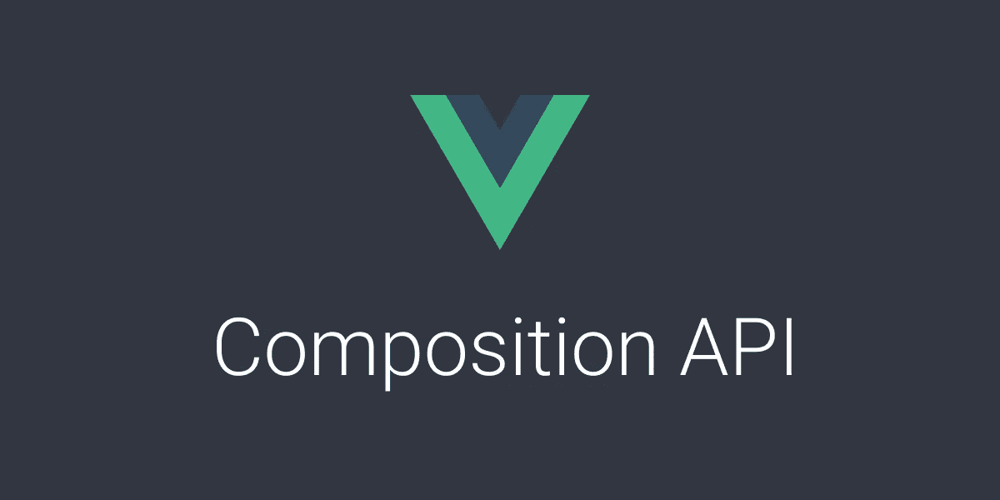
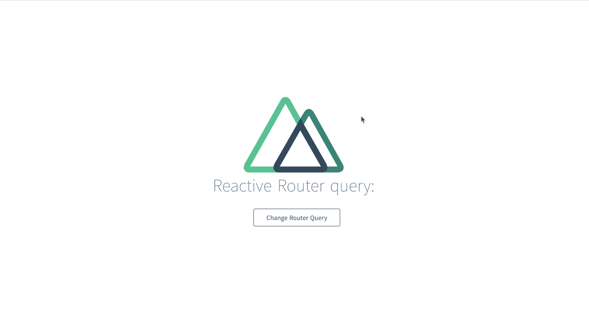
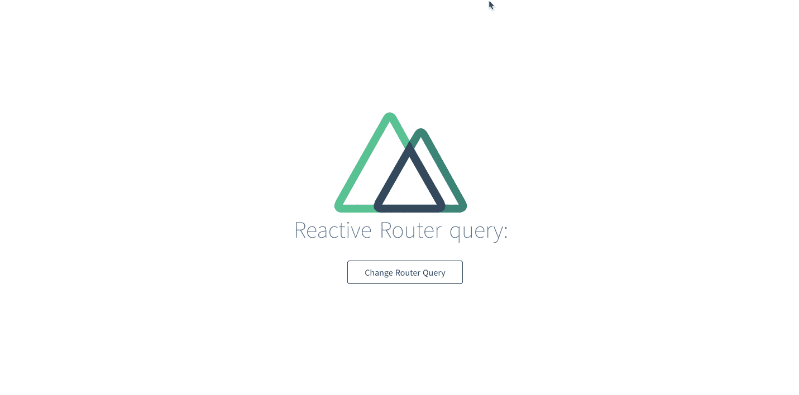

# 具有组合 API 的反应性 Vue 路由

> 原文：<https://betterprogramming.pub/reactive-vue-routes-with-the-composition-api-18c1abd878d1>

## 观看 Vue.js 路线



图片来源:作者

[Vue.js 组合 API](https://vue-composition-api-rfc.netlify.com/#summary) 是一组基于函数的 API，允许您灵活组合组件逻辑。这对于编写可重用的逻辑和使代码组织良好非常有用。

本文将介绍如何在 Vue 项目中直接观察 route 对象。

下面是 GitHub 中的最终代码库:[manakuro/reactive-vue-route-in-composition-API-example](https://github.com/manakuro/reactive-vue-route-in-composition-api-example)。

# 设置 Nuxt 项目

为了快速开始，我们将创建一个 [Nuxt](https://nuxtjs.org/) 项目:

```
npx create-nuxt-app my-app
```

安装后，您可以通过运行以下命令来启动 dev 服务器:

```
yarn dev
```

# 设置合成 API

安装合成 API:

```
yarn add @vue/composition-api
```

创建一个`plugins/composition-api.js`:

```
import Vue from 'vue'
import VueCompositionApi from '@vue/composition-api'

Vue.use(VueCompositionApi)
```

将其添加到`nuxt.config.js`中的插件:

```
plugins: ['~/plugins/composition-api'],
```

# 添加设置功能

既然我们可以在 SFC 中使用组合 API，那么让我们来利用这个特性。

假设我们有一个按钮，可以像这样更改 URL 中的查询参数:

当您想在设置功能中使用`route`时，您可以通过`ctx`来访问它，它包括 Vue 实例对象。

让我们看看它是如何工作的:



我以为点击按钮后文本会变成`React Router query: handle my query!`。但它没有改变，因为路由对象只是一个普通的对象，而不是一个反应性的对象。

为了使它工作，我们需要通过传递一个引用来使路由具有反应性。

将代码更改为:

我们添加了一个 reactive `state`，包括 route 对象。`reactive`函数等于`Vue.observable`，使一个对象具有反应性。在内部，Vue 在由`data`函数返回的对象上使用它。

我们通过使用`watch`函数使`$route`可见，因为我们需要在`$router`改变一些东西后用一个新的对象更新`state.route`对象。

让我们看看它是如何工作的:



很好。效果很好。

现在我们已经完成了，我们想让路线在整个项目中更容易重用。

为此，我们将提取代码并创建`useRouter`作为钩子函数。

让我们创建`hooks/useRouter.ts`:

`toRefs`在从组合函数中返回反应对象时非常有用，可以在不损失反应性的情况下析构返回的对象。

然后我们编辑 Vue 文件:

很好！这是一个非常具有声明性的函数，使它更容易重用。

# 结论

我们已经介绍了如何使用复合 API 来观察 route 对象。组合 API 的关键思想是使代码有组织、可读和可重用。如果你发现自己在设置函数中写了一堆代码，就试着按关注点分开，创建一个`useXXX`函数来重用它。你可以在 GitHub 上看到[一些代码](https://gist.github.com/yyx990803/8854f8f6a97631576c14b63c8acd8f2e)的例子。

我希望这能对你有所帮助。

下面是 GitHub 中的最终代码库:[manakuro/reactive-vue-route-in-composition-API-example](https://github.com/manakuro/reactive-vue-route-in-composition-api-example)。