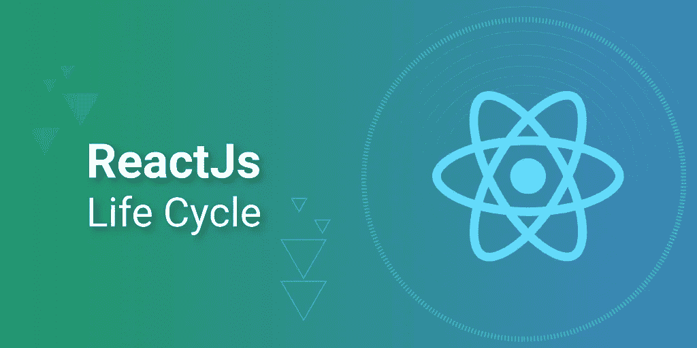
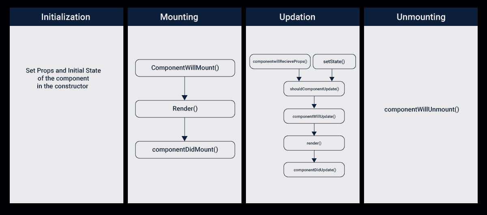
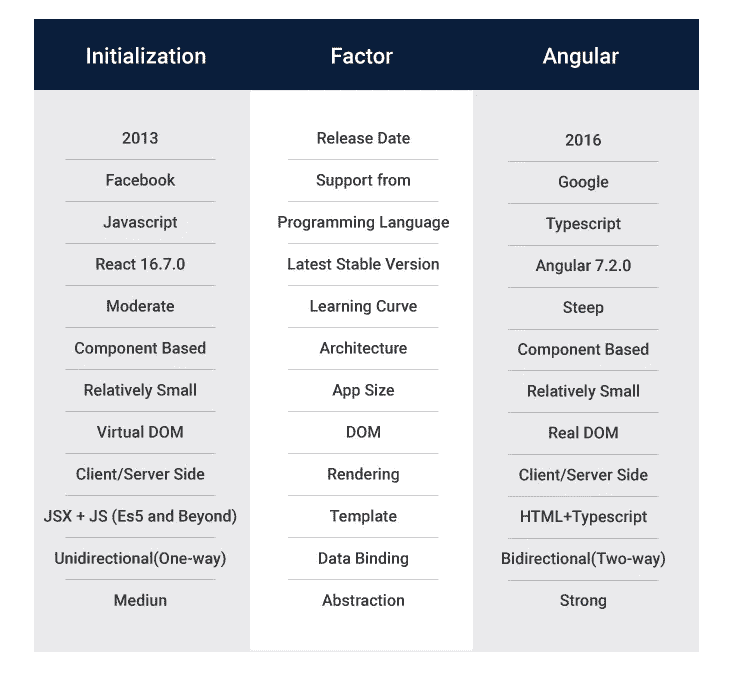
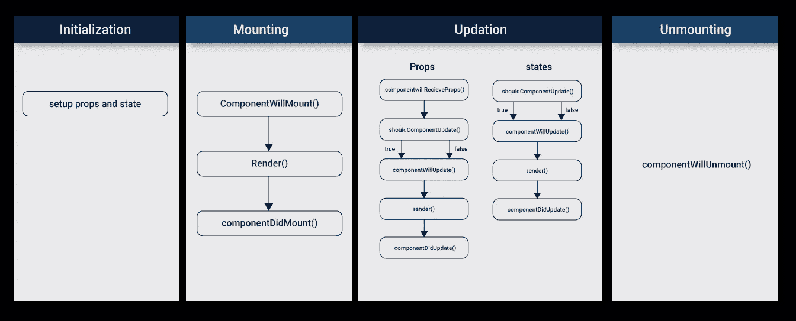
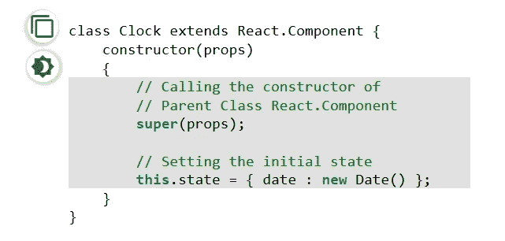

# React.js 生命周期—初始化、安装、更新和卸载

> 原文：<https://betterprogramming.pub/reactjs-lifecycle-initialization-mounting-updating-unmounting-8ec22a804118>

## 理想情况下，React.js 的生命周期分为四个核心阶段

React.js 生命周期是一个广泛的工具，可用于设计令人难忘的网络体验。它是开发领域中最健壮的方法之一，允许我们创建面向 UI 的应用程序。

这些应用程序可以在网上发布，让更多的人来消费。虽然 React.js 定期更新，但核心功能遵循生命周期路线。

React.js 组件上升，以循环的形式催生其他组件。这使得整个过程更加高效和精益。

理想情况下，React.js 的生命周期分为四个核心阶段。

# React.js 生命周期—初始化、安装、更新和卸载

在开发周期中，每个阶段都有其独特的用途，并且需要执行多种操作。开发人员可以编写特定的命令，以确保用户在使用应用程序时获得出色的结果。这是工程师可以编写正确的 React.js 服务的地方。

用户也可以尝试这个应用程序，并发现它每次都工作(按照编程)。这是因为 React.js 开发人员遵守生命周期协议，为他们创建了一个独特的功能性应用程序。

无论是在线计算器还是图书馆的参考指南，UI 都会准确地对命令作出反应，因为它贯穿了整个生命周期。

# React.js 是做什么用的

React.js 是一个 JavaScript 库，可以用来设计吸引人的用户界面。React.js 背后的核心技术允许用户无缝地与在线体验进行交互。

没有通过云集成的更新代码或新功能。处理在现场完成，最终计算的延迟很低。

这可以用来设计一个天气应用程序，一个简单的登录系统，甚至一些更复杂的在线订票应用程序。

React.js 开发人员熟悉这项技术至关重要，因为它可以增强他们的编码技能，从而创造更难忘的体验。他们可以利用 React.js 创建更多独特的在线应用，使网站/应用在市场中脱颖而出。

此外，React.js 是一种流行的语言，所有开发人员都应该对它有一个基本的了解。

> “无论是技术还是产品，我们都关注那些拥有基本解决问题技能的人。如果我们招聘前端，我们会理想地去找有 React.js 经验的人。
> 
> *我们也有一种“雇佣&培训”的模式，但考虑到这主要是一家初创公司，我们也需要有经验的人来平衡它。我们的团队两者兼而有之。”— Nitin Chandra，NestAway 产品负责人。*

从通用性的角度来看，React.js 又赢了。它具有多种特性和功能，可以随着时间的推移而利用。

从强大的结果角度来看，React.js 在这里也很有帮助。它可以与人工智能和机器学习系统合作，创建更强大的最终解决方案。

当编码环境得到简化时，React.js 在其部署的生命周期中工作得最好。这就是为什么许多 React.js 项目要求编码人员在提到的生命周期参数内工作。

# React.js 的优势

随着脸书开发 React.js，它具有一些令人兴奋的功能，使其有别于传统的应对机制。有些人甚至会将它与 Angular 进行比较，但当我们回顾技术方面时，优势更加明显。

## 网络和移动应用

React.js 旨在满足日益增长的对更强大应用的需求。由于反应堆的激增，网络和移动应用增长如此之快。

程序员可以花时间学习 React.js 背后的基础知识，并从一开始就着手开发复杂的应用程序。由于该库是为 React.js 开发人员更有效地编码而创建的，因此它是在动态环境中工作时需要学习的顶级语言。

> “我们的免费开源产品叫做 P21 社区。这是一个 Java/React.js 应用程序，已被大多数制药行业用于在提交给 FDA 之前验证数据。
> 
> *大型制药公司历来使用社区，但目前，其主要受众是小公司、生物技术公司和需要运行一次以进行验证的个人。”— Brad Moran，顶峰 21 数据技术公司的创始人。*

虚拟 DOM 允许浏览器和 web 应用程序之间的高级连接。这将使工程师能够应对集成和连接方面的多重挑战。

*   适应性框架

使用 React.js 最显著的优势之一是它作为一个框架是灵活的。这是一个多功能的图书馆，允许下行信息权威。

该报告确保较新的组件不受可用父信息的影响。这使得 React.js 开发人员可以在更长的时间内编写独特的特性。

适应性融入到整体架构中，同时提供更显著的好处。

## 动态更新内容

React.js 中构建的网络具有令人难以置信的动态性，使得所有内容都显示为更新的。该框架更轻，并且可以扩展以照顾可移植性。

代码模块也可以帮助从已建立的渲染中移动编曲。由于内容是动态更新的，因此 JavaScript 框架中的并发性更强。

这允许开发人员在 React.js 框架中存储重要信息，并在另一个上下文中再现这些信息。

# React.js 的挑战

唯一足够重要的挑战是处理 UI 和 MVC 框架。有时，更新时间比预期的要长，并且可用的文档有限。

这就是 [React.js 社区](https://reactjs.org/community/support.html)的用武之地，它提供了对该领域更深入的了解。它还可以创建一个更健壮的库，编码人员可以在其中进行加减运算。他们可以利用该技术来满足他们自己对编码模式的独特需求。

React.js 比市场上的任何其他替代软件都更健壮、更好用。从 Angular 到 React.js 也是一个更干净的移动，因为在使用 React.js 库时有更多的灵活性。

通过基于 JavaScript 和 JSX(一个 PHP 扩展)，结果是一个高度可重用的 web 体验元素集群。由于这个原因，React.js 越来越受欢迎，越来越多的公司开始雇佣 react . js 程序员。

在构建前端体验的最灵活语言的竞争中，它显然是赢家。

从 Instagram 到优步，每个人都在使用 React.js 来创造更好的用户体验。推动用户增长的多种应用程序正在使用技术。

由于 React.js 提供的规模和灵活性，研究它的生命周期也是必要的。

# React.js 生命周期的各个阶段

尽管 React.js 可用于物联网、人工智能和网络应用，但工程师需要遵循特定的途径来构建他们的表单。

这最好利用 React.js 生命周期来完成，从初始化到卸载。这使得 React.js 成为一个越来越可扩展的应用程序，它依赖于更好的处理和更有影响力的编码架构。

一个状态的属性受到定义的关系的影响。

# 初始化

这是 React.js 生命周期的第一个阶段，对于彻底理解和探索是至关重要的。这是用提供的属性和默认状态构造组件的阶段。

这是在组件类的构造函数中完成的。开发人员必须定义理想的属性和组件的初始状态。

下面分享一个参考例子。

https://www.geeksforgeeks.org/reactjs-lifecycle-components/

在填充组件的状态或属性时，理解组件是如何初始化的非常重要。这可以帮助他们在框架标记之外呈现正确的信息。您也可以在构思阶段早期这样做，以简化您的编码方法。

JSX 主要依赖以下三项数据:

*   `error` —这是当系统中有错误或渲染有错误时显示的标准消息。
*   `loading` —加载是指应用程序获取 API 数据的时候。
*   `users` —从 API 中检索的数据也很关键。

这有助于在更大的用户界面模块中启动成功的编码架构。

当组件在构造函数中设置初始状态时，您可以在以后使用`setState`方法更改它。当您走向生命周期的另一端时，这为您的编码提供了更多的灵活性。

`defaultProps`也被定义为组件的属性，这样你就可以识别道具的默认值。您可以稍后用新的属性值来覆盖它。

然后，您可以设置默认值，应用程序可以将这些值用作默认状态。这种默认状态可以在多个应用程序中多次使用。

正确编写这部分代码很重要，因为它为生命周期中的下一层奠定了基础。

# 增加

这是生命周期的下一个阶段，也是发布的关键阶段。在您准备好包含基本需求、状态和属性的代码之后，您需要将组件安装到浏览器中。

这是通过浏览器 DOM 完成的，这个阶段为您提供了合适的 React.js Hooks 方法，用于拟合之前和之后。

以下是您应该熟练掌握的关键术语:

## **渲染**

Render 就是在这种状态下将组件装载到浏览器上。这是一种经典的方法，每次提供相同的输入时都会给出相同的输出。

这是 React.js 编码框架中广泛使用的标准函数。

## **组件将安装**

这是一个需要记住的关键函数，因为它是在即将安装 reach 组件之前执行的。DOM 的挂载在这个阶段之后就完成了，在这个阶段你可以输入所有你想让程序做的事情。

它还会在组件的生命周期中执行一次，并在您第一次渲染程序之前发生。它还用于初始化状态或道具，使其成为一个可以利用的健壮组件。

## **组件安装**

这是在组件挂载 DOM 后执行的最后一个 React.js 钩子方法。它在生命周期中执行一次，发生在第一次渲染之后。

工程师可以通过这种方法访问 DOM，并初始化适当的 JS 库。使用这个组件可以有效地访问 DOM。

您还可以初始化其他几个可以合并到最终输出中的库。您可以在这个方法下进行正确的 API 调用，以便能够以正确的方式检索数据。

# 更新

当组件在浏览器上被采用时，第三阶段开始。这可以通过从程序接收新的更新来增长。用户可以与程序交互，并且组件可以相应地更新。

开发人员通常可以通过几种主要方式来更新组件。他们可以向命令发送新的道具，或者完全更新状态。根据工作的复杂程度或规模，他们可以选择任何一种方法并让程序运行。

以下是对理解至关重要的挂钩方法:

## **shouldComponentUpdate**

方法告诉程序更新时呈现的状态。

如果正在更新新的道具或规则，可以完成或跳过渲染。这对于正确编码很重要，因为程序中也有不断发展的状态。

将方法更新为`true` / `false`是正确的方法。此处默认为`true`，可以根据代码更改。

## **组件将更新**

这在先前的方法返回`true`的答案时执行。如果在返回响应之前需要进行一些预先的计算，那么它将用于准备即将到来的渲染。

对于更复杂的程序，也可以使用这种方法。

## **componentiddupdate**

然后，当更新的组件也在 DOM 中更新时，执行这个操作。您可以启动新的库来重新加载，以便在整个过程中维护更新的程序。

根据核心需求，可以相应地触发渲染。

# 卸载

卸载的最后一个阶段非常重要，因为它不需要组件，并从 DOM 中卸载。作为最终状态，它被设计为通过卸载产生结果。

下面是卸载时使用的基本方法:

## **组件将卸载**

这是生命周期中的最后一个方法，因为它与核心卸载和从 DOM 中移除有关。组件的清理也在这里执行。

当用户想要从他们的浏览器中清除程序时，这用于注销用户。

# 结论

当我们从初始化到卸载时，生命周期为开发人员提供了一个健壮的模块。组件可以遵循绘制的路径，然后可以根据需要进行扩展。

这是一种更有组织的复杂用户界面编码格式。在每个交叉点，适量的信息和处理是必要的。

用户可以与应用程序进行交互，并获得相应数量的反馈和信息。这使得互动更有吸引力，结果出现得更快。

开发人员也可以按照 React.js 的生命周期系统地规划使用。

这将有助于开发者或离岸软件开发公司创建一个功能更多、占用资源更少、非常用户友好的应用程序。

生命周期组件的知识有助于开发人员基于 React 打造非凡的 web 应用程序！