# React 的上下文 API 解释

> 原文：<https://betterprogramming.pub/reacts-context-api-explained-baebcee39d2f>

## 关于 React 的上下文 API，您需要知道的是

来源:[戴夫·霍弗勒谈 Unsplash.com](https://unsplash.com/photos/gRCWHvBMWHs)

如今，编写 web 应用程序会变得极其乏味和复杂。如果您正在构建一个 React 应用程序，您有时会将数据从一个组件发送到另一个组件。然而，由于项目的复杂性，有时您不得不在组件之间发送`states`和`props`，从而进一步增加了复杂性。这就是 React 的[上下文 API](https://reactjs.org/docs/context.html) 非常有用的地方。

让我们首先发现为什么我们需要上下文 API。

# 什么是语境，为什么有用？

作为一个例子，让我们创建一个例子，其中我们建立一个电影列表及其各自价格的数据库。

让我们首先创建一个名为`Movies.js`的文件，并在其中定义状态。这些状态包含关于电影的值。

`Movies.js`

*   `Line 21–24`:使用`map`方法，通过`MovieList`组件显示所有处于`movies`状态的数组项。`MovieList`组件只是将`name`属性显示为标题，将`price`属性显示为段落元素。

我们已经在这个文件中渲染了`MovieList` 组件。`MovieList.js`文件包含以下代码:

这使用简单的`props`概念在页面上显示数据。关于`props`的复习，你可以阅读“[React](https://medium.com/better-programming/a-guide-to-props-in-react-d6980f947ea9)道具指南。”

在`App.js`中，我们需要做的就是渲染这些组件:

但是，我现在想构建一个导航栏，它将显示电影的数量:

`NavBar.js`

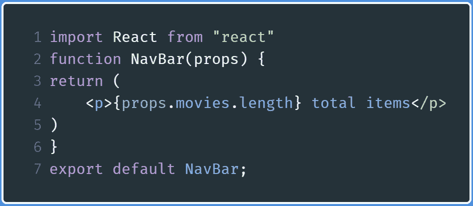

NavBar.js

我们只需传入`props`，它将返回数据库中的商品数量。我们就放在`App.js`里吧。这就是我们的问题所在。

在`App.js`中:

我们在 App.js 中遇到的一个小问题

我们应该在`NavBar`的`movies`道具里放什么，这样才能输出一个结果？有一个解决方案:我们可以在`App.js`中定义我们的`movies`状态，然后将它们传递给我们的`NavBar`组件。我们需要手动传递每一层的道具。这一点很重要。

然而，这种变通方法仍然与我们的目标相矛盾。它仍然使我们的程序显得复杂。

让我们用上下文来解决这个问题。React 上下文 API 为程序员提供了一种在组件之间传递数据的方式，而不必手动将属性从一个组件传递到另一个组件。

因此，这意味着 React 上下文 API 将帮助我们使我们的应用程序代码看起来更简单。

让我们首先从修改这个应用程序的代码开始。

# 上下文 API 的使用

## MovieContext.js

让我们首先将我们的`Movie.js`文件重命名为`MovieContext.js`。这个文件将负责向其他组件传递数据。

这里我们将从从`react`模块导入`createContext`开始。因此，将您的`import`语句修改如下:

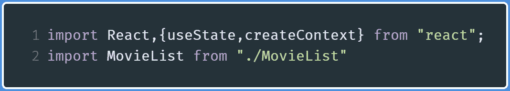

MovieContext.js 中的导入

这个`createContext`方法将帮助我们创建一个`Context`实例，这将有助于向各种其他组件发送数据。

接下来，让我们`export`我们的`Context`实例如下:

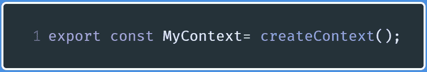

导出 MyContext 上下文实例

现在，我们将导出一个名为`MovieContext`的函数，然后将其定义如下:

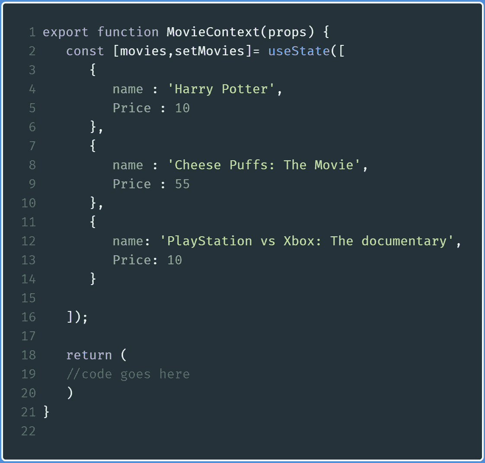

MovieContext.js 中的更多代码

*   `Lines 2–16`:我们`movies`状态的标准定义

在我们的`return`块中，编写以下代码(其中`code goes here`写在`line 19`上):

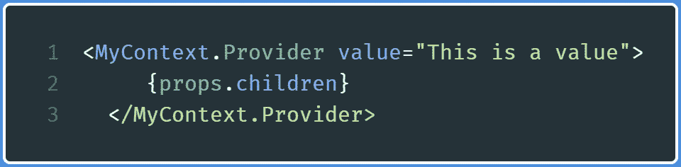

MovieContext.js 中的更多代码

这些代码行表明，我们现在完全能够在组件之间共享数据，而无需手动传递属性。

`line 1`中的`MyContext.Provider`标签中的`value`属性是我们将共享给各种组件的数据。

`line 2`上的`props.children`意味着将在`MovieContext`标签之间呈现的组件将可以访问位于`MovieContext`中的数据。

如果这个不清楚，不用担心。这将在本文后面通过代码解释。

## MovieList.js

如果您还记得，这个组件用于显示`movies`数组。

让我们修改这个文件。

首先，从`MovieContext`进口`MyContext`:

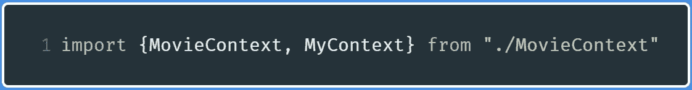

MovieList.js 中的导入

除此之外，像这样导入`useContext`:

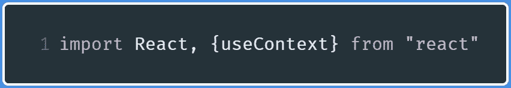

MovieList.js 中的进一步导入

在`MovieList`函数定义中，首先编写下面一行代码:

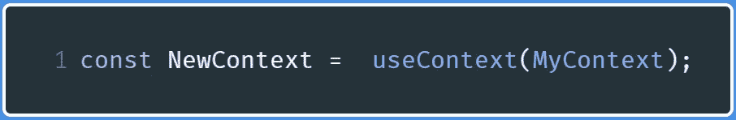

使用 MyContext 对象

这一行基本上声明了一个叫做`NewContext`的`context`钩子。这个`useContext`函数接受一个参数，询问它应该使用什么上下文对象。因为我们想要使用`MyContext`实例，所以我们将`MyContext`作为参数传入。

但是有一个问题:变量`MyContext`的值是什么？我们很快就会知道它的价值。在此之前，我们必须进一步修改我们的代码。

现在，在`NewContext`声明后编写以下代码:

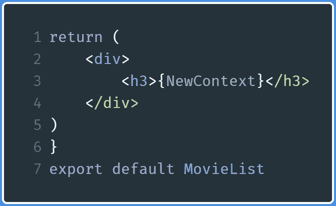

MovieList 中的更多代码

在这段代码中，我们只是输出`NewContext`的值，然后使用`export`语句，这样`MovieList`函数就可以在其他文件中使用。

最后，我们的文件将如下所示:

## App.js

首先，将以下导入添加到`App.js`:

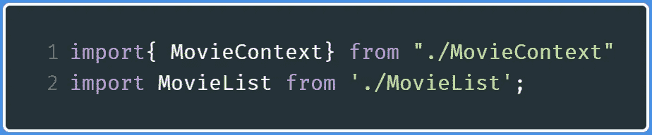

App.js 中的导入

现在，在`return`块中，编写以下代码:

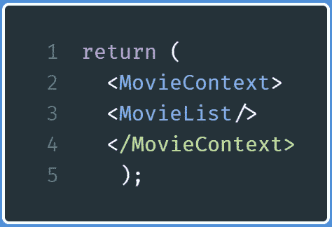

App.js 中的更多代码

该代码表示现在`MovieList`可以访问由`MovieContext`共享的数据。

最后，`App.js`看起来是这样的:

运行代码。这将是输出:

代码的输出

那么这根弦是哪里来的呢？

让我们回溯到`MovieContext.js`，找到下面这段代码:

在`MovieContext.js`:

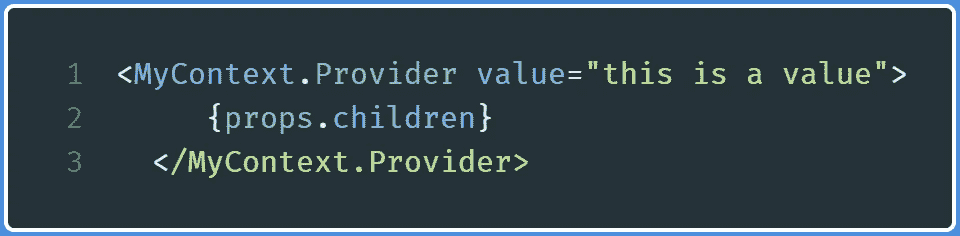

要在 MovieContext.js 中查找的代码

这意味着我们写在`value`属性中的数据将与组件共享。

我们已经使用上下文 API 成功地共享了一个字符串作为数据。现在让我们继续分享`movies`状态。

# 通过上下文共享状态

## MovieContext.js

在`MovieContext.js`中，在`return`块中，找到以下代码行:

要在 MovieContext.js 中查找的代码

因为我们想要共享`movies`状态，所以转到`value`属性，用`movies`状态替换`this is a value`，如下所示:

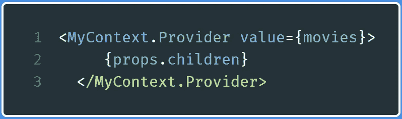

MovieContext.js 中要替换的代码

我们现在已经将`movies`数组作为可访问的数据进行了传递。

因为`movies`是一个数组，所以让我们使用`map`方法向浏览器显示数组元素。

## MovieList.js

转到`MovieList.js`文件，修改`return`块，如下所示:

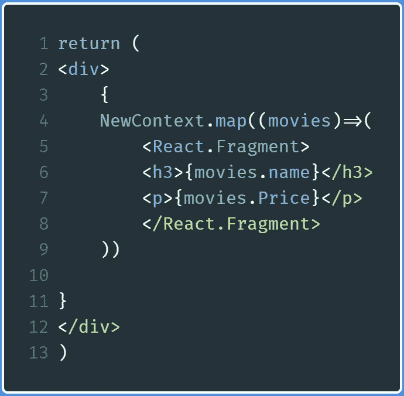

MovieList.js 中的代码

*   `Lines 4–8`:由于电影状态是一个数组，我们使用`map` array 方法来显示数组的元素。此外，因为 React 不允许我们呈现多个父元素，所以我们使用`React.Fragment`作为父元素。`React.Fragment`表示 React 中的空元素。

运行代码，输出如下:

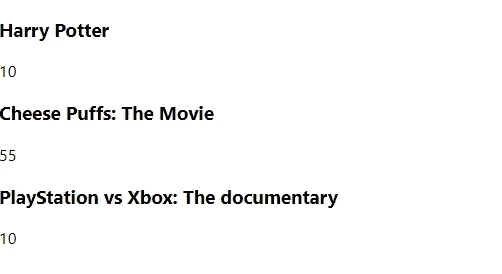

代码输出

我们终于展示了我们的`movies`状态，而没有把它作为道具传递下去。

假设我们想要向这个数组添加更多的元素，这意味着我们现在想要共享`movies`数组和`setMovies`函数。在 React 的世界里，这很容易实现。让我们继续下一部分。

# 通过上下文共享数据和功能

## MovieContext.js

在`MovieContext.js`中，找到下面的`return`块:

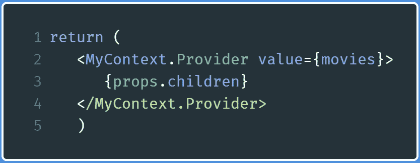

MovieContext.js 中的代码

因为我们想共享`movies`和`setMovies`函数，所以修改`value`属性，如下所示:

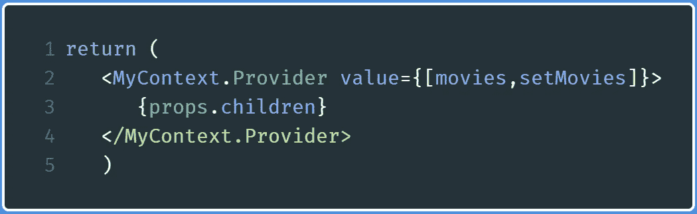

MovieContext.js 中的代码

这意味着我们已经发送了一个数组作为可访问的数据。第一个元素是`movies`数组，第二个元素是`setMovies`函数，用于设置`movies`数组的值。这一步意味着我们已经使用上下文共享了数据和函数。

## MovieList.js

我们将对这个文件做一个小的修改。

在`MovieList`函数中，找到这行代码:

MovieList.js 中的代码

然后将其替换为以下内容:

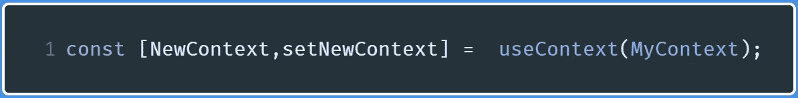

MovieList.js 中的代码

当我们发送一个数组作为可访问数据时，我们使用[数组析构](https://javascript.info/destructuring-assignment)来处理这个数组，以便它可以在`MovieList`中使用。

如果我们运行代码，我们将得到和以前一样的输出。

现在让我们继续使用共享函数，这样我们可以向`movies`数组添加元素。

## change 上下文. js

在这个文件中，我们将构建一个将电影添加到`movies`数组的表单。这将在`setMovies`功能的帮助下完成。

创建一个名为`ChangeContext.js`的新文件，并在其中写入以下代码:

*   `Line 5`:从`MovieContext.js`文件中带入各自的上下文对象。
*   `Lines 6–7`:我们初始化`name`和`price`钩子。这些钩子将被赋予它们各自文本域的值。
*   `Lines 8–13`:这些功能将改变`name`和`price`钩子的值。每当用户在文本字段中写入数据时，它们就会被执行(发生了一个`onChange`事件)。`event.target.value`是文本字段中的值。
*   `Line 14`:每当点击`Submit`按钮，就会调用`changeValue`功能。
*   `Line 15–17` : `event.preventDefault`阻止页面在表单提交时重新加载。因为我们不能将元素推入钩子，所以我们使用这个方法将元素添加到`movies`数组中。
*   这里我们正在呈现一个标准的表单组件。

## App.js

我们也将对这个文件做一些小的修改。

进口`ChangeContext`喜欢这样:

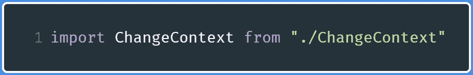

ChangeContext.js 中的代码

现在用下面几行代码替换`return`块:

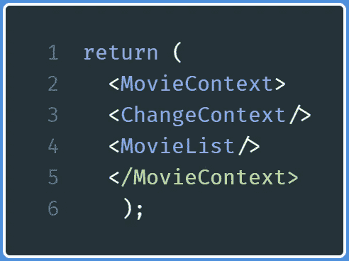

ChangeContext.js 中的代码

这意味着现在`ChangeContext`可以访问由`MovieContext`组件共享的数据。

运行代码将得到以下输出:

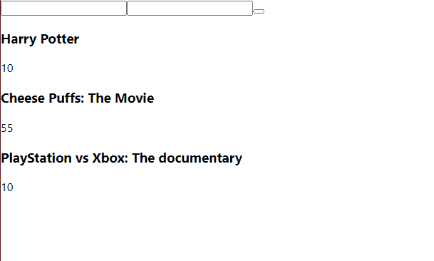

代码输出

请注意，我们输入了适当的输入，然后它相应地呈现在页面上。

## 导航栏组件

在简介部分，我们想要显示`movies`数组中元素的数量。现在，使用上下文可以做到这一点。

创建一个名为`Navbar.js`的新文件，并编写以下代码:

*   `Lines 1–2`:我们的标准进口
*   `Line 4` :使用`MyContext`上下文对象
*   `Line 6`:显示`movies`数组中元素的个数

现在转到`App.js`并将`NavBar`自动关闭标签插入到`MovieContext`标签之间，就像这样:

在`App.js`中:

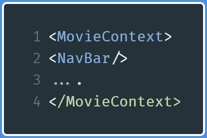

App.js 中的代码

这将是输出:

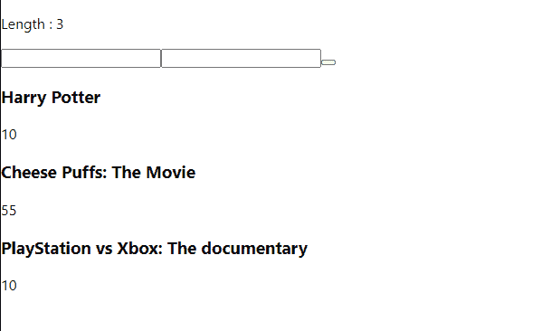

代码输出

正如您所看到的，每当我们向这个列表中添加一个新条目时，元素就会更新，相应的`movies`数组的长度也会显示出来。

# 概述

## 密码

在本教程结束时，这些文件是:

*   `App.js`

*   `MovieContext.js`

*   `MoviesList.js`

*   `ChangeContext.js`

*   `NavBar.js`

# 附加注释

*   要创建上下文:

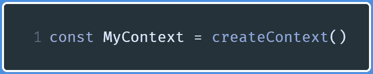

*   要共享数据:

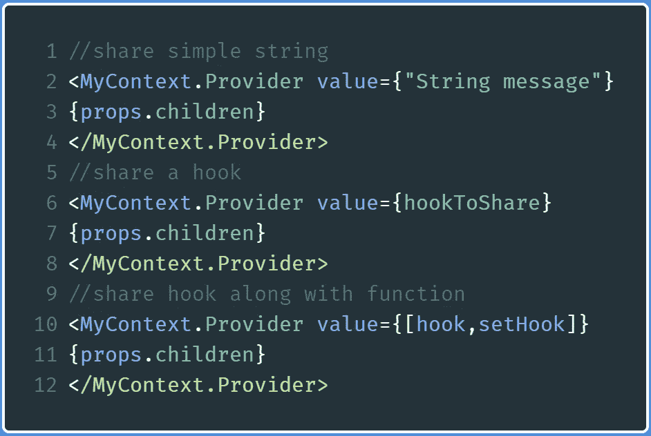

*   要使用上下文:

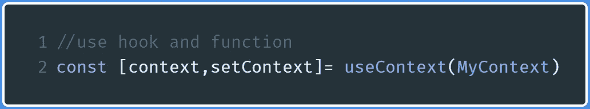

# 进一步阅读

*   [下面是新的上下文 API 的工作方式](https://www.youtube.com/watch?v=XLJN4JfniH4)——Wes Bos
*   [反应上下文](https://www.youtube.com/watch?reload=9&v=35lXWvCuM8o) —开发

# 结论

尽管上下文在实际软件中并不常见，但它仍然是一个非常有用和强大的 API，正如我们在本教程中所看到的。

如果有任何令人困惑的地方，建议您使用代码并分解上面的示例程序。此外，你也可以使用谷歌和 YouTube 资源来深入了解上下文。

非常感谢您的阅读！祝您愉快！

下一篇:[Node . js 中的简单网页抓取项目](https://codeburst.io/simple-web-scraping-project-with-node-js-b2a1710b4b37)
上一篇:[登录 Node 中的系统。Js](https://medium.com/better-programming/build-a-login-system-in-node-js-f1ba2abd19a?source=your_stories_page---------------------------)