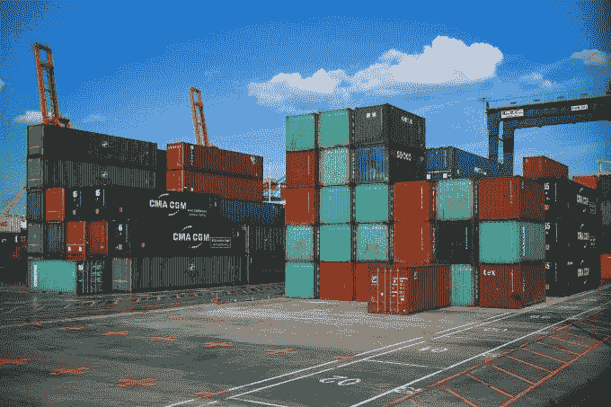
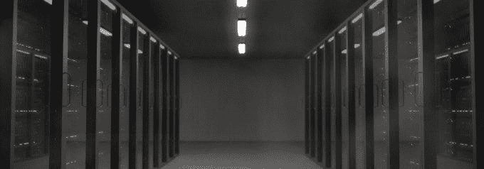
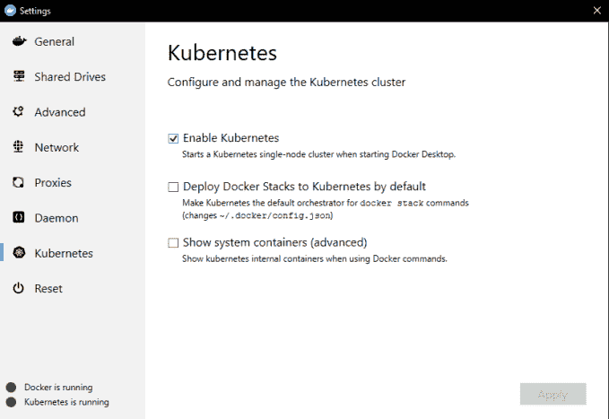

# 如果你仍然不知道 Kubernetes 是什么，请阅读这篇文章

> 原文：<https://betterprogramming.pub/read-this-if-you-still-do-not-know-what-kubernetes-is-6f763bcf13fd>

## 前所未有的协调

图片来自 [Pixabay](https://pixabay.com/?utm_source=link-attribution&amp;utm_medium=referral&amp;utm_campaign=image&amp;utm_content=2098877) 的[约安娜·苏萨](https://pixabay.com/users/YannaZazu-4665957/?utm_source=link-attribution&amp;utm_medium=referral&amp;utm_campaign=image&amp;utm_content=2098877)

Kubernetes (或 K8s)是一个开源的容器编排系统。它用于应用程序部署和扩展。它最近变得非常受欢迎，部分原因是云原生解决方案的兴起。

在这篇文章中，我将对 Kubernetes 进行高层次的概述，介绍术语，并解释 K8s 解决什么样的问题。

# 什么是容器？

来自 [Pixabay](https://pixabay.com/?utm_source=link-attribution&amp;utm_medium=referral&amp;utm_campaign=image&amp;utm_content=1845350) 的[像素](https://pixabay.com/users/Pexels-2286921/?utm_source=link-attribution&amp;utm_medium=referral&amp;utm_campaign=image&amp;utm_content=1845350)的图像

为了理解什么是容器编排系统，我们必须理解什么是容器。容器用于描述 OS 级虚拟化，这一原则允许您在一个内核上运行多个用户空间实例。

换句话说，它以更少的开销和更低的性能降级提供了虚拟化(在计算机中运行的计算机)。它也不需要特殊的硬件支持，甚至不需要第三方软件。

操作系统级虚拟化最流行的实现是`chroot`命令，Linux 用户应该很熟悉。`chroot`允许您更改 Linux 系统上当前会话的根挂载点。

它将允许您使用相同的内核，但是在一个隔离的文件系统中。额外的好处是，您还可以独立访问硬件，因为磁盘和设备在 Linux 中被表示为文件。

另一个操作系统级虚拟化软件是 Docker，它是专门为容器化应用程序而设计的。

这种方法让您确信您的应用程序将在您的开发和生产环境中以相同的方式运行。它还简化了部署和集成的过程。

在 Docker 中，容器是用一个`Dockerfile`来描述的，这是一个用 YAML 写的配置文件。它描述了该容器应该使用什么映像，构建和启动容器的过程是什么，以及要使用哪些网络/存储设备。

下面是一个典型的运行 [Express.js](https://expressjs.com/) 应用程序的`Dockerfile`:

# 为什么要编排容器？

现在你知道了什么是容器，让我们来谈谈如何编排它们。

正如维基百科所说，协调是:

> "计算机系统和软件的自动配置、协调和管理."

为什么我们需要在容器中自动化所有这些？这与微服务架构和扩展密切相关。

微服务架构是一种通过将计算机软件分解成独立的小服务来设计软件的方法。例如，认证服务、消息服务、资产服务等。

这实现了两个主要目标:

1.  鲁棒性。如果一项服务关闭(由于错误或计划维护)，系统的其余部分不会受到影响。
2.  缩放。微服务完美适应各种负载。如果您注意到您的资产服务消耗了太多的 CPU，但是消息服务几乎没有被使用，那么您可以将资源转移到资产服务，或者启动它的更多实例。

这两个问题都可以通过像 Kubernetes 这样的容器编排系统来解决。

它为您自动运行和管理容器，在容器失败时重新启动容器，并将工作负载分布在几个工作站上。

# 基本术语

在继续之前，我们需要了解 Kubernetes 的一些基本概念:

*   Pod —一组容器。这是 Kubernetes 空间中最小的可能单位。它还保证在同一台机器上运行，这意味着容器可以共享资源。
*   服务—一组 pod。服务通常是大型应用程序的半独立部分。
*   卷 Pod 的永久存储。默认情况下，当您重新启动 Pod 时，所有数据都将被擦除。卷用于永久存储数据。
*   ConfigMaps/Secrets —为容器提供凭证/密钥的机制。它们将被注射到需要它们的容器的环境中。

还有更多的概念要介绍，但是它们超出了本文的范围。

# 你为什么需要 Kubernetes？

图片由 [Elias Sch 提供。](https://pixabay.com/users/EliasSch-3372715/?utm_source=link-attribution&amp;utm_medium=referral&amp;utm_campaign=image&amp;utm_content=2160321)来自 [Pixabay](https://pixabay.com/?utm_source=link-attribution&amp;utm_medium=referral&amp;utm_campaign=image&amp;utm_content=2160321)

Kubernetes 是管理和维护大规模、高吞吐量应用程序的完美解决方案。

它也在许多云服务提供商(如 [Cloud Foundry](https://www.cloudfoundry.org/) )的引擎盖下使用，所以你可能正在使用它，甚至没有意识到它。有了 K8s，您将能够在几天内运行企业级应用程序。

不过，有一点要记住:库伯内特斯是*硬的。这是一个非常强大和有特色的系统，正确设置它需要很多技巧。*

如果你是没有系统管理经验的开发人员，最好交给 DevOps 的工程师。尽管如此，了解基础知识仍然是有益的。

# 玩弄它

如果你运行的是 Windows 或 Mac，你可以使用 [Docker Desktop](https://www.docker.com/products/docker-desktop) 在你的电脑上同时安装 Docker 和 Kubernetes。在 Linux 上，这有点复杂，但是我相信如果你正在使用 Linux，你知道你的方法。

注意:要在 Docker 桌面中启用 Kubernetes，请打开 *Kubernetes* 选项卡并选中*启用 Kubernetes* 框:

# 结束语

感谢您的阅读，希望您喜欢这篇文章。请在评论中告诉我你是如何在你的项目中使用 Kubernetes 的！

# 资源

*   [Kubernetes 网站](https://kubernetes.io/)
*   [Docker 桌面](https://www.docker.com/products/docker-desktop)
*   [教程](https://kubernetes.io/docs/tutorials/)