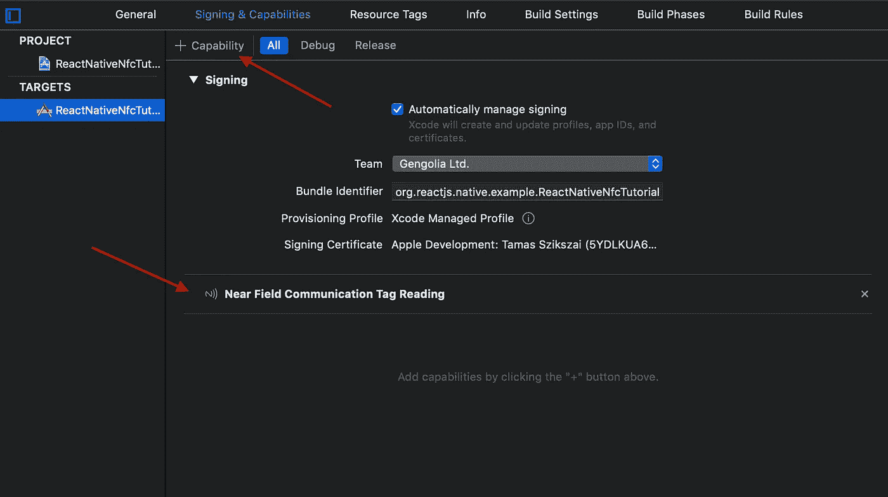

# 在 React Native 中配合 iOS 使用 NFC

> 原文：<https://betterprogramming.pub/reading-and-writing-nfc-in-react-native-d504a656eb78>

## 看一看 react-native-nfc-manager


随着 iOS 13，苹果终于开放了 SDK，在一些最受欢迎的 NFC 芯片上写入数据。

值得庆幸的是，最流行的(据我所知也是唯一的)NFC React 原生库之一， [react-native-nfc-manager](https://github.com/whitedogg13/react-native-nfc-manager) ，也添加了(一些)支持来做到这一点。让我们看看它在实践中是如何工作的！

TL；博士 1:懒得看书？观看视频:

TL；博士 2:只想要代码？[下面是代码！](https://github.com/lepunk/react-native-nfc-demo/tree/master/RNNFCDemo)

# 安装库

安装其实超级简单。首先，我们需要通过 [npm](https://www.npmjs.com/) 添加模块。

```
npm i --save react-native-nfc-manager
```

对于安卓来说，就是这样。对于 iOS，你必须做一些额外的步骤。首先，运行 pod 安装:

```
cd ios && pod install && cd ..
```

然后，您必须将下列行添加到您的`info.plist`(在`ios/YourProject`)中:

```
<key>NFCReaderUsageDescription</key>
<string>YOUR_PRIVACY_DESCRIPTION</string>
```

您还需要为您的应用添加“近场通信标签读取”功能:



# 脚手架

首先，让我们制作一些按钮和脚手架代码:

```
import React, { Component } from 'react';
import {
    SafeAreaView,
    StyleSheet,
    View,
    Text,
    TextInput,
    Alert,
    Platform,
    TouchableOpacity
} from 'react-native';
import NfcManager, { NfcTech } from 'react-native-nfc-manager';class App extends Component {
    constructor(props){
        super(props);this.state = {
            log: "Ready...",
            text: ""
        }
    }componentDidMount(){
        NfcManager.start();
    }componentWillUnMount(){
        this.cleanUp();
    }cleanUp = () => {
        NfcManager.cancelTechnologyRequest().catch(() => 0);
    }onChangeText = (text) => {
        this.setState({
            text
        })
    }writeData = async () => {

    }readData = async () => {

    }render(){
        return (
            <SafeAreaView style={styles.container}>
                <TextInput
                    style={styles.textInput}
                    onChangeText={this.onChangeText}
                    autoCompleteType="off"
                    autoCapitalize="none"
                    autoCorrect={false}
                    placeholderTextColor="#888888"
                    placeholder="Enter text here" /><TouchableOpacity
                    onPress={this.writeData}
                    style={styles.buttonWrite}>
                    <Text style={styles.buttonText}>Write</Text>
                </TouchableOpacity><TouchableOpacity
                    onPress={this.readData}
                    style={styles.buttonRead}>
                    <Text style={styles.buttonText}>Read</Text>
                </TouchableOpacity><View style={styles.log}>
                    <Text>{this.state.log}</Text>
                </View>
            </SafeAreaView>
        )
    }
}const styles = StyleSheet.create({
    container: {
        flex: 1,
        flexDirection: 'column',
        justifyContent: 'center'
    },
    textInput: {
        marginLeft: 20,
        marginRight: 20,
        height: 50,
        marginBottom: 10,
        textAlign:'center',
        color: 'black'
    },
    buttonWrite: {
        marginLeft: 20,
        marginRight: 20,
        height: 50,
        marginBottom: 10,
        alignItems: 'center',
        justifyContent: 'center',
        borderRadius: 8,
        backgroundColor: '#9D2235'
    },
    buttonRead: {
        marginLeft: 20,
        marginRight: 20,
        height: 50,
        marginBottom: 10,
        alignItems: 'center',
        justifyContent: 'center',
        borderRadius: 8,
        backgroundColor: '#006C5B'
    },
    buttonText: {
        color: 'white'
    },
    log: {
        marginTop: 30,
        height: 50,
        alignItems: 'center',
        justifyContent: 'center',
    }
});export default App;
```

这里不多解释了。

我们已经设置了一个输入字段，它将包含我们想要写入标记的文本。还有两个按钮，一个用于书写，一个用于阅读。最后，一个用于记录内容的文本字段。相当基础…

# 写入数据

老实说，在写这篇文章之前，我不知道有不同的 NFC 芯片。我干脆从亚马逊订了最便宜的，正好是 Mifare 超轻芯片组一。

不幸的是，该库在 iOS 上对这种芯片组的支持非常基本:你所能做的就是向芯片发送命令。

我的第一反应是订购一套支持更好的新标签。但是后来我开始谷歌东西，找到了 Mifare Ultralight 的[文档。](https://www.nxp.com/docs/en/data-sheet/NTAG213_215_216.pdf#page=41&zoom=100,0,793)

在第 41 页，文档描述了写入数据时需要发送的命令。下面是它在 React Native 中的样子:

```
writeData = async () => {
    if (!this.state.text){
        Alert.alert("Enter some text");
        return;
    }try {
        let tech = Platform.OS === 'ios' ? NfcTech.MifareIOS : NfcTech.NfcA;
        let resp = await NfcManager.requestTechnology(tech, {
            alertMessage: "Ready for magic"
        });let cmd = Platform.OS === 'ios' ? NfcManager.sendMifareCommandIOS : NfcManager.transceive;
        let text = this.state.text;
        let fullLength = text.length + 7;
        let payloadLength = text.length + 3;resp = await cmd([0xA2, 0x04, 0x03, fullLength, 0xD1, 0x01]);
        resp = await cmd([0xA2, 0x05, payloadLength, 0x54, 0x02, 0x65]) // T enYourPayloadlet currentPage = 6;
        let currentPayload = [0xA2, currentPage, 0x6E]; // nfor(let i=0; i<text.length; i++){
            currentPayload.push(text.charCodeAt(i));
            if (currentPayload.length == 6){
                resp = await cmd(currentPayload);
                currentPage += 1;
                currentPayload = [0xA2, currentPage]
            }
        }currentPayload.push(254);
        while(currentPayload.length < 6){
            currentPayload.push(0);
        }resp = await cmd(currentPayload);
        this.setState({
            log: resp.toString() === "10" ? "Success" : resp.toString()
        })//sendMifareCommandIOS
    } catch(err){
        this.setState({
            log: err.toString()
        })
        this.cleanUp();
    }
}
```

好了，别害怕，这其实很简单。我们来分解一下。

```
let resp = await NfcManager.requestTechnology(tech, {
    alertMessage: "Ready for magic"
});
```

这三行告诉引擎，您正在尝试与 Mifare Ultralight 芯片通信。iOS 将自动呈现标准 UI，执行将等待，直到这样的设备非常接近 NFC 读取器。

此时，芯片已准备好接受命令。在 iOS 上，你可以用`NfcManager.sendMifareCommandIOS`发送命令，它接受一个字节列表。

根据文档，所有的写命令都应该以`0xA2`开头，后面跟着你正在写的页面的地址。在我的芯片上，所有页面可以包含四个字节，它们的地址在`0x02`和`0x2C`之间。

`0x02`和`0x03`其实是保留的，所以你要写的第一页是`0x04`。

我们要写一个文本类型的记录，它应该遵循一定的模式:

1.  第一个字节是`0x03`。
2.  第二个字节应该是完整有效载荷的长度(它将是文本的长度+ 7)。
3.  第三个字节是`0xD1`。
4.  第四个字节是`0x01`。
5.  第五个字节是记录的长度(在文本记录的情况下，它将是文本的长度+ 3)。
6.  `0x54`->“T”字。
7.  `0x02`
8.  `0x65` - >字符“e”。
9.  `0x6E` - >人物“n”。
10.  你的短信。
11.  `0xFE`关闭记录。

这部分代码负责上述内容:

```
let text = this.state.text;
        let fullLength = text.length + 7;
        let payloadLength = text.length + 3;resp = await cmd([0xA2, 0x04, 0x03, fullLength, 0xD1, 0x01]);
        resp = await cmd([0xA2, 0x05, payloadLength, 0x54, 0x02, 0x65]) // T enYourPayloadlet currentPage = 6;
        let currentPayload = [0xA2, currentPage, 0x6E]; // nfor(let i=0; i<text.length; i++){
            currentPayload.push(text.charCodeAt(i));
            if (currentPayload.length == 6){
                resp = await cmd(currentPayload);
                currentPage += 1;
                currentPayload = [0xA2, currentPage]
            }
        }currentPayload.push(254);
        while(currentPayload.length < 6){
            currentPayload.push(0);
        }resp = await cmd(currentPayload);
```

# 读取数据

读取数据其实更简单一点。下面是实现的函数:

```
readData = async () => {
    try {
        let tech = Platform.OS === 'ios' ? NfcTech.MifareIOS : NfcTech.NfcA;
        let resp = await NfcManager.requestTechnology(tech, {
            alertMessage: "Ready for magic"
        });let cmd = Platform.OS === 'ios' ? NfcManager.sendMifareCommandIOS : NfcManager.transceive;resp = await cmd([0x3A, 4, 4])
        let payloadLength = parseInt(resp.toString().split(",")[1]);
        let payloadPages = Math.ceil(payloadLength / 4);
        let startPage = 5;
        let endPage = startPage + payloadPages - 1;resp = await cmd([0x3A, startPage, endPage]);
        let bytes = resp.toString().split(",");
        let text = ""for(let i=0; i<bytes.length; i++){
            if (i<5){
                continue;
            }if (parseInt(bytes[i]) === 254){
                break;
            }text = text + String.fromCharCode(parseInt(bytes[i]));
        }this.setState({
            log: text
        })
    } catch(err){
        this.setState({
            log: err.toString()
        })
        this.cleanUp();
    }
}
```

请求技术后，我们可以开始发送命令。文档的第 39 页解释了`FAST_READ`命令，它有一个非常简单的界面:

1.  请求的第一个字节是`0x3A`。
2.  第二个字节是你想读的第一页。
3.  第三个字节是你想读的最后一页。

在我们的实现中，我们首先读取第三页，它包含完整的有效载荷长度。根据有效载荷的长度，我们可以计算出需要请求多少个页面。

从这一点开始，我们将忽略文本记录的标题(`i<5`)，继续读取字符，直到`0xFE`结束符。

# 结论

仅此而已。当然，这只是一个概念证明。你可以用 NFC 技术做很多事情。

iOS 的这个库现在还处于非常早期的阶段，但是这个库非常活跃，所以我相信很快就会发布一个更好的 API。