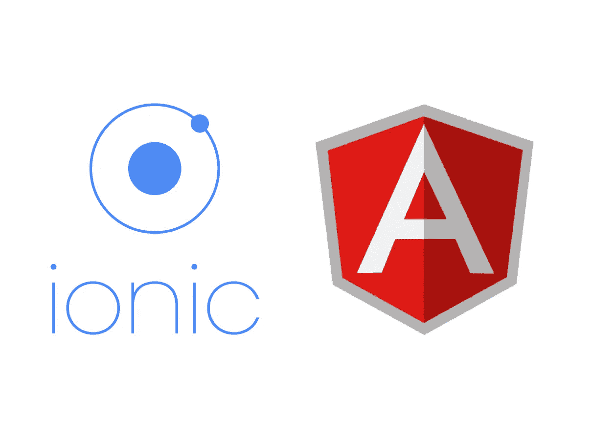

# 阅读 Angular 4/5 或 Ionic 2/3 项目中的本地 JSON

> 原文：<https://betterprogramming.pub/reading-local-json-present-in-an-angular-2-project-733bc3dda18e>



**更新:如果您使用的是 TypeScript 2.9 及以上版本，您可以使用 tsconfig.json 中的** `resolveJsonModule` **来访问 TS 文件中的 json 文件，如下所示:**

```
// In tsconfig.json:{ "compilerOptions": {
        ... "resolveJsonModule": true,
        ... },}// In your TS files:import * as products from "./products.json";//and then using them as:console.log(products.property)
```

**了解更多** [**这里**](https://www.typescriptlang.org/docs/handbook/release-notes/typescript-2-9.html#new---resolvejsonmodule) **。**

我最近在做一个 Angular 2 项目，该项目需要读取项目文件夹中的一个本地静态 JSON 文件。我在网上搜索 JSON 的阅读方式，发现:

```
private _productURL = 'api/products/products.json';    
getProducts(): Observable<any> {
        return this._http.get(this._productURL).map((response : Response) => <any> response.json())
        .do(data =>console.log(JSON.stringify(data))).catch(this.handleError);
}
```

这是一种流行的读取本地 JSONs 的方式。这里，我使用的是存在于 *@angular/http* 中的 Angular 2 HTTP 类。你会在很多网站上找到类似上面的代码。

接下来，我在浏览器的开发者窗口中启用了[离线](https://developers.google.com/web/tools/chrome-devtools/network-performance/reference#offline)复选框。

结果？JSON 没有加载。当应用程序离线时，Angular 2 HTTP 不工作。我甚至尝试为应用程序配置服务人员，但这是一个非常复杂的方法。

在网上搜了一天，挠头了一天之后，我尝试了一个解决方案。它实际上是有效的，但效率不是很高。我将完整的 JSON 转换为 typescript 文件中的变量，并导出它们，在需要的地方，导入它们并像这样使用:

```
//Creating a new typescript file and adding code like below:
export const varName = [{},{},..];//And then importing them in other files:
import { varName } from 'path';
console.log(varName.property);
```

使用这种方法有效，但也有一些缺点。它增加了应用程序的大小，并需要更多的内存来在运行时存储如此大的变量。

后来又搜索了几个站点，尝试使用 Node.js require 方法。

```
//Add this before class declaration:declare function require(url: string);//and later:let variable = require('path/to/your/JSON.json');//And using it as:console.log(variable.property);
```

再次，另一种方法，效果很好，但我在寻找一个更清晰的解决方案。所以，我在 stack overflow[上发了一个问题，并收到了 Ofer Herman](http://stackoverflow.com/questions/43345347/using-angular-2-http-offline-when-loading-json-in-local-project-folder/43365447#43365447) 的回答。他建议道:

首先，添加一个新文件`json-typings.d.ts`。

```
declare module "*.json" { const value: any; export default value;}
```

我把这个文件和 index.html 文件一起放在了 app 文件夹里。

其次，在所需的文件中导入所需的 JSON，如下所示:

```
import * as products from "./products.json";//and then using them as:console.log(products.property)
```

后来，我选择了最后一个，因为它似乎能更清楚地解决我的问题。