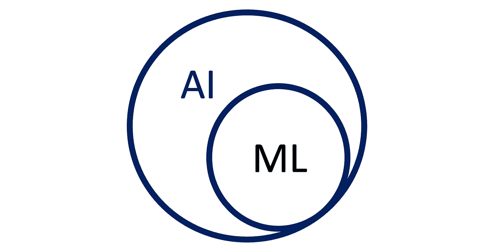
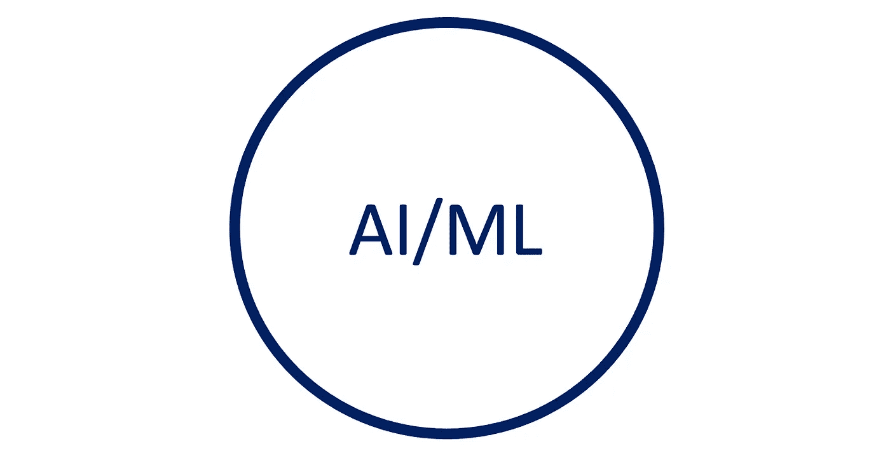
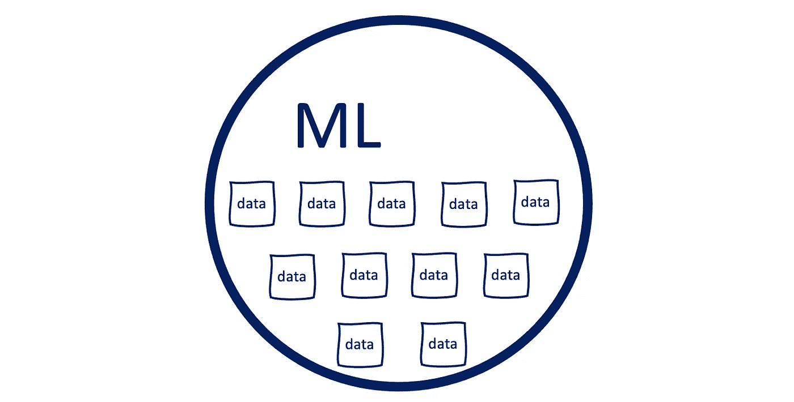
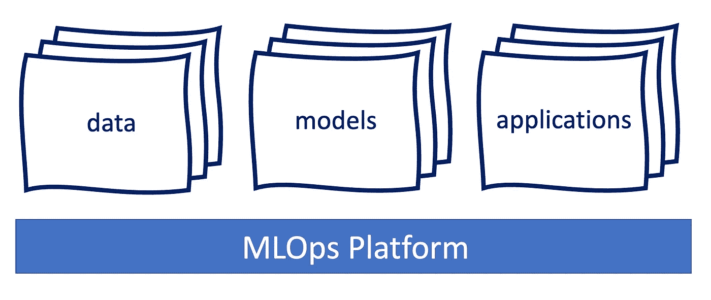
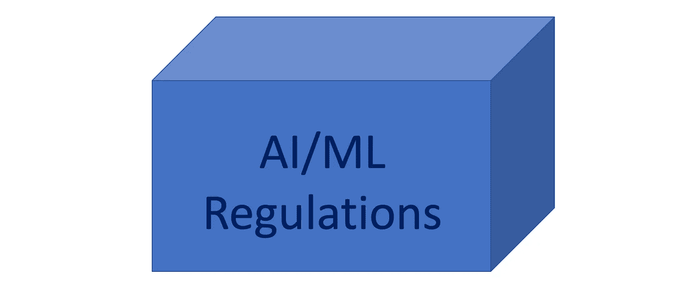

# 阅读首届 MLOps 会议的内容

> 原文：<https://betterprogramming.pub/reading-the-tea-leaf-from-the-first-ever-mlops-conference-7f507990a392>

## 机器学习的趋势

莎拉·多维勒在 [Unsplash](https://unsplash.com?utm_source=medium&utm_medium=referral) 上的照片

[Rev 3](https://rev.dominodatalab.com/) 于 5 月 5 日至 6 日在纽约侯爵万豪酒店举行。这是全球排名第一的 MLOps 大会，观众是数据科学家和 It 领导者。专家们聚集在一起，分享关于 MLOps 最佳实践的战略和实践见解，以推动其组织内的进步。

机器学习操作标准。这是一个端到端的 MLOps 生命周期，它收集数据、训练模型并构建应用程序。我们参加了会议，并从当前的 AL/ML 发展中了解到一些趋势，包括:

*   术语 AI 和 ML 可以互换使用。
*   机器学习做出客观的决策。
*   需要在一个平台上简化端到端的 MLOps 生命周期。
*   技术进步必须遵循人工智能规则。

# 术语 AI 和 ML 可以互换使用

人工智能(AI)用于描述模仿和显示人类认知技能的机器，这些技能与人类思维相关，如学习和解决问题。人工智能根据收集的信息/数据做出决策。

[机器学习](https://en.wikipedia.org/wiki/Machine_learning) (ML)是人工智能的一部分。它是对计算机算法的研究，可以通过经验和使用数据自动改进。

1959 年，计算机游戏和人工智能的先驱亚瑟·塞缪尔(Arthur Samuel)将机器学习定义为无需明确编程就能让计算机具备学习能力的研究领域。

严格来说，AI 是 ML 的超集。

作者图片

实际上，我们听到大多数演讲者交替使用术语 AL 和 ML。毕竟两者都指的是机器的决策能力。

作者图片

在整篇文章中，我们也交替使用术语 AI 和 ML。

# 机器学习做出客观的决策

当人类做决定时，有两件事需要考虑:

*   以前的经历
*   信息来源

根据以前的经验，人类的思维可能会受到许多认知偏见的影响，这些偏见会损害他们的判断，并使他们难以做出可预测的决定。

说到信息来源，今天的数字数据正呈指数级增长。如果给一个公正的专家足够的时间，他可以做出更好的决定。然而，人类的大脑可能没有处理这么多数据的能力。或者，我们创造捷径或经验法则来加速这个过程，这可能导致次优的决策。

出于这些原因，使用机器学习从数据中获得洞察力并采取相应行动是有意义的。凭借计算能力，机器学习探索原始的、无偏见的和大量的数据，并且很可能会产生客观的决策。

作者图片

Rev 3 关注企业如何通过更容易地访问基础设施、更好地跨团队协作以及更快的模型学习和迭代来释放突破性创新。会议有若干主题:

*   数据科学如果运用得当，将会推动企业和人类发生重大变革。
*   救命药可以更快上市。我们可以有更健康的作物，更好的客户体验，等等。
*   至关重要的是将点连接起来，建立在过去的工作基础上，并快速访问强大的 It 资源。

# 需要在一个平台上简化端到端 MLOps 生命周期

机器学习有三大资产——数据、模型和应用。数据源是数据来源的位置。它可能是一个数据库、一个数据集市、一个数据仓库、一个平面文件、来自物理设备的实时测量、抓取的 web 数据，或者任何来自静态和流数据服务的海量数据。

模型是一种算法的表达式，它通过大量数据来寻找模式或进行预测。模型是人工智能的数学引擎。对可以成为模型特征的对象没有限制，对机器学习的使用也没有限制。

这两者的结合产生了机器学习应用的无限可能。以下是一些首选:

*   社交媒体平台从用户的经历中学习来推荐朋友。
*   网站跟踪用户的行为来推荐产品。
*   制药公司从研究数据中获得洞察力。
*   汽车由计算机导航和操纵，无需人工控制。
*   情感分析决定了演讲者或作者的情感或观点。
*   电子邮件服务器检测垃圾邮件。
*   面部和语音识别用于身份验证。

机器学习在过去十年里取得了巨大的进步。收集数据、训练模型和构建应用程序都有标准化的方法。热门领域是在一个平台上简化端到端的 MLOps 生命周期，该平台支持数据科学家使用他们首选的工具、语言和基础架构以及 IT 中央资源管理、治理和安全性进行协作，而不会受到供应商的限制。

作者图片

# 技术进步必须遵循人工智能规则

人工智能是一项对行业、政府和公众具有颠覆性潜力的重要技术。它给企业和社会带来好处和炒作。然而，关于企业和社会应该如何解决真正自主系统的无数影响，还有许多问题。

人工智能系统可能是滥用的黑匣子。它们可以被黑客攻击；它们可能违反数据隐私和反歧视法，还可能对人造成身体伤害。

帕特里克·霍尔，BNH 大学的首席科学家。AI 在“数据科学家和首席执行官:你的 AI 违法了吗？”。他提醒技术公司在模型风险管理、计算机安全、数据隐私和非歧视法方面遵循可靠的人工智能风险管理实践。

AI.gov 是国家人工智能项目的所在地。它指出了推进美国在人工智能领域领导地位的持续活动。2020 年[国家人工智能倡议法案](https://www.congress.gov/116/crpt/hrpt617/CRPT-116hrpt617.pdf#page=1210)(第 E 部分，第。5001)于 2021 年 1 月 1 日成为法律，为整个联邦政府提供了一个协调的计划，以加速人工智能的研究和应用，促进国家的经济繁荣和国家安全。它列出了企业应该关注的最近与人工智能相关的出版物和事件。

作者图片

# 结论

我们参加了 Rev 3，这是全球第一大 MLOps 会议。这是一次奇妙的会面。内容充实且鼓舞人心，出席率很高，充满活力，制作细节非常出色。

感谢阅读。我希望这有所帮助。如果你有兴趣，可以看看[我的其他媒体文章](https://jenniferfubook.medium.com/jennifer-fus-web-development-publications-1a887e4454af)。

*注:感谢鼓励我写这篇文章的 Urian Chang、* *和其他 Rev 3 与会者。*