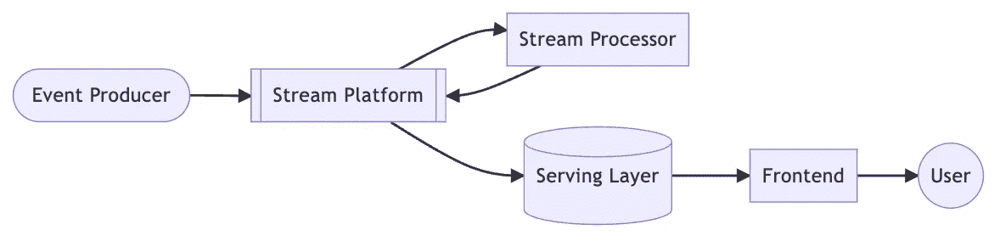
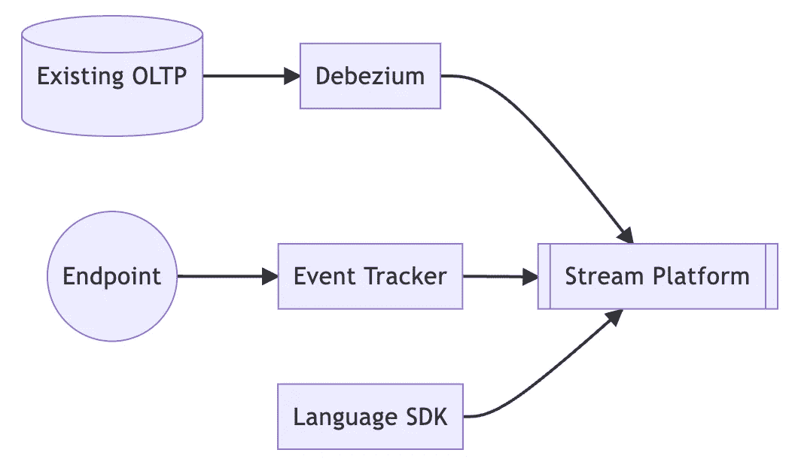

# 用于实时数据分析的基础架构堆栈

> 原文：<https://betterprogramming.pub/real-time-data-infra-stack-73c597ed05ee>

## 看看现有的流行选项

阿曼达·琼斯在 [Unsplash](https://unsplash.com/photos/feLC4ZCxGqk) 上的照片

之前，我们介绍了数据基础设施的[演进，我们将原始的数据块逐步演进为一个能够支持实时分析和各种数据治理的架构。](/evolutionary-data-infrastructure-4ddce2ec8a7e)

然而，在那篇文章中，我们并没有涵盖什么技术选择是可用的，而只是架构演进过程的高级视图。

在本文中，我们将重点关注实时分析的堆栈，并列出一些热门或逐渐流行的选项。

# 实时红外线

在开始之前，我们先简单介绍一下实时分析的整体架构。

正如我们之前提到的，整个实时基础设施的核心是流。

为了快速处理来自事件生产者的所有事件，流起着重要的作用，在流内部，有流平台和流处理器。流平台是流的代理，用于存储流并将其分发到处理器。并且处理器将在处理该流之后将该流发送回平台。

> *为什么处理器不直接向后传送数据流？*

因为该流可能经过不止一个处理器。为了完成一个完整的用例，流可能会经过许多处理器，每个处理器都专注于它们要做的事情。这与数据管道是同一个概念。

当流被处理时，它被持久化并在需要时可供用户使用。因此，服务层必须是具有高吞吐量的数据存储，并提供各种复杂的查询。对于这种需求，传统的 RDBMS 无法满足吞吐量需求，所以服务层通常不是关系数据库。

最后一层是向最终用户呈现数据，可以是表格、图表，甚至是完整的报告。

# 事件生产者

我们已经知道事件生产者负责生成各种“事件”，但是到底有哪种类型事件呢？

有三种类型。

*   现有 OLTP 数据库
*   事件跟踪器
*   语言 SDK

## ***现有 OLTP 数据库***

任何系统都会有一个数据库，不管是关系数据库还是 NoSQL 数据库，只要应用程序有存储需求，就会使用适合自己需求的数据库。

为了从这些数据库中捕获数据变化，并将它们交付给流媒体平台，我们经常使用 [Debezium](https://debezium.io/) 。

## ***事件跟踪器***

当用户操作系统时，无论是 web 前端还是移动应用程序，我们总是希望捕获那些事件，以便后续分析用户行为。

我们希望跟踪器能够为我们消化快速生成的事件，但我们也希望它们有一些定制，比如丰富事件。因此，在选择追踪器时，插件和定制将是优先考虑的因素。

下面列出了常见的选项。

*   [朱婷段](https://segment.com/)
*   [扫雪机](https://snowplow.io/)

`SNOWPLOW`提供开源版本，而`segment`没有。

## ***语言 SDK***

最后是各种应用后端产生的事件，通过流平台提供的 SDK 交付。这里的技术选择将取决于流平台和使用的编程语言。

# 河流平台

流平台的概念很简单，就是一个高吞吐量的经纪人。

最常见的选择是 [Kafka](https://kafka.apache.org/) ，但也有各种开源软件和托管服务。对了，以下顺序不代表推荐顺序。

## ***开源***

*   [小熊猫](https://redpanda.com/)
*   [阿帕奇脉冲星](https://pulsar.apache.org/)

## ***托管服务***

*   AWS 室壁运动
*   GCP 酒吧/Sub
*   Azure 活动中心
*   [汇合](https://www.confluent.io/)
*   [抢风头](https://upstash.com/)
*   [巧妙地](https://ably.com/)
*   [慰藉](https://solace.com/)

# 流处理器

顾名思义，流处理器是处理流的角色。它必须具有可伸缩性、可用性和容错性，支持各种数据源和接收器的能力也是一个重要的考虑因素。

经常提到的[阿帕奇 Flink](https://flink.apache.org/) 就是这些选项中的一个，还有很多其他的。

## ***开源***

*   [阿帕奇卡夫卡流](https://kafka.apache.org/documentation/streams/)
*   [ksqlDB](https://ksqldb.io/)
*   [Apache Beam](https://beam.apache.org/) :可以在 Apache Flink 和 GCP Dataflow 等几个 runner 上运行的流框架
*   [物化](https://materialize.com/):类似 ksqlDB 的基于 Postgres 的流数据库
*   [MEM 图形](https://memgraph.com/):为实时流构建的图形数据库，兼容 Neo4j
*   [bytewax](https://bytewax.io/) : Python 框架
*   [浮士德](https://faust-streaming.github.io/faust/) : Python 框架

## ***托管服务***

*   GCP 数据流
*   [三角洲流](https://www.deltastream.io/)
*   [Quix](https://www.quix.io/)

# 服务层

服务层的功能是持久保存流处理的结果，并使它们易于为用户所用。因此，它必须具备两个重要条件，一是较大的吞吐量，二是能够支持更复杂的查询操作。

一般来说，有两种不同的做法，一种是选择一个通用的 NoSQL 数据库，比如 [MongoDB](https://www.mongodb.com/home) 、 [ElasticSearch](https://www.elastic.co/) 或者 [Apache Cassandra](https://cassandra.apache.org/_/index.html) 。所有这些 NoSQL 数据库都具有良好的可扩展性，可以支持复杂的查询。另外，这些数据库已经非常成熟，无论是使用还是操作，学习曲线都很低。

此外，还有一些针对低延迟和大数据的 NoSQL 数据库正在崛起，例如 [SCYLLA](https://www.scylladb.com/) 。

另一方面，SQL 家族中有许多新成员。这些新的 SQL 兼容数据库具有与传统关系数据库完全不同的实现逻辑，因此具有高吞吐量，甚至可以直接与流平台交互。

而且这些数据库具有传统 RDBMSs 所不具备的可扩展性，在大数据场景下仍然可以有较低的查询延迟。

*   [阿帕奇比诺](https://pinot.apache.org/)
*   [阿帕奇德鲁伊](https://druid.apache.org/)
*   [点击房屋](https://clickhouse.com/)
*   [岩石集](https://rockset.com/)

# 前端

前端中最常见的仍然是使用通用 web 框架来构建服务，比如这三个最常见的框架。

*   [安古拉吉斯](https://angularjs.org/)
*   [武威 js](https://vuejs.org/)
*   [做出反应](https://reactjs.org/)

此外，近年来，低代码框架变得越来越流行。低代码意味着开发人员只需要编写少量代码就可以使用大量预定义的功能，这可以显著缩短开发时间，加快发布速度。

为了让数据更加实时，目的是尽早让数据发挥价值，所以生产环境下的敏捷开发也是合理的考虑。这里有两个流行的低代码框架。

*   [流线型](https://streamlit.io/)
*   [破折号](https://dash.plotly.com/)

最后，还有各种数据可视化平台。

*   [阿帕奇超集](https://superset.apache.org/)
*   [元数据库](https://www.metabase.com/)
*   [redash](https://redash.io/)
*   PowerBI

# 结论

虽然这篇文章列出了很多技术选择的目标，但肯定还有其他的我没有列出来，它们可能是过时的、较少使用的选项，如 [Apache Storm](https://storm.apache.org/) ，或者从一开始就不在我的考虑范围内，如 Java 生态系统。

除此之外，我没有放已经比较成熟的三大公有云平台(AWS、GCP、Azure)的链接，因为那些随时都可以在网上的很多资源中找到。

尽管这些技术堆栈是按类别列出的，但有些领域实际上是重叠的。例如，尽管 [Materialize](https://materialize.com/) 被归类为流处理器，但将其视为服务层是有意义的，因为它本质上是一个流数据库，对于 [ksqlDB](https://ksqldb.io/) 也是如此。

每个项目都有自己的优势和应用。在做出选择时，考虑组织内现有的实践和堆栈，以及您想要完成的目标是很重要的，这样您就可以在众多选项中找到正确的答案。

如果有一个项目我没有列出，而你觉得它值得一提，请随时给我留下评论，我会找时间调查它。