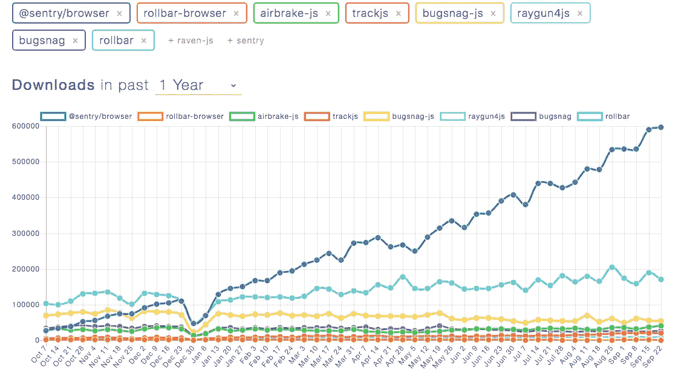
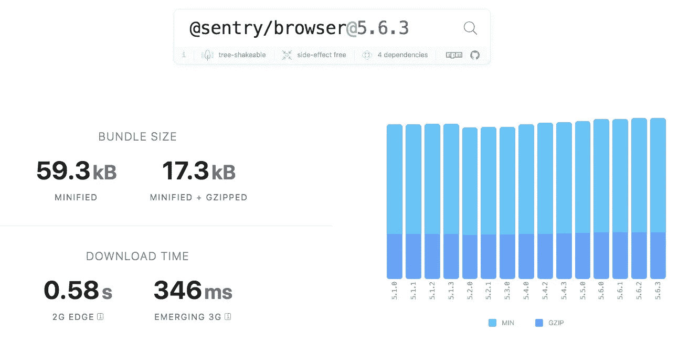
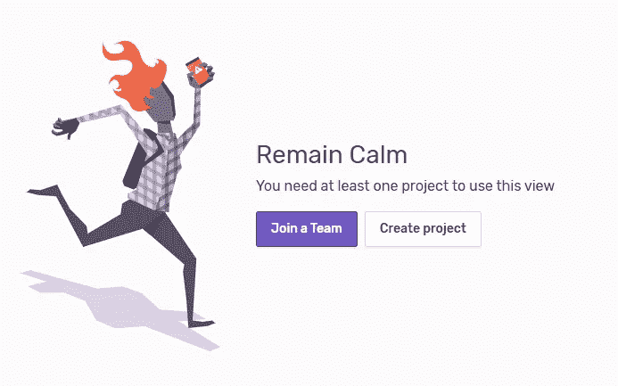
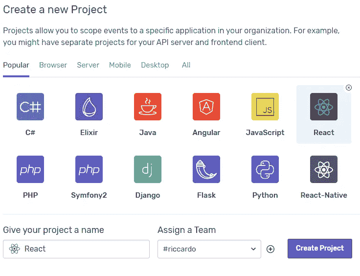
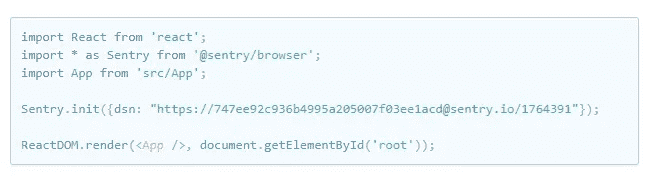
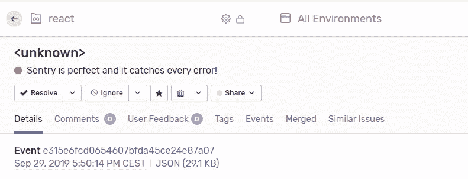
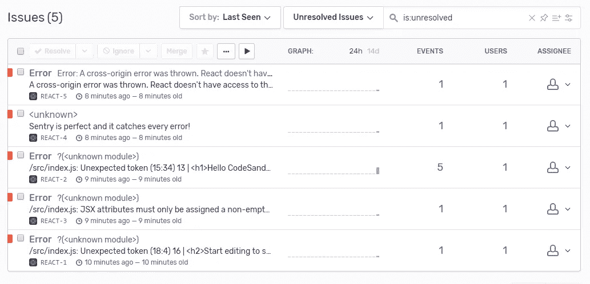
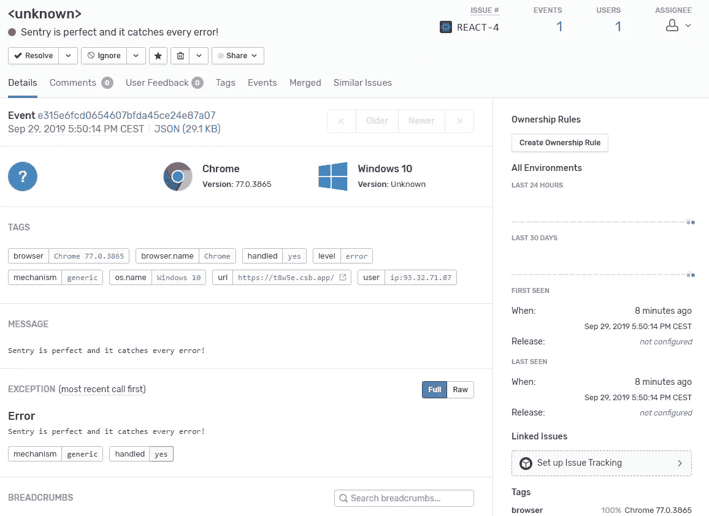

# 实时错误报告—捕捉每个 Bug 或错误

> 原文：<https://betterprogramming.pub/real-time-error-reporting-catch-every-bug-or-error-4c3df3b9a49d>

## Sentry 能让你捕捉到每一个错误，而且它是开源的

哨兵艺术作品—[https://sentry.io/](https://sentry.io/)

试图在你的前端应用程序或后端服务器中捕捉错误可能会很棘手，因为问题很少发生，或者当你不查看日志跟踪时。但是能够抓住每一个错误真的很难能可贵！

市面上有很多厂商向你出售一体化解决方案，实时跟踪每一个可能的错误。但是它们中的大多数都有一个锁定的代码库，阻止你更换供应商或者在你需要的时候添加新的语言。

一些著名的公司有 [BugSnag](https://www.bugsnag.com/) 、 [RollBar](https://rollbar.com/) 、 [Sentry](https://sentry.io/welcome/) 。

然而，有了[哨兵](https://sentry.io/)，我们就不会被锁定，我们将获得有史以来最好的产品之一，没有我们之前讨论过的任何问题。

[哨兵 100%开源](https://sentry.io/_/open-source/)！

# 为什么我需要哨兵或类似的服务？

我将引用[官方哨兵声明](https://sentry.io/about/)，它充分代表了为什么以现代方式处理错误或问题是至关重要的。

> S entry 通过提供跨堆栈的可见性和关于错误的深层上下文，使开发人员能够快速分类和解决问题，同时减少一切都在燃烧的压力、混乱和潜在的财务损失——从 [Sentry](https://sentry.io/about/) about 页面。

信息是明确的。当问题出现时，您必须尽快找到并解决它们，有了 Sentry，您就有能力解决每一个问题。

# 为什么是哨兵？

*   哨兵在去年 (2019 年)[一直在急剧增长。从 npm 下载的趋势来看，你可以清楚地看到它正在统治竞争对手。](https://www.npmtrends.com/@sentry/browser-vs-rollbar-browser-vs-airbrake-js-vs-trackjs-vs-bugsnag-js-vs-raygun4js-vs-bugsnag-vs-rollbar)
*   Sentry 的创建者免费提供一个管理版本的 Sentry，有一个巨大的免费计划，他们提供所有的文档让你在你的个人服务器上安装 Sentry。
*   Sentry 支持各种编程语言，这要感谢它的社区不断构建和添加新的包，比如: [JavaScript](https://sentry.io/for/javascript/) 、 [React](https://sentry.io/for/react/) 、 [Angular](https://sentry.io/for/angular/) 、 [Angular 2](https://sentry.io/for/angular2/) 、 [Ember](https://sentry.io/for/ember/) 、 [Backbone](https://sentry.io/for/backbone/) 、 [Vue](https://sentry.io/for/vue/) 、 [Node](https://sentry.io/for/node/) 、 [Express](https://sentry.io/for/express/) 、 [Koa](https://sentry.io/for/koa/) 、  [芹菜](https://sentry.io/for/celery/)， [AWS Lambda](https://sentry.io/for/pythonawslambda/) ，[金字塔](https://sentry.io/for/pyramid/)， [RQ](https://sentry.io/for/rq/) ， [PHP](https://sentry.io/for/php/) ， [Monolog](https://docs.sentry.io/hosted/clients/php/integrations/monolog/) ， [Laravel](https://sentry.io/for/laravel/) ， [Symfony](https://sentry.io/for/symfony/) ， [Ruby](https://sentry.io/for/ruby/) ， [Rails](https://sentry.io/for/rails/) ， [Sinatra](https://sentry.io/for/sinatra/) ，[Go](https://sentry.io/for/go/) 网，[。NET](https://sentry.io/for/dot-net/) ，Unity 也有 [C#](https://sentry.io/for/csharp/) ，还有[虚幻引擎](https://sentry.io/for/unrealengine/)。
*   为 JavaScript 应用程序安装它的 Sentry 包很小: [17.3kb](https://bundlephobia.com/result?p=@sentry/browser@5.6.3) 。

# 如何在 React 或 JavaScript 中安装

要在 React 或 JavaScript 应用程序中使用 Sentry，您需要使用`[@sentry/browser](https://www.npmjs.com/package/@sentry/browser)` (Sentry 的浏览器 JavaScript SDK)。

1.  使用`yarn`或`npm`将 Sentry SDK 作为依赖项添加到您的项目中:

2.去 [Sentry.io](https://sentry.io/auth/login/) 登录或者注册，用你项目的特定编程语言或者框架添加一个新项目，这种情况下，React。

没有项目？创建一个项目并选择您正在使用的语言或框架。

3.最后，您将从 onboarding 页面上显示的代码中复制定制的 DSN URL。这是我的:

然后，您将通过在 React 应用程序启动之前添加一个`Sentry.init`命令来将 SDK 连接到 Sentry。记得从 web 项目中复制您的 Sentry DSN 密钥。

如果你使用 React ≥16 并且你想使用新的 [React 错误边界](https://reactjs.org/docs/error-boundaries.html)、我建议你遵循[文档](https://docs.sentry.io/platforms/javascript/react/)。

# 测试岗哨

让我们抛出一个简单的错误，您将看到第一个问题出现在 Sentry 仪表板中。

而且，如果你去哨兵页，你会看到这个不错的错误出现。

# 如何将错误链接到用户

在您的应用程序中，您将拥有一个包含管理登录状态的逻辑的类。在那里，您需要添加这段代码，将任何错误链接到遇到它的用户。

# 错误看起来像什么？

Sentry 会自动将任何新错误与多个用户可能遇到的任何其他相关或相同的错误进行分组。

它将尝试匹配和合并它们，让您看到已经分组在一起的问题的概述，您不必手动将特定错误分配给特定问题。

# CodeSandbox 哨兵+反应

# 结论

我希望你开始使用 Sentry 或 BugSnag 或 RollBar 等其他服务来捕捉每个错误，并记住错误就像口袋妖怪一样。

> “你必须抓住他们！”—前端工程师在习惯 Sentry 后谈论浏览器问题

哨兵从他们的博客真棒艺术品！——[https://sentry.io/](https://sentry.io/)

# 参考资料和资源

*   [https://www . NPM trends . com/@ sentry/browser-vs-roll bar-browser-vs-air brake-js-vs-track js-vs-bugsnag-js-vs-ray gun 4 js-vs-bugsnag-vs-roll bar](https://www.npmtrends.com/@sentry/browser-vs-rollbar-browser-vs-airbrake-js-vs-trackjs-vs-bugsnag-js-vs-raygun4js-vs-bugsnag-vs-rollbar)
*   https://bundlephobia.com/result?p=@sentry/browser@5.6.3
*   [https://sentry.io](https://sentry.io/)
*   [https://docs.sentry.io/platforms/javascript/react/](https://docs.sentry.io/platforms/javascript/react/)