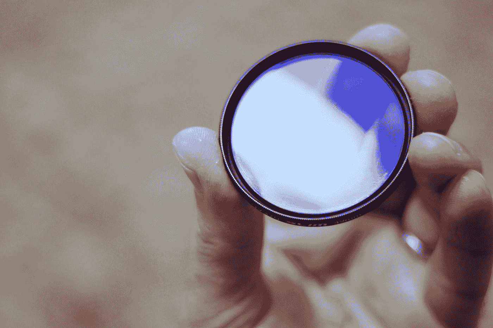
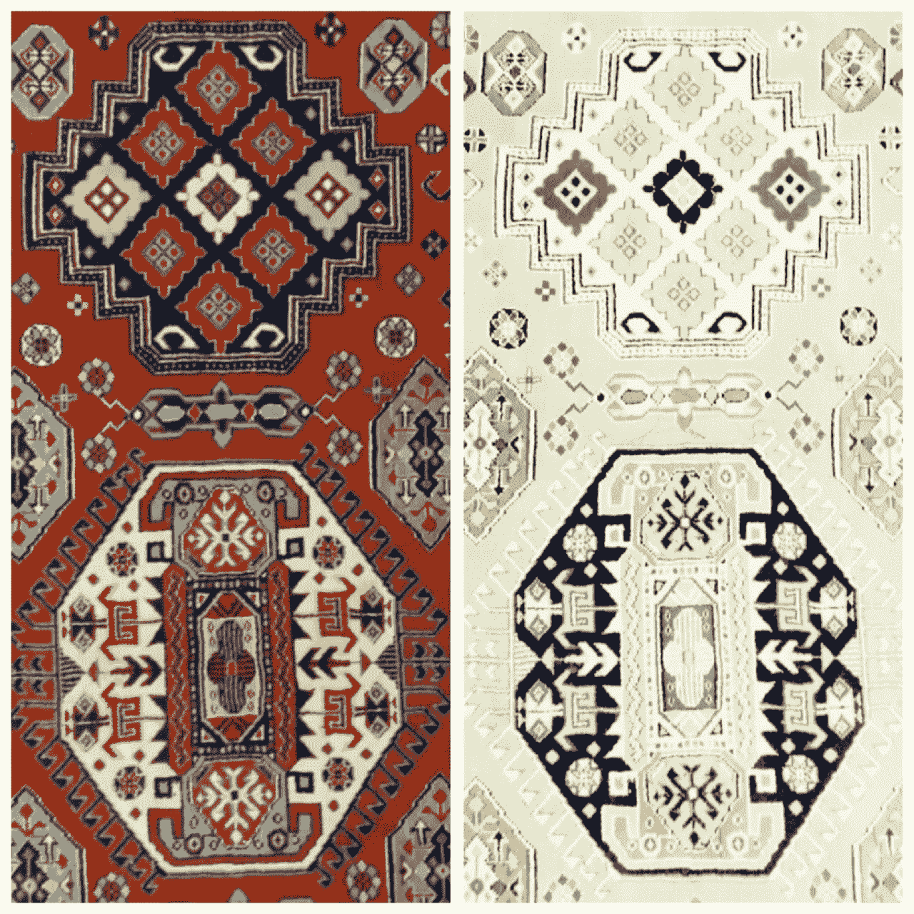
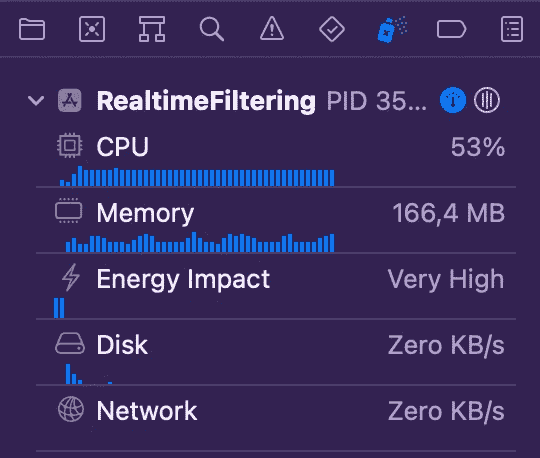
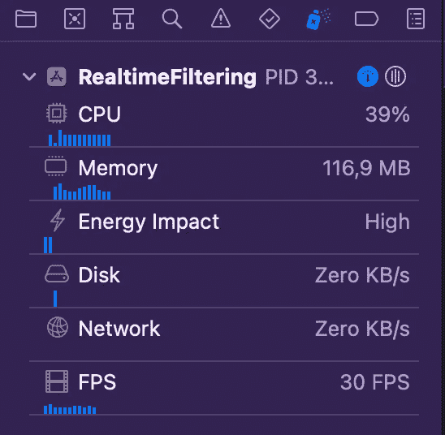

# 用 CIFilter 实现实时过滤

> 原文：<https://betterprogramming.pub/real-time-filtering-with-cifilter-bf7af16aee04>

## 在 AVFoundation 上执行核心图像过滤



照片由[哈比卜·达德哈](https://unsplash.com/@habibdadkhah?utm_source=medium&utm_medium=referral)在 [Unsplash](https://unsplash.com?utm_source=medium&utm_medium=referral) 拍摄

在我的[上一篇文章](https://medium.com/@sonmezbahad/creating-a-custom-filter-with-cifilter-3e5a6445ec15)中，我谈到了用`CIFilter`创建一个自定义过滤器。在本文中，我将讨论如何使用`CIFilter`过滤器进行实时过滤。应用程序需要摄像机使用和摄像机使用许可才能工作。确保您在`Info.plist`中请求了隐私-相机使用描述许可。

首先，让我们创建一个名为`CameraCapture`的类来处理和传输相机捕获的图像。这个类用一个摄像机位置和一个`callback`闭包初始化。

```
typealias Callback = (CIImage?) -> ()
private let position: AVCaptureDevice.Position
private let callback: Callback
init(position: AVCaptureDevice.Position = .front, callback: @escaping Callback) {
  self.position = position
  self.callback = callback
  super.init()
}
```

在类中定义一个`AVCaptureSession`和一个用户启动的`DispatchQueue`。定义`userInitiated`很重要，因为它会一直出现在 UI 中。

```
private let session = AVCaptureSession()
private let bufferQueue = DispatchQueue(label: "someLabel", qos: .userInitiated)
```

编写两个公共函数来启动和结束会话，因为会话是私有的。

```
func start() {
  session.startRunning()
}
```

```
func stop() {
  session.stopRunning()
}
```

为会话配置创建一个函数，并在`super.init()`后调用它。为了处理摄像机捕获的图像，`CameraCapture`必须符合`AVCaptureVideoDataOutputSampleBufferDelegate`协议。

```
private func configureSession() {
// 1
session.sessionPreset = .hd1280x720
// 2
let discovery = AVCaptureDevice.DiscoverySession(deviceTypes: [.builtInDualCamera, .builtInWideAngleCamera], mediaType: .video, position: position)
guard let camera = discovery.devices.first, let input = try? AVCaptureDeviceInput(device: camera) else {
// Error handling
return
}
session.addInput(input)
// 3
let output = AVCaptureVideoDataOutput()
output.setSampleBufferDelegate(self, queue: bufferQueue)
session.addOutput(output)
}
```

让我们一步一步地看看函数内部是什么。

1.确定图像质量。
2。用`AVCaptureDevice.DiscoverySession`找到并配置合适的视频采集元件，用`AVCaptureDeviceInput`
3 创建采集输入。用`AVCaptureVideoDataOutput`创建输出，并将委托添加到类中

捕获的图像需要转换到`CIImage`并输入到`callback`闭合中。为此编写符合`AVCaptureVideoDataOutputSampleBufferDelegate`的`CameraCapture`扩展。

```
extension CameraCapture:AVCaptureVideoDataOutputSampleBufferDelegate {
  func captureOutput(_ output: AVCaptureOutput, didOutput sampleBuffer: CMSampleBuffer, from connection: AVCaptureConnection) {
    guard let imageBuffer = CMSampleBufferGetImageBuffer(sampleBuffer) else { return }
    DispatchQueue.main.async {
      let image = CIImage(cvImageBuffer: imageBuffer)
      self.callback(image.transformed(by: CGAffineTransform(rotationAngle: 3 * .pi / 2)))
    }
  }
}
```

用委托函数中的`sampleBuffer`创建一个`CIImage`，并将其传递给`callback`。由于传入的图像是侧向的，因此有必要将其旋转 270 度。结果，创建了下面的类。

在没有任何问题地创建了`CameraCapture`类之后，就可以使用这个类进行过滤了。用`UIImageView`和`CameraCapture`实例创建一个`ViewController`。

```
class RealtimeFilterViewController: UIViewController {
  var imageView: UIImageView!
  var cameraCapture: CICameraCapture?
  override func viewDidLoad() {
    super.viewDidLoad()
    imageView = UIImageView(frame: view.bounds)
    view.addSubview(imageView)
    cameraCapture = CICameraCapture(cameraPosition: .front, callback: { image in })
    cameraCapture?.start()
  }
}
```

现在是时候过滤并显示来自`callback`的图像了。选择并应用任何内置过滤器。我们来选择`xRay`滤镜。在`callback`封闭内进行过滤。最后，`cameraCapture`看起来是这样的:

```
cameraCapture = CICameraCapture(cameraPosition: .front, callback: { image in
  guard let image = image else { return }
  let filter = CIFilter.xRay()
  filter.setDefaults()
  filter.inputImage = image
  let uiImage = UIImage(ciImage: (filter.outputImage!.cropped(to: image.extent)))
  self.imageView.image = uiImage
})
```

让我们这样运行它。但那是什么？什么都不会出现，并且控制台会不断记录一条消息。

```
2022-11-08 15:06:14.829234+0300 RealtimeFiltering[2903:883376] [api] -[CIContext(CIRenderDestination) _startTaskToRender:toDestination:forPrepareRender:forClear:error:] The image extent and destination extent do not intersect.
```

这个信息非常清楚。图像范围和目标范围不相交。我们应该定义一个函数来将图像转换和缩放到我们的视图范围内。创建一个扩展并使用此功能:

```
import CoreImage
extension CIImage {
  func transformToOrigin(withSize size: CGSize) -> CIImage {
    let originX = extent.origin.x
    let originY = extent.origin.y
    let scaleX = size.width / extent.width
    let scaleY = size.height / extent.height
    let scale = max(scaleX, scaleY)
    return transformed(by: CGAffineTransform(translationX: -originX, y: -originY)).transformed(by: CGAffineTransform(scaleX: scale, y: scale))
  }
}
```

现在，让我们用这个函数来定义`uiImage`，然后嘭！我们已经创建了一个有效的实时过滤应用程序。

```
let uiImage = UIImage(ciImage: (filter.outputImage!.cropped(to: image.extent).transformToOrigin(withSize: self.view.bounds.size)))
```

最后，`*RealtimeFilterViewController*`应该是这样的:

它非常适合一个简单的过滤器。输出图像如下所示:



输入图像→输出图像

但是如果几个滤镜作为一个链条呢？让我们试一试。像这样改变`cameraCapture`的定义:

```
cameraCapture = CICameraCapture(cameraPosition: .front, callback: { image in
  guard let image = image else { return }
  let filter = CIFilter.thermal()
  let filter2 = CIFilter.xRay()
  let filter3 = CIFilter.motionBlur()
  filter.setDefaults()
  filter2.setDefaults()
  filter3.setDefaults()
  filter.inputImage = image
  filter2.inputImage = filter.outputImage!
  filter3.inputImage = filter2.outputImage!
  let uiImage = UIImage(ciImage: (filter3.outputImage!.cropped(to: image.extent).transformToOrigin(withSize: self.view.bounds.size)))
  self.imageView.image = uiImage
})
```

它仍然工作，但是当查看资源消耗时，它看起来就像是在消耗。



这种方式一点效率都没有。那么，该怎么办呢？幸运的是，苹果意识到了这一点，并提供了一种更高效的方式。是`MTKView`。创建一个继承了`MTKView`的名为`MetalRenderView`的类。

如果设备不支持 Metal 框架，应用程序将会崩溃。`MetalRenderView`最重要的部分是`renderImage`功能。分配图像时调用该函数，使图像适用于`MTKView`。更多信息，可以使用苹果的[文档`MTKView`的](https://developer.apple.com/documentation/metalkit/mtkview)。

现在，让我们在这个`MetalRenderView`的帮助下展示过滤后的图像。首先，让我们将`RealtimeFilterViewController`中的`imageView`替换为`MetalRenderView`。

```
var metalView: MetalRenderView!
```

其次，替换`viewDidLoad`中的*的以下块:*

```
imageView = UIImageView(frame: view.bounds)
view.addSubview(imageView)
```

…有了这个

```
metalView = MetalRenderView(frame: view.bounds, device: MTLCreateSystemDefaultDevice())
view.addSubview(metalView)
```

然后更换`*callback*`封口内的这两条线

```
let uiImage = UIImage(ciImage: (filter3.outputImage!.cropped(to: image.extent).transformToOrigin(withSize: self.view.bounds.size)))
self.imageView.image = uiImage
```

与这个

```
self.metalView.setImage(filter3.outputImage?.cropped(to: image.extent))
```

`MetalRenderView`独立处理`transformToOrigin`方法。现在，`RealtimeFilterViewController`应该是这样的:

现在，让我们再次运行应用程序，看看有什么不同。看起来稍微好一点。但是，当过滤器的数量增加或使用更困难的过滤器时，这种细微的差别会更有价值。



是的，我们现在有了一个完全正常工作且更高效的实时过滤应用程序。可以使用不同的过滤器和不同的 UI 增强来开发应用程序。这款应用也许可以拍照，但那是另一篇文章的主题。

```
Want to Connect?

Linkedin: https://www.linkedin.com/in/bahadir-sonmez-itu/
Website: https://bahadirsonmez.github.io/
```