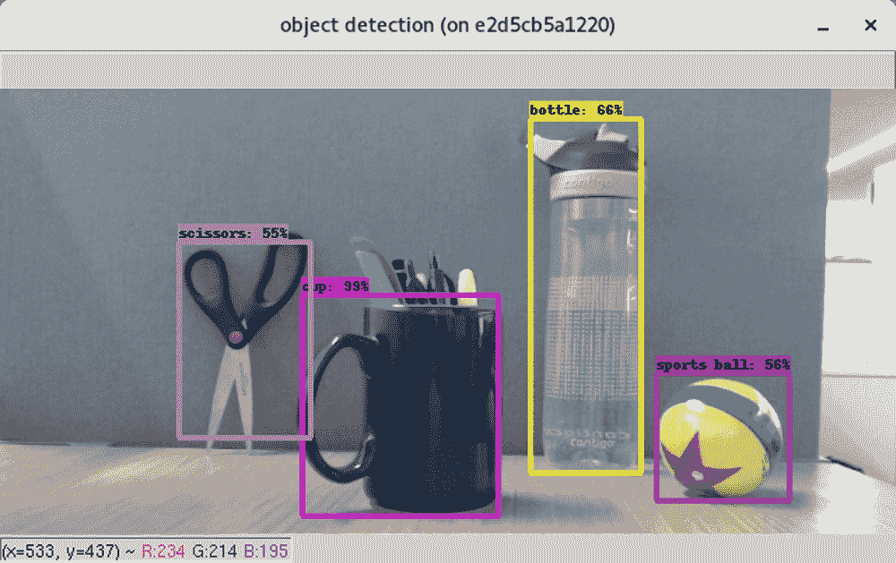
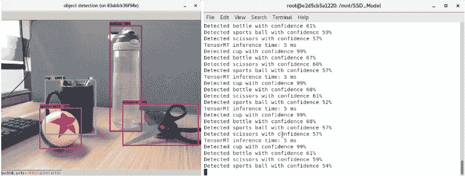
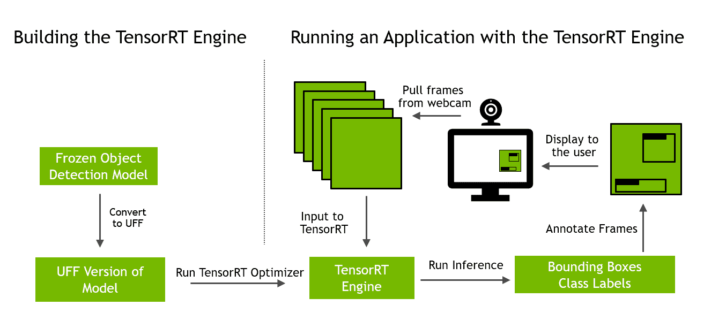
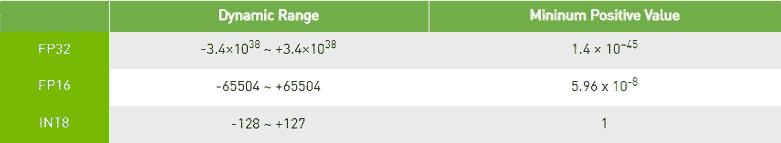
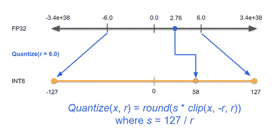

# 在 10 分钟内在 GPU 上进行实时对象检测

> 原文：<https://betterprogramming.pub/real-time-object-detection-on-gpus-in-10-minutes-6e8c9b857bb3>

## 了解如何在 10 分钟内在 GPU 上运行高性能对象检测管道进行推理。



物体检测是一种非常受欢迎的深度学习应用，从简单的家庭自动化应用到安全关键的自动驾驶。事实证明，GPU 在执行深度学习训练和推理方面非常强大。现在有许多库和工具来执行这些任务。在这篇文章中，我们将向您展示如何在 10 分钟内在 GPU 上运行高性能对象检测管道进行推理。

我们的 Python 应用程序从实时视频流中提取帧，并在 GPU 上执行对象检测。我们使用预训练的单镜头检测(SSD)模型和 Inception V2，应用 TensorRT 的优化，为我们的 GPU 生成运行时，然后对视频馈送执行推理以获得标签和边界框。然后，应用程序用这些边界框和类标签注释原始帧。产生的视频馈送具有覆盖在其上的来自我们的对象检测网络的边界框预测。同样的方法可以扩展到其他任务，如分类和分割。

虽然 GPU 和 NVIDIA 软件的知识不是必需的，但您应该熟悉对象检测和 Python 编程。使用的一些软件工具包括来自 [NVIDIA GPU Cloud](https://ngc.nvidia.com/catalog/landing) (NGC)的 Docker 容器来设置我们的环境， [OpenCV](https://opencv.org/) 来运行来自相机的馈送，以及[tensort](https://developer.nvidia.com/tensorrt)来加速我们的推理。虽然阅读这篇文章会让你受益匪浅，但是你需要一个支持 CUDA 的 GPU 和一个连接到你的机器上的摄像头来运行这个例子。

在本文结束时，您将了解设置端到端对象检测推理管道所需的组件，如何在 GPU 上应用不同的优化，以及如何在管道上执行 FP16 和 INT8 precision 中的推理。作为参考，所有代码(以及如何安装所有内容的详细自述文件)都可以在 [NVIDIA GitHub 页面](https://github.com/NVIDIA/)上找到。

用命令`nvidia-smi`测试你有一个正常工作的 GPU。CUDA GPUs 列表在[本页](https://developer.nvidia.com/cuda-gpus)。

我们使用的网络是以 [InceptionV2](https://arxiv.org/abs/1512.00567v3) 为骨干的[单发探测](https://arxiv.org/abs/1512.02325)网络。这个应用中使用的所有代码都可以在这个 [GitHub repo](https://github.com/NVIDIA/object-detection-tensorrt-example) 中获得。

# 运行样本！

我们使用 Docker 容器来设置环境并打包它们以供分发。我们可以回忆起许多使用容器很容易立即从冲突和崩溃中恢复的情况，所以在尝试这个例子之前，请确保您的机器上有 [Docker](https://docs.docker.com/v17.12/install/linux/docker-ce/ubuntu/) 和 [NVIDIA Docker](https://github.com/NVIDIA/nvidia-docker) 。

导航到主`object-detection-webcam`文件夹，运行下面的部分来构建容器并运行应用程序:

```
./setup_environment.shpython SSD_Model/detect_objects_webcam.py
```

这将弹出一个窗口，显示来自您的网络摄像头的视频源，带有如图 1 所示的边框和标签。



**图一。**命令提示符上的输出显示了推理所用的时间和目标类的前 1 名预测

# 使用 NGC 和 TensorRT 开源软件进行设置

让我们回顾一下设置，设置的所有代码都可以在`setup_environment.sh`中找到。有 4 个关键步骤:

1.  为 Docker 设置环境变量以查看网络摄像头
2.  下载 VOC 数据集用于 INT8 校准(我们将在博客后面看到)
3.  构建一个包含我们运行代码所需的所有库的`Dockerfile`
4.  启动那个`Dockerfile`，这样我们就可以在正确的环境中运行应用程序

因为我们使用 Docker 容器来管理我们的环境，所以我们需要让我们的容器访问主机中的所有硬件。这大部分是由 Docker 自动处理的，除了我们手动添加的网络摄像头。我们需要为 Docker 设置访问 X11 的权限，X11 用于打开 webcam feed 的 GUI。通过使用环境变量和设置在 docker run 命令期间传递到容器中的权限来实现这一点。

接下来，我们下载用于 INT8 校准的 PASCAL VOC 数据集，我们将在后面的章节中讨论。该数据集包含常见家居用品和日常物品的图像。

然后我们建立一个`Dockerfile`，它拥有我们的整个开发环境。`Dockerfile`安装以下部件:

1.  TensorRT 和所需的库
2.  TensorRT 开源软件，替换 TensorRT 安装中的插件和解析器
3.  我们的应用程序的其他依赖项

使用来自[英伟达 NGC](https://ngc.nvidia.com/catalog/landing) 的 tensort 容器，安装 tensort 非常简单。该容器包含所需的库，如 [CUDA](https://developer.nvidia.com/cuda-toolkit) 、 [cuDNN](https://developer.nvidia.com/cudnn) 和 [NCCL](https://developer.nvidia.com/nccl) 。NGC 是一个预建容器的存储库，这些容器每月更新一次，并跨平台和云服务提供商进行测试。参见[发行说明](https://docs.nvidia.com/deeplearning/sdk/tensorrt-container-release-notes/rel_19-05.html#rel_19-05)中 TensorRT 容器中的内容。因为除了 tensort 之外，我们还需要组合多个其他库和包，所以我们将创建一个自定义的`Dockerfile`,使用 tensort 容器作为基本映像。

因为 TensorRT 插件和解析器的最新版本是开源的，所以我们在例子中使用了它们。插件提供了一种在 TensorRT 模型中使用定制层的方法，并且已经包含在 TensorRT 容器中。例如，SSD 模型使用插件库中的 flattenConcat 插件。严格地说，在这个例子中，我们不需要使用开源版本的插件，使用 TensorRT 容器中的版本也可以。了解这一点很方便，您可以扩展和定制这些组件，以支持模型中的定制层。

为了获得开源插件，我们克隆了[tensort GitHub repo](https://github.com/NVIDIA/TensorRT)，使用 *cmake* 构建组件，并用新版本替换 tensort 容器中这些组件的现有版本。TensorRT 应用程序将在这个路径下搜索 TesnorRT 核心库、解析器和插件。

最后，我们可以安装应用程序所需的其他依赖项，主要是 OpenCV 及其渲染库。OpenCV 是一个计算机视觉库，我们用它来与我们的网络摄像头进行交互。

使用 docker build 命令构建`Dockerfile`中的所有组件:

启动容器，打开新的开发环境，如下所示。在这个命令中，我们将运行时设置为 Nvidia，让 Docker 知道我们的主机有 GPU，然后我们将 GitHub repo 挂载到 Docker 容器中以访问其中的代码，最后通过后续的挂载和环境变量转发有关如何与网络摄像头交互的信息。有关我们使用的标志的更多信息，请查看 [Docker 文档](https://docs.docker.com/engine/reference/run/)。

```
docker run — runtime=nvidia -it -v `pwd`/:/mnt — device=/dev/video0 -e DISPLAY=$DISPLAY -v $XSOCK:$XSOCK -v $XAUTH:$XAUTH -e XAUTHORITY=$XAUTH object_detection_webcam
```

一旦容器启动，您就可以使用以下命令运行您的应用程序:

```
python detect_objects_webcam.py.
```

# 优化模型，构建推理引擎

在 **detect_objects_webcam.py** 中，该应用程序的伪代码如下，如图 2 所示:



**图二。**本博客将涵盖该工作流程中的所有步骤，从构建 TensorRT 引擎到将其插入一个简单的应用程序。

第一步是从 TensorFlow 模型动物园下载冻结的 SSD 对象检测模型。这是在`prepare_ssd_model` 中完成的`model.py` **:**

下一步是优化这个推理模型，并生成一个在您的 GPU 上执行的运行时。我们使用 TensorRT，这是一个深度学习优化器和运行时引擎。TensorRT 从这个应用程序为每个 NVIDIA GPU 生成运行时。您需要应用程序提供尽可能低的延迟来实时执行推理。让我们来看看如何用 TensorRT 实现这一点。

使用`model.py`中可用的实用程序将冻结的张量流图转换为通用框架格式(UFF)。现在使用解析器将 UFF 模型导入 TensorRT，应用优化，并生成运行时引擎。优化是在构建过程中秘密应用的，您不需要做任何事情来应用它们。例如，TensorRT 可以将卷积、ReLU 和 Bias 等多个层融合到一个层中。这就是所谓的层融合。另一种优化是张量融合或层聚合，其中共享相同输入的层融合到单个核中，然后将它们的结果去连接。

要构建运行时引擎，您需要指定四个参数:

1.  我们模型的 UFF 文件的路径
2.  推理引擎的精度(FP32、FP16 或 INT8)
3.  校准数据集(仅在运行 INT8 时需要)
4.  推断过程中使用的批量

参见`engine.py`中的发动机建造规范。建造引擎的功能叫做`build_engine`。

较低精度的推理(FP16 和 INT8)提高了吞吐量并提供了更低的延迟。使用 FP16 precision 在张量核上提供比 FP32 快几倍的性能，而模型精度实际上没有下降。INT8 中的推理可以在模型精度下降不到 1%的情况下进一步提高性能。TensorRT 从 FP32 和您允许的任何精度中选择内核。当您启用 FP16 精度时，TensorRT 会从 FP16 和 FP32 精度中选择内核。要使用 FP16 和 INT8 precision，请使两者都能获得尽可能高的性能。

校准用于确定图形中张量的动态范围，因此您可以有效地使用 INT8 精度的有限范围。稍后会详细介绍。

最后一个参数，批处理大小，用于为推理工作负载选择最佳内核。您可以将引擎用于比创建时指定的批量更小的批量。然而，性能可能并不理想。我通常为最常见的批量生成几个引擎，并在它们之间切换。在本例中，我们将从网络摄像头中一次抓取一帧，使批量大小为一。

还需要注意的是，TensorRT 会自动检测 GPU 上的任何专用硬件。因此，如果你的 GPU 有张量核，它会自动检测到这一点，并在这些张量核上运行你的 FP16 内核。

让我们看看`engine.py`，看看所有这些参数是如何工作的:

`build_engine` 函数为构建器、解析器和网络创建一个对象。解析器以 UFF 格式导入 SSD 模型，并将转换后的图形放在网络对象中。当我们使用 UFF 解析器来导入转换后的 TensorFlow 模型时，TensorRT 还包括 Caffe 和 [ONNX](https://onnx.ai/) 的解析器。这两者都可以在 TensorRT 开源回购中获得。使用这个模型的 ONNX 格式仅仅意味着改为调用 ONNXParser 代码的其余部分是相同的。

第 71 行指定了 TensorRT 应用优化应该使用的内存。这只是暂存空间，您应该提供系统允许的最大大小；我提供了两个 GB。条件代码根据推理的精度来设置参数。对于第一次运行，我们使用默认的 FP32 精度。

接下来的几行为解析器指定了输入节点和输出节点的名称和形状。parser.parse 实际上使用我们上面指定的参数在我们的 UFF 文件上执行解析器。最后，`builder.build_cuda_engine`对网络进行优化，生成引擎对象。

脚本`engine.py` 有两个额外的关键功能:`save_engine` 和`load_engine`。一旦你生成了一个引擎，你可以把它保存到磁盘上以备将来使用，这个过程叫做*序列化*。序列化生成一个计划文件，您可以随后从磁盘加载该文件，这通常比从头开始重新构建引擎要快得多。这就是这些加载和保存函数的作用。如果您更改了用于构建引擎的参数、使用的模型或使用的 GPU，您需要重新生成引擎，因为 TensorRT 会选择不同的内核来构建引擎。

您可以从 [NGC 模型](https://ngc.nvidia.com/catalog/models?orderBy=modifiedDESC&query=tensorrt&quickFilter=&filters=)下载预训练模型、参数和精度的几种组合的计划文件。如果我使用的是标准模型，我通常首先会检查 NGC 上是否有计划文件可以直接用于我的应用程序。

# 使用 TensorRT 引擎运行推理

我们现在可以使用 TensorRT 引擎来执行对象检测。为了在我们的例子中使用引擎，我们将从网络摄像头中一次获取一帧，并将其传递给`inference.py`中的 TensorRT 引擎，更具体地说是在函数`infer_webcam`中:

该函数首先从网络摄像头加载图像(第 174 行)，然后在函数`load_img_webcam`中执行一些预处理步骤。我们的示例将轴的顺序从 HWC 移动到 CHW，对图像进行归一化，使所有值都落在-1 和+1 之间，然后对数组进行扁平化。您还可以在此函数中添加管道所需的任何其他预处理操作。

第 182 行开始计时，测量 TensorRT 引擎执行推理所需的时间。这有助于理解整个推理管道的延迟。

我们调用`do_inference`来执行推理。这个函数将我们的数据发送到 TensorRT 引擎进行推理，并返回两个参数:`detection_out`和`keepCount_out`。`detection_out` 包含关于每个检测的边界框坐标、置信度和类别标签的所有信息，并且`keepCount_out`跟踪网络发现的检测的总数。

# 把所有的放在一起

到目前为止，我们已经了解了如何从 TensorFlow model zoo 导入预训练的模型，将其转换为 UFF 格式，应用优化并生成 TensorRT 引擎，最后使用该引擎对来自网络摄像头的单个图像进行推理。

让我们看看所有这些组件是如何组合在一起的:

解析命令行参数后，`prepare_ssd_model` 使用`model.py` 将冻结的张量流图转换为 UFF 格式。然后我们在第 153 行初始化一个 tensort 推理对象，如上所述使用`engine.py`中的`build_engine`来实际构建 tensort 引擎。如前所述，如果在我们的`args.trt_engine_path`中没有已经保存的引擎文件，那么我们需要从头构建一个。我们模型的 UFF 版本也是如此。我们将在默认的 FP32 精度下运行，这样就不需要提供校准数据集。最后，因为我们只在一个网络摄像头上运行实时推理，所以我们将保持我们的批处理大小= 1。

现在让我们将它集成到操作网络摄像头的应用程序中。如果相机标志打开(默认)，应用程序将使用 OpenCV(第 164 行)启动视频流，并在第 167 行进入主循环。在这个循环中，我们将不断地从网络摄像头获取新的帧，如第 169 行所示，然后对该帧执行推理，如第 172 行所示。

最后，我们将边界框结果叠加到原始帧上(第 176–180 行)，然后使用`imshow`将它们显示给用户。

这就是我们的整个管道！

# TensorRT 在 INT8 精度中的推理

与框架内推理相比，该应用程序在 GPU 上使用 TensorRT 进行推理的速度快了几倍。然而，你可以让它快几倍。到目前为止，我们使用单精度(FP32)进行推理，其中每个数字都用 32 位表示。在 FP32 中，激活值可以在+/- 3.4x10 *⁸* 的范围内，并且需要 32 位来存储每个数字。数量越大，执行时需要的存储空间就越多，同时也会导致性能下降。当切换到使用较低精度的 FP16 时，大多数型号的精度几乎相同。使用 NVIDIA 提供的模型和技术，您可以使用 INT8 precision 进行推理，从而获得最高的性能。不过，请注意，图 2 中 INT8 精度的动态范围明显较低。



**图二。**可以用 FP32、FP16 和 INT8 精度表示的值的动态范围

要使用 INT8 精度并获得类似 FP32 推理的精度，您需要执行一个称为校准的附加步骤。在校准过程中，对与最终数据集相似的训练数据进行推理，并收集激活值的范围。TensorRT 然后计算一个比例因子，将 INT8 值的范围分布在每个节点的激活值的范围内。图 3 显示，如果一个节点的激活范围在-6 到+6 之间，您希望用 INT8 表示的 256 个值只覆盖这个范围。



**图 3。**校准和量化是转换为 INT8 精度的关键步骤。

使用以下命令重新构建 TensorRT 引擎，以便在您的应用中使用 INT8 实现精度，执行校准并运行推理。整个过程可能需要几分钟:

```
python detect_objects_webcam -p 8
```

您应该会看到相同的结果，但性能比之前使用 FP32 precision 获得的结果更高。

我们来看看`engine.py`中的`build_engine`是怎么做到的。根据您为推理启用的精度，条件块启用不同的构建器模式。默认情况下，TensorRT 总是选择 FP32 内核。如果您启用 FP16 模式，它也会尝试运行在 FP16 precision 中的内核；INT8 也是如此。

然而，仅仅因为你允许较低精度的内核，并不意味着它们在性能上总是优于较高精度的内核。例如，即使我们将精度模式设置为 INT8，也可能有一些 FP16 或 FP32 内核运行得更快。TensorRT 将选择速度最佳的选项。

TensorRT 检测专门硬件的存在，如张量核，并将在其上使用 FP16 内核以获得可能的最高性能。TensorRT 自动选择最佳内核的能力称为内核自动调整。这使得 TensorRT 能够在提供高性能的同时，广泛应用于各种应用。

注意，在 INT8 条件块中，我们使用了一个函数`SSDEntropyCalibrator`。该类在批量校准期间通过您的模型运行校准数据。为此，您需要做的就是在`calibrator.py`中实现名为`get_batch`的函数，从您的校准数据集中获取下一批数据。参见下面`calibrator.py` 中的`SSDEntropyCalibrator`代码:

该函数将图像目录作为输入进行校准，并将存储缓存文件的位置作为输入。此缓存文件包含网络激活所需的所有比例因子。如果保存激活值，您只需为特定配置运行一次校准，并且可以为任何后续运行加载此缓存表。

这就是使用 TensorRT 执行 INT8 校准所需的全部工作！

# 从这里去哪里？

这篇文章展示了如何在 GPU 上快速设置和运行对象检测应用程序。它涵盖了很多方面，包括设置、在 INT8 precision 中部署、使用 TensorRT 中新的开源插件和解析器、连接到网络摄像头和叠加结果。

将为您留下一些与本文相关的资源:

*   基于相同代码库的网络研讨会:[如何对常见应用进行推理](https://www.nvidia.com/en-us/about-nvidia/webinar-portal/?D2C=2003671)
*   [TensorRT 样品](https://docs.nvidia.com/deeplearning/sdk/tensorrt-sample-support-guide/index.html)例如本应用中使用的 SSD 样品
*   [TensorRT 开源 GitHub repo](https://github.com/NVIDIA/TensorRT) 用于最新版本的插件、示例和解析器
*   TensorRT 入门博客:[如何用 tensort 加速推理](https://devblogs.nvidia.com/speed-up-inference-tensorrt/)
*   [为 GPU 博客创建对象检测管道](https://devblogs.nvidia.com/object-detection-pipeline-gpus)
*   NVIDIA NGC 上的[tensort 容器](https://ngc.nvidia.com/catalog/containers/nvidia:tensorrt)和[tensort 计划文件](https://ngc.nvidia.com/catalog/models?orderBy=modifiedDESC&query=tensorrt&quickFilter=&filters=)

我们希望你喜欢阅读这篇文章，就像我们喜欢开发它一样。交给你了，你是怎么用 GPU 进行推理的？

我们一直在为博客和教程寻找很酷的应用程序创意。请在下面留言，告诉我们你觉得最具挑战性的是什么。

如果您在使用此应用程序时遇到问题，请务必查看此示例的 [GitHub repo](https://github.com/NVIDIA/object-detection-tensorrt-example) 中的问题，了解类似的问题和解决方案。

如果您对使用 TensorRT 有任何疑问，请随时查看 [NVIDIA TensorRT 开发者论坛](https://devtalk.nvidia.com/default/board/304/)，看看 TensorRT 社区的其他成员是否有解决方案。NVIDIA 注册开发者程序也可以在 https://developer.nvidia.com/nvidia-developer-program 的[提交 bug。](https://developer.nvidia.com/nvidia-developer-program)

# 参考

【刘等 2016】刘，魏，【SSD:单次多盒探测器。“欧洲计算机视觉会议。施普林格，查姆，2016。

【Szegedy 等人 2016】Szegedy，Christian 等人】[重新思考计算机视觉的盗梦空间架构。](https://arxiv.org/abs/1512.00567)《IEEE 计算机视觉和模式识别会议论文集》。2016.

【林等 2014】林，宗毅等.[微软 COCO:情境中的公共对象。](https://arxiv.org/abs/1405.0312)“欧洲计算机视觉会议。施普林格，查姆，2014 年。

> NVIDIA 作者:解决方案架构师加里·伯内特和产品营销经理西达尔特·夏尔马