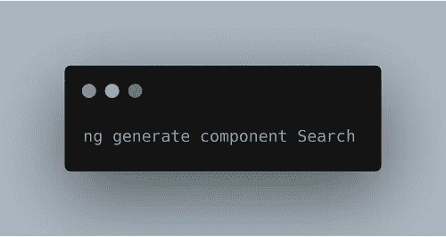
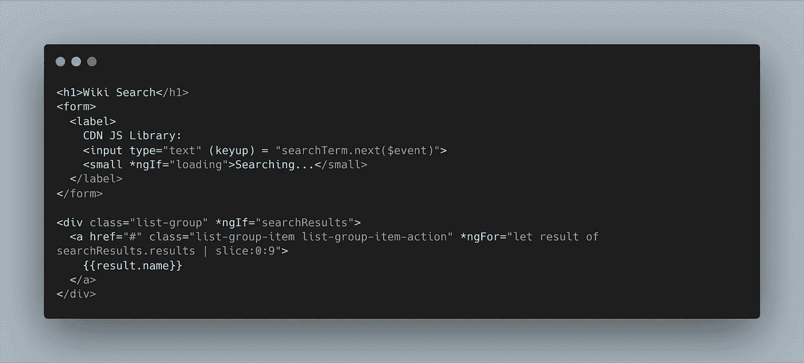
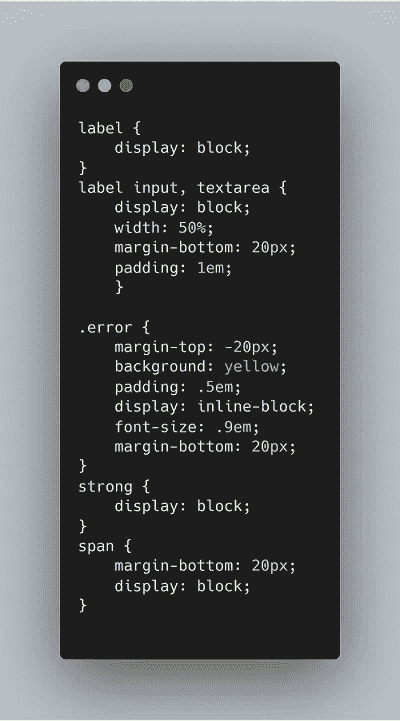
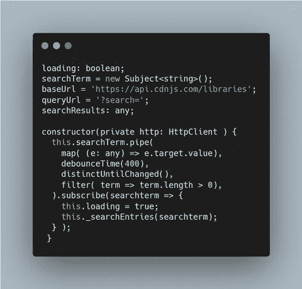
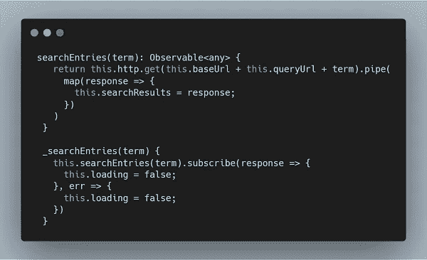
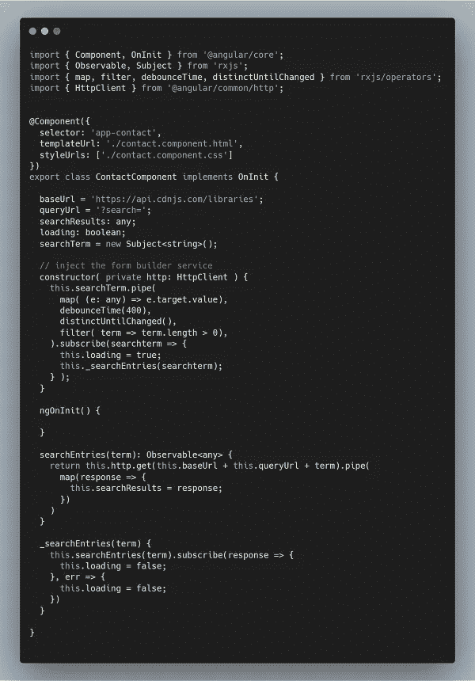

# 使用 RxJS 的实时搜索引擎(第 1 部分)

> 原文：<https://betterprogramming.pub/real-time-search-engine-with-rxjs-530cbadcde8c>

## 使用几个 RxJS 库演示 Angular 中的实时搜索引擎

在本教程中，我将演示如何使用几个可用的 RxJS 库在 Angular 中实现实时搜索引擎。我将把教程分成两个部分:第一部分将集中在把我们的搜索框和搜索结果放在一个单独的组件中，然后最后一部分将集中在如何使组件解耦和可重用。

基本上，搜索引擎所做的是根据用户输入的搜索查询，向 HTTP 资源发出获取数据的请求。我们将使用 [cdnjs](https://cdnjs.com/api) 库的 API。

# 入门指南

为了深入研究，我们将创建一个名为`Search`的新组件。

接下来，让我们为搜索框添加标记。

我用的是 Bootstrap 框架，你可以从 [Bootstrap](https://getbootstrap.com/docs/4.3/getting-started/introduction/) 中获取 CDN 链接，只需复制粘贴到你的`index.html`文件中即可。

根据上面的标记，我们创建了一个 input 元素，它附带了一个`keyUp`事件(我们将在后面详细讨论)。

我还用引导类`list-group`创建了一个`div`，来显示我们的搜索结果。我将在教程的后面对此进行更多的解释。

接下来，我们添加 CSS 代码，这是尽可能少的代码，只是为了给标记添加一点样式。

基本上，我们试图实现的是获取用户的输入，这将是我们对 API 的查询词，并用搜索词发出我们的`GET`请求。

有许多方法可以实现这一点，我们将走 RxJS 路线。

1.  我们将获得用户的输入，并用它创建一个可观察的流。
2.  在每个 keyup 事件中，我们用 windows 事件更新可观察的流。
3.  我们等待几毫秒(以确保用户已经停止输入)，然后用搜索词发出`GET`请求。

因此，在组件的`.ts`文件中，只需添加这些:

1.  我创建了一个`loading` 变量来控制标记，向用户表明正在发出请求。我还添加了`baseUrl` 和`queryUrl`变量，它们将组合成我们的资源 URL。我也创建了我们的`searchResult`变量。
2.  我把`searchTerm`变量变成了`subject`，它允许我们发布和订阅。
3.  在构造函数中，我将来自`@angular/common/http`的`HttpClient`服务作为 HTTP 注入。
4.  这行代码`map( (e: any) => e.target.value )` 只是提取用户输入的值。
5.  `debounceTime(400)` 在 400 毫秒后抑制请求，即我们仅在用户暂停 400 毫秒后发出请求。可以[阅读更多关于](https://www.learnrxjs.io/operators/filtering/debouncetime.html) `[debounceTime](https://www.learnrxjs.io/operators/filtering/debouncetime.html)`的内容。
6.  `distinctUntilChanged()` 将确保只有不同的数据通过。如果用户键入一些东西，快速擦除一个字符，然后重新键入相同的字符，`distinctUntilChanged`将只发送一次数据。
7.  `filter( (term: string) => term.length > 0)` 将确保流只发出长度大于 0 的搜索词。如果您想消除短搜索，实际上可以使用更高的值。
8.  下面几行对可观察对象进行订阅，将`true`赋给`loading` 并调用`_searchEntries` 方法。我们很快就会谈到这个方法。

现在，让我们创建`searchEntries` 方法。

第一个方法(`searchEntries`)发出 HTTP 请求来获取我们的资源，并返回可观察到的响应。请注意响应是如何映射的，并且`searchResult` 被设置为响应。

第二个方法用于订阅从第一个方法返回的可观察对象。这里，如果请求成功，`loading` 被设置为`false`，同样，如果请求中有错误。

我们完整的代码应该是这样的:

在本系列的第二部分中，我们将看到如何使组件可重用。文章的第二部分可以在[这里](https://medium.com/better-programming/real-time-search-engine-with-rxjs-part-2-6585d9394128)找到。

通过编码来改变现状…