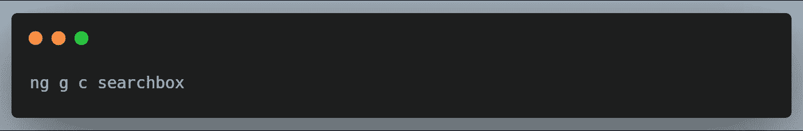
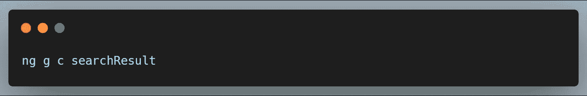
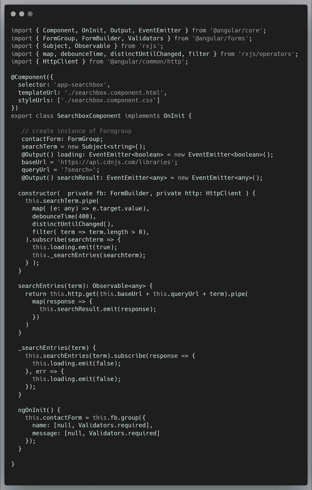
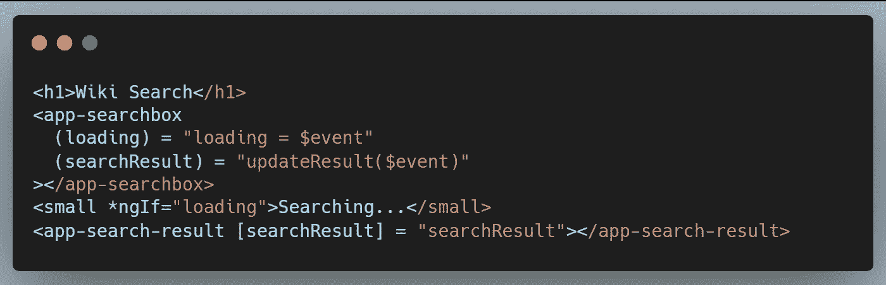
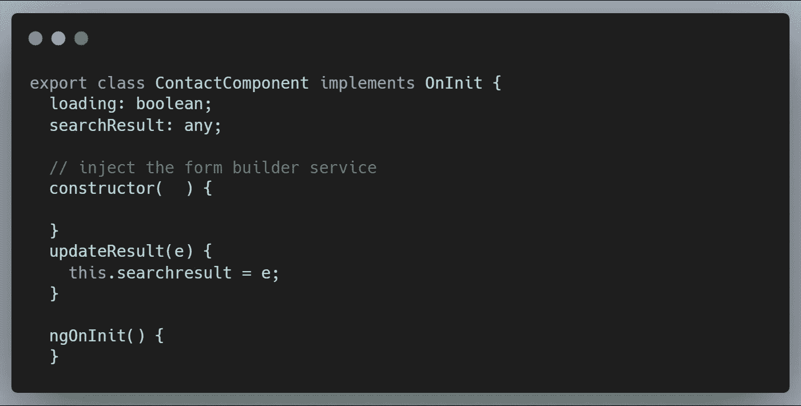
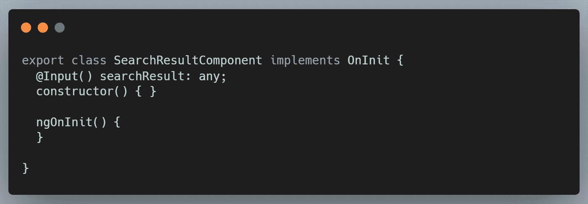
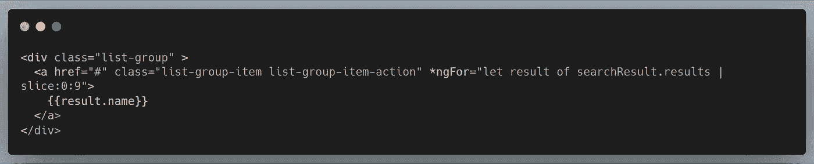

# 使用 RxJS 的实时搜索引擎(第 2 部分)

> 原文：<https://betterprogramming.pub/real-time-search-engine-with-rxjs-part-2-6585d9394128>

您好，这是本文的结论部分。你可以在这里找到第一部分。在这一部分，我们将进行关注点的分离，(例如，我们将使我们的组件可重用)。因此，我们将创建两个新组件:

1.  搜索框:这将有我们的输入框，用户可以在其中键入搜索查询，我们将使用它来发出 HTTP 请求。响应将保存在搜索框组件中。
2.  搜索结果:在 HTTP 请求之后，响应将从搜索框组件传递到这个搜索结果组件。所以基本上，搜索结果组件将只关心如何将我们的搜索结果呈现给用户。如何获取结果完全基于这个组件。

让我们开始吧。

# 代码

让我们创建两个新组件。

现在在`searchBox.css file`中，将我们在文章的[第 1 部分](https://medium.com/better-programming/real-time-search-engine-with-rxjs-530cbadcde8c)中的代码移动到这个文件中。然后把这个放到`.ts`文件中

好吧，那我做了什么？

1.  我用一个`@Output`指令制作了`EventEmitter`类型的`loading` 和`searchResults`变量。这是因为它们的值可以作为事件发出。
2.  在`searchEntries()`函数中，当我们从 HTTP 请求中获得响应时，`searchResult`事件会随响应一起发出。加载事件以“false”发出

这正是正在发生的事情。当用户在搜索框中键入内容时，按照`debounce()`操作符中的说明等待几毫秒后，我们发出 HTTP 请求。此时，我们在加载发射器上发出一个错误。每当结果出现时，我们发出一个 true，并在`searchResult`发射器上发出结果。

现在我们可以更新搜索组件的模板，它现在是我们的父组件，看起来像这样:

而`.ts`文件看起来像:

注意我是如何使用输入绑定将`searchresult`发送给搜索结果组件的。

现在，让我们更新搜索结果组件，以接受来自父组件(搜索组件)的结果，并将其显示在视图上。

模板呢？

…就是这样。

那么这一部分我们学到了什么？

1.  我们学习了如何使用输入绑定和事件发射器将数据从一个组件传递到另一个组件。
2.  我们学习了如何在我们的代码中分离关注点:我们能够让我们的`searchBox`组件执行从用户那里获取搜索查询、从 API 获取我们的数据以及将数据传递给父组件的功能。父组件也接受数据，并将其传递给搜索结果组件。

谢谢你的时间。