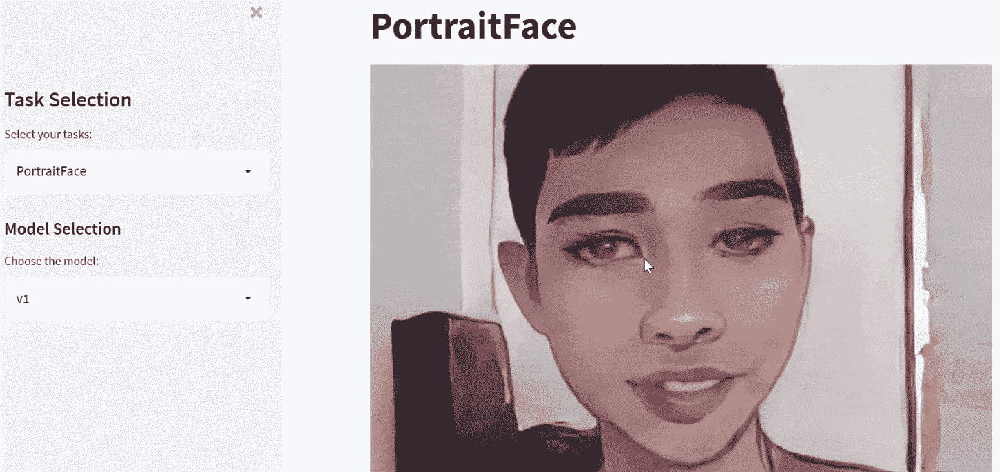
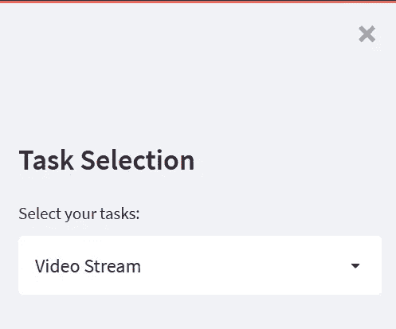
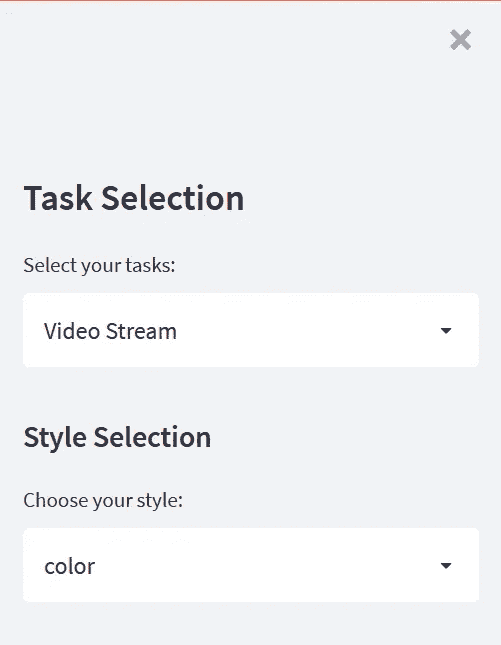
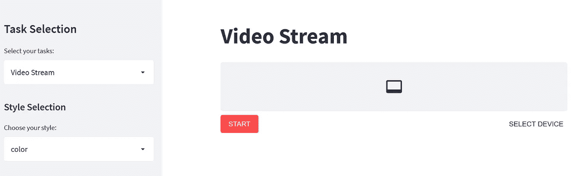

# 使用 Streamlit-WebRTC 的实时视频流

> 原文：<https://betterprogramming.pub/real-time-video-streams-with-streamlit-webrtc-bd38d15f2ef3>

## 通过网络处理和传输实时视频


照片由[上的](https://unsplash.com/s/photos/video-call?utm_source=unsplash&utm_medium=referral&utm_content=creditCopyText)[表面](https://unsplash.com/@surface?utm_source=unsplash&utm_medium=referral&utm_content=creditCopyText)和组成

通过阅读这篇文章，你将学会用实时视频和音频流构建一个可共享的 web 应用程序。这对于展示任何计算机视觉和音频处理相关的项目都非常有用。整个实现将完全在 Python 中，可以通过 URL 从他们的智能手机或具有网络摄像头功能的计算机访问它。

看看下面的 gif，它展示了我过去的一个基于 AnimeGANv2 的 [PyTorch 实现的研究项目。](https://github.com/bryandlee/animegan2-pytorch)



作者 Gif

本教程涵盖了使用名为 [streamlit-webrtc](https://github.com/whitphx/streamlit-webrtc) 的 Python 包创建实时视频流 web 应用程序的基本实现。基于 Github 中的官方库，这个包提供了

> …通过 Streamlit 实现网络上的实时视频和音频流。

它建立在 [Streamlit](https://streamlit.io/) 之上，Streamlit 是一个开源框架，可以将 Python 数据脚本转换为可共享的 web 应用。

让我们继续下一部分，开始安装必要的模块。

# 设置

强烈建议您在继续安装之前创建一个新的虚拟环境。

激活它并运行以下命令来安装`streamlit-webrtc`:

```
pip install streamlit-webrtc
```

安装可能需要一些时间，因为 streamlit 需要相当多的依赖项。

# 履行

在同一个工作目录中，创建一个名为`app.py`的新文件。

## 导入

在文件顶部添加以下导入语句:

```
import streamlit as st
from streamlit_webrtc import webrtc_streamer, VideoProcessorBase, RTCConfiguration
import av
import threading
```

`av`包含 FFmpeg 库的 Pythonic 绑定。它将用于从一个`PIL.Image`或 numpy 数组构建一个帧。

另一方面，`threading`在回调中访问/传递变量时提供了线程安全。

## 页面配置

您可以通过调用`set_page_config`函数来设置网页的标题和图标。

```
st.set_page_config(page_title="Streamlit WebRTC Demo", page_icon="🤖")
```

## 补充报道

接下来，添加下面的代码，它将为任务选择创建一个侧栏。

```
task_list = ["Video Stream"]with st.sidebar:
    st.title('Task Selection')
    task_name = st.selectbox("Select your tasks:", task_list)
st.title(task_name)
```

在这种情况下，我只为这个应用程序设置了一个任务。它将在 web 应用程序的左侧呈现以下用户界面:



作者图片

您可以轻松设置多个任务，并在单个应用程序中独立运行它们。您需要做的就是添加条件检查代码，并相应地实例化相应的小部件。举个例子，

```
if task_name == task_list[0]:
    style_list = ['color', 'black and white']st.sidebar.header('Style Selection')
    style_selection = st.sidebar.selectbox("Choose your style:", style_list)
```

当用户选择第一个任务时，上面的代码将在侧边栏创建一个额外的标签和下拉列表:



作者图片

## 视频处理器

完成后，让我们创建一个继承自`VideoProcessorBase`的`VideoProcessor`类，函数如下:

*   `init`:任何初始化代码都应该放在这里
*   `recv`:接收并返回帧的回调方法。该帧是 [av 的实例。视频框](https://pyav.org/docs/develop/api/video.html#av.video.frame.VideoFrame)。你应该在这个回调中调用所有的图像处理方法。

然后，实例化该类，并传入以下参数:

*   `key`:唯一标识符。只需使用任意字符串
*   `video_processor_factory` : `VideoProcessorBase`实例类

```
class VideoProcessor(VideoProcessorBase):
    def __init__(self):
        self.style = 'color' def recv(self, frame):
        img = frame.to_image()

        # image processing code here

        return av.VideoFrame.from_image(img)webrtc_streamer(key="vpf", video_processor_factory=VideoProcessor)
```

`recv`函数中的代码基于 PIL。如果您更喜欢使用 opencv，请修改如下:

```
class VideoProcessor(VideoProcessorBase):
    def __init__(self):
        self.style = 'color'def recv(self, frame):
        img = frame.to_ndarray(format="bgr24")

        # image processing code here

        return av.VideoFrame.from_ndarray(img, format="bgr24")webrtc_streamer(key="vpf", video_processor_factory=VideoProcessor)
```

假设当用户选择第二种风格选项时，您打算将视频流更改为黑白。您可以简单地修改`recv`功能，如下所示:

```
def recv(self, frame):
    img = frame.to_image()

    # image processing code here
    # using PIL to convert img to greyscale
    if self.style == style_list[1]:
        img = img.convert("L") return av.VideoFrame.from_image(img)
```

请注意，回调方法在不同的线程中执行时有一些限制:

*   任何 streamlit 方法在`recv()`内部都不起作用。这包括所有的`st.`功能，如`st.write()`
*   您不能引用回调之外的任何变量(即使您使用了 global 关键字)
*   当从回调外部和内部访问相同的对象时，您需要小心并实现线程安全的代码。

话虽如此，您可以利用以下技巧来传递变量:

*   初始化`init`功能中的变量
*   从`webrtc_streamer`获取上下文对象并直接操作变量

以下示例说明了当用户从下拉列表中选择一个选项时，如何更改`style`值。

```
st.sidebar.header('Style Selection')
style_selection = st.sidebar.selectbox("Choose your style:", style_list)...ctx = webrtc_streamer(key="vpf", video_processor_factory=VideoProcessor)if ctx.video_processor:
    ctx.video_processor.style = style_selection
```

处理复杂物体时考虑使用`threading.Lock`。例如，您可以按如下方式更新样式:

```
st.sidebar.header('Style Selection')
style_selection = st.sidebar.selectbox("Choose your style:", style_list)...class VideoProcessor(VideoProcessorBase):
    def __init__(self):
        self.model_lock = threading.Lock()
        self.style = style_list[0] def update_style(self, new_style):
        if self.style != new_style:
            with self.model_lock:
                self.style = new_style...ctx = webrtc_streamer(key="vpf", video_processor_factory=VideoProcessor)if ctx.video_processor:
    ctx.video_transformer.update_style(style_selection)
```

## WebRTC 配置

除此之外，您可以向`webrtc_stream`传递额外的参数:

*   `media_stream_constraints`:接受代表`getUserMedia`函数的[约束](https://developer.mozilla.org/en-US/docs/Web/API/MediaDevices/getUserMedia#parameters)的字典。
*   `rtc_configuration` : `RTCConfiguration`眩晕或转身服务器的对象。供您参考，STUN 指的是 NAT 的会话遍历实用程序。它能够识别客户端的公共地址、它们背后的 NAT 类型以及通过 NAT 与特定本地端口关联的互联网端端口。如果您打算通过 IP 或域名远程提供应用程序，则需要此设置。如果您在 localhost 下工作，可以安全地忽略这一点。

初始化下面的配置，它包含了 Google 的 STUN 服务器的 url。您可以根据自己的喜好随意使用任何其他 STUN 服务器:

```
RTC_CONFIGURATION = RTCConfiguration(
    {"iceServers": [{"urls": ["stun:stun.l.google.com:19302"]}]}
)
```

然后，简单地如下初始化`webrtc_streamer`:

```
ctx = webrtc_streamer(
        key="example",
        video_processor_factory=VideoProcessor,
        rtc_configuration=RTC_CONFIGURATION,
        media_stream_constraints={
            "video": True,
            "audio": False
        }
    )
```

您可以在以下[要点](https://gist.github.com/wfng92/c60994e046df02065827d1ef3832977d)中找到完整的代码:

# 试验

保存文件并在终端上运行以下命令:

```
streamlit run app.py
```

它将通过您的默认浏览器打开一个指向以下 URL 的新网页:

```
http://localhost:8501/
```

您应该会看到以下用户界面:



作者图片

点击`START`按钮，它会询问您是否允许使用相机和音频。之后，您应该会看到您的网络摄像头拍摄的视频流。

当调用`streamlit run`命令时，您可以传递额外的选项。例如，以下命令将其设置为无头，并将端口更改为 8005 而不是 8051(默认):

```
streamlit run app.py --server.headless true --server.port 8005
```

# HTTPS

请注意，此包仅在安全上下文中工作，因为它使用 [getUserMedia](https://developer.mozilla.org/en-US/docs/Web/API/MediaDevices/getUserMedia) 来访问本地媒体设备。从官方文件来看，它声明…

> 简而言之，安全上下文是使用 HTTPS 或 file:/// URL 方案加载的页面，或者是从 localhost 加载的页面。

如果您将应用程序托管在远程服务器上，则必须将其部署为 HTTPS。考虑阅读我以前的[文章](https://levelup.gitconnected.com/how-to-proxy-https-traffic-to-your-development-server-63c9980d5899),了解开发期间代理 HTTPS 流量的快速解决方案:

*   [如何将 HTTPS 流量代理到您的开发服务器](https://levelup.gitconnected.com/how-to-proxy-https-traffic-to-your-development-server-63c9980d5899)

# 结论

让我们回顾一下你今天所学的内容。

本文首先简要介绍了 streamlit 和 webrtc。然后，它通过`pip install`进入安装过程。

还介绍了设置侧栏和更改页面配置。随后，它为`VideoProcessor`类提供了深入的解释，以及如何为您自己的用例扩展它。

最后，它讨论了在命令行上运行应用程序，以及在远程服务器上托管时，在安全的上下文中服务 web 应用程序的需要。

感谢你阅读这篇文章。祝你有美好的一天！

# 参考

1.  [GitHub — streamlit-webrtc](https://github.com/whitphx/streamlit-webrtc)
2.  [Streamlit —文档](https://docs.streamlit.io/)