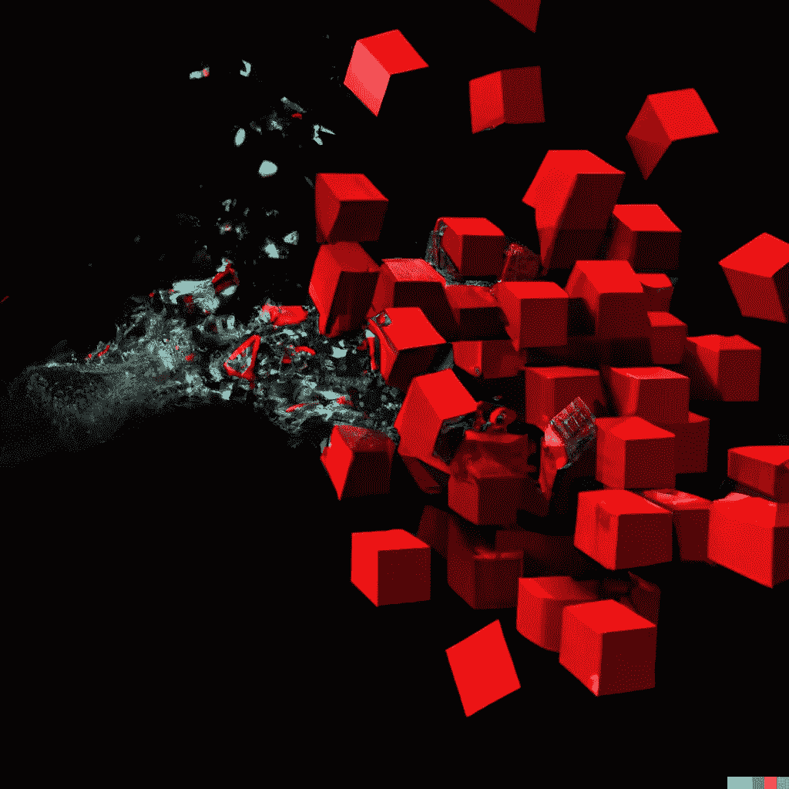
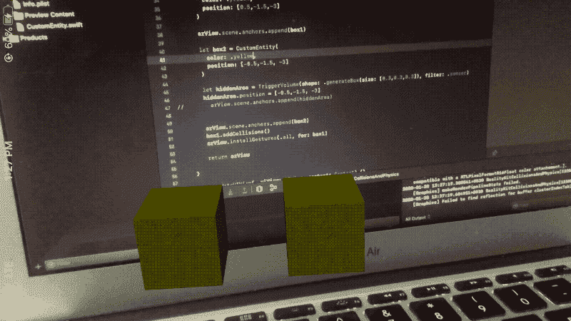
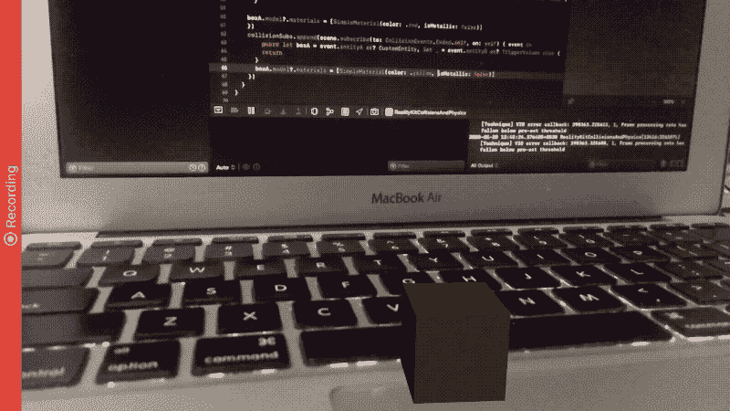

# 跨不同实体检测和处理 RealityKit 场景中的碰撞事件

> 原文：<https://betterprogramming.pub/realitykit-on-ios-part-2-applying-collision-events-d64b6e10421f>

## iOS 上的现实工具包，第 2 部分—应用碰撞事件



由 DALL-E 绘制

这是我涵盖 RealityKit 来龙去脉的系列文章的第二部分，从这里的[开始](/introduction-to-realitykit-on-ios-entities-gestures-and-ray-casting-8f6633c11877)。

# 快速回顾

如果你没有机会看一下第 1 部分，我们探索了 RealityKit 框架的基础——reality kit 的`ARView`解剖，实体，组件，材料，设置教练覆盖，光线投射，以及向我们基于增强现实的 iOS 应用程序添加一些 3D 手势。

我们最终得到的应用程序能够向 AR 场景添加多个实体，但是它缺乏任何事件处理。像重叠的实体和相互移动实体这样的事情没有任何事件处理程序来显示冲突的发生。

# 我们的目标

本文的目的是深入挖掘碰撞事件。我们将在我们的实体上设置各自的组件，并通过我们将在本文过程中构建的 iOS 应用程序来查看一些不同的冲突检测用例。

这里，三个主要组件用于为 RealityKit 中的实体提供真实的类似对象的行为和感觉:

*   `[CollisionComponent](https://developer.apple.com/documentation/realitykit/collisioncomponent)`
*   `[PhysicsBodyComponent](https://developer.apple.com/documentation/realitykit/physicsbodycomponent)`
*   `[PhysicsMotionComponent](https://developer.apple.com/documentation/realitykit/physicsmotioncomponent)`

我们将在另一部分更深入地探讨物理学方面。现在，让我们在 RealityKit 中碰撞碰撞！

# 现实套件碰撞

为了允许实体检测碰撞事件，我们需要先给实体添加一个`CollisionComponent`。随后，我们将在 AR 场景中监听[碰撞事件](https://developer.apple.com/documentation/realitykit/collisionevents)，并处理碰撞的不同状态— *开始*、*接触*和*结束*。

为了开始我们的旅程，启动 Xcode 并创建一个新的基于增强现实的 iOS 应用程序，然后选择 RealityKit 作为渲染引擎，SwiftUI 作为用户界面类型。

接下来，让我们用一个`ModelComponent`(为了美观)和一个`CollisionComponent`来设置我们的自定义实体框，这使我们的实体能够与其他有`CollisionComponent`的实体碰撞。

```
import SwiftUI
import RealityKit
import Combineclass CustomEntity: Entity, HasModel, HasAnchoring, **HasCollision** {

    **var collisionSubs: [Cancellable] = []**

    required init(color: UIColor) {
        super.init()

        self.components[**CollisionComponent**] = CollisionComponent(
            shapes: [.generateBox(size: [0.5,0.5,0.5])],
            **mode: .trigger**,
          **filter: .sensor**
        )

        self.components[ModelComponent] = ModelComponent(
            mesh: .generateBox(size: [0.5,0.5,0.5]),
            materials: [SimpleMaterial(
                color: color,
                isMetallic: false)
            ]
        )
    }

    convenience init(color: UIColor, position: SIMD3<Float>) {
        self.init(color: color)
        self.position = position
    }

    required init() {
        fatalError("init() has not been implemented")
    }
}
```

在上面的代码中，我们做了相当多的事情。让我们仔细看看:

*   符合`HasCollision`协议对于启用实体内的冲突检测至关重要。
*   `collisionSubs`是一个保存实体冲突订阅的数组，我们很快就会看到。
*   就像`ModelComponent` s 一样，`CollisionComponent`也需要一个形状，它可以不同于可见实体的形状。通常，当您想要对进入我们当前实体附近的实体进行碰撞检测时，会为`CollisionComponent`设置一个较大的尺寸。
*   `CollisionMode`用于指示如何为实体收集碰撞数据— `trigger`和`default`是当前可用的两种内置模式。
*   `CollisionFilter`作为一个筛选程序，用于确定需要检测碰撞的实体。它由三种类型组成— `default`、`sensor`(这与所有类型的实体相冲突)，以及一个自定义类型。我们可以通过设置一个`CollisionGroup`来创建定制的`CollisionFilter`——一个包含在实体中的位掩码。

既然我们已经设置了带有`CollisionComponent`的`CustomEntity`类，让我们监听`CollisionEvents`并相应地处理实体的状态。

## 简单碰撞事件

在下面的代码中，我们明确地在我们已经订阅的`Began`和`Ended`事件中寻找`CustomEntity`类型的实体。一旦碰撞开始，我们使用`SimpleMaterial`改变其中一个实体的颜色——在碰撞结束后重置它。

现在我们已经在实体上设置了碰撞事件，让我们在 RealityKit 场景中添加几个实体框，并见证碰撞:



> 注意:为了防止碰撞时两个实体重叠，我们需要使用`PhysicsBodyComponent`。

## 与触发器体积碰撞(隐藏空间)

`TriggerVolumes`是不可见的 3D 形状，当实体进入或退出该体积时被触发。`TriggerVolumes`是看不见的实体，这一事实可以在 AR 游戏的“寻宝”类游戏中加以利用(即解开谜团)。

`TriggerVolumes`扩展一个实体，默认符合`HasCollision`协议。为了给你的现实装备场景添加一个`TriggerVolume`，你需要遵守`HasAnchoring`协议。你还需要以下面的方式把它放到场景中，以确保我们之前看到的`addCollision`函数在检测`CollisionEvents`时允许类型`TriggerVolume`:

```
extension TriggerVolume : HasAnchoring{}let hiddenArea = TriggerVolume(shape: .generateBox(size: [0.3,0.3,0.3]), filter: .sensor)hiddenArea.position = [-0.5,-1.5, -3]arView.scene.anchors.append(hiddenArea)
```



## 碰撞过滤器和组

通常，只需要在某一组实体之间设置碰撞事件。不同`CollisionFilter`的实体不会触发碰撞事件(一个`CollisionFilter`由一个`CollisionGroup`和`Mask`组成)。一个`CollisionFilter`很方便的场景是一个 AR 台球游戏(即知道条纹或固体是否有碰撞)。

在下面的代码中，我们创建了一个新的球形实体，带有一个自定义的`CollisionFilter`！

另一方面，我们已经将先前创建的 box 实体的`CollisionComponent`的`filter`属性更改为:

```
filter: CollisionFilter(group: CollisionGroup(rawValue: 1), mask: CollisionGroup(rawValue: 1)
```

现在让我们将光线投射和`ARCoachingOverlay`一起添加到我们的 RealityKit 场景中来检测一个水平面。我们将使用 2D 点交替添加盒子和球体实体到 3D 空间的场景中。我们将基于用户的手势和在`GlobalVariables`结构中定义的全局属性:

> 注意变化:现在在`addCollision`函数中传递了`scene`属性。

这种变化的原因是实体不再直接添加到场景的根锚点。实体被添加到光线投射锚，最终在场景中设置。所以为了允许实体使用`self.scene`访问场景，我们在前面定义的`CustomEntity`的`addCollision`扩展函数中传递属性。

保存 RealityKit 的`ARView`的 SwiftUI `ContentView`的代码如下所示:

```
struct ContentView : View {
    var body: some View {
        return ARViewContainer().edgesIgnoringSafeArea(.all)
    }
}struct ARViewContainer: UIViewRepresentable {

    func makeUIView(context: Context) -> ARView {

        let arView = ARView(frame: .zero)

        let config = ARWorldTrackingConfiguration()
        config.planeDetection = .horizontal
        arView.session.run(config, options: [])

        arView.addCoaching()
        arView.setupGestures()
        return arView

    }

    func updateUIView(_ uiView: ARView, context: Context) {}
}
```

`addCoaching`函数用于在 onboarding 期间设置教练覆盖以检测飞机(这在上一部分中讨论过，源代码中提供了实现)。

让我们看看我们的 RealityKit iOS 应用程序在上面集成的`CollisionFilters`和组中的运行情况。您会注意到，在下面的视频中，长方体和球体形状之间的碰撞事件没有订阅:

# 结论

处理碰撞是任何增强现实应用程序中最常见的功能之一。我们看到了`CollisionComponents`如何与`ModelComponents`一起在让我们的实体表现得像真实物体方面发挥重要作用。一个`CollisionComponent`让我们控制实体的碰撞形状。

此外，我们探索了`TriggerVolume`——entity 的一个子类，通常用于确定一个实体是否已经进入那个空间。最后，我们看到了如何通过使用碰撞组和过滤器来管理与场景中某些实体的选择性碰撞。

正如我们在第 1 部分中所做的扩展，以及在本文中所讨论的内容(特别是光线投射和教练叠加)，我们将在本系列的后续部分中做同样的事情。具体来说，我们将使用冲突的各种用例来为我们的 AR 应用程序添加更多的功能。

你可以在下面的 [GitHub 库](https://github.com/anupamchugh/iowncode/tree/master/RealityKitCollisions)中找到我们在上面构建的 RealityKit iOS 应用程序的完整源代码。

这一次到此为止。感谢阅读，请继续关注下一部分。