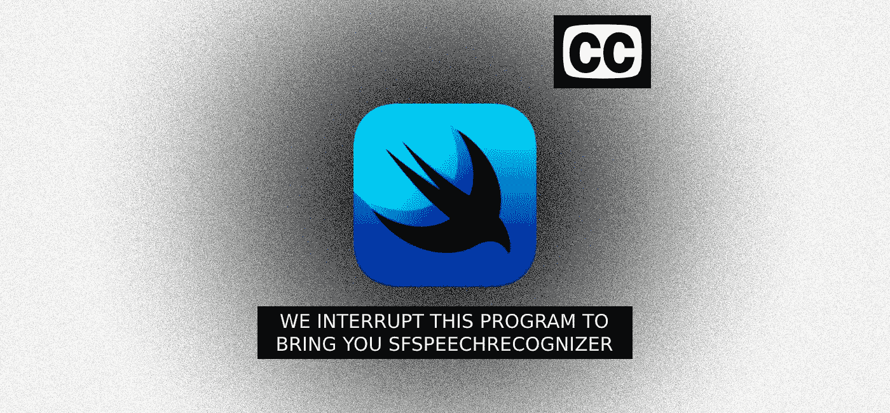
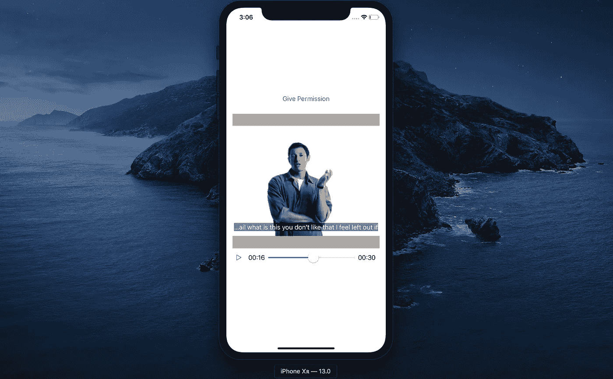

# SwiftUI 中的实时视频隐藏字幕

> 原文：<https://betterprogramming.pub/realtime-video-closed-captioning-in-swiftui-4022ba85c803>

## 使用 SFSpeechRecognizer 脱机、在设备上且不中断



*这个项目献给我的父亲，他每天都在克服自己的听力损失，并激励我编写代码来提高技术的可访问性。*

最近，[我对苹果今年发布的](https://towardsdatascience.com/apple-cranks-speech-to-text-up-to-xcode-11-e1848e42252b) `[SFSpeechRecognizer](https://towardsdatascience.com/apple-cranks-speech-to-text-up-to-xcode-11-e1848e42252b)` [的变化感到非常兴奋。改变游戏规则的是，它现在能够在本地设备上运行:不需要互联网连接。这意味着:](https://towardsdatascience.com/apple-cranks-speech-to-text-up-to-xcode-11-e1848e42252b)

*   用户不再需要担心在移动时使用数据
*   隐私 FTW——一切都在本地完成，而不是与某个服务器来回切换
*   转录延迟更少，*尤其是实时的*
*   不再局限于每天只录制有限次数的一分钟音频。它是无限的(或者直到你的声音停止或者你的电池耗尽)

总体来说，这对于语音转文本、可访问性和语音技术来说是个大新闻。

# 用例

我生长在一个通常开着隐藏字幕(CC)看电视的家庭，这让我专注于测试`SFSpeechRecognizer`的最新更新变得非常有意义。当考虑如何进行 CC 时，录制的节目通常会准备好文本进行播放，而现场活动，如体育或新闻，会有人进行现场转录。

那么，我们的目标将是通过制作一个实时转录视频(在我们的例子中是预先录制的)的应用程序来取代该系统。这已经在 iOS 上完成了，但这次它不会有任何网络延迟、数据使用或转录长度的限制。

另外，作为最后一个挑战，我想在 SwiftUI 中做这件事。这不是这个项目必须的，但我在过去的几个月里一直在使用它(查看[我的个人资料](https://medium.com/@dbolella)中我所有关于 SwiftUI 的文章),并想尝试使用 AV。

*完全披露:*我最终建立在别人的工作之上。令人惊叹的是，它们都是链式进化的一部分——相互依存。我最终只是那个进程的最新迭代，结果变得很棒！

但是为了公平起见，我会在整篇文章中引用它们的名字和链接。

# 它是如何工作的

如果您想在 Github 或您的 IDE 上继续学习，这里是该项目的源代码。否则，我会包括相关的要点。

 [## dbolella/SwiftUIClosedCaptioning

### SFSpeechRecognizer 的最新版本允许离线语音转文本，以及其他新功能。此项目构建…

github.com](https://github.com/dbolella/SwiftUIClosedCaptioning) 

第一件事是理解`[SFSpeechRecognizer](https://developer.apple.com/documentation/speech/sfspeechrecognizer)`是如何工作的，以及它需要什么来完成它的工作。文档告诉我们，为了实时识别，我们需要创建一个带音频缓冲区的`[SFSpeechAudioBufferRecognitionRequest](https://developer.apple.com/documentation/speech/sfspeechaudiobufferrecognitionrequest)`(或者是`[AVAudioPCMBuffer](https://developer.apple.com/documentation/avfoundation/avaudiopcmbuffer)`或者是`[CMSampleBuffer](https://developer.apple.com/documentation/coremedia/cmsamplebuffer)`)。然后，我们将我们的请求作为参数传递给`recognitionTask`，并设置一个完成处理程序，在那里我们应该期望得到一个`SFSpeechRecognitionResult`。

```
private let speechRecognizer = SFSpeechRecognizer(locale: Locale(identifier: "en-US"))!
    private var recognitionRequest: SFSpeechAudioBufferRecognitionRequest?
    private var recognitionTask: SFSpeechRecognitionTask?

    private func setupRecognition() {
        let recognitionRequest = SFSpeechAudioBufferRecognitionRequest()

        recognitionRequest.shouldReportPartialResults = true
        recognitionTask = speechRecognizer.recognitionTask(with: recognitionRequest) { [weak self] result, error in
            result!.bestTranscription.formattedString
        }

        self.recognitionRequest = recognitionRequest
    }
```

到目前为止够简单了。现在我只需要找到视频的音频缓冲区，事实证明，这并不那么简单。

# 在 AVAsset 中点击 V 中的 A


为了把这些点/回复联系起来，有相当多的线索可循。照片由[威廉·艾文](https://unsplash.com/@firmbee?utm_source=unsplash&utm_medium=referral&utm_content=creditCopyText)在 [Unsplash](https://unsplash.com/?utm_source=unsplash&utm_medium=referral&utm_content=creditCopyText) 上拍摄

我找出如何访问缓冲区的旅程是从 Sash Zats 的这个回购开始的。这是我发现的第一个在视频缓冲区上使用`SFSpeechRecognition`的项目。当我探索他的工作时，他留下了一条评论，讲述了他如何从几个苹果工程师那里得到帮助，修改苹果的一个`MTAudioProcessingTap` [样本(用 Obj-C 编写)以获得一个`CMSampleBuffer`，然后他将这个样本传递给一个代表以供消费。](https://developer.apple.com/library/archive/samplecode/AudioTapProcessor/Introduction/Intro.html#//apple_ref/doc/uid/DTS40012324-Intro-DontLinkElementID_2)

这似乎有些过火，尤其是因为他的解决方案使用了 AVPlayer 实现。所以我看得更远一点，发现[这个回购](https://github.com/peacemoon/SFSpeechRecognizerRealtimeVideoCaptioning)由一个 Tran。他创建了一个清理版的 Zats repo，但他的笔记提到他希望创建一个快速版的 AudioTap，并提供了几个可能的解决方案的链接。

其中一个链接引起了我的兴趣。这是奥马尔·华雷斯创造的一个要点。浏览一下，它看起来像是名为`VideoMediaInput`的修改 tap 的 Swifty 版本，仍然提供 CMSampleBuffer。虽然我希望有一个解决方案能给我一个`AVAudioPCMBuffer`，但感觉这是我能得到的最好的答案。

感觉我已经有了拼图的碎片，我尝试用 Swift 代替 Obj-C tap，如果我最终将它放入 SwiftUI，这将是更好的选择。结果很成功，可以在[这里](https://github.com/dbolella/SwiftClosedCaptioning)找到。

```
//*********went from this*********
let asset = AVURLAsset(url: url)
guard let audioTrack = asset.tracks(withMediaType: AVMediaType.audio).first else {
    print("can't get audioTrack")
    return
}
playerItem = AVPlayerItem(asset: asset)

tap = MYAudioTapProcessor(audioAssetTrack: audioTrack)
tap.delegate = self

player.insert(playerItem, after: nil)
player.currentItem?.audioMix = tap.audioMix
player.play()

// Player view
let playerView: UIView! = view
playerLayer.player = player

//*********to this*********
vmInput = VideoMediaInput(url: url, delegate: self)

// Player view
let playerView: UIView! = view
playerLayer.player = vmInput.player
```

## 关闭 Swift 循环

现在我有了勇气，是时候把它放进 SwiftUI 了。在 [AVPlayer & SwiftUI](https://medium.com/@chris.mash/avplayer-swiftui-b87af6d0553) 上浏览了 Chris Mash 的系列之后，我在这个 [repo](https://github.com/ChrisMash/AVPlayer-SwiftUI) 中按照他的文章和代码构建了一个带控件的视频播放器。在做了一些提取和移动之后，`VideoMediaInput`被注入到 PlayerContainerView 中，方法是用 tap 中的 AVPlayer 替换它。

难题的最后一部分是消耗要转录的代表的缓冲区。通过创建一个遵循该协议的`ClosedCaptioning`类，我将缓冲区直接附加到识别器中进行处理。

对于绑定，我也有符合`ObservableObject`协议的`ClosedCaptioning`。里面是一个带有`Published`标签的`captioning`房产。这使得它可以与我的 SwiftUI 代码绑定，只需用`ObservedObject`标记我的类的实例。将我的文本视图设置为该属性后，每当我们得到新的结果时，绑定都会更新它，最后，显示我们的实时隐藏字幕。

# 结果

在所有的研究、学习、试验和工作之后，我终于有了我的应用程序。我插入了一则 90 年代杰夫·高布伦的旧苹果广告，并对其进行了测试。结果…还不错。



我的朋友杰夫在谈论如何不被排除在电子邮件聚会之外。90 后，amiright？

虽然杰夫有他独特的说话方式，有时可能会分散，但`SFSpeechRecognizer`很好地遵循了这种方式。当我把手机调到飞行模式时，我也得到了同样的结果，证明我们确实是在本地运行。最后一个测试是让它循环两次以上，看看转录是否在一分钟后中断，这也是成功的。

视频的实时隐藏字幕:完成

# 然而…

转录的质量不是 100%准确。有几个词错了或漏了，但不足以失去上下文或无法在心理上填补空白，尤其是在听的时候。

不过，为了模拟作为一名失聪用户运行这款应用，我把手机调成静音，一边看一边读着脚本。让文本出现在视频顶部确实在同步时间和手势方面有所帮助。不幸的是，缺少对上下文语法和标点符号的编辑是非常令人遗憾的。静音转录使人们很难理解杰夫的话要说什么，他们被告知的方式，并把一切都变成了一个 30 秒的连续句子。


没有音频或语法帮助，转录可以得到正确的单词，但仍然缺乏上下文意义。拉斐尔·沙勒在 [Unsplash](https://unsplash.com/s/photos/words?utm_source=unsplash&utm_medium=referral&utm_content=creditCopyText) 上拍摄的照片

虽然语音转文本是一项巨大的无障碍成就，但它仍然无法与隐藏式字幕相媲美。虽然在服务器上运行可能有助于纠正一些单词，但对于没有音频或语法帮助或上下文的用户来说，它仍然是不够的。

# 新的希望

这就是 Core ML/Create ML 中新的`[SFAudioAnalytics](https://developer.apple.com/documentation/speech/sfvoiceanalytics)`和声音分类的用武之地。这些新功能可以(而且肯定会)填补空白。

例如，结合使用分析和经过训练的 ML 模型，我们可以确定转录中的标点符号(包括句号、感叹号和问号)。标点符号给出的上下文非常有价值。但是想象一下，通过字体来处理和显示音调、语调或情感，你可以更进一步！可能性是惊人的，这是语音识别的一条伟大的前进道路。

我的希望是将这些想法融入到这个项目中，同时也希望看到其他开发人员加入到这个行动中来。

*非常感谢并感谢苹果、* [*萨莎·扎茨*](https://github.com/zats)*[*安·特兰*](https://github.com/peacemoon) *、* [*奥马尔·华雷斯*](https://github.com/omarojo) *，以及* [*克里斯·马什*](https://github.com/ChrisMash) *，他们的作品都有助于将这个激情项目结合在一起。**