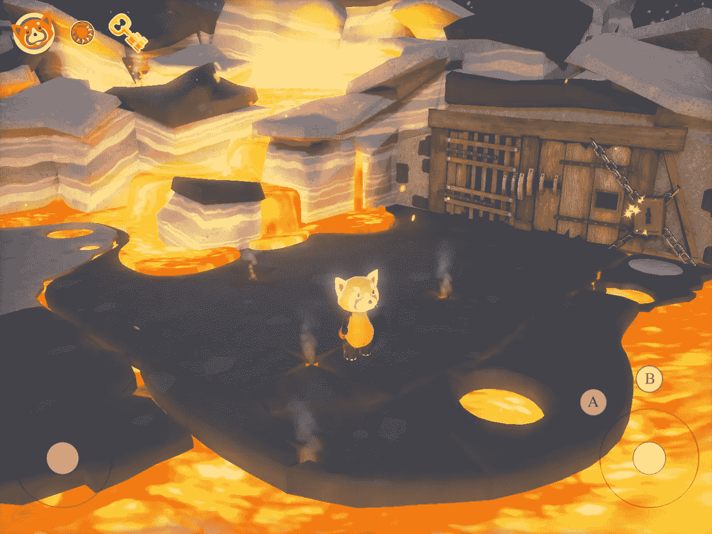
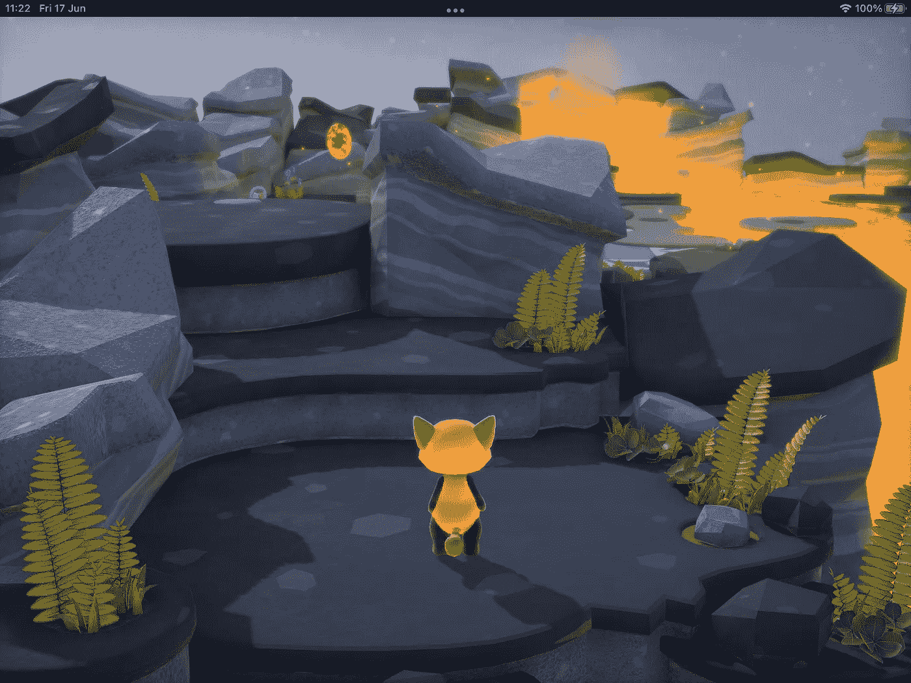
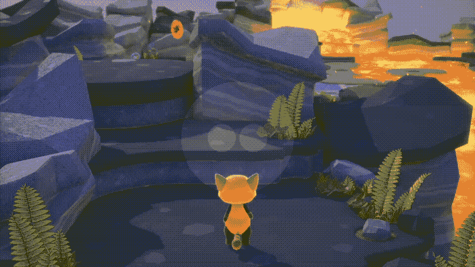

# 用 SceneKit 和 SwiftUI 重建苹果 WWDC 2017 演示应用

> 原文：<https://betterprogramming.pub/rebuilding-apples-wwdc-2017-demo-app-with-scenekit-and-swiftui-77374c230e28>

## 更新福克西 2 游戏代码的尝试



foxy2 演示代码的截图

可悲的是，苹果上一次真正谈论 SceneKit 是在 2017 年，尽管它在 2018 年出现过一次。2017 年，他们做了一场出色的演示，展示了一个看起来非常好的摇滚演示，foxy2。

幸运的是，演示代码仍然可用，可以在这里下载。一个仍然非常有效的演示！

所有这些都让我想到，你知道，自 2017 年以来，Swift 和 iOS 发生了一些变化，既然了解代码如何破坏和修复的最佳方式是破坏和修复代码，我想我会尝试将 foxy 2 代码更新到 2022 年，并记录我的旅程。

## 带 SwiftUI 的 Foxy2

我的计划是使用 SwiftUI 重新构建 foxy2 演示代码，以管理一个平视显示器，并在我使用它的时候做一些其他的升级。从长远来看，我有一个以 foxy2 为主角的衍生游戏的想法，但没问题——一步一步来。

## 基本构件

Bon —我需要一个嵌入在 SwiftUI 中的 SceneKit，并在 SwiftUI 界面上运行一个 HUD(这是 foxy2 的一部分，我们需要做些不同的事情)。

我将使用 Combine 框架中的这篇[文章](/16-useful-extensions-for-swiftui-88aae6ff8909)中描述的订阅模式来链接 SwiftUI HUD 和我的 SceneKit。理论上，我应该能够将旧项目中的大部分代码复制并粘贴到新项目中；我们会看到的。

## 编码

第一项任务是更新 foxy2 并运行它，我很高兴地说这是一件轻而易举的事情[除了 Xcode 的安全问题，你需要通过系统偏好设置中的隐私标签来解决]。浏览代码时，我注意到它有 iOS、macOS 甚至 tvOS 的版本。所有这些都很棒，尽管我计划只关注 iOS。

## 2022 年的版本

我首先为我更新的 foxy2 创建一个模板，作为一个标准的基于 SwiftUI 的应用程序，其`ContentView`如下所示。

这里的关键行是对`GameController`的引用。

接下来我把下载的 foxy2 代码在 iOS 上复制过来，分享代码。我没有意义在这里列出它们，因为我将包括最终的项目供您下载。我也复制艺术、资产和音频。

我做了一个重要的改变。我用一个`makeView`函数替换了`GameController`中的`init`,并在方法的最后添加了该函数所需的返回。

我整理了一下，看了看我得到的东西。



SwiftUI 下 SceneKit 上的初始 foxy2 重建快照

虽然我可以在场景中移动[因为我有了`.allowsCameraControl`的设置，我还不能控制狐狸自己，尽管，考虑到我是从裤子的座位上飞起来的，这是一个好的开始。

继续搜索代码，我找到了对 foxy 的引用，遗憾的是，他似乎被称为“模型”,在这一点上没有印象分，还有一组在场景中使他动画的例程。

为了更好地理解它，我在 SwiftUI 界面中创建了一个 HUD，并通过一个`Combine`框架订阅来链接它。

SwiftUI 这边看起来是这样的。

```
Circle()
  .fill(Color.white)
  .opacity(0.1)
  .frame(width: 64, height: 64, alignment: .center)
  .onTapGesture(count: 2, perform: {
    spinning.send(true)
  })
}
```

在`Character`类中，我用相应的行动号召定义了订阅的另一面。

```
spinner = spinning.sink(receiveValue: { [self] bool in
  print("spinner")
  if bool { attack() }
})
```

使用它和其他工具，我通过尝试不同的例程来拼凑代码是如何工作的。我发现行走动画，旋转动画和其他动画。我在这里概述了一些工作；有些只需要我设置一个变量，就像这个。

```
burner = burning.sink(receiveValue: { [self] bool in
  print("burning" )
  if bool { isBurning = true }
})
```

让狐狸做不同事情的惯例…



带有一些狡猾动作的动画 GIF

但是等等——我最不想做的事情就是在这里重新发明轮子。我需要尽可能多地重用代码。

我决定将`SCNSceneRendering`代码重新定位到一个单独的`SceneDelegate`文件中，并删除了`ExtraProtocols`类型别名下对它的引用，实际上是整个代码。与此同时，我将鼠标移到我在`GameController`中找到的渲染函数上。[这是一个我事后才知道的错误]。

当然，我遇到了变量的隐私问题，并从`GameController`中删除了隐私约束。是的，快速&脏解；抱歉，也许我以后会再来。

为了改变最少的代码，我替换了接触，并开始用我的订阅模式编码，从那里触发代理。

我用我的 SwiftUI 接口触发它——注意，我也在这里更新了协议。我用 bool 来区分会移动相机的`dpad`和会移动 foxy 的 dpad。同样，是的，枚举可能是更好的选择。

我需要修改`GameController`代码来管理新的协议，修改如下。

回想起来，我本可以/应该以不同的方式来做这件事——也许完全绕过使用协议——这也许是 foxy2 代码第二次修订的主题。

看起来不错，但显然，事情的物理方面仍然没有工作——我返回来查看代码。我发现这一行引用了现在更新的渲染器，并将其更改为。

```
scene!.physicsWorld.contactDelegate = self
```

我又测试了一遍；这一次，我可以捡起宝石，虽然敌人仍然不承认我。我意识到我注释掉了太多的代码，需要在设置字符例程中将这些代码添加回去。

```
character!.physicsWorld = scene!.physicsWorld
```

我喜欢说就是这样！我修复了一切——但事实并非如此，我也没有——我担心我可能遇到了一个`GameKit`框架错误。这是最后一次跑步的视频。如你所见，这几乎是可行的。随意下载项目，证明我错了！告诉我我做错了什么。

## 结论

GamePlayKit 框架实现有问题[这里](https://github.com/wizard1066/Foxy2Update)？我不确定是什么；这是这个项目——非常欢迎你指出我做错了什么:)

## 2022 年 6 月 21 日更新

我需要去出版社，也确实去了——但是第二天当我遛狗的时候，我突然灵光一现；我将您在这里读到的几乎所有代码更改都复制到了一个新项目中；我所做的唯一主要改变是没有将`sceneDelegate`放入一个单独的类中；**一切都变了** …游戏套件现在可以正常工作了！

正如他们所说的，看看这个空间，看看我是否能解决最后的挑战，使更新的版本和原来的一样好，甚至更好:)